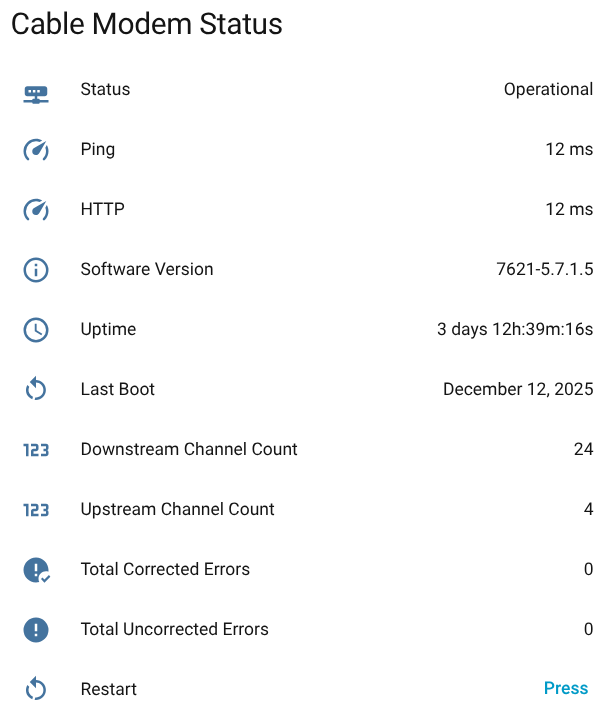
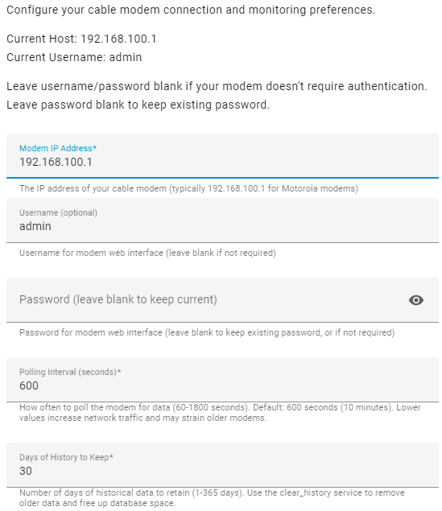
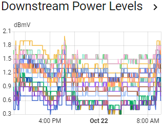
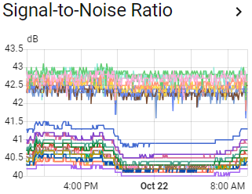
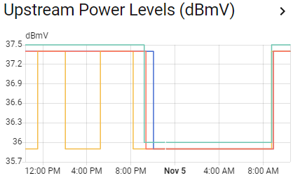
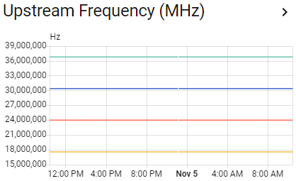
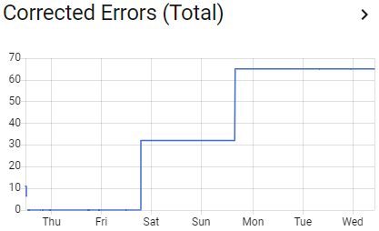

# Cable Modem Monitor for Home Assistant

[](https://github.com/hacs/integration)
[](https://github.com/kwschulz/cable_modem_monitor/actions/workflows/tests.yml)
[](https://github.com/kwschulz/cable_modem_monitor/releases)
[](https://github.com/psf/black)
[](https://opensource.org/licenses/MIT)

A custom Home Assistant integration that monitors cable modem signal quality, power levels, and error rates. Perfect for tracking your internet connection health and identifying potential issues before they cause problems.

> **⭐ If you find this integration useful, please star this repo!**
> It helps others discover the project and shows that the integration is actively used.



## Quick Links
- [**Installation Guide**](#installation)
- [**Supported Modems**](#supported-modems)
- [**Troubleshooting Guide**](./docs/TROUBLESHOOTING.md)
- [**Contributing Guide**](./CONTRIBUTING.md)
- [**Development Setup**](#development-setup) (for contributors)

---

## Development Setup

### Quick Start (2 options)

**Option 1: Local Python (Fastest)**
```bash
git clone https://github.com/kwschulz/cable_modem_monitor.git
cd cable_modem_monitor
./scripts/setup.sh    # Installs dependencies in .venv
code .                # Opens in VS Code - that's it!
```

**Option 2: Dev Container (Zero setup)**
```bash
git clone https://github.com/kwschulz/cable_modem_monitor.git
cd cable_modem_monitor
code .                # Opens in VS Code
# Click "Reopen in Container" when prompted (wait 2-3 min first time)
```

**Both work identically** - choose based on preference. See [Getting Started Guide](./docs/GETTING_STARTED.md) for detailed comparison and troubleshooting.

### After Opening in VS Code

#### What You'll See

**Notifications:**

| Notification | Action |
|--------------|--------|
| "Dev Container configuration available..." | **Option A:** Click "Reopen in Container" (no setup needed)<br>**Option B:** Dismiss and use local Python |
| "Install recommended extensions?" | Click **"Install"** (Python, Ruff, Black, YAML) |
| "GitLens" or "CodeQL" | **Optional** - dismiss if you don't need them |

**Terminal Window:**
- If `.venv` doesn't exist yet, you'll see friendly setup instructions
- Run `bash scripts/setup.sh` to set up (takes ~2 minutes)
- After setup, close and reopen the terminal - it will auto-activate `.venv`

Then validate everything works:
```bash
# In terminal OR use VS Code task (Ctrl+Shift+P → Tasks → Quick Validation)
make validate
```

**Having issues?** See [Getting Started Guide](./docs/GETTING_STARTED.md) for detailed troubleshooting.

**Testing fresh developer experience?** Run `python scripts/dev/fresh_start.py` to reset VS Code state.

Full guides: [Getting Started](./docs/GETTING_STARTED.md) | [Contributing](./CONTRIBUTING.md) | [Developer Quickstart](./docs/DEVELOPER_QUICKSTART.md)

---

## Features

- **Easy Setup**: Configure via Home Assistant UI - no YAML editing required
- **Comprehensive Monitoring**: Tracks downstream and upstream channels
- **Per-Channel Metrics**:
  - Power levels (dBmV)
  - Signal-to-Noise Ratio (SNR in dB)
  - Frequency (Hz)
  - Corrected/Uncorrected errors
- **Summary Sensors**: Total corrected and uncorrected errors across all channels
- **Connection Status**: Monitor modem online/offline state
- **System Information**: Software version, uptime, channel counts, and last boot time
- **Consistent Entity Naming**: All entities use `cable_modem_` prefix for predictability
- **Automation-Friendly**: Last boot time sensor with timestamp device class for reboot detection
- **Modem Control**: Restart your modem directly from Home Assistant
- **Historical Data**: All metrics are stored for trend analysis
- **Dashboard Ready**: Create graphs and alerts based on signal quality
- **Extensible**: Plugin architecture makes adding new modem models easy

## Supported Modems

This integration relies on community contributions for modem support. Compatibility varies based on firmware versions and ISP customizations.

### ✅ Confirmed Working
These models have test coverage and confirmed working by users:

- **ARRIS SB6141** - Full support
- **Motorola MB7621** - Full support
- **Technicolor XB7 (CGM4331COM)** - Full support (system info enhancements complete)

### 🔧 Partial Support / Known Issues
Parsers exist but have known limitations:

- **Motorola MB8611** - Parser exists, but still needs more analysis for full HNAP/SOAP support.
- **Technicolor TC4400** - Parser exists, investigating entity availability issues ([Issue #1](https://github.com/kwschulz/cable_modem_monitor/issues/1))

### 📋 Requested Models
Community members have requested support for these models:

- **Netgear CM600** - Awaiting HTML samples ([Issue #3](https://github.com/kwschulz/cable_modem_monitor/issues/3))

### ℹ️ Motorola Generic Parser
A generic Motorola parser may work with other Motorola DOCSIS 3.x modems that use standard HTML pages (not HNAP/SOAP). Try "auto" detection during setup.

## How to Help Add Support for Your Modem

If your modem isn't fully supported or you'd like to help expand compatibility:

1.  **Capture HTML Samples**: Provide us with the HTML source from your modem's status pages. This is crucial for building new parsers.
    *   See the [HTML Capture Guide](./docs/HTML_CAPTURE_GUIDE.md) for detailed instructions on how to safely capture and share HTML.
2.  **Open a GitHub Issue**: Create an issue with your modem model and attach the captured HTML samples.
    *   This helps us prioritize and implement support for your modem.

**Your contribution helps everyone with the same modem model!**

**Have a different modem?** This integration uses a plugin architecture that makes adding new models easy. Please see the [Contributing Guide](./CONTRIBUTING.md) for details on how to add support for your modem.


## Installation

### Method 1: HACS (Recommended)

**Prerequisites:** You must have HACS installed. If you don't have HACS yet:
1. Go to Settings → Add-ons → Add-on Store
2. Click three dots (⋮) → Repositories
3. Add: `https://github.com/hacs/addons`
4. Install and start the "Get HACS" add-on
5. Restart Home Assistant
6. Go to Settings → Devices & Services → Add Integration → Search for "HACS"
7. Complete HACS setup (requires free GitHub account)

**Installing Cable Modem Monitor via HACS:**

1. Open **HACS** from the Home Assistant sidebar
2. Click the **Integrations** tab
3. Click the **three dots (⋮)** in the top-right corner
4. Select **"Custom repositories"**
5. Add this repository URL: `https://github.com/kwschulz/cable_modem_monitor`
6. Category: **Integration**
7. Click **"Add"**
8. Search for **"Cable Modem Monitor"** in HACS
9. Click **"Download"**
10. **Restart Home Assistant**
11. Add the integration: **Settings → Devices & Services → Add Integration → Cable Modem Monitor**

### Method 2: Manual Installation

1. Download the [latest release](https://github.com/kwschulz/cable_modem_monitor/releases/latest)
2. Extract the zip file
3. Copy the `custom_components/cable_modem_monitor` folder to your Home Assistant's `config/custom_components/` directory
4. Restart Home Assistant
5. Go to Settings → Devices & Services
6. Click "+ Add Integration"
7. Search for "Cable Modem Monitor"
8. Enter your modem's IP address (typically `192.168.100.1`)

## Configuration

1. **Find your modem's IP address**: Usually `192.168.100.1` or `192.168.0.1`
2. **Verify web interface access**: Open `http://192.168.100.1` (or your modem's IP) in a browser
3. **Add the integration**:
   - Settings → Devices & Services → Add Integration
   - Search for "Cable Modem Monitor"
   - Enter the IP address

### Configuration Options

After installation, you can configure additional settings:

1. Go to **Settings → Devices & Services**
2. Find **Cable Modem Monitor** and click **Configure**
3. Available options:
   - **Modem IP Address**: Update if your modem's IP changes
   - **Username/Password**: Update authentication credentials
   - **Modem Model**: Select your modem model or use "auto" for automatic detection (recommended)
   - **Polling Interval**: How often to check modem status (60-1800 seconds, default: 600 - 10 minutes)
   - **History Retention**: Number of days to keep when using Clear History button (1-365 days, default: 30)



*Configuration options available through the Settings UI*

---

## Available Sensors

All sensors use the `cable_modem_` prefix for consistent entity naming and easy identification.

### Connection Status
- `sensor.cable_modem_connection_status`: Overall connection state (online/offline)

### System Information
- `sensor.cable_modem_software_version`: Modem firmware/software version
- `sensor.cable_modem_system_uptime`: How long the modem has been running
- `sensor.cable_modem_last_boot_time`: When the modem last rebooted (timestamp device class)
- `sensor.cable_modem_downstream_channel_count`: Number of active downstream channels
- `sensor.cable_modem_upstream_channel_count`: Number of active upstream channels

### Summary Sensors
- `sensor.cable_modem_total_corrected_errors`: Total corrected errors across all downstream channels
- `sensor.cable_modem_total_uncorrected_errors`: Total uncorrected errors across all downstream channels

### Per-Channel Downstream Sensors (for each channel)
Replace `X` with the channel number (1-32 depending on your modem):
- `sensor.cable_modem_downstream_ch_X_power`: Power level in dBmV
- `sensor.cable_modem_downstream_ch_X_snr`: Signal-to-Noise Ratio in dB
- `sensor.cable_modem_downstream_ch_X_frequency`: Channel frequency in Hz
- `sensor.cable_modem_downstream_ch_X_corrected`: Corrected errors
- `sensor.cable_modem_downstream_ch_X_uncorrected`: Uncorrected errors

### Per-Channel Upstream Sensors (for each channel)
Replace `X` with the channel number (1-8 depending on your modem):
- `sensor.cable_modem_upstream_ch_X_power`: Transmit power level in dBmV
- `sensor.cable_modem_upstream_ch_X_frequency`: Channel frequency in Hz

### Controls
- `button.cable_modem_restart_modem`: Restart your cable modem remotely

### Services
- `cable_modem_monitor.clear_history`: Clear old historical data (keeps specified number of days)
- `cable_modem_monitor.cleanup_entities`: Remove orphaned entities from registry (useful after upgrades)

## Understanding the Values

### Downstream Power (dBmV)
- **Ideal range**: -7 to +7 dBmV
- **Acceptable**: -15 to +15 dBmV
- **Poor**: Below -15 or above +15 dBmV

### Signal-to-Noise Ratio (dB)
- **Excellent**: Above 40 dB
- **Good**: 33-40 dB
- **Acceptable**: 25-33 dB
- **Poor**: Below 25 dB

### Upstream Power (dBmV)
- **Ideal range**: 35-50 dBmV
- **Acceptable**: 30-55 dBmV
- **Poor**: Below 30 or above 55 dBmV

### Corrected vs Uncorrected Errors
- **Corrected errors**: Normal in small amounts; modem can fix these
- **Uncorrected errors**: Indicate data loss; any sustained increase is concerning
- **Monitor trends**: Sudden increases may indicate line issues

## Example Dashboard

Here's an example of a simple, clean dashboard showing all key modem health metrics:


### Example Graphs

Track your signal quality over time with history graphs:



*Downstream power levels across all channels - ideal range is -7 to +7 dBmV*



*Signal-to-Noise Ratio for all channels - higher is better, aim for above 40 dB*



*Upstream power levels - ideal range is 35-50 dBmV*



*Upstream frequency - should be stable*



*Corrected and uncorrected errors - watch for sudden increases in uncorrected errors*

Create a comprehensive dashboard to monitor your modem health. This example shows all 24 downstream channels (typical for Motorola MB7621), 5 upstream channels, and error tracking:

```yaml
type: vertical-stack
cards:
  - type: entities
    title: Cable Modem Status
    entities:
      - entity: sensor.cable_modem_connection_status
        name: Status
      - entity: sensor.cable_modem_software_version
        name: Software Version
      - entity: sensor.cable_modem_system_uptime
        name: Uptime
      - entity: sensor.cable_modem_last_boot_time
        name: Last Boot
        format: date
      - entity: sensor.cable_modem_downstream_channel_count
        name: DS Channel Count
      - entity: sensor.cable_modem_upstream_channel_count
        name: US Channel Count
      - entity: sensor.cable_modem_total_corrected_errors
        name: Total Corrected Errors
      - entity: sensor.cable_modem_total_uncorrected_errors
        name: Total Uncorrected Errors
      - entity: button.cable_modem_restart_modem
    show_header_toggle: false
    state_color: false
  - type: history-graph
    title: Downstream Power Levels (dBmV)
    hours_to_show: 24
    entities:
      - entity: sensor.cable_modem_ds_ch_1_power
        name: Ch 1
      - entity: sensor.cable_modem_ds_ch_2_power
        name: Ch 2
      - entity: sensor.cable_modem_ds_ch_3_power
        name: Ch 3
      - entity: sensor.cable_modem_ds_ch_4_power
        name: Ch 4
      - entity: sensor.cable_modem_ds_ch_5_power
        name: Ch 5
      - entity: sensor.cable_modem_ds_ch_6_power
        name: Ch 6
      - entity: sensor.cable_modem_ds_ch_7_power
        name: Ch 7
      - entity: sensor.cable_modem_ds_ch_8_power
        name: Ch 8
      - entity: sensor.cable_modem_ds_ch_9_power
        name: Ch 9
      - entity: sensor.cable_modem_ds_ch_10_power
        name: Ch 10
      - entity: sensor.cable_modem_ds_ch_11_power
        name: Ch 11
      - entity: sensor.cable_modem_ds_ch_12_power
        name: Ch 12
      - entity: sensor.cable_modem_ds_ch_13_power
        name: Ch 13
      - entity: sensor.cable_modem_ds_ch_14_power
        name: Ch 14
      - entity: sensor.cable_modem_ds_ch_15_power
        name: Ch 15
      - entity: sensor.cable_modem_ds_ch_16_power
        name: Ch 16
      - entity: sensor.cable_modem_ds_ch_17_power
        name: Ch 17
      - entity: sensor.cable_modem_ds_ch_18_power
        name: Ch 18
      - entity: sensor.cable_modem_ds_ch_19_power
        name: Ch 19
      - entity: sensor.cable_modem_ds_ch_20_power
        name: Ch 20
      - entity: sensor.cable_modem_ds_ch_21_power
        name: Ch 21
      - entity: sensor.cable_modem_ds_ch_22_power
        name: Ch 22
      - entity: sensor.cable_modem_ds_ch_23_power
        name: Ch 23
      - entity: sensor.cable_modem_ds_ch_24_power
        name: Ch 24
  - type: history-graph
    title: Downstream Signal-to-Noise Ratio (dB)
    hours_to_show: 24
    entities:
      - entity: sensor.cable_modem_ds_ch_1_snr
        name: Ch 1
      - entity: sensor.cable_modem_ds_ch_2_snr
        name: Ch 2
      - entity: sensor.cable_modem_ds_ch_3_snr
        name: Ch 3
      - entity: sensor.cable_modem_ds_ch_4_snr
        name: Ch 4
      - entity: sensor.cable_modem_ds_ch_5_snr
        name: Ch 5
      - entity: sensor.cable_modem_ds_ch_6_snr
        name: Ch 6
      - entity: sensor.cable_modem_ds_ch_7_snr
        name: Ch 7
      - entity: sensor.cable_modem_ds_ch_8_snr
        name: Ch 8
      - entity: sensor.cable_modem_ds_ch_9_snr
        name: Ch 9
      - entity: sensor.cable_modem_ds_ch_10_snr
        name: Ch 10
      - entity: sensor.cable_modem_ds_ch_11_snr
        name: Ch 11
      - entity: sensor.cable_modem_ds_ch_12_snr
        name: Ch 12
      - entity: sensor.cable_modem_ds_ch_13_snr
        name: Ch 13
      - entity: sensor.cable_modem_ds_ch_14_snr
        name: Ch 14
      - entity: sensor.cable_modem_ds_ch_15_snr
        name: Ch 15
      - entity: sensor.cable_modem_ds_ch_16_snr
        name: Ch 16
      - entity: sensor.cable_modem_ds_ch_17_snr
        name: Ch 17
      - entity: sensor.cable_modem_ds_ch_18_snr
        name: Ch 18
      - entity: sensor.cable_modem_ds_ch_19_snr
        name: Ch 19
      - entity: sensor.cable_modem_ds_ch_20_snr
        name: Ch 20
      - entity: sensor.cable_modem_ds_ch_21_snr
        name: Ch 21
      - entity: sensor.cable_modem_ds_ch_22_snr
        name: Ch 22
      - entity: sensor.cable_modem_ds_ch_23_snr
        name: Ch 23
      - entity: sensor.cable_modem_ds_ch_24_snr
        name: Ch 24
  - type: history-graph
    title: Upstream Power Levels (dBmV)
    hours_to_show: 24
    entities:
      - entity: sensor.cable_modem_us_ch_1_power
        name: US Ch 1
      - entity: sensor.cable_modem_us_ch_2_power
        name: US Ch 2
      - entity: sensor.cable_modem_us_ch_3_power
        name: US Ch 3
      - entity: sensor.cable_modem_us_ch_4_power
        name: US Ch 4
      - entity: sensor.cable_modem_us_ch_5_power
        name: US Ch 5
  - type: history-graph
    title: Upstream Frequency (MHz)
    hours_to_show: 24
    entities:
      - entity: sensor.cable_modem_us_ch_1_frequency
        name: US Ch 1
      - entity: sensor.cable_modem_us_ch_2_frequency
        name: US Ch 2
      - entity: sensor.cable_modem_us_ch_3_frequency
        name: US Ch 3
      - entity: sensor.cable_modem_us_ch_4_frequency
        name: US Ch 4
      - entity: sensor.cable_modem_us_ch_5_frequency
        name: US Ch 5
  - type: history-graph
    title: Corrected Errors (Total)
    hours_to_show: 24
    entities:
      - sensor.cable_modem_total_corrected_errors
  - type: history-graph
    title: Uncorrected Errors (Total)
    hours_to_show: 24
    entities:
      - sensor.cable_modem_total_uncorrected_errors
```

**Note**: This dashboard example includes all 24 downstream channels. If your modem has fewer channels (e.g., 16 or 8), simply remove the extra channel entries. If you have more channels, add them by following the same pattern with entity_ids like `sensor.cable_modem_ds_ch_X_power` where X is the channel number.

### Last Boot Time Display Options

The `sensor.cable_modem_last_boot_time` is a timestamp sensor. You can customize how it displays:

**Relative time (recommended)** - Compact and informative:
```yaml
- entity: sensor.cable_modem_last_boot_time
  format: relative
```
*Shows: "29 days ago"*

**Date only** - Just the date:
```yaml
- entity: sensor.cable_modem_last_boot_time
  format: date
```
*Shows: "2025-09-25"*

**Time only** - Just the time:
```yaml
- entity: sensor.cable_modem_last_boot_time
  format: time
```
*Shows: "00:38:00"*

**Full datetime (fits in UI)** - Date and time:
```yaml
- entity: sensor.cable_modem_last_boot_time
  format: datetime
```
*Shows: "2025-09-25 00:38:00"*

**Custom template** - For more control (may be too long for some UIs):
```yaml
type: markdown
content: >
  Last Reboot: {{
    as_timestamp(states('sensor.cable_modem_last_boot_time'))
    | timestamp_custom('%Y-%m-%d %H:%M')
  }}
```
*Shows: "Last Reboot: 2025-09-25 00:38"*

## Automation Examples

### Alert on High Uncorrected Errors

```yaml
automation:
  - alias: "Cable Modem - High Uncorrected Errors"
    trigger:
      - platform: numeric_state
        entity_id: sensor.cable_modem_total_uncorrected_errors
        above: 100
    action:
      - service: notify.notify
        data:
          title: "Cable Modem Alert"
          message: "High uncorrected errors detected. Check your cable connection."
```

### Alert on Low SNR

```yaml
automation:
  - alias: "Cable Modem - Low SNR Warning"
    trigger:
      - platform: numeric_state
        entity_id: sensor.cable_modem_downstream_ch_1_snr
        below: 30
    action:
      - service: notify.notify
        data:
          title: "Cable Modem Alert"
          message: "Low signal quality detected on downstream channel 1."
```

### Alert on Channel Count Changes

```yaml
automation:
  - alias: "Cable Modem - Channel Count Changed"
    trigger:
      - platform: state
        entity_id:
          - sensor.cable_modem_downstream_channel_count
          - sensor.cable_modem_upstream_channel_count
    condition:
      - condition: template
        value_template: "{{ trigger.from_state.state != 'unavailable' }}"
    action:
      - service: notify.notify
        data:
          title: "Cable Modem Alert"
          message: "Channel count changed: {{ trigger.to_state.name }} is now {{ trigger.to_state.state }}"
```

### Auto-Restart on Network Issues

```yaml
automation:
  - alias: "Cable Modem - Auto Restart on High Errors"
    trigger:
      - platform: numeric_state
        entity_id: sensor.cable_modem_total_uncorrected_errors
        above: 1000
    action:
      - service: notify.notify
        data:
          title: "Cable Modem Alert"
          message: "High error count detected. Restarting modem..."
      - service: button.press
        target:
          entity_id: button.cable_modem_restart_modem
```

## Troubleshooting

> **📖 For detailed troubleshooting help, see [TROUBLESHOOTING.md](TROUBLESHOOTING.md)**
>
> Covers: entity ID cleanup, upstream sensors not appearing, duplicate entities, migration issues, and more.

### Integration doesn't appear
1. Check that files are in `/config/custom_components/cable_modem_monitor/`
2. Restart Home Assistant
3. Check logs for errors: Settings → System → Logs

### "Cannot Connect" error
1. Verify modem IP address is correct
2. Open modem web interface in browser to confirm it's accessible
3. Ensure Home Assistant can reach the modem (same network)
4. If modem requires authentication, enter username and password in the config dialog

### Sensors show "Unknown" or no data
The modem's HTML format may differ from expected. To debug:
1. Enable debug logging in `configuration.yaml`:
   ```yaml
   logger:
     default: warning
     logs:
       custom_components.cable_modem_monitor: debug
   ```
2. Restart Home Assistant
3. Check logs for parsing errors
4. Open an issue with your modem model and a sample of the HTML

### Different modem page URL
Some modems use different URLs for signal data:
- `/cmSignalData.htm` (common Motorola)
- `/cmSignal.html`
- `/` (root page)

The integration tries multiple common URLs automatically.

## Contributing

Contributions are welcome! If you have:
- Support for additional modem models
- Bug fixes
- Feature improvements

Please see the [Contributing Guide](./CONTRIBUTING.md) for details on how to add support for your modem, run tests, and submit changes.

## Privacy & Security

- All data stays local - no cloud services involved
- Only reads data from your modem (no configuration changes)
- Supports authentication for modems that require login
- Credentials are stored securely in Home Assistant's encrypted storage

## License

MIT License - see LICENSE file for details

## Support

- [GitHub Issues](https://github.com/kwschulz/cable_modem_monitor/issues)
- [Home Assistant Community Forum](https://community.home-assistant.io/)

## Resources

- [Home Assistant Releases](https://github.com/home-assistant/core/releases)
- [HACS Brand Repository](https://github.com/home-assistant/brands/tree/master/custom_integrations/cable_modem_monitor)

## Credits

Created for monitoring Cox Cable Motorola modems, but designed to work with various cable modem brands.

---

**Disclaimer**: This integration reads data from your modem's web interface. It does not modify modem settings or configuration.
