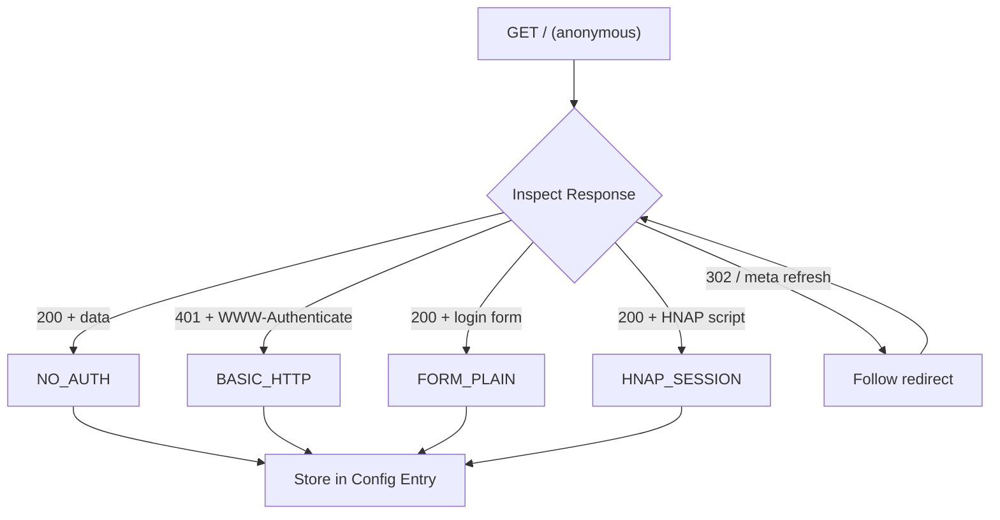
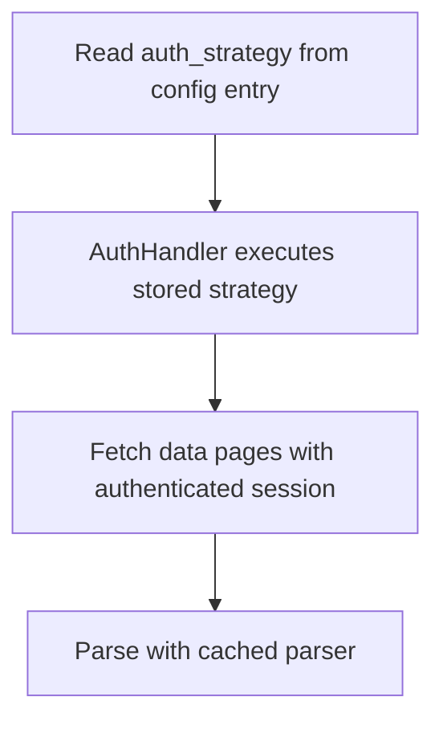
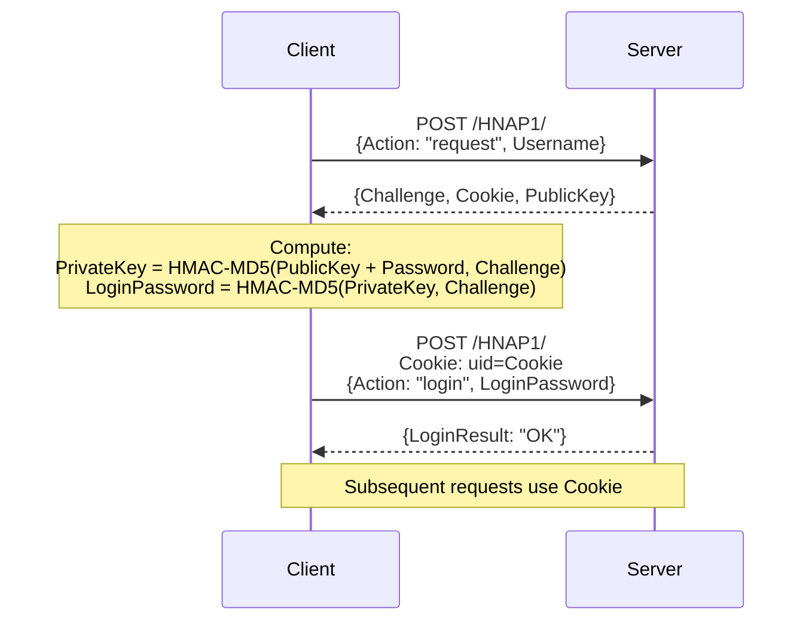
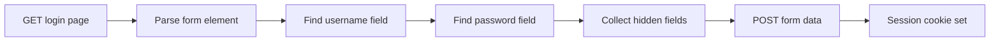
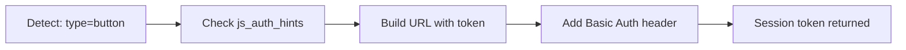

# Authentication System

## Overview

The Cable Modem Monitor uses **response-driven authentication discovery** to handle
the variety of auth methods used by cable modems. Like a browser, we inspect
the modem's response and react accordingly.

**v3.12.0+ Architecture:** Auth discovery runs BEFORE parser detection during setup.
Parsers no longer handle authentication - they just parse data.

## How It Works

### Discovery Flow (Setup & Reconfigure)



### Polling Flow (Each Update)



## Supported Auth Strategies

| Strategy | Detection | How It Works |
|----------|-----------|--------------|
| NO_AUTH | 200 + parseable data | Direct access, no login needed |
| BASIC_HTTP | 401 + WWW-Authenticate | HTTP Basic Auth header |
| FORM_PLAIN | 200 + form with password | Parse form, POST credentials (encoding via `password_encoding`) |
| HNAP_SESSION | SOAPAction.js script | HMAC-MD5 challenge-response |
| URL_TOKEN_SESSION | JS form + parser hints | Base64 token in URL |
| UNKNOWN | Unrecognized pattern | Captured for debugging |

## Key Components

### AuthDiscovery (`discovery.py`)

Inspects modem responses to detect authentication requirements:
- Parses login forms automatically
- Follows redirects and meta refreshes
- Captures unknown patterns for debugging

```python
from custom_components.cable_modem_monitor.core.auth import AuthDiscovery

discovery = AuthDiscovery()
result = discovery.discover(session, base_url, data_url, username, password, parser)

if result.success:
    print(f"Strategy: {result.strategy}")  # e.g., AuthStrategyType.FORM_PLAIN
    print(f"Form config: {result.form_config}")  # Form fields if applicable
```

### AuthHandler (`handler.py`)

Runtime handler that applies stored authentication during polling:

```python
from custom_components.cable_modem_monitor.core.auth import AuthHandler

handler = AuthHandler(
    strategy="form_plain",
    form_config=stored_form_config,
)

# verbose=True for discovery (INFO logs), False for polling (DEBUG logs)
success, html = handler.authenticate(session, base_url, username, password, verbose=True)
```

**Return values:**
- `success`: True if authentication succeeded
- `html`: Page content if available, or `None` for form auth (scraper fetches data pages separately)

### AuthFactory (`factory.py`)

Creates strategy instances for specific authentication types:

```python
from custom_components.cable_modem_monitor.core.auth import AuthFactory, AuthStrategyType

strategy = AuthFactory.get_strategy(AuthStrategyType.BASIC_HTTP)
result = strategy.authenticate(session, base_url, username, password, config)
```

## HNAP Protocol

HNAP (Home Network Administration Protocol) is used by Arris S33, Motorola MB8611, and similar modems.



**Detection:** Page includes `<script src="**/SOAPAction.js">` or similar.

## Form Authentication

Standard HTML form login with automatic field detection.



**Parser Hints:** For non-standard forms, parsers can provide:

```python
class MyParser(ModemParser):
    auth_form_hints = {
        "username_field": "webUserName",
        "password_field": "webPassKey",
        "login_url": "/goform/login",  # Optional: custom login endpoint
        "password_encoding": "base64",  # Optional: encode password before POST
    }
```

## URL Token Authentication (SB8200)

JavaScript-based auth that encodes credentials in URL.



**Parser Hints:**

```python
class SB8200Parser(ModemParser):
    js_auth_hints = {
        "pattern": "url_token_session",
        "login_prefix": "login_",
    }
```

## Parser Integration (v3.12+)

**Parsers no longer handle authentication.** The `AuthDiscovery` system
automatically detects and handles auth before parser detection runs.

### What Parsers DON'T Do Anymore

- No `auth_config` attribute
- No `login()` method
- No auth strategy selection
- No auth hints on parser classes (moved to modem.yaml)

### Auth Hints in modem.yaml

As of v3.12.0, auth hints are configured in `modems/{manufacturer}/{model}/modem.yaml`:

```yaml
# For non-standard form fields (MB7621, etc.)
auth:
  strategy: form
  form:
    action: "/goform/login"
    username_field: loginUsername
    password_field: loginPassword
    password_encoding: base64  # or "plain" (default)

# For HNAP/SOAP protocol (S33, MB8611)
auth:
  strategy: hnap_session
  hnap:
    endpoint: "/HNAP1/"
    namespace: "http://purenetworks.com/HNAP1/"
    empty_action_value: ""  # All known HNAP modems use ""

# For JavaScript-based auth (SB8200)
auth:
  strategy: url_token_session
  url_token:
    login_page: "/cmconnectionstatus.html"
    login_prefix: "login_"
    token_prefix: "ct_"
    session_cookie: "credential"
```

**Access via adapter:**
```python
from custom_components.cable_modem_monitor.modem_config.adapter import get_auth_adapter_for_parser

adapter = get_auth_adapter_for_parser("ArrisS33HnapParser")
hnap_hints = adapter.get_hnap_hints()  # Returns modem.yaml auth.hnap config
```

Most modems need no auth configuration - auth is auto-detected.

## Diagnostics

Auth information is included in diagnostics export:

```json
{
  "auth_discovery": {
    "status": "success",
    "strategy": "hnap_session",
    "strategy_description": "HNAP/SOAP protocol (Arris S33, Motorola MB8611)",
    "form_config": null,
    "captured_response": null
  }
}
```

For failed discoveries, `captured_response` contains the login page HTML
and headers for debugging:

```json
{
  "auth_discovery": {
    "status": "unknown_pattern",
    "strategy": "unknown",
    "captured_response": {
      "status_code": 200,
      "url": "http://192.168.100.1/login.asp",
      "html_sample": "<html>...(truncated)...</html>",
      "headers": {"Content-Type": "text/html"}
    }
  }
}
```

## Adding Support for New Auth Patterns

1. Capture HAR file from browser during login
2. Identify the auth flow from network requests
3. If it matches existing pattern → should auto-detect
4. If new pattern → implement new strategy in `strategies/`
5. Add detection logic to `AuthDiscovery`
6. Add tests using HAR-based mock server

## Module Structure

```
core/auth/
├── __init__.py          # Public exports
├── base.py              # AuthStrategy base class, AuthResult
├── configs.py           # Auth config dataclasses
├── discovery.py         # AuthDiscovery - response-driven detection
├── factory.py           # AuthFactory - strategy instantiation
├── handler.py           # AuthHandler - runtime auth execution
├── types.py             # AuthStrategyType enum
├── strategies/          # Individual auth strategies
│   ├── basic_http.py
│   ├── form_plain.py     # Handles both plain and base64 via password_encoding
│   ├── hnap_json.py      # JSON HNAP (MB8611, S33)
│   ├── hnap_session.py   # XML/SOAP HNAP (legacy)
│   ├── redirect_form.py  # Form with redirect validation (XB7)
│   └── url_token_session.py  # URL-based token auth (SB8200)
└── hnap/                # HNAP protocol builders
    ├── json_builder.py
    └── xml_builder.py
```

## Testing

Auth has dedicated tests in:
- `tests/core/test_auth_discovery.py` - Discovery logic
- `tests/core/test_auth_handler.py` - Runtime handler
- `tests/integration/test_auth_mock_server.py` - Mock server tests
- `tests/integration/test_scraper_auth_integration.py` - Scraper integration
