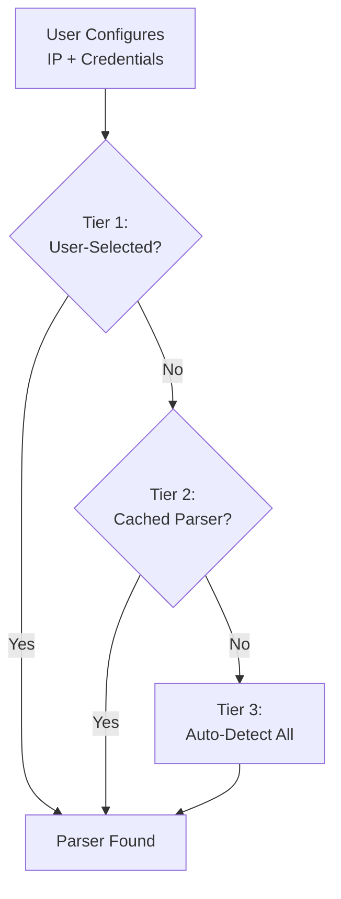

# Cable Modem Monitor - Complete Architecture & Implementation Roadmap

**Version:** 2.0 (Enhanced with Integrated Features)
**Date:** November 5, 2025
**Status:** Comprehensive Implementation Guide

---

## 🎯 Vision

Transform Cable Modem Monitor from a code-based system to a **fully modular, data-driven, community-extensible platform** where anyone can add support for their modem without writing code.

---

## 🚀 Version Targets

| Version | Phases | Target Features | Status |
|---------|--------|----------------|--------|
| **v2.6.0** | Phase 0 | XB7 enhancements, Health monitoring, Reset button, SSL fix | 📝 **Ready** |
| v3.0.0-alpha | Phase 1 | Complete auth abstraction | After v2.6.0 |
| v3.0.0-beta | Phase 2 | HNAP/SOAP, MB8611 parser, Netgear CM600 (Issue #3) | After alpha |
| v3.0.0 | Phase 3 | Enhanced discovery | **Major release** |
| v4.0.0-alpha | Phase 4 | JSON configs (when needed) | If/when triggered |
| v4.0.0 | Phase 5 | Config utility (if needed) | If/when triggered |

**Current Focus:** v2.6.0 ready for implementation

**Version Strategy:**
- **v2.6.0** = Quick wins (Phase 0 + SSL fix for HTTPS modems)
- **v3.0.0** = Major refactor (Phases 1-3: auth abstraction, HNAP, discovery)
- **v4.0.0** = Data-driven platform (if/when needed)

---

## 📋 Implementation Guidelines

### Issue Management Policy

**IMPORTANT:** When implementing fixes or features related to open issues:

#### ❌ DO NOT:
- Close issues when pushing code changes
- Use language like "Fixed Issue #X" or "Closes #X" in commits
- Be overconfident that changes will work on user hardware
- Merge PRs that claim to "fix" issues without user testing

#### ✅ DO:
- Keep issues open until users confirm success on their hardware
- Use softer language: "Attempt to fix", "Should address", "May resolve"
- Explain reasoning and logic behind changes
- Request user testing and feedback
- Add comprehensive tests to verify logic
- Document what was changed and why

#### Commit Message Pattern:
```
Attempt to address Issue #X: [Brief description]

Changes:
- [Change 1 with reasoning]
- [Change 2 with reasoning]
- Added tests for [scenarios]

This should help with [problem], but requires user confirmation
before closing. See Issue #X for testing instructions.

Related to #X (remains open)
```

#### Issue Comment Pattern:
```
I've implemented changes that may address this issue:

**What Changed:**
- [Detailed list]

**Why:**
- [Reasoning for each change]

**Testing:**
- [Tests added and passing]
- [What we tested]

**Next Steps:**
Please test v3.x.x with your modem and report back:
- [ ] Does X work?
- [ ] Are values correct?
- [ ] Any errors in logs?

This issue will remain open pending your confirmation.
```

### Why This Matters

We don't have physical access to users' modems. What works in tests may not work on real hardware due to:
- Firmware variations
- ISP configurations
- Network conditions
- HTML/XML structure differences

**User confirmation is the only way to truly verify success.**

---

## Table of Contents

1. [Executive Summary](#executive-summary)
2. [Current State Analysis](#current-state-analysis)
3. [Architecture Goals](#architecture-goals)
4. [Complete Feature Integration Map](#complete-feature-integration-map)
5. [Implementation Roadmap](#implementation-roadmap)
6. [Technical Designs](#technical-designs)
   - [Authentication Abstraction](#authentication-abstraction-design)
   - [Modem Discovery & Detection](#modem-discovery--detection)
   - [Data Retrieval Strategies](#data-retrieval-strategies)
   - [Dynamic Metrics & Extra Attributes](#dynamic-metrics--extra-attributes)
   - [Data-Driven JSON Configuration](#path-to-data-driven-configuration)
   - [Modem Configuration Utility](#modem-configuration-utility)
7. [API Reference](#api-reference)
8. [Success Metrics](#success-metrics)

---

## Executive Summary

### The Journey

```
Current State (v2.5.0)          →          Fully Modular Future (v4.0+)
─────────────────────                      ─────────────────────────────
✅ 5 parsers (Python code)                 🎯 Unlimited parsers (JSON configs)
✅ Centralized auth (partial)              🎯 Complete auth abstraction
⚠️ Manual parser addition                  🎯 Community contributions (no code)
⚠️ Code changes required                   🎯 JSON-driven configuration
❌ No HNAP/SOAP support                    🎯 Multiple protocols (HTML, SOAP, REST)
❌ No config utility                       🎯 Visual config builder
```

---

### Key Objectives

1. **Separation of Concerns**: Decouple authentication from parsers
2. **Protocol Agnostic**: Support HTML, SOAP/HNAP, REST APIs
3. **Data-Driven**: Move to JSON-based modem configuration
4. **Discovery First**: Robust detection before authentication
5. **Community Extensible**: Anyone can add modems without code

---

### Integrated Features

This roadmap consolidates ALL planned features into a single implementation timeline:

#### ✅ Already Implemented (v2.5.0)
- **XB7 Support** - Parser for Technicolor XB7 (completed Oct 2025)
  - ⚠️ **Needs completion:** System info fields missing (Issue #2)

#### ✅ Ready to Implement (Complete Design)
- **XB7 System Info Enhancement** (2-3 hours) - Complete Issue #2, add uptime/version/primary channel
- **Reset Entities Button** (1-2 hours) - Fresh entity start
- **Smart Polling Foundation** (foundation exists) - Diagnostic sensor

#### 🚀 In Roadmap Phases
- **Auth Abstraction** (Phase 1) - Strategy pattern with enums
- **MB8611 HNAP** (Phase 2) - SOAP/HNAP protocol support
- **Dynamic Metrics** (Phase 4) - Extra attributes via JSON configs
- **Config Utility** (Phase 5) - Visual modem configuration tool

#### ⏸️ Deferred Until Demand
- JSON Configs (wait until >10 parsers)
- Config Utility (wait until JSON proves valuable)
- Smart Polling Automation (diagnostic sensor first)

---

### Timeline Overview

```
Phase 0: Quick Wins (Week 0) → v2.6.0 🎯 NEXT RELEASE
├─ XB7 System Info Enhancement (Close Issue #2)
├─ Timeout/Logging + Health Monitor (Close Issue #5)
│  ├─ Dual-layer diagnostics (ICMP + HTTP)
│  └─ 4 diagnostic sensors
├─ Reset Entities Button
└─ Documentation improvements

Phase 1: Auth Abstraction (Weeks 1-4) → v3.0.0-alpha
├─ Enum-based strategies
├─ Dataclass configs
├─ HNAP support
├─ **Migrate XB7** to new auth (parser already exists)
└─ Parser migrations

Phase 2: New Protocols (Weeks 5-7) → v3.0.0-beta
├─ MB8611 HNAP Parser
├─ Protocol validation
└─ **Smart Polling Sensor** (added)

Phase 3: Enhanced Discovery (Week 8) → v3.0.0 (MAJOR RELEASE)
├─ Anonymous probing
└─ Better detection

Phase 4: Data-Driven Config (Weeks 9-11) → v4.0.0-alpha [WHEN NEEDED]
├─ JSON schema design
├─ **Dynamic Metrics/Extra Attributes** (integrated)
├─ Generic parser
└─ Community model

Phase 5: Community Platform (Weeks 12-17+) → v4.0.0 [IF NEEDED]
├─ Config utility (CLI)
├─ Config utility (HA integration)
└─ Community infrastructure
```

**Rationale:**
- **v2.6.0** = Incremental improvements (Phase 0)
- **v3.0.0** = Major architectural refactor (Phases 1-3)
- **v4.0.0** = Platform transformation (Phases 4-5, if needed)

---

## Current State Analysis

### Version 2.5.0 Status

#### ✅ Working Well
- Parser plugin architecture with auto-discovery
- Manufacturer subdirectories (arris/, motorola/, technicolor/)
- Parser priority system
- 3-tier detection (user selection → cached → auto-detect)
- Comprehensive test suite (120+ tests)
- 5 working parsers

#### ⚠️ Needs Improvement
- Authentication scattered across parsers
- Only form-based auth centralized
- No HNAP/SOAP support
- No HTTP Basic auth strategy
- No redirect form auth strategy

#### ❌ Not Yet Implemented
- Data-driven JSON configuration
- Community configuration utility
- Dynamic metrics (extra attributes)
- Enhanced discovery with heuristics

---

### Existing Authentication Patterns

| Modem Model | Auth Method | Implementation | Uses Central Auth? | Status |
|-------------|-------------|----------------|-------------------|---------|
| Motorola MB7621 | Form (Base64) | Centralized | ✅ Yes | Working |
| Motorola Generic | Form (Plain/Base64) | Centralized | ✅ Yes | Working |
| ARRIS SB6141 | None | Custom | N/A | Working |
| Technicolor TC4400 | HTTP Basic | Custom | ❌ No | Working |
| Technicolor XB7 | Form + Redirect | Custom | ❌ No | Working |
| **Motorola MB8611** | **HNAP/SOAP** | **Not implemented** | **❌ No** | **Phase 2** |

---

### Existing Central Authentication System

**Location:** `custom_components/cable_modem_monitor/core/authentication.py`

**Components:**
- `AuthFactory` - Strategy pattern factory (string-based, needs enum)
- `FormAuthStrategy` - Base class for form authentication
- Concrete strategies:
  - `FormPlainAuth` - Plain text password
  - `FormBase64Auth` - Base64-encoded password
  - `FormPlainAndBase64Auth` - Fallback strategy
  - `NoAuth` - No authentication

**Current Limitations:**
- ❌ String-based strategy names (no type safety)
- ❌ No HTTP Basic auth strategy
- ❌ No redirect form auth strategy
- ❌ No HNAP/SOAP session management
- ❌ Configuration scattered across parser classes

**Phase 1 Will Add:**
- ✅ Enum-based `AuthStrategyType`
- ✅ Dataclass configurations
- ✅ `BasicHttpAuthStrategy`
- ✅ `RedirectFormAuthStrategy`
- ✅ `HNAPSessionAuthStrategy`

---

### Modem Discovery Flow

**Current Implementation:** `config_flow.py`

**Three-Tier Detection Strategy:**



**Current Issues:**
- Detection and auth are tightly coupled
- Slow (tries all parsers sequentially)
- No heuristics to narrow search

**Phase 3 Will Add:**
- Anonymous probing (detect without auth)
- Parser heuristics (narrow search space)
- Better error messages

---

## Architecture Goals

### Core Principles

1. **Authentication is Protocol-Agnostic**
   - Auth layer doesn't know about modems
   - Handles only session establishment
   - Returns success status + optional response

2. **Modem Discovery is Independent**
   - Detection before authentication when possible
   - Non-authenticated endpoints tried first
   - Auth only when necessary

3. **Parsers are Declarative**
   - Parsers declare requirements (auth, endpoints, format)
   - Parsers don't implement authentication
   - Pure data transformation: HTML/XML → structured data

4. **Configuration is Data-Driven** (eventual goal)
   - Short term: Python dataclasses (type safety)
   - Long term: JSON files (community contributions)
   - Enables non-coders to add modems

5. **Extensibility Built-In**
   - Easy to add new auth types
   - Support for emerging protocols
   - Plugin-like architecture

---

### Non-Goals (Out of Scope)

- JavaScript execution (modems requiring JS rendering)
- Automatic parser generation from traffic
- Real-time monitoring (stick with polling)
- Configuration through modem interfaces (read-only)

---

## Complete Feature Integration Map

This section shows where EVERY planned feature fits into the roadmap.

### Phase 0: Quick Wins + SSL Fix (v2.6.0)

| Feature | Effort | Status | User Value |
|---------|--------|--------|------------|
| **XB7 Support** | N/A | ✅ Done (v2.5.0) | High - Community request |
| **XB7 System Info Enhancement** | **2-3 hours** | **✅ Complete** | **High - Complete Issue #2** |
| **Timeout/Logging + Health Monitor** | **3-4 hours** | **✅ Complete** | **High - Complete Issue #5 + Diagnostics** |
| **Reset Entities Button** | 1-2 hours | ✅ Complete | High - Modem replacement |
| **SSL Certificate Fix** | **1 hour** | **📝 Planned** | **Critical - Unblocks MB8611 (Issue #6)** |
| Documentation improvements | 2-3 hours | ✅ Complete | Medium - Support burden |
| Troubleshooting guide | 2-3 hours | ✅ Complete | High - User self-service |

**Status:** Phase 0 complete, SSL fix planned for v2.6.0

**Health Monitoring (Complete):**
- Dual-layer diagnostics (ICMP + HTTP) with 3 sensors:
  - Health Status (healthy/degraded/icmp_blocked/unresponsive)
  - Ping Latency (ms)
  - HTTP Latency (ms)

**SSL Fix (Planned for v2.6.0):**
- **Problem:** MB8611 and other HTTPS modems fail with SSL certificate verification errors
- **Root Cause:** Self-signed certificates on modem web interfaces
- **Solution:** Add `verify=False` to requests in modem_scraper.py + urllib3 warning suppression
- **Impact:** Unblocks HTTPS modems (MB8611, others)

---

### Phase 1: Authentication Abstraction (Weeks 1-4)

| Feature | Effort | Dependencies | Notes |
|---------|--------|--------------|-------|
| Auth enum types | 2 hours | None | Foundation |
| Auth dataclasses | 4 hours | Enum types | Type safety |
| BasicHttpAuthStrategy | 2 hours | Dataclasses | For TC4400 |
| RedirectFormAuthStrategy | 3 hours | Dataclasses | For XB7 (migration) |
| HNAPSessionAuthStrategy | 6 hours | Dataclasses | For MB8611 |
| **Migrate XB7 Parser** | **2-3 hours** | **RedirectFormAuth** | **Already exists, needs migration** |
| Parser migrations | 8 hours | All strategies | TC4400, MB7621, etc. |
| Integration tests | 4 hours | Migrations | Validate all parsers |

**Deliverable:** v3.0.0-alpha - Complete auth abstraction

---

### Phase 2: New Protocols (Weeks 5-7)

| Feature | Effort | Dependencies | Notes |
|---------|--------|--------------|-------|
| HNAPRequestBuilder | 4 hours | HNAPAuth | SOAP envelope generation |
| MB8611 Parser | 8 hours | HNAP complete | JSON/HNAP parsing - test fixtures ready (Issue #4) |
| **Netgear CM600 Parser** | **4-6 hours** | **None** | **HTML samples provided (Issue #3)** |
| **Smart Polling Sensor** | **1-2 hours** | **None** | **Diagnostic only, foundation exists** |
| Protocol validation | 4 hours | MB8611 + CM600 | Test with real hardware |
| Documentation | 2 hours | All features | Update README |

**Deliverable:** v3.0.0-beta - HNAP support + MB8611 + CM600 + Smart Polling

**Test Fixtures Ready:**
- MB8611: Complete HNAP JSON response + HTML pages (`tests/parsers/motorola/fixtures/mb8611/`)
- CM600: HTML samples from Issue #3

---

### Phase 3: Enhanced Discovery (Week 8)

| Feature | Effort | Dependencies | Notes |
|---------|--------|--------------|-------|
| Anonymous probing | 4 hours | Phase 1 | Detect without auth |
| Parser heuristics | 3 hours | None | Speed up detection |
| Better error messages | 2 hours | None | Improve UX |
| Circuit breaker | 2 hours | None | Prevent endless attempts |

**Deliverable:** v3.1.0 - Fast, reliable detection

---

### Phase 4: Data-Driven Configuration (Weeks 9-11) [WHEN NEEDED]

**Trigger:** Parser count > 10 OR maintenance burden significant

| Feature | Effort | Dependencies | Notes |
|---------|--------|--------------|-------|
| JSON schema design | 8 hours | Phase 3 complete | **Include extra_attributes from day 1** |
| **Dynamic Metrics (Extra Attributes)** | **4 hours** | **JSON schema** | **Modem-specific fields** |
| Generic parser | 12 hours | JSON schema | Reads JSON, parses HTML |
| Pilot JSON config | 4 hours | Generic parser | Convert one parser to JSON |
| JSON validation tool | 4 hours | Schema | Validate community contributions |
| Community model docs | 3 hours | All above | How to contribute JSON |

**Deliverable:** v4.0.0-alpha - JSON-driven system

---

### Phase 5: Community Platform (Weeks 12-17+) [IF NEEDED]

**Trigger:** JSON configs successful AND community requests utility

| Feature | Effort | Dependencies | Notes |
|---------|--------|--------------|-------|
| Config builder core lib | 12 hours | Phase 4 | Authentication detection, field mapper |
| CLI tool | 16 hours | Core lib | Standalone utility |
| HA integration wizard | 20 hours | Core lib | Optional, high effort |
| Community infrastructure | 8 hours | All above | GitHub repo, validation |

**Deliverable:** v4.0.0 - Full community platform

---

## Implementation Roadmap

This section provides detailed implementation checklists for each phase, integrating ALL features.

---

### Phase 0: Quick Wins ⏱️ Est: 9-12 hours (Do First!)

**Goal:** Ship high-value features with minimal effort

**Can be done independently, anytime**

**Priority Order:**
1. XB7 System Info Enhancement (2-3 hours) - Completes Issue #2
2. Timeout/Logging + Health Monitor (3-4 hours) - Completes Issue #5 + Diagnostics
3. Reset Entities Button (1-2 hours) - High user value
4. Documentation Improvements (2-3 hours) - Reduces support burden

#### Timeout/Logging + Health Monitoring (3-4 hours) ⭐ HIGH PRIORITY

**Goal:** Fix improper exception handling, add modem health monitoring with dual-layer diagnostics

**User Feedback (Issue #5 - esand):**
- ✅ Simple "Failed to log in to modem" message is good
- ❌ Full stack trace being logged for timeouts (should be debug only)
- ❌ Exception not properly caught in XB7 login method
- 💡 **Feature request:** Event/notification system for login failures
- 💡 **Enhancement:** Health check to distinguish network issues from auth issues

**Problem:**
When XB7 modem login times out, we don't know if it's an auth issue, network issue, or modem rebooting. Full stack traces create log noise.

**File:** `custom_components/cable_modem_monitor/parsers/technicolor/xb7.py:67`

**Current Code (Line 48-72):**
```python
def login(self, session, base_url, username, password) -> tuple[bool, str | None]:
    """Log in to XB7 modem using form-based authentication with redirect."""
    if not username or not password:
        _LOGGER.debug("No credentials provided for XB7 login")
        return (False, None)

    try:
        # Submit login form
        login_data = {"username": username, "password": password}
        login_response = session.post(
            f"{base_url}/check.jst", data=login_data, allow_redirects=True, timeout=10
        )

        # XB7 redirects to at_a_glance.jst on successful login
        if "/at_a_glance.jst" in login_response.url:
            _LOGGER.debug("XB7 login successful, fetching network setup page")
            status_response = session.get(
                f"{base_url}/network_setup.jst", timeout=10
            )
            return (True, status_response.text)
        else:
            _LOGGER.warning("XB7 login failed: unexpected redirect to %s", login_response.url)
            return (False, None)
    except Exception as e:
        _LOGGER.error("XB7 login exception: %s", e, exc_info=True)  # ❌ Full stack trace
        return (False, None)
```

**Implementation:**

1. **Improve Exception Handling:**

```python
def login(self, session, base_url, username, password) -> tuple[bool, str | None]:
    """Log in to XB7 modem using form-based authentication with redirect."""
    if not username or not password:
        _LOGGER.debug("No credentials provided for XB7 login")
        return (False, None)

    try:
        # Submit login form
        login_data = {"username": username, "password": password}
        login_response = session.post(
            f"{base_url}/check.jst", data=login_data, allow_redirects=True, timeout=10
        )

        # XB7 redirects to at_a_glance.jst on successful login
        if "/at_a_glance.jst" in login_response.url:
            _LOGGER.debug("XB7 login successful, fetching network setup page")
            status_response = session.get(
                f"{base_url}/network_setup.jst", timeout=10
            )
            return (True, status_response.text)
        else:
            _LOGGER.warning("XB7 login failed: unexpected redirect to %s", login_response.url)
            return (False, None)

    except (requests.exceptions.Timeout, requests.exceptions.ReadTimeout) as e:
        # Timeout is common when modem is busy/rebooting - log at debug level
        _LOGGER.debug("XB7 login timeout (modem may be busy): %s", str(e))
        return (False, None)

    except requests.exceptions.ConnectionError as e:
        # Connection errors should be logged but not with full stack trace
        _LOGGER.warning("XB7 login connection error: %s", str(e))
        return (False, None)

    except requests.exceptions.RequestException as e:
        # Other request errors
        _LOGGER.warning("XB7 login request failed: %s", str(e))
        _LOGGER.debug("XB7 login exception details:", exc_info=True)  # Full trace only at debug
        return (False, None)

    except Exception as e:
        # Unexpected errors should still log details
        _LOGGER.error("XB7 login unexpected exception: %s", str(e), exc_info=True)
        return (False, None)
```

2. **Apply Same Pattern to Other Parsers:**

Check other parsers for similar issues:
- `parsers/technicolor/tc4400.py` - Uses HTTP Basic (less likely to timeout)
- `parsers/motorola/mb7621.py` - Check login method
- `parsers/motorola/generic.py` - Check login method

3. **Update modem_scraper.py for Consistent Handling:**

**File:** `custom_components/cable_modem_monitor/core/modem_scraper.py:264`

Ensure the "Failed to log in to modem" message is consistent across all failure modes.

4. **Add Modem Health Monitor:**

Create `custom_components/cable_modem_monitor/core/health_monitor.py`:

**Dual-Layer Health Check Architecture:**

```
Network Stack Diagnostics:
┌─────────────────────────────────────┐
│ Layer 7: HTTP HEAD                  │ ← Web server responsive?
├─────────────────────────────────────┤
│ Layer 3: ICMP Ping                  │ ← Network reachable?
└─────────────────────────────────────┘

Diagnostic Matrix:
┌───────────┬───────────┬─────────────────────────────┐
│ ICMP Ping │ HTTP HEAD │ Diagnosis                   │
├───────────┼───────────┼─────────────────────────────┤
│ ✅ Success│ ✅ Success│ Healthy - fully responsive  │
│ ✅ Success│ ❌ Fail   │ Web server issue            │
│ ❌ Fail   │ ✅ Success│ ICMP blocked (firewall)     │
│ ❌ Fail   │ ❌ Fail   │ Network down / offline      │
└───────────┴───────────┴─────────────────────────────┘
```

**Implementation:** See full `ModemHealthMonitor` class design in implementation notes

**Key Features:**
- Performs both ICMP ping and HTTP HEAD checks
- Tracks success rate, latency, consecutive failures
- Provides context for error logging
- Foundation for diagnostic sensors

5. **Integrate Health Monitor:**

Update coordinator to run health checks before data fetches:

```python
# In coordinator update cycle
health_check = await health_monitor.check_health(base_url)

if not success and health_check.failed:
    _LOGGER.warning("Data fetch failed after health check failure - modem unresponsive")
elif not success:
    _LOGGER.warning("Data fetch failed but modem responding to pings - likely auth issue")
```

6. **Add Diagnostic Sensors:**

Create new sensors in `sensor.py`:
- `sensor.cable_modem_health_status` (healthy/degraded/unresponsive)
- `sensor.cable_modem_ping_latency` (milliseconds)
- `sensor.cable_modem_http_latency` (milliseconds)
- `sensor.cable_modem_availability` (percentage)

**Checklist:**
- [ ] Update XB7 `login()` with specific exception handling
- [ ] Implement `ModemHealthMonitor` class with dual-layer checks
- [ ] Integrate health monitor with coordinator
- [ ] Add health context to exception logging
- [ ] Create 4 diagnostic sensors (health status, ping latency, HTTP latency, availability)
- [ ] Test timeout behavior with health checks
- [ ] Verify only debug messages appear for timeouts
- [ ] Check other parsers for similar issues
- [ ] Update `modem_scraper.py` if needed for consistency
- [ ] Add test cases for timeout scenarios and health checks
- [ ] Update documentation about logging levels and health monitoring
- [ ] Consider future: Event system for login failures (defer to later)

**User Value:**
- **Closes Issue #5** - User reported since Nov 5, 2025
- Cleaner logs (no stack traces for common timeouts)
- Better error diagnosis (network vs auth vs modem issues)
- Network health visibility with diagnostic sensors
- Users can create automations based on modem health
- Early warning of degrading modem performance
- Foundation for future event/notification system
- Professional logging behavior

**Benefits of Dual-Layer Health Checks:**
- Distinguish "modem offline" from "web server crashed"
- Identify when ISP/firewall blocks ICMP ping
- Track latency trends over time
- Provide context for login failures

**Priority:** Should be done **alongside** XB7 System Info Enhancement since both affect XB7 parser.

---

#### Reset Entities Button (1-2 hours) ✅ READY TO IMPLEMENT

**File:** `custom_components/cable_modem_monitor/button.py`

**Implementation:**
```python
class ResetEntitiesButton(CoordinatorEntity, ButtonEntity):
    """Button to reset all entities and reload integration."""

    _attr_name = "Cable Modem Reset Entities"
    _attr_icon = "mdi:refresh"
    _attr_entity_category = EntityCategory.CONFIG

    async def async_press(self) -> None:
        """Handle button press - remove all entities and reload."""
        entity_reg = er.async_get(self.hass)

        # Remove all cable modem entities
        entities_to_remove = [
            entity_entry.entity_id
            for entity_entry in entity_reg.entities.values()
            if entity_entry.platform == DOMAIN
        ]

        for entity_id in entities_to_remove:
            entity_reg.async_remove(entity_id)

        # Reload integration (recreates entities)
        await self.hass.config_entries.async_reload(self._entry.entry_id)
```

**Use Cases:**
- Modem replacement (16 → 32 channels)
- Fresh start after upgrades
- Troubleshooting entity issues

**Tests:** Add to `tests/test_button.py`

**Checklist:**
- [ ] Implement `ResetEntitiesButton` class
- [ ] Add to button entity setup
- [ ] Write tests (entity removal, reload, recreation)
- [ ] Update documentation

---

#### XB7 System Info Enhancement (2-3 hours) ⭐ HIGH PRIORITY

**Goal:** Complete XB7 parser to fully resolve Issue #2

**User Feedback (Issue #2 - esand):**
- ✅ Authentication working
- ✅ All downstream channels parsing correctly
- ❌ System uptime showing "Unknown"
- ❌ Software version showing "Unknown"
- ❌ Last boot time not available
- 💡 **Feature request:** Primary channel entity for automations

**File:** `custom_components/cable_modem_monitor/parsers/technicolor/xb7.py:417-446`

**Implementation:**

1. **Enhance `_parse_system_info()` method:**

```python
def _parse_system_info(self, soup: BeautifulSoup) -> dict:
    """Parse system information from XB7."""
    system_info = {}

    try:
        labels = soup.find_all("span", class_="readonlyLabel")

        for label in labels:
            label_text = label.get_text(strip=True).rstrip(":")
            value_span = label.find_next_sibling("span")

            if value_span and "readonlyLabel" not in value_span.get("class", []):
                value = value_span.get_text(strip=True)

                # Existing fields
                if "Serial Number" in label_text:
                    system_info["serial_number"] = value
                elif "CM MAC" in label_text or "Hardware Address" in label_text:
                    system_info["mac_address"] = value
                elif "Acquire Downstream" in label_text:
                    system_info["downstream_status"] = value
                elif "Upstream Ranging" in label_text:
                    system_info["upstream_status"] = value

                # NEW: System Uptime
                elif "System Uptime" in label_text:
                    # Parse "21 days 15h: 20m: 33s" format
                    system_info["system_uptime"] = value
                    # Calculate last boot time from uptime
                    system_info["last_boot_time"] = self._calculate_boot_time(value)

                # NEW: Software Version (use Download Version, not BOOT Version)
                elif "Download Version" in label_text:
                    system_info["software_version"] = value

    except Exception as e:
        _LOGGER.error(f"Error parsing XB7 system info: {e}", exc_info=True)

    return system_info

def _calculate_boot_time(self, uptime_str: str) -> str:
    """
    Calculate boot time from uptime string.
    Format: "21 days 15h: 20m: 33s"
    """
    from datetime import datetime, timedelta
    import re

    try:
        # Parse uptime string
        days = 0
        hours = 0
        minutes = 0
        seconds = 0

        day_match = re.search(r'(\d+)\s*days?', uptime_str)
        if day_match:
            days = int(day_match.group(1))

        hour_match = re.search(r'(\d+)h', uptime_str)
        if hour_match:
            hours = int(hour_match.group(1))

        min_match = re.search(r'(\d+)m', uptime_str)
        if min_match:
            minutes = int(min_match.group(1))

        sec_match = re.search(r'(\d+)s', uptime_str)
        if sec_match:
            seconds = int(sec_match.group(1))

        # Calculate boot time
        uptime_delta = timedelta(days=days, hours=hours, minutes=minutes, seconds=seconds)
        boot_time = datetime.now() - uptime_delta

        return boot_time.isoformat()

    except Exception as e:
        _LOGGER.error(f"Error calculating boot time: {e}")
        return "Unknown"
```

2. **Parse Primary Downstream Channel:**

```python
def _parse_primary_channel(self, soup: BeautifulSoup) -> str | None:
    """
    Parse primary channel from note: "*Channel ID 10 is the Primary channel"
    """
    try:
        # Look for the note text
        for span in soup.find_all("span", class_="readonlyLabel"):
            text = span.get_text(strip=True)
            if "Primary channel" in text:
                # Extract channel ID: "*Channel ID 10 is the Primary channel"
                import re
                match = re.search(r'Channel ID (\d+) is the Primary', text)
                if match:
                    return match.group(1)
    except Exception as e:
        _LOGGER.error(f"Error parsing primary channel: {e}")

    return None
```

3. **Update `parse()` method to use primary channel:**

```python
def parse(self, html: str, base_url: str) -> dict:
    """Parse XB7 modem data."""
    # ... existing parsing ...

    # Parse primary channel
    primary_channel_id = self._parse_primary_channel(soup)
    if primary_channel_id:
        result["primary_downstream_channel"] = primary_channel_id

    return result
```

**HTML Data Available:**
```html
<!-- System Uptime: Line 512-514 -->
<span class="readonlyLabel">System Uptime:</span>
<span class="value">21 days 15h: 20m: 33s</span>

<!-- Software Version: Line 836-837 -->
<span class="readonlyLabel networkColor">Download Version:</span>
<span class="value">Prod_23.2_231009 & Prod_23.2_231009</span>

<!-- Primary Channel: Line 884 -->
<div class="form-row "><b><i><span class="readonlyLabel";font-weight:bold;>
*Channel ID 10 is the Primary channel
</span></i></b></div>
```

**Tests to Add:**
```python
def test_xb7_system_uptime():
    """Test parsing system uptime."""
    # Use existing fixture
    assert result["system_uptime"] == "21 days 15h: 20m: 33s"
    assert result["last_boot_time"] is not None
    # Verify boot time is ~21 days ago

def test_xb7_software_version():
    """Test parsing Download Version as software_version."""
    assert result["software_version"] == "Prod_23.2_231009 & Prod_23.2_231009"

def test_xb7_primary_channel():
    """Test parsing primary downstream channel."""
    assert result["primary_downstream_channel"] == "10"
```

**Checklist:**
- [ ] Add System Uptime parsing to `_parse_system_info()`
- [ ] Add Download Version parsing (map to `software_version`)
- [ ] Implement `_calculate_boot_time()` helper method
- [ ] Implement `_parse_primary_channel()` method
- [ ] Update `parse()` to include primary channel in result
- [ ] Add 3 new tests to `tests/parsers/technicolor/xb7/test_parser_technicolor_xb7.py`
- [ ] Test with user's modem or fixture
- [ ] Update Issue #2 with completion status
- [ ] Close Issue #2

**User Value:**
- **Completes Issue #2** - User waiting since Oct 25, 2025
- Provides all available system info for XB7 users
- Enables primary channel automation use cases
- Demonstrates parser completeness before auth refactor

**Priority:** Should be done **before** or **alongside** Reset Entities Button as they're both quick wins.

---

#### Documentation Improvements (2-3 hours)

**Create/Update:**
- [ ] Troubleshooting guide
  - Authentication failures
  - Connection issues
  - Unsupported modems
- [ ] FAQ section
  - Why sensors go unavailable during reboot
  - Polling interval recommendations
  - ISP compatibility
- [ ] Contributing guide enhancements
  - More detailed parser template
  - Visual examples

---

### Phase 1: Authentication Abstraction ⏱️ Est: 2-4 weeks

**Goal:** Complete, type-safe authentication system supporting all current and future auth methods

---

#### Week 1: Core Infrastructure (8-12 hours)

**Create `AuthStrategyType` Enum**

**File:** `custom_components/cable_modem_monitor/core/authentication.py`

```python
from enum import Enum

class AuthStrategyType(Enum):
    """Enumeration of supported authentication strategies."""

    NO_AUTH = "no_auth"
    """No authentication required."""

    BASIC_HTTP = "basic_http"
    """HTTP Basic Authentication (RFC 7617)."""

    FORM_PLAIN = "form_plain"
    """Form-based auth with plain password."""

    FORM_BASE64 = "form_base64"
    """Form-based auth with base64-encoded password."""

    FORM_PLAIN_AND_BASE64 = "form_plain_and_base64"
    """Form-based auth with fallback."""

    REDIRECT_FORM = "redirect_form"
    """Form-based auth with redirect validation."""

    HNAP_SESSION = "hnap_session"
    """HNAP/SOAP session-based authentication."""
```

**Checklist:**
- [ ] Create `AuthStrategyType` enum
- [ ] Update `AuthFactory` to accept enum (maintain backward compat)
- [ ] Add type hints throughout authentication module
- [ ] Write enum tests

---

**Create Auth Configuration Dataclasses**

**File:** `custom_components/cable_modem_monitor/core/auth_config.py` (new)

```python
from dataclasses import dataclass
from typing import Optional
from abc import ABC

@dataclass
class AuthConfig(ABC):
    """Base class for authentication configurations."""
    strategy: AuthStrategyType

@dataclass
class NoAuthConfig(AuthConfig):
    """No authentication required."""
    strategy: AuthStrategyType = AuthStrategyType.NO_AUTH

@dataclass
class BasicAuthConfig(AuthConfig):
    """HTTP Basic Authentication."""
    strategy: AuthStrategyType = AuthStrategyType.BASIC_HTTP

@dataclass
class FormAuthConfig(AuthConfig):
    """Form-based authentication."""
    strategy: AuthStrategyType  # FORM_PLAIN, FORM_BASE64, etc.
    login_url: str
    username_field: str
    password_field: str
    success_indicator: Optional[str] = None  # URL fragment or min response size

@dataclass
class RedirectFormAuthConfig(AuthConfig):
    """Form auth with redirect validation (e.g., XB7)."""
    strategy: AuthStrategyType = AuthStrategyType.REDIRECT_FORM
    login_url: str
    username_field: str
    password_field: str
    success_redirect_pattern: str
    authenticated_page_url: str

@dataclass
class HNAPAuthConfig(AuthConfig):
    """HNAP/SOAP session authentication (e.g., MB8611)."""
    strategy: AuthStrategyType = AuthStrategyType.HNAP_SESSION
    login_url: str = "/Login.html"
    hnap_endpoint: str = "/HNAP1/"
    session_timeout_indicator: str = "UN-AUTH"
    soap_action_namespace: str = "http://purenetworks.com/HNAP1/"
```

**Checklist:**
- [ ] Create auth config dataclasses
- [ ] Add validation methods
- [ ] Write dataclass tests
- [ ] Update type hints in parsers

---

**Add BasicHttpAuthStrategy**

**File:** `custom_components/cable_modem_monitor/core/authentication.py`

```python
class BasicHttpAuthStrategy(AuthStrategy):
    """HTTP Basic Authentication strategy."""

    def login(
        self,
        session: requests.Session,
        base_url: str,
        username: Optional[str],
        password: Optional[str],
        config: AuthConfig
    ) -> Tuple[bool, Optional[str]]:
        """Set up HTTP Basic Auth."""
        if not username or not password:
            _LOGGER.warning("BasicAuth requires username and password")
            return (False, None)

        # Attach auth to session (sent with every request)
        session.auth = (username, password)
        return (True, None)
```

**Checklist:**
- [ ] Implement `BasicHttpAuthStrategy`
- [ ] Write tests with mock responses
- [ ] Test 401 unauthorized handling
- [ ] Document usage

---

**Add RedirectFormAuthStrategy**

**File:** `custom_components/cable_modem_monitor/core/authentication.py`

```python
class RedirectFormAuthStrategy(AuthStrategy):
    """Form auth with redirect validation (for XB7, etc.)."""

    def login(
        self,
        session: requests.Session,
        base_url: str,
        username: Optional[str],
        password: Optional[str],
        config: RedirectFormAuthConfig
    ) -> Tuple[bool, Optional[str]]:
        """Submit form and validate redirect."""
        data = {
            config.username_field: username,
            config.password_field: password
        }

        response = session.post(
            f"{base_url}{config.login_url}",
            data=data,
            allow_redirects=True
        )

        # Check for success redirect pattern
        if config.success_redirect_pattern in response.url:
            # Fetch authenticated page
            auth_response = session.get(f"{base_url}{config.authenticated_page_url}")
            return (True, auth_response.text)

        return (False, None)
```

**Checklist:**
- [ ] Implement `RedirectFormAuthStrategy`
- [ ] Write redirect validation tests
- [ ] Test with XB7 HTML fixture
- [ ] Document redirect patterns

---

#### Week 2: HNAP Support (6-8 hours)

**Create HNAPSessionAuthStrategy**

**File:** `custom_components/cable_modem_monitor/core/authentication.py`

```python
class HNAPSessionAuthStrategy(AuthStrategy):
    """HNAP/SOAP session-based authentication."""

    def login(
        self,
        session: requests.Session,
        base_url: str,
        username: Optional[str],
        password: Optional[str],
        config: HNAPAuthConfig
    ) -> Tuple[bool, Optional[str]]:
        """Establish HNAP session."""
        # Build login SOAP envelope
        login_envelope = self._build_login_envelope(username, password, config)

        response = session.post(
            f"{base_url}{config.hnap_endpoint}",
            data=login_envelope,
            headers={
                "SOAPAction": f'"{config.soap_action_namespace}Login"',
                "Content-Type": "text/xml; charset=utf-8"
            }
        )

        # Parse response and check for success
        if config.session_timeout_indicator not in response.text:
            return (True, response.text)

        return (False, None)

    def _build_login_envelope(self, username: str, password: str, config: HNAPAuthConfig) -> str:
        """Build SOAP login envelope."""
        # SOAP XML generation
        pass
```

**Checklist:**
- [ ] Implement `HNAPSessionAuthStrategy`
- [ ] Add SOAP envelope generation
- [ ] Write HNAP auth tests
- [ ] Test session timeout handling

---

**Create HNAPRequestBuilder**

**File:** `custom_components/cable_modem_monitor/core/hnap_builder.py` (new)

```python
class HNAPRequestBuilder:
    """Helper for building HNAP/SOAP requests."""

    def __init__(self, endpoint: str, namespace: str):
        self.endpoint = endpoint
        self.namespace = namespace

    def call_single(
        self,
        session: requests.Session,
        base_url: str,
        action: str,
        params: Optional[Dict] = None
    ) -> str:
        """Make single HNAP action call."""
        soap_envelope = self._build_envelope(action, params)

        response = session.post(
            f"{base_url}{self.endpoint}",
            data=soap_envelope,
            headers={
                "SOAPAction": f'"{self.namespace}{action}"',
                "Content-Type": "text/xml; charset=utf-8"
            }
        )

        return response.text

    def call_multiple(
        self,
        session: requests.Session,
        base_url: str,
        actions: List[str]
    ) -> str:
        """Make batched HNAP request (GetMultipleHNAPs)."""
        soap_envelope = self._build_multi_envelope(actions)

        response = session.post(
            f"{base_url}{self.endpoint}",
            data=soap_envelope,
            headers={
                "SOAPAction": f'"{self.namespace}GetMultipleHNAPs"',
                "Content-Type": "text/xml; charset=utf-8"
            }
        )

        return response.text

    def _build_envelope(self, action: str, params: Optional[Dict]) -> str:
        """Build SOAP envelope XML."""
        # Implementation
        pass

    def _build_multi_envelope(self, actions: List[str]) -> str:
        """Build GetMultipleHNAPs envelope."""
        # Implementation
        pass
```

**Checklist:**
- [ ] Implement `HNAPRequestBuilder`
- [ ] Add SOAP envelope generation
- [ ] Add XML response parsing utilities
- [ ] Write HNAP builder tests
- [ ] Document HNAP actions

---

#### Week 3: Parser Migration (10-12 hours)

**Update base_parser.py**

**File:** `custom_components/cable_modem_monitor/parsers/base_parser.py`

```python
class ModemParser(ABC):
    """Base class for all modem parsers."""

    # Declarative auth configuration (replaces login() method)
    auth_config: AuthConfig

    # URL patterns with auth requirements
    url_patterns: List[Dict[str, Any]]  # [{"path": "/page", "auth_required": bool}]

    @abstractmethod
    def can_parse(self, html: str) -> bool:
        """Determine if this parser can handle the HTML/XML."""
        pass

    @abstractmethod
    def parse(self, soup: BeautifulSoup, session=None, base_url=None) -> dict:
        """Parse all data from the modem."""
        pass

    # login() method DEPRECATED - auth handled by AuthStrategy
```

**Checklist:**
- [ ] Update `ModemParser` base class
- [ ] Add `auth_config` attribute
- [ ] Deprecate `login()` method (keep for backward compat)
- [ ] Update docstrings

---

**Migrate Technicolor TC4400 to BasicAuthConfig**

**File:** `custom_components/cable_modem_monitor/parsers/technicolor/tc4400.py`

```python
class TechnicolorTC4400Parser(ModemParser):
    """Parser for Technicolor TC4400."""

    name = "Technicolor TC4400"
    manufacturer = "Technicolor"
    models = ["TC4400"]

    # Declarative auth config (replaces login() method)
    auth_config = BasicAuthConfig(
        strategy=AuthStrategyType.BASIC_HTTP
    )

    url_patterns = [
        {"path": "/cmconnectionstatus.html", "auth_required": True}
    ]

    # Remove login() method - handled by BasicHttpAuthStrategy
```

**Checklist:**
- [ ] Migrate TC4400 to `BasicAuthConfig`
- [ ] Remove custom `login()` method
- [ ] Update tests
- [ ] Validate with real modem (if available)

---

**Migrate Technicolor XB7 to RedirectFormAuthConfig**

**File:** `custom_components/cable_modem_monitor/parsers/technicolor/xb7.py`

```python
class TechnicolorXB7Parser(ModemParser):
    """Parser for Technicolor XB7."""

    name = "Technicolor XB7"
    manufacturer = "Technicolor"
    models = ["XB7", "CGM4331COM"]

    # Declarative auth config with redirect
    auth_config = RedirectFormAuthConfig(
        strategy=AuthStrategyType.REDIRECT_FORM,
        login_url="/check.jst",
        username_field="username",
        password_field="password",
        success_redirect_pattern="/at_a_glance.jst",
        authenticated_page_url="/network_setup.jst"
    )

    url_patterns = [
        {"path": "/network_setup.jst", "auth_required": True}
    ]

    # Remove login() method - handled by RedirectFormAuthStrategy
```

**Checklist:**
- [ ] Migrate XB7 to `RedirectFormAuthConfig`
- [ ] Remove custom `login()` method
- [ ] Update tests with redirect validation
- [ ] Validate with real modem (if available)

---

**Validate Motorola Parsers**

Motorola parsers already use centralized auth, but update to new dataclass system:

**File:** `custom_components/cable_modem_monitor/parsers/motorola/mb7621.py`

```python
class MotorolaMB7621Parser(ModemParser):
    """Parser for Motorola MB7621."""

    # Update to dataclass config
    auth_config = FormAuthConfig(
        strategy=AuthStrategyType.FORM_BASE64,
        login_url="/goform/login",
        username_field="loginUsername",
        password_field="loginPassword",
        success_indicator="10000"  # Min response size
    )
```

**Checklist:**
- [ ] Update Motorola parsers to dataclass configs
- [ ] Keep using existing `FormBase64Auth` strategy
- [ ] Validate no regressions
- [ ] Update tests

---

**Update config_flow.py**

**File:** `custom_components/cable_modem_monitor/config_flow.py`

```python
async def _validate_input(self, user_input):
    """Validate user input using new auth system."""
    for parser in get_parsers():
        # Get auth strategy from factory
        auth_strategy = AuthFactory.get_strategy(parser.auth_config.strategy)

        # Attempt authentication
        success, response = auth_strategy.login(
            session,
            base_url,
            username,
            password,
            parser.auth_config
        )

        if success:
            # Try to parse
            if parser.can_parse(response or fetched_html):
                return {"parser": parser.name, ...}
```

**Checklist:**
- [ ] Update `config_flow.py` to use new auth system
- [ ] Handle all auth config types
- [ ] Update detection flow
- [ ] Write integration tests

---

#### Week 4: Migrate XB7 Parser & Testing (2-3 hours) ✅ PARSER EXISTS

**Migrate Existing XB7 Parser** to new auth system

**File:** `custom_components/cable_modem_monitor/parsers/technicolor/xb7.py`

**Note:** XB7 parser already implemented in v2.5.0 (Oct 2025). This task migrates it to use the new RedirectFormAuthStrategy.

**Design is complete - see original notes for full implementation details:**

- 34 downstream channels (non-sequential IDs: 10, 1-9, 11-34)
- 5 upstream channels with XB7-specific fields:
  - `symbol_rate` (2560, 5120, 0)
  - `channel_type` (TDMA, ATDMA, TDMA_AND_ATDMA, OFDMA)
- Transposed table layout (like SB6141)
- Mixed frequency formats (MHz text + raw Hz)
- RedirectFormAuthConfig for authentication

**Implementation Plan:**
1. Create parser class (2 hours)
2. Implement transposed table parsing (2 hours)
3. Add test fixtures from user sample (1 hour)
4. Write 21 comprehensive tests (2 hours)

**Checklist:**
- [ ] Create `parsers/technicolor/xb7.py`
- [ ] Implement `can_parse()` detection
- [ ] Implement `parse()` with transposed tables
- [ ] Parse downstream channels (34)
- [ ] Parse upstream channels (5) with XB7-specific fields
- [ ] Parse system info
- [ ] Add test fixture `tests/fixtures/technicolor_xb7_network_setup.html`
- [ ] Write 21 comprehensive tests
- [ ] Integration test with detection flow
- [ ] Update documentation

**User Value:**
- Resolves Issue #2 (user waiting for XB7 support)
- Validates RedirectFormAuthConfig implementation
- Validates parser architecture before JSON migration

---

**Integration Tests**

**File:** `tests/test_auth_integration.py` (new)

```python
class TestAuthIntegration:
    """Integration tests for authentication system."""

    def test_all_parsers_have_auth_config(self):
        """Verify all parsers define auth_config."""
        for parser in get_parsers():
            assert hasattr(parser, 'auth_config')
            assert isinstance(parser.auth_config, AuthConfig)

    def test_auth_strategies_match_configs(self):
        """Verify all auth configs have matching strategies."""
        for parser in get_parsers():
            strategy = AuthFactory.get_strategy(parser.auth_config.strategy)
            assert strategy is not None

    def test_backward_compatibility(self):
        """Verify old parsers still work."""
        # Test that parsers with deprecated login() still function
        pass
```

**Checklist:**
- [ ] Write integration tests
- [ ] Test all parsers
- [ ] Verify backward compatibility
- [ ] Test config flow integration
- [ ] Validate no regressions

---

**Documentation Updates**

**Files:** `README.md`, `CONTRIBUTING.md`, docs

**Updates:**
- [ ] Update architecture documentation
- [ ] Document new auth system
- [ ] Update contributing guide with auth examples
- [ ] Add XB7 to supported modems list
- [ ] Document RedirectFormAuth pattern
- [ ] Update troubleshooting guide

---

**Phase 1 Complete: Deliverable v3.0.0-alpha**

**What You Have:**
- ✅ Complete auth abstraction with enums + dataclasses
- ✅ Support for all auth types (None, Basic, Form, Redirect, HNAP)
- ✅ Type-safe authentication system
- ✅ XB7 parser integrated
- ✅ All parsers migrated to new system
- ✅ Reset Entities button shipped (from Phase 0)
- ✅ 140+ tests passing

---

### Phase 2: New Protocols ⏱️ Est: 2-3 weeks

**Goal:** Add HNAP/SOAP support and validate with MB8611 parser

---

#### Week 5-6: MB8611 HNAP Parser (12-16 hours)

**Create MB8611 Parser**

**File:** `custom_components/cable_modem_monitor/parsers/motorola/mb8611.py`

```python
class MotorolaMB8611Parser(ModemParser):
    """Parser for Motorola MB8611 using HNAP/SOAP."""

    name = "Motorola MB8611"
    manufacturer = "Motorola"
    models = ["MB8611", "MB8612"]
    priority = 60  # Higher than generic

    # HNAP authentication config
    auth_config = HNAPAuthConfig(
        strategy=AuthStrategyType.HNAP_SESSION,
        login_url="/Login.html",
        hnap_endpoint="/HNAP1/",
        soap_action_namespace="http://purenetworks.com/HNAP1/"
    )

    url_patterns = [
        {"path": "/HNAP1/", "auth_required": True}
    ]

    retrieval_strategy = DataRetrievalStrategy.SOAP_HNAP

    @classmethod
    def can_parse(cls, html: str) -> bool:
        """Detect MB8611 by HNAP/XML markers."""
        return (
            "HNAP" in html or
            "purenetworks.com/HNAP1" in html or
            "MB8611" in html
        )

    def parse(self, soup: BeautifulSoup, session=None, base_url=None) -> dict:
        """Parse data using HNAP SOAP calls."""
        if not session or not base_url:
            raise ValueError("MB8611 requires session and base_url for HNAP calls")

        # Build HNAP request builder
        builder = HNAPRequestBuilder(
            endpoint=self.auth_config.hnap_endpoint,
            namespace=self.auth_config.soap_action_namespace
        )

        # Make batched HNAP request for all data
        soap_actions = [
            "GetMotoStatusStartupSequence",
            "GetMotoStatusConnectionInfo",
            "GetMotoStatusDownstreamChannelInfo",
            "GetMotoStatusUpstreamChannelInfo"
        ]

        xml_response = builder.call_multiple(session, base_url, soap_actions)

        # Parse XML response
        downstream = self._parse_downstream_from_xml(xml_response)
        upstream = self._parse_upstream_from_xml(xml_response)
        system_info = self._parse_system_info_from_xml(xml_response)

        return {
            "downstream": downstream,
            "upstream": upstream,
            "system_info": system_info,
        }

    def _parse_downstream_from_xml(self, xml: str) -> List[Dict]:
        """Parse downstream channels from SOAP XML response."""
        # XML parsing implementation
        pass

    def _parse_upstream_from_xml(self, xml: str) -> List[Dict]:
        """Parse upstream channels from SOAP XML response."""
        # XML parsing implementation
        pass

    def _parse_system_info_from_xml(self, xml: str) -> Dict:
        """Parse system info from SOAP XML response."""
        # XML parsing implementation
        pass
```

**Checklist:**
- [ ] Create `parsers/motorola/mb8611.py`
- [ ] Implement HNAP-based `parse()` method
- [ ] Add XML response parsing utilities
- [ ] Test with HNAP/SOAP responses
- [ ] Write parser tests
- [ ] Integration test with HNAPAuth
- [ ] **Test with real MB8611 modem** (coordinate with Issue #4 user)
- [ ] Update documentation

**User Value:**
- Resolves Issue #4 (MB8611 user request)
- Validates HNAP/SOAP architecture
- Proves multiple protocols work

---

#### Week 7: Smart Polling & Polish (4-6 hours)

**Add Smart Polling Diagnostic Sensor** ✅ FOUNDATION EXISTS

**File:** `custom_components/cable_modem_monitor/sensor.py`

**Foundation:** `signal_analyzer.py` already exists with algorithm implemented

**Implementation:**
```python
class RecommendedScanIntervalSensor(CoordinatorEntity, SensorEntity):
    """Sensor showing recommended polling interval."""

    _attr_name = "Cable Modem Recommended Scan Interval"
    _attr_device_class = SensorDeviceClass.DURATION
    _attr_native_unit_of_measurement = UnitOfTime.SECONDS
    _attr_entity_category = EntityCategory.DIAGNOSTIC

    @property
    def native_value(self) -> int:
        """Return recommended interval in seconds."""
        analyzer = self.coordinator.hass.data[DOMAIN][...]["analyzer"]
        current_interval = self.coordinator.update_interval.total_seconds()
        recommendation = analyzer.get_recommended_interval(current_interval)
        return recommendation["recommended_seconds"]

    @property
    def extra_state_attributes(self) -> dict:
        """Return additional attributes."""
        analyzer = self.coordinator.hass.data[DOMAIN][...]["analyzer"]
        current_interval = self.coordinator.update_interval.total_seconds()
        rec = analyzer.get_recommended_interval(current_interval)

        return {
            "confidence": rec["confidence"],
            "signal_status": rec["signal_status"],
            "reason": rec["reason"],
            "snr_variance": rec.get("snr_variance"),
            "power_variance": rec.get("power_variance"),
        }
```

**Integration:**
- [ ] Integrate `SignalQualityAnalyzer` with coordinator
- [ ] Create `RecommendedScanIntervalSensor`
- [ ] Add sensor to entity setup
- [ ] Write sensor tests
- [ ] Update documentation

**User Value:**
- Helps users optimize polling intervals
- Data-driven recommendations
- Non-intrusive (informational only, no automation)

**Future (Phase 3 or later):**
- Optional notifications (opt-in)
- Auto-adjust capability (opt-in)

---

**Phase 2 Complete: Deliverable v3.0.0**

**What You Have:**
- ✅ HNAP/SOAP protocol support
- ✅ MB8611 parser working
- ✅ Smart polling diagnostic sensor
- ✅ XB7 parser (from Phase 1)
- ✅ Reset Entities button (from Phase 0)
- ✅ Multiple protocols validated (HTML, SOAP)
- ✅ 150+ tests passing

**Major Milestone:** Core architecture complete, multiple protocols working

---

### Phase 3: Enhanced Discovery ⏱️ Est: 1 week

**Goal:** Fast, reliable parser detection with better UX

**Trigger:** After Phase 2 ships and stabilizes

---

#### Anonymous Probing (4 hours)

**Implement Phase 1 Discovery: Try Public URLs First**

**File:** `custom_components/cable_modem_monitor/config_flow.py`

```python
async def _detect_parser_anonymous(self):
    """Try to detect parser without authentication."""
    for parser in get_parsers():
        # Only try URLs that don't require auth
        public_urls = [
            pattern for pattern in parser.url_patterns
            if not pattern.get("auth_required", True)
        ]

        for url_pattern in public_urls:
            try:
                response = await session.get(
                    f"{base_url}{url_pattern['path']}",
                    timeout=5
                )

                if parser.can_parse(response.text):
                    return parser

            except Exception:
                continue

    return None  # No public detection, try authenticated
```

**Checklist:**
- [ ] Implement anonymous probing
- [ ] Add `auth_required` flag to URL patterns
- [ ] Update parsers to mark public URLs
- [ ] Test anonymous detection (ARRIS SB6141)
- [ ] Fallback to authenticated detection

---

#### Parser Heuristics (3 hours)

**Speed Up Detection with Quick Checks**

**File:** `custom_components/cable_modem_monitor/config_flow.py`

```python
class ParserHeuristics:
    """Quick checks to narrow parser search."""

    @staticmethod
    def get_likely_parsers(base_url: str) -> List[Type[ModemParser]]:
        """Return parsers likely to match based on quick checks."""

        # Check URL/hostname patterns
        if "motorola" in base_url.lower():
            return [MotorolaMB7621Parser, MotorolaMB8611Parser, ...]

        # Try common public pages (no auth)
        try:
            response = requests.get(f"{base_url}/", timeout=2)

            if "arris" in response.text.lower():
                return [ArrisSB6141Parser, ...]
            if "technicolor" in response.text.lower():
                return [TechnicolorTC4400Parser, TechnicolorXB7Parser]

        except Exception:
            pass

        # Fallback: all parsers
        return get_parsers()
```

**Checklist:**
- [ ] Implement `ParserHeuristics` class
- [ ] Add heuristic checks (URL patterns, quick probes)
- [ ] Use in detection flow
- [ ] Test performance improvement
- [ ] Measure before/after detection time

---

#### Better Error Messages (2 hours)

**Improve UX When Detection Fails**

**File:** `custom_components/cable_modem_monitor/config_flow.py`

```python
async def _validate_input(self, user_input):
    """Validate with detailed error messages."""

    try:
        parser = await self._detect_parser(user_input)
    except ConnectionError:
        raise ConfigFlowError("cannot_connect")
    except AuthenticationError:
        raise ConfigFlowError("invalid_auth")
    except ParserNotFoundError as e:
        raise ConfigFlowError("unsupported_modem", {
            "modem_info": e.modem_info,
            "suggestions": e.suggestions
        })
```

**Checklist:**
- [ ] Add specific error types
- [ ] Provide modem info in errors
- [ ] Suggest troubleshooting steps
- [ ] Update translations
- [ ] Test error flow

---

#### Circuit Breaker (2 hours)

**Prevent Endless Authentication Attempts**

**File:** `custom_components/cable_modem_monitor/config_flow.py`

```python
class DiscoveryCircuitBreaker:
    """Limit authentication attempts."""

    def __init__(self, max_attempts: int = 5, timeout_seconds: int = 30):
        self.max_attempts = max_attempts
        self.timeout = timeout_seconds
        self.start_time = None
        self.attempts = 0

    def should_continue(self) -> bool:
        """Check if detection should continue."""
        if self.attempts >= self.max_attempts:
            _LOGGER.warning("Max detection attempts reached")
            return False

        if self.start_time and (time.time() - self.start_time > self.timeout):
            _LOGGER.warning("Detection timeout reached")
            return False

        return True

    def record_attempt(self):
        """Record an authentication attempt."""
        if self.start_time is None:
            self.start_time = time.time()
        self.attempts += 1
```

**Checklist:**
- [ ] Implement `DiscoveryCircuitBreaker`
- [ ] Integrate with detection flow
- [ ] Test max attempts
- [ ] Test timeout
- [ ] Log warnings appropriately

---

**Phase 3 Complete: Deliverable v3.1.0**

**What You Have:**
- ✅ Fast anonymous probing (try public URLs first)
- ✅ Parser heuristics (narrow search space)
- ✅ Better error messages (actionable feedback)
- ✅ Circuit breaker (prevent endless attempts)
- ✅ Improved user experience
- ✅ Faster detection (30s → 5-10s)

---

### Phase 4: Data-Driven Configuration ⏱️ Est: 2-3 weeks

**⚠️ ONLY BUILD WHEN NEEDED**

**Triggers:**
- Parser count > 10 (maintenance burden)
- Community requests JSON contribution
- Python parsers become painful to maintain

**Current Status:** 5 parsers, Python works fine. **Wait.**

---

#### JSON Schema Design with Dynamic Metrics (8 hours)

**Goal:** Design JSON schema that includes dynamic/extra attributes from day 1

**File:** `custom_components/cable_modem_monitor/parsers/schemas/parser_config_v1.json`

```json
{
  "$schema": "http://json-schema.org/draft-07/schema#",
  "title": "Modem Parser Configuration",
  "version": "1.0",
  "type": "object",
  "required": ["name", "manufacturer", "models", "authentication", "data_retrieval", "parsing"],
  "properties": {
    "name": {"type": "string"},
    "manufacturer": {"type": "string"},
    "models": {"type": "array", "items": {"type": "string"}},

    "authentication": {
      "type": "object",
      "required": ["strategy"],
      "properties": {
        "strategy": {
          "enum": ["no_auth", "basic_http", "form_plain", "form_base64", "redirect_form", "hnap_session"]
        },
        "config": {"type": "object"}
      }
    },

    "data_retrieval": {
      "type": "object",
      "required": ["strategy", "endpoints"],
      "properties": {
        "strategy": {"enum": ["html_scraping", "soap_hnap", "rest_json"]},
        "endpoints": {"type": "object"}
      }
    },

    "parsing": {
      "type": "object",
      "properties": {
        "downstream_fields": {"type": "object"},
        "upstream_fields": {"type": "object"},
        "system_info_fields": {"type": "object"},
        "extra_fields": {
          "type": "object",
          "description": "Modem-specific non-standard fields (dynamic metrics)",
          "additionalProperties": {
            "type": "object",
            "properties": {
              "selector": {"type": "string"},
              "type": {"enum": ["int", "float", "string", "temperature", "bytes"]},
              "description": {"type": "string"}
            }
          }
        }
      }
    },

    "identifier_hints": {"type": "object"}
  }
}
```

**Example JSON Config with Extra Attributes:**

```json
{
  "name": "Motorola MB7621",
  "manufacturer": "Motorola",
  "models": ["MB7621", "MB7420"],
  "authentication": {
    "strategy": "form_base64",
    "config": {
      "login_url": "/goform/login",
      "username_field": "loginUsername",
      "password_field": "loginPassword"
    }
  },
  "data_retrieval": {
    "strategy": "html_scraping",
    "endpoints": {
      "downstream": "/MotoConnection.asp",
      "status": "/MotoHome.asp"
    }
  },
  "parsing": {
    "downstream_fields": {
      "channel_id": {"selector": "td:nth-child(1)", "type": "int"},
      "frequency": {"selector": "td:nth-child(4)", "type": "frequency_mhz"},
      "power": {"selector": "td:nth-child(5)", "type": "power_dbmv"},
      "snr": {"selector": "td:nth-child(6)", "type": "snr_db"}
    },
    "extra_fields": {
      "board_temperature": {
        "selector": "div#system_temp",
        "type": "temperature",
        "description": "Modem board temperature in Celsius"
      },
      "lan_eth0_received_bytes": {
        "selector": "span.lan_rx_bytes",
        "type": "bytes",
        "description": "LAN port 0 received bytes"
      }
    }
  },
  "identifier_hints": {
    "page_titles": ["Motorola Cable Modem"],
    "element_ids": ["motoConnection"]
  }
}
```

**Checklist:**
- [ ] Design JSON schema
- [ ] **Include `extra_fields` for dynamic metrics from day 1**
- [ ] Add field type validators
- [ ] Create schema documentation
- [ ] Write schema validation tests

---

#### Generic Parser (12 hours)

**Build Parser That Reads JSON Configs**

**File:** `custom_components/cable_modem_monitor/parsers/generic_parser.py`

```python
class GenericParser(ModemParser):
    """Parser that works from JSON configuration."""

    def __init__(self, config_path: str):
        """Load JSON config and build parser."""
        with open(config_path) as f:
            self.config = json.load(f)

        # Build auth config from JSON
        self.auth_config = self._build_auth_config(self.config["authentication"])

        # Build field parsers
        self.field_parsers = self._build_field_parsers(self.config["parsing"])

    def can_parse(self, html: str) -> bool:
        """Check identifier hints from JSON."""
        soup = BeautifulSoup(html, "html.parser")

        for title in self.config["identifier_hints"].get("page_titles", []):
            if soup.title and title in soup.title.string:
                return True

        for element_id in self.config["identifier_hints"].get("element_ids", []):
            if soup.find(id=element_id):
                return True

        return False

    def parse(self, soup: BeautifulSoup, session=None, base_url=None) -> dict:
        """Parse using JSON-defined selectors."""
        downstream = self._parse_fields(soup, self.config["parsing"]["downstream_fields"])
        upstream = self._parse_fields(soup, self.config["parsing"]["upstream_fields"])
        system_info = self._parse_fields(soup, self.config["parsing"]["system_info_fields"])

        # Parse extra fields (dynamic metrics)
        extra_attributes = self._parse_fields(soup, self.config["parsing"].get("extra_fields", {}))

        return {
            "downstream": downstream,
            "upstream": upstream,
            "system_info": system_info,
            "extra_attributes": extra_attributes,  # Modem-specific fields
        }

    def _parse_fields(self, soup, field_definitions):
        """Parse fields based on JSON selectors."""
        # Generic field parsing implementation
        pass
```

**Checklist:**
- [ ] Implement `GenericParser` class
- [ ] Add JSON loading and validation
- [ ] Implement generic field parsing
- [ ] Support all field types (int, float, temperature, bytes, etc.)
- [ ] Handle extra_attributes/dynamic metrics
- [ ] Write comprehensive tests
- [ ] Test with multiple JSON configs

---

#### Pilot JSON Config (4 hours)

**Convert One Parser to JSON Format**

**Choose:** Motorola MB7621 (straightforward HTML scraping)

**Create:** `parsers/configs/motorola/mb7621.json`

**Test:** Load with GenericParser and validate output matches Python parser

**Checklist:**
- [ ] Convert MB7621 to JSON config
- [ ] Test with GenericParser
- [ ] Compare output to Python parser
- [ ] Validate all fields match
- [ ] Document lessons learned

---

#### JSON Validation Tool (4 hours)

**Build Tool to Validate Community Contributions**

**File:** `scripts/validate_parser_config.py`

```python
import json
import jsonschema

def validate_parser_config(config_path: str) -> ValidationResult:
    """Validate JSON parser config."""

    # Load config
    with open(config_path) as f:
        config = json.load(f)

    # Load schema
    with open("parsers/schemas/parser_config_v1.json") as f:
        schema = json.load(f)

    # Validate schema
    try:
        jsonschema.validate(config, schema)
    except jsonschema.ValidationError as e:
        return ValidationResult(valid=False, errors=[str(e)])

    # Additional validation (field types, etc.)
    # ...

    return ValidationResult(valid=True)
```

**Checklist:**
- [ ] Create validation script
- [ ] Add schema validation
- [ ] Add field type validation
- [ ] Add security checks (no passwords in configs)
- [ ] Create CLI interface
- [ ] Add to pre-commit hooks

---

#### Community Documentation (3 hours)

**Write Guide for Contributing JSON Configs**

**File:** `docs/CONTRIBUTING_PARSERS.md`

**Content:**
- How to capture modem HTML
- How to create JSON config
- How to validate config
- How to test locally
- How to submit PR

**Checklist:**
- [ ] Write parser contribution guide
- [ ] Add JSON config examples
- [ ] Document validation process
- [ ] Add troubleshooting tips
- [ ] Link from main CONTRIBUTING.md

---

**Phase 4 Complete: Deliverable v4.0.0-alpha**

**What You Have:**
- ✅ JSON schema with dynamic metrics support
- ✅ Generic parser reads JSON configs
- ✅ Pilot JSON config working
- ✅ Validation tool for community contributions
- ✅ Documentation for contributors
- ✅ Foundation for community platform

**Decision Point:** Do we need Phase 5 (Config Utility)?

---

### Phase 5: Community Platform ⏱️ Est: 4-6+ weeks

**⚠️ ONLY BUILD IF:**
- Phase 4 JSON configs are successful
- Community actively requests config utility
- Manual JSON editing becomes a barrier

**Current Assessment:** Most contributors can edit JSON. Utility may not be needed.

---

#### Core Library (12 hours)

**Build `modem_config_builder` Package**

**Components:**
- `AuthenticationDetector` - Auto-detect auth type
- `ModemCapture` - Capture HTML/XML from modem
- `HNAPDiscovery` - Discover HNAP actions
- `ConfigValidator` - Validate generated configs
- `ConfigExporter` - Export configs in various formats

**Decision:** Only build if there's proven demand from Phase 4.

---

#### CLI Tool (16 hours)

**Standalone Tool for Developers**

**Commands:**
- `capture` - Capture modem responses
- `generate` - Interactive config generation
- `validate` - Validate config
- `export` - Export for sharing

**Decision:** Start here if building Phase 5. HA integration is optional.

---

#### Home Assistant Integration (20 hours)

**Visual Config Wizard in HA**

**Wizard Steps:**
1. Basic info (IP, credentials)
2. Authentication detection
3. HTML capture
4. Field mapping (visual selector)
5. Validation
6. Export/share

**Decision:** Very high effort, uncertain value. Only if CLI tool proves insufficient.

---

**Phase 5 Complete: Deliverable v4.0.0 (if built)**

**What You Have:**
- ✅ Full community platform
- ✅ Config utility (CLI and/or HA)
- ✅ Visual config creation
- ✅ Community contribution infrastructure
- ✅ Anyone can add modems without code

---

## Technical Designs

This section provides detailed technical designs for each major component.

---

### Authentication Abstraction Design

[Keep existing detailed auth design from original doc - Strategy Pattern, Dataclasses, etc.]

---

### Modem Discovery & Detection

[Keep existing discovery design - 3-phase approach, heuristics, etc.]

---

### Data Retrieval Strategies

[Keep existing retrieval strategies - HTML Scraping, SOAP/HNAP, REST API designs]

---

### Dynamic Metrics & Extra Attributes

**New Section:** Integrates the extra_attributes concept into JSON configs

#### Problem Statement

Different modem models expose varying levels of detail:
- Some provide board temperature
- Some provide LAN statistics (bytes sent/received)
- Some provide detailed uptime breakdowns
- Others provide only basic metrics

**Challenge:** Capture modem-specific metrics without:
- Cluttering core `system_info` with optional fields
- Requiring conditional logic for every possible field
- Breaking the consistent data contract

#### Solution: Extra Attributes in JSON Configs

**Design Principle:** Reserve `system_info` for universal fields, use `extra_attributes` for modem-specific data.

**JSON Schema:**

```json
{
  "parsing": {
    "extra_fields": {
      "board_temperature": {
        "selector": "div#system_temp",
        "type": "temperature",
        "description": "Modem board temperature"
      },
      "lan_eth0_received_bytes": {
        "selector": "span.lan_rx_bytes",
        "type": "bytes",
        "description": "LAN port 0 received bytes"
      }
    }
  }
}
```

**Parser Output:**

```python
{
    "downstream": [...],
    "upstream": [...],
    "system_info": {...},  # Universal fields only
    "extra_attributes": {  # Modem-specific fields
        "board_temperature": 25.5,
        "lan_eth0_received_bytes": 1234567890
    }
}
```

**Home Assistant Integration:**

```python
# Sensor.py creates additional sensors from extra_attributes
for attr_name, attr_value in data.get("extra_attributes", {}).items():
    # Create diagnostic sensor
    sensors.append(
        ModemExtraAttributeSensor(
            coordinator,
            attr_name,
            attr_value,
            description=f"Modem {attr_name.replace('_', ' ').title()}"
        )
    )
```

**Benefits:**
- Clear separation (core vs. supplementary)
- Easy to extend (just add to JSON)
- No code changes needed
- Advanced users get full data
- Simple modems stay clean

**Implementation:**
- Defined in JSON schema (Phase 4)
- Parsed by GenericParser
- Dynamically create sensors in HA
- Fully extensible

---

### Path to Data-Driven Configuration

[Keep existing JSON config evolution - Phase 1: Dataclasses, Phase 2: JSON, Phase 3: Generic Parser]

---

### Modem Configuration Utility

[Keep existing config utility design - CLI tool, HA integration, community workflow]

---

## API Reference

[Keep existing API reference - AuthStrategyType, AuthConfig dataclasses, AuthFactory, etc.]

---

## Success Metrics

### Phase 0-1 Success (v3.0.0-alpha)

**Technical:**
- [ ] All auth strategies implemented
- [ ] All parsers migrated to new auth system
- [ ] XB7 parser working (34 down + 5 up channels)
- [ ] Reset Entities button working
- [ ] 140+ tests passing

**User:**
- [ ] Issue #2 resolved (XB7 user)
- [ ] No regressions
- [ ] Auth failures reduced
- [ ] Clear error messages

---

### Phase 2 Success (v3.0.0)

**Technical:**
- [ ] HNAP/SOAP protocol working
- [ ] MB8611 parser functional
- [ ] Smart polling sensor providing recommendations
- [ ] Multiple protocols validated
- [ ] 150+ tests passing

**User:**
- [ ] Issue #4 resolved (MB8611 user)
- [ ] Users understand optimal polling intervals
- [ ] Multiple modem types working

---

### Phase 3 Success (v3.1.0)

**Technical:**
- [ ] Anonymous probing working
- [ ] Detection time reduced (30s → 10s)
- [ ] Better error messages

**User:**
- [ ] Fewer "can't detect modem" issues
- [ ] Faster setup experience
- [ ] Clear troubleshooting guidance

---

### Phase 4 Success (v4.0.0-alpha) [If Built]

**Technical:**
- [ ] JSON schema defined
- [ ] GenericParser working
- [ ] Extra attributes system working
- [ ] Validation tool functional

**User:**
- [ ] Community contributions via JSON
- [ ] No code changes needed for new modems

---

### Phase 5 Success (v4.0.0) [If Built]

**Technical:**
- [ ] Config utility working
- [ ] Community infrastructure operational

**User:**
- [ ] Non-coders can add modems
- [ ] Visual config creation
- [ ] Active community contributions

---

## Appendix: Design Decisions

### Why Not Build JSON Configs Immediately?

**Decision:** Wait until parser count > 10

**Rationale:**
- Current system (5 parsers) works fine
- Premature optimization
- JSON adds complexity
- No immediate user demand

**When to build:** Maintenance burden is real, not theoretical

---

### Why Not Build Config Utility?

**Decision:** May never build it

**Rationale:**
- Most contributors can edit JSON
- Very high effort (4-6 weeks)
- Uncertain value
- CLI tool might be sufficient

**When to build:** Community explicitly requests it AND JSON configs are successful

---

### Why Include Extra Attributes in JSON Schema?

**Decision:** Build into JSON schema from day 1, not as separate system

**Rationale:**
- Same concept as JSON extensibility
- Avoid double implementation
- Natural fit for data-driven config
- No point building separately

---

### Why Start with Quick Wins (Phase 0)?

**Decision:** Ship Reset Button and XB7 before auth abstraction

**Rationale:**
- Immediate user value
- Build confidence
- Quick wins motivate larger work
- No dependencies

---

## Questions & Feedback

**Have questions or suggestions?**
1. Open a GitHub issue with the `architecture` label
2. Reference this document in your issue
3. Tag @kwschulz for architecture discussions

**Contributing:** See [CONTRIBUTING.md](../CONTRIBUTING.md) for guidelines.

---

**Document Version:** 2.0 (Enhanced with Integrated Features)
**Last Updated:** November 4, 2025
**Next Review:** After v3.0.0 ships
