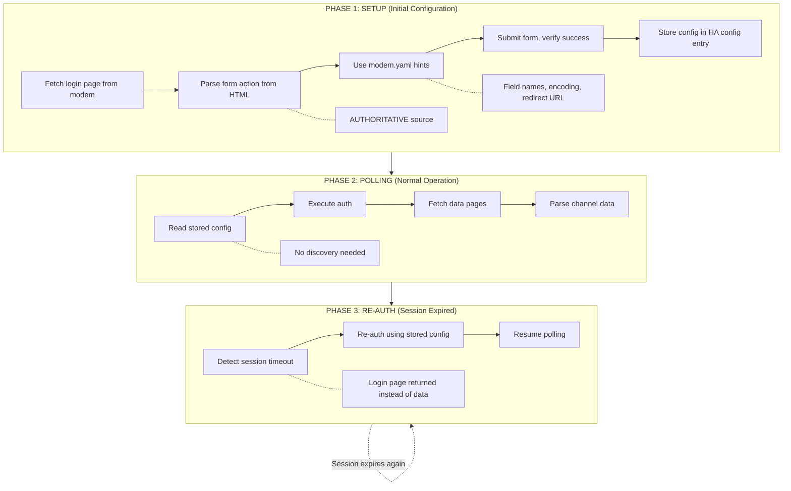
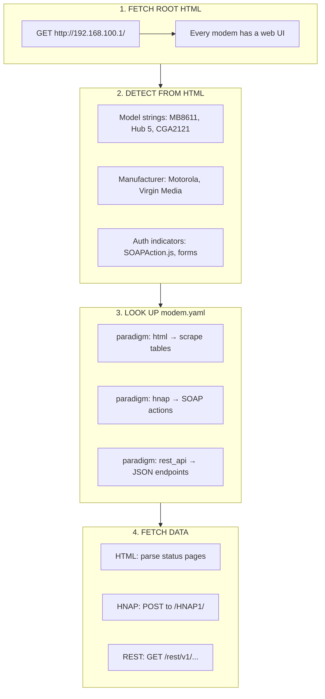
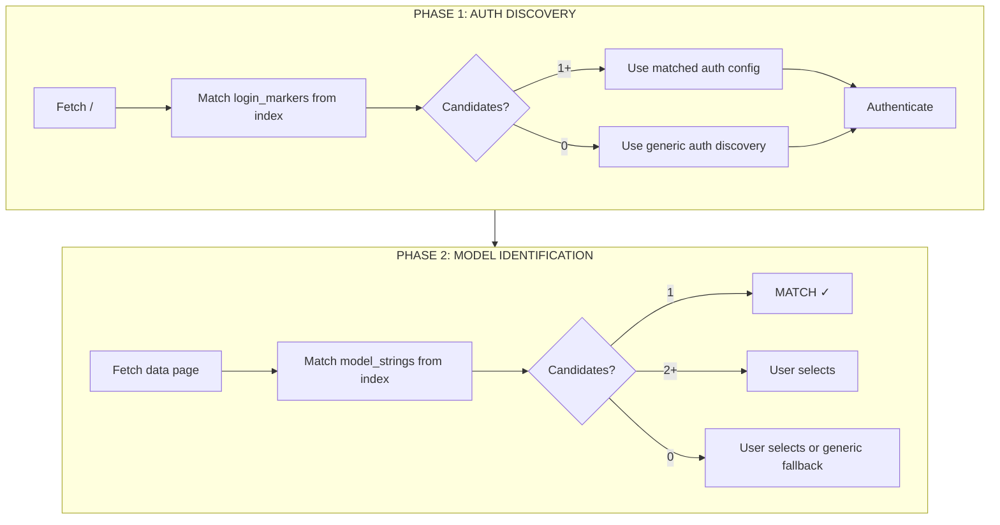
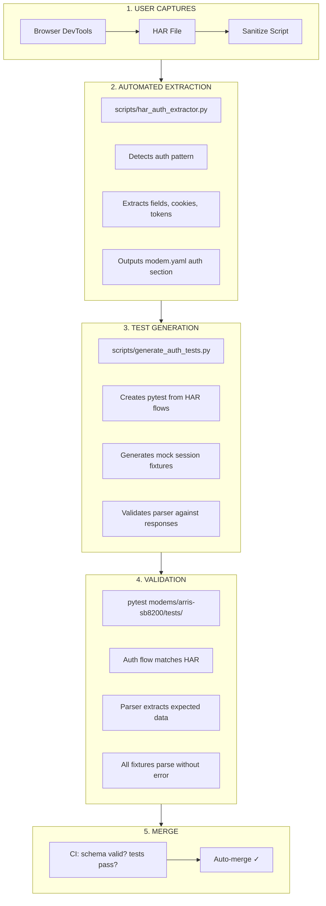

# Parser Architecture Design & Rationale

This document captures the key architectural decisions, design rationale, and lessons learned from building the parser plugin system. It serves as a reference for future maintainers and contributors.

---

## Parser Plugin System Overview

The Cable Modem Monitor uses a **modular parser plugin architecture** that allows adding support for new modem models without modifying core integration code.

### Key Benefits

- **Zero core changes needed** - Just add a new parser file
- **Auto-discovery** - Plugin system finds parsers automatically
- **Parser isolation** - Adding/fixing parsers can't break existing ones
- **User control** - Users can manually override auto-detection
- **Performance caching** - Parser choice is cached after first success

---

## Design Principle: Self-Contained Modems

> **The governing principle:** A contributor should be able to drop a new modem into
> `modems/<mfr>/<model>/` and need **zero changes elsewhere** in the codebase.

This principle drives all architectural decisions about where modem-specific content lives.

### What Belongs in `modems/<mfr>/<model>/`

Everything specific to a single modem model lives in its directory:

| Content | File/Directory | Purpose |
|---------|----------------|---------|
| **Configuration** | `modem.yaml` | Single source of truth: metadata, auth hints, pages |
| **Parser** | `parser.py` | Model-specific parsing logic |
| **Fixtures** | `fixtures/` | Sanitized HTML/JSON for parser tests |
| **HAR Captures** | `har/` | Full session captures (gitignored for PII) |
| **Tests** | `tests/test_parser.py` | Parser detection and parsing tests |
| **HAR Tests** | `tests/test_har.py` | HAR-based auth flow tests (run locally) |
| **Auth Tests** | `tests/test_auth.py` | Modem-specific auth scenarios (optional) |

### What Stays in Core (`tests/`, `custom_components/`)

Mechanisms and infrastructure that work across all modems:

- Auth strategies (FORM_PLAIN, HNAP_SESSION, etc.)
- Parser plugin system and base classes
- MockModemServer implementation
- HAR replay tooling
- Test fixtures and conftest.py helpers

### Drop-In Modem Checklist

To add a new modem, create this structure:

```
modems/<manufacturer>/<model>/
├── modem.yaml              # Required: metadata + auth config
├── parser.py               # Required: parsing logic
├── fixtures/               # Required: test fixtures
│   └── status.html         # At minimum, one fixture
└── tests/
    └── test_parser.py      # Required: parser tests
```

Optional additions:
- `har/` - HAR captures for high-fidelity testing
- `tests/test_har.py` - HAR-based tests
- `tests/test_auth.py` - Auth variant tests

The `modems/README.md` is auto-generated from `modem.yaml` files and should not be edited manually.

---

## Architectural Decisions

### 1. Auto-Discovery Over Manual Registration

**Decision:** Parsers auto-register on import via plugin discovery system

**Rationale:**
- Zero-configuration - developers can't forget to register their parser
- Maintainers don't need to update a central registry
- New parsers are immediately available to the integration

**Trade-off:**
- Slightly slower import time (negligible in practice)
- All parser modules are loaded even if not used

**Implementation:**
- `parsers/__init__.py` scans manufacturer subdirectories
- Imports all modules and registers `ModemParser` subclasses
- Sorted by manufacturer and priority for predictable ordering

### 2. Parser-Specific Validation

**Decision:** Each parser implements its own `validate_channels()` method

**Rationale:**
- Different modems have different channel constraints
- DOCSIS 3.0 vs 3.1 have different frequency ranges
- Some modems have unusual channel counts or configurations
- Allows per-model customization without affecting others

**Benefit:**
- Flexible validation that adapts to modem capabilities
- Parser developers can fine-tune validation for their specific model

**Example:**
```python
def validate_channels(self, downstream, upstream):
    """Custom validation for this modem model."""
    if not (8 <= len(downstream) <= 32):
        raise ValueError(f"Expected 8-32 downstream channels, got {len(downstream)}")
    # Model-specific validation logic...
```

### 3. ~~Parser Priority System~~ (REMOVED in v3.12.0)

> **Status:** Removed. Priority was dead code - never actually used in detection.
> Parser detection now relies on `can_parse()` returning True for the correct parser.

### 4. ~~Parser-Owned URL Patterns~~ (MOVED to modem.yaml in v3.12.0)

> **Status:** Moved to modem.yaml. URL patterns are now configured in `pages.public` and
> `pages.protected` sections of each modem's modem.yaml file.

**New structure (modem.yaml):**
```yaml
pages:
  public:
    - /  # Pages that don't require auth
  protected:
    - /MotoStatus.asp  # Pages that require auth
  hnap_actions:  # For HNAP modems
    - GetCustomerStatusDownstreamChannelInfo
```

**Access via adapter:**
```python
from custom_components.cable_modem_monitor.modem_config.adapter import get_auth_adapter_for_parser

adapter = get_auth_adapter_for_parser("MotorolaMB7621Parser")
url_patterns = adapter.get_url_patterns()  # Returns modem.yaml pages config
```

### 5. Response-Driven Authentication Discovery (v3.12+)

**Decision:** Authentication is auto-discovered by inspecting modem responses, not declared by parsers.

**Rationale:**
- Parsers focus on parsing only - no auth logic needed
- Auth is discovered once during setup, stored in config entry
- Same modem model at different ISPs may have different auth requirements
- Unknown auth patterns are captured for debugging

**How it works (Setup Flow):**
1. `AuthDiscovery.discover()` fetches modem page anonymously
2. Response is inspected: 200+data → NO_AUTH, 401 → BASIC_HTTP, form → FORM_PLAIN, etc.
3. Strategy and form config (if applicable) stored in config entry
4. Parser detection runs on authenticated HTML

**How it works (Polling Flow):**
1. `AuthHandler` reads stored strategy from config entry
2. Executes strategy to authenticate session
3. Scraper fetches data with authenticated session
4. Parser parses the data (no auth involvement)

**Available strategies:** `NO_AUTH`, `BASIC_HTTP`, `FORM_PLAIN`, `FORM_BASE64`, `HNAP_SESSION`, `URL_TOKEN_SESSION`.

**Parser Auth Hints (Optional):**
For non-standard forms, parsers can provide optional hints:
```python
class MyParser(ModemParser):
    auth_form_hints = {"username_field": "webUserName"}  # Non-standard field names
    js_auth_hints = {"pattern": "url_token_session"}     # JS-based auth (SB8200)
```

→ **For implementation details, see [`core/auth/README.md`](../../custom_components/cable_modem_monitor/core/auth/README.md)**

#### Auth Data Flow: Setup → Polling → Re-Auth

The auth system has three distinct phases with different data sources:



<details>
<summary>Text version (mobile/terminal)</summary>

```
┌─────────────────────────────────────────────────────────────────────────┐
│  PHASE 1: SETUP (Initial Configuration)                                 │
├─────────────────────────────────────────────────────────────────────────┤
│                                                                         │
│  1. Fetch login page from modem (live HTTP request)                     │
│  2. Parse form action from HTML ← AUTHORITATIVE (firmware variants)     │
│  3. Use modem.yaml hints for:                                           │
│     - Field names (hard to auto-detect: "webUserName" vs "username")    │
│     - Password encoding (base64 vs plain)                               │
│     - Success redirect URL (for post-login verification)                │
│  4. Submit form, verify success                                         │
│  5. Store discovered config in HA config entry                          │
│                                                                         │
│  Result: Config entry contains learned knowledge from live modem        │
│                                                                         │
└─────────────────────────────────────────────────────────────────────────┘
                                    ↓
┌─────────────────────────────────────────────────────────────────────────┐
│  PHASE 2: POLLING (Normal Operation)                                    │
├─────────────────────────────────────────────────────────────────────────┤
│                                                                         │
│  1. AuthHandler reads stored config from HA config entry                │
│  2. Executes auth using stored form action, field names, encoding       │
│  3. Scraper fetches data pages with authenticated session               │
│  4. Parser extracts channel data                                        │
│                                                                         │
│  No discovery needed - using learned knowledge                          │
│                                                                         │
└─────────────────────────────────────────────────────────────────────────┘
                                    ↓
┌─────────────────────────────────────────────────────────────────────────┐
│  PHASE 3: RE-AUTH (Session Expired)                                     │
├─────────────────────────────────────────────────────────────────────────┤
│                                                                         │
│  1. Polling detects session timeout (login page returned instead)       │
│  2. AuthHandler re-authenticates using stored config                    │
│  3. Resume normal polling                                               │
│                                                                         │
│  No re-discovery needed - stored config already has correct values      │
│                                                                         │
└─────────────────────────────────────────────────────────────────────────┘
```

</details>

**Key Principle: Live HTML is Authoritative**

The modem's actual HTML response is the source of truth for:
- Form action URL (where to POST login)
- Form method (POST vs GET)
- Hidden fields (CSRF tokens)

modem.yaml provides hints for things that are hard to auto-detect:
- Field names (modems use non-standard names like "loginName", "pwd", etc.)
- Password encoding (base64 detection from JavaScript is heuristic)
- Success redirect URL (needed to verify login worked)

This design handles firmware variants gracefully. If a modem's firmware changes the form action URL, the live HTML parsing adapts automatically.

### 6. Three-Tier Parser Selection Strategy

**Decision:** Tiered fallback system for parser selection

**Strategy:**
1. **Tier 1: User explicit selection** (strict, no fallback)
   - User manually selected a parser in config
   - If parsing fails, raise error (don't silently fallback)
   - Respects user's intentional choice

2. **Tier 2: Cached parser from previous detection**
   - Parser that worked last time is tried first
   - Improves performance (skip detection on every poll)
   - Falls back to Tier 3 if cached parser fails

3. **Tier 3: Auto-detection across all parsers**
   - Try each parser's `can_parse()` method
   - First parser that returns True is used
   - Cache the successful parser for next time

**Rationale:**
- User control when needed (ISP-customized firmware)
- Performance optimization via caching
- Automatic detection for ease of setup

### 7. Manufacturer Subdirectories

**Decision:** Organize parsers in manufacturer-specific subdirectories

**Structure:**
```
parsers/
├── arris/
│   └── sb6141.py
├── motorola/
│   ├── generic.py
│   └── mb7621.py
└── technicolor/
    ├── tc4400.py
    └── xb7.py
```

**Rationale:**
- Better organization as parser count grows
- Clear ownership and responsibility
- Easier to find and maintain related parsers
- Allows manufacturer-specific utilities in `__init__.py`

---

## Lessons Learned

### What Worked Well

1. **Auto-discovery system worked perfectly first try**
   - Plugin pattern is well-understood in Python
   - No manual registration headaches
   - Easy to test with simple imports

2. **All existing tests passed without modification**
   - Clean abstraction with base class
   - Backward compatibility maintained
   - Refactoring was safe and non-breaking

3. **Parser isolation prevents interference**
   - Each parser is completely independent
   - Bugs in one parser don't affect others
   - Safe for community contributions

4. **Clear separation of concerns**
   - Scraper handles HTTP/session management
   - Parser handles HTML parsing only
   - Validation is parser-specific

### Areas for Improvement

See **[TECH_DEBT.md](./TECH_DEBT.md)** for tracked improvement items, including:
- Parser-specific unit test coverage (Item #8)
- Error handling standardization (Item #9)
- Detection collision handling (related to Item #4)

---

## Technical Implementation Notes

### BeautifulSoup Import Placement

**Note:** BeautifulSoup is imported in `parsers/__init__.py`

**Why it's fine:**
- BeautifulSoup is already a required dependency
- Import cost is negligible
- All parsers need it anyway

### Parser Detection Order

**Note:** Detection order is deterministic (manufacturer + priority)

**Why it matters:**
- Predictable behavior for debugging
- Higher priority parsers tried first within manufacturer
- Prevents random behavior from dictionary ordering

### Validation Method Override

**Note:** `validate_channels()` can be overridden per-parser

**Usage:**
```python
def validate_channels(self, downstream, upstream):
    """Custom validation for this specific modem."""
    # Override base class validation if needed
    # or call super().validate_channels() and add checks
```

### System Info Merging

**Note:** System info uses dictionary unpacking for clean merging

**Pattern:**
```python
return {
    "downstream": downstream,
    "upstream": upstream,
    **system_info,  # Merge system info at top level
}
```

**Why:** Allows parsers to add arbitrary system fields without modifying core code

### Detection Markers

**Best Practice:** Use unique, stable HTML markers for detection

**Good markers:**
- Model name in page title
- Unique CSS classes or IDs
- Specific table headers
- Software version format

**Bad markers:**
- Generic text that might appear on other modems
- Firmware-version-specific strings
- ISP-customized branding

---

## Future Considerations

### Potential Enhancements

1. **Parser capability flags**
   - Some parsers support restart, others don't
   - Some provide uptime, others don't
   - Could use feature flags to communicate capabilities

2. **Multi-page parsing**
   - Some modems spread data across multiple pages
   - Parser could define multiple URL patterns with roles
   - Scraper would fetch all and pass to parser

3. **Firmware version detection**
   - Track firmware version in device info
   - Warn users when firmware is outdated
   - Help with troubleshooting parser issues

4. **Parser testing framework**
   - Standardized test harness for parsers
   - Common validation tests all parsers should pass
   - Performance benchmarking for parsing speed

5. **Dynamic parser updates**
   - Allow users to install parsers via HACS
   - Separate parser releases from integration releases
   - Community-maintained parser repository

6. **Three-part decomposition (post-30 modems milestone)**
   - **HA Integration (thin)**: config_flow, sensors, device registry - HA-specific wrapper
   - **Standalone Core (stable)**: scraper, parsing strategies, data models - HA-independent, PyPI-extractable
   - **Community Configs (high velocity)**: JSON parser configs + fixtures replace Python parsers

   Key shift: parsers become declarative JSON, not Python code. Core provides parsing *strategies* (HTML table extraction, HNAP, REST), community provides *configuration* per modem.

   Enables:
   - Non-developer contributors can produce complete submissions
   - AI skill guides fixture → JSON config → test validation
   - Maintainer review becomes: schema valid? tests pass? → merge
   - Platform portability (same JSON configs for Python core and browser extension)

---

## Unified Detection: HTML as the Front Door

> **Status:** Architecture defined. Implementation target: v3.12.0

### The Principle

**All modems are detected from their initial HTML response, regardless of data paradigm.**



<details>
<summary>Text version (mobile/terminal)</summary>

```
┌─────────────────────────────────────────────────────────────────────────┐
│  UNIFIED DETECTION FLOW (All Paradigms)                                 │
├─────────────────────────────────────────────────────────────────────────┤
│                                                                         │
│  1. FETCH ROOT HTML                                                     │
│     GET http://192.168.100.1/                                           │
│     → Every modem has a web UI that returns HTML                        │
│                                                                         │
│  2. DETECT FROM HTML CONTENT                                            │
│     • Model strings: "MB8611", "Hub 5", "CGA2121"                       │
│     • Manufacturer: "Motorola", "Virgin Media", "Technicolor"          │
│     • Auth indicators: SOAPAction.js → HNAP, <form> → form auth        │
│                                                                         │
│  3. LOOK UP modem.yaml → Get paradigm + config                          │
│     • paradigm: html → scrape HTML tables                              │
│     • paradigm: hnap → use HNAP SOAP actions                           │
│     • paradigm: rest_api → use REST JSON endpoints                     │
│                                                                         │
│  4. FETCH DATA using paradigm-appropriate method                        │
│     • HTML: parse tables from status pages                             │
│     • HNAP: POST SOAP actions to /HNAP1/                               │
│     • REST: GET JSON from /rest/v1/... endpoints                       │
│                                                                         │
└─────────────────────────────────────────────────────────────────────────┘
```

</details>

### Why This Matters

Before this principle, each paradigm had different detection approaches:

| Paradigm | Old Detection Method | Problem |
|----------|---------------------|---------|
| HTML | Fetch `/`, detect from HTML | ✓ Works |
| HNAP | Fetch `/Login.html`, detect SOAPAction.js | ✓ Works |
| REST | Probe `/rest/v1/...`, detect from JSON | ✗ Must know endpoints first |

REST API modems were the odd one out - detection required probing specific endpoints
that we could only know from modem.yaml. This is backwards: we need to detect the
modem *before* we can look up its modem.yaml.

### The Solution: Hybrid Detection for REST Modems

REST API modems (like Virgin Hub 5) should:
1. Be detected from their gateway HTML UI (like all other modems)
2. Use REST endpoints only for data fetching (not detection)

**modem.yaml structure for REST modems:**

```yaml
paradigm: rest_api

pages:
  public:
    - "/"                                    # For detection (HTML)
    - "/rest/v1/cablemodem/downstream"       # For data (JSON)
    - "/rest/v1/cablemodem/upstream"         # For data (JSON)

detection:
  body_contains:                             # Match HTML content
    - "Virgin Media"
    - "Hub 5"
  json_markers:                              # Optional: verify JSON once found
    - "cablemodem"

data:
  downstream_channels: "/rest/v1/cablemodem/downstream"
  upstream_channels: "/rest/v1/cablemodem/upstream"
```

### Implementation Requirements

1. **Capture HTML fixtures** for REST modems (currently only JSON captured)
2. **Add HTML detection patterns** to REST modem.yaml files
3. **Add `/` to pages.public** for REST modems (gateway HTML UI for detection)
4. **Update parser `can_parse()`** to detect from both HTML and JSON

### Auth Discovery Simplification

When modem.yaml declares an explicit strategy (not FORM), auth discovery is skipped:

```python
# In config_flow.py
_EXPLICIT_STRATEGY_MAP = {
    AuthStrategy.NONE: AuthStrategyType.NO_AUTH,
    AuthStrategy.BASIC: AuthStrategyType.BASIC_HTTP,
    AuthStrategy.HNAP: AuthStrategyType.HNAP_SESSION,
    AuthStrategy.URL_TOKEN: AuthStrategyType.URL_TOKEN_SESSION,
    AuthStrategy.REST_API: AuthStrategyType.NO_AUTH,
}

# If strategy in map → skip discovery, use mapped type directly
# If strategy is FORM → run discovery to find form action/fields
```

This means:
- **REST_API modems**: Skip discovery entirely (no auth needed)
- **HNAP modems**: Skip discovery (HNAP auth is explicit)
- **BASIC modems**: Skip discovery (basic auth is explicit)
- **FORM modems**: Still run discovery (need to find form action from live HTML)

### Benefits

| Aspect | Before | After |
|--------|--------|-------|
| Detection consistency | Paradigm-specific | Unified (HTML first) |
| New REST modem discovery | Must know endpoints | Detect from HTML |
| Diagnostics quality | "Unknown REST modem" | "Found Hub 5, using REST API" |
| Contributor experience | Different flows per paradigm | Same flow for all |

---

## Discovery Intelligence Architecture

> **Status:** Design approved. Implementation in v3.12+.

### The Problem

When a user connects a modem we don't recognize, the current system either:
- Fails silently with "no parser found"
- Falls back to UniversalFallbackParser with limited functionality

This creates friction for users and makes it hard to add support for new modems.

### The Solution: Constraint-Based Discovery

Discovery becomes a **constraint satisfaction** process that:
1. Gathers signals about the modem (probes, responses, patterns)
2. Uses signals to filter modem.yaml candidates
3. Narrows down until "there can be only one"
4. When no match exists, produces actionable intelligence

### Key Concepts

#### Data Paradigms vs Auth Strategies

These are **independent concerns** that should not be conflated:

| Paradigm | Description | Auth Options |
|----------|-------------|--------------|
| **HTML** | Traditional web pages with tables | none, basic, form, url_token |
| **HNAP** | SOAP protocol over HTTP | hnap_session (coupled) |
| **REST API** | JSON endpoints | varies |

Most modems use HTML with various auth strategies. HNAP is the exception where paradigm and auth are coupled.

#### Protocol Constants vs Modem Configuration

| Type | Location | Examples |
|------|----------|----------|
| **Protocol constants** | Hardcoded in code | HNAP endpoint `/HNAP1/`, namespace, empty_action_value |
| **Modem configuration** | modem.yaml | Which HNAP actions to call, URL token session details |
| **Runtime discovery** | Discovered at probe time | Form fields, auth type detection |

**YAGNI Principle:** Keep things hardcoded until real-world variance forces configuration. Don't add config options "just in case."

#### Discovery Signals

Signals are observations gathered during modem probing:

```
Signal Type          Example                         Filters To
─────────────────────────────────────────────────────────────────
paradigm_hnap        /HNAP1/ responds with SOAP      S33, MB8611
paradigm_html        HTML tables detected            Most modems
paradigm_rest        JSON API responds               Hub 5
action_prefix        GetMoto* in HNAP response       MB8611
action_prefix        GetCustomer* in HNAP response   S33
model_string         "MB8612" in HTML                New/unknown
auth_form            Login form detected             Form-auth modems
auth_basic           401 + WWW-Authenticate          Basic-auth modems
```

#### modem.yaml as Discovery Constraints

Each modem.yaml file provides constraints that signals must match:

```yaml
# In modem.yaml
manufacturer: Motorola
model: MB8611

paradigm: hnap                    # Discovery filter: must detect HNAP
detection:
  hnap_action_prefix: "GetMoto"   # Discovery filter: action names
  body_contains:                  # Detection markers
    - "MB8611"
```

### Discovery Flow (Two-Phase, Index-Driven)

Discovery uses pre-indexed hints from `index.yaml` for O(1) lookup, filtering candidates at each phase.



<details>
<summary>Text version (mobile/terminal)</summary>

```
┌─────────────────────────────────────────────────────────────────────┐
│                 PHASE 1: AUTH DISCOVERY                              │
├─────────────────────────────────────────────────────────────────────┤
│                                                                     │
│  1. Fetch modem IP (/)                                              │
│  2. Match response against ALL login_markers in index               │
│  3. Filter candidates by matches                                    │
│     - 1+ matches → use matched modem's auth config                  │
│     - 0 matches → use generic auth discovery                        │
│  4. Authenticate                                                    │
│                                                                     │
│  Output: Authenticated session + narrowed candidate list            │
│                                                                     │
└─────────────────────────────────────────────────────────────────────┘
                                ↓
┌─────────────────────────────────────────────────────────────────────┐
│                 PHASE 2: MODEL IDENTIFICATION                        │
├─────────────────────────────────────────────────────────────────────┤
│                                                                     │
│  1. Fetch data page (or use page_hint from index)                   │
│  2. Match response against candidates' model_strings                │
│  3. Filter candidates by matches                                    │
│                                                                     │
│  Outcomes:                                                          │
│     - 1 match   → use that parser                                   │
│     - 2+ matches → user selects from narrowed list                  │
│     - 0 matches  → user selects from full list OR generic fallback  │
│                                                                     │
│  Output: Identified parser + working URL + auth strategy            │
│                                                                     │
└─────────────────────────────────────────────────────────────────────┘
```

</details>

#### Simple Filtering Logic

```python
def detect_modem(initial_response: str, index: dict) -> str | list[str] | None:
    """Filter candidates at each phase using indexed hints."""
    candidates = list(index.keys())  # Start with all modems

    # Phase 1: Filter by login_markers
    candidates = [c for c in candidates
                  if any(marker in initial_response
                         for marker in index[c].get("login_markers", []))]

    # ... authenticate using first match's config (or generic discovery) ...

    # Phase 2: Filter by model_strings
    candidates = [c for c in candidates
                  if any(s in data_response
                         for s in index[c].get("model_strings", []))]

    if len(candidates) == 1:
        return candidates[0]      # Found it
    elif len(candidates) > 1:
        return candidates         # User selects
    else:
        return None               # User selects or generic fallback
```

#### Generic Fallback

When no modem matches, the generic fallback still provides value:
- Auth discovery works (response-driven, inspects login page)
- Can authenticate and fetch pages
- Raw data visible in diagnostics
- Just won't parse modem-specific channel data

**Key insight:** We don't care *how* we authenticate, just that we *do*. By using indexed auth hints, we maximize the chance of successful authentication. After that, it's either a match (use identified parser) or fallback (capture diagnostics for analysis).

The paradigm (HNAP/HTML/REST) is an implementation detail of how we fetch data *after* identification, not a detection concern.

### When No Match Exists: Discovery Intelligence

When discovery narrows to zero candidates (new/unsupported modem), produce actionable output:

```
Discovery Report for 192.168.100.1
══════════════════════════════════════════════════════════════════

Detected Signals:
  ✓ Paradigm: HNAP (responded to /HNAP1/)
  ✓ Actions: GetMotoStatusDownstreamChannelInfo, GetMotoStatusUpstreamChannelInfo
  ✓ Model string: "MB8612"
  ✓ Manufacturer hint: "Motorola" in page content

Candidate Analysis:
  ┌────────────────────────────────────────────────────────────────┐
  │ Motorola MB8611                                        95% match│
  │   ✓ Same paradigm (HNAP)                                       │
  │   ✓ Same action prefix (GetMoto*)                              │
  │   ✓ Same manufacturer                                          │
  │   ✗ Model "MB8612" not in known models ["MB8611"]              │
  └────────────────────────────────────────────────────────────────┘

Recommendation:
  This appears to be a variant of Motorola MB8611.

  To request support:
  1. Download diagnostics from Home Assistant
  2. Open issue: https://github.com/solentlabs/cable_modem_monitor/issues/new
  3. Attach diagnostics JSON

  For developers - quick add:
  1. Copy modems/motorola/mb8611/ → modems/motorola/mb8612/
  2. Update model in modem.yaml
  3. Add "MB8612" to parser models list
  4. Run: pytest tests/parsers/motorola/test_mb8612.py
```

### Benefits

1. **Faster new modem support** - Discovery tells us exactly what's different
2. **Better user experience** - Actionable guidance instead of "unsupported"
3. **Contribution funnel** - Users get clear path to request/add support
4. **Reduced maintenance** - Discovery signals captured in diagnostics
5. **AI-assisted triage** - modem-request-triage skill uses discovery data

### Implementation Phases

| Phase | Description | Scope |
|-------|-------------|-------|
| **1. Foundation** | Hardcode HNAP constants, simplify modem.yaml | Code cleanup |
| **2. Signals** | Define signal types, capture during probe | New module |
| **3. Constraints** | Add `paradigm` field to modem.yaml schema | Schema update |
| **4. Filtering** | Use signals to filter candidates | Discovery logic |
| **5. Intelligence** | Generate reports for unmatched modems | UX enhancement |
| **6. Integration** | Connect to diagnostics, triage skill | Workflow |

---

## Long-Term Vision: Self-Contained Modem Configurations

> **Status:** Planning phase. Target: post-30 modems milestone.

The ultimate goal is to make each modem configuration a **self-contained, testable unit** that includes everything needed to support that modem—from raw captures to generated tests.

### Target Directory Structure

```
modems/                              # Future separate repo or submodule
├── arris-sb8200/
│   ├── modem.yaml                   # Metadata + auth hints + page definitions
│   ├── captures/
│   │   ├── status.html              # Fixture HTML pages (sanitized)
│   │   ├── logs.html
│   │   └── auth_flow.har            # Complete auth sequence for mock replay
│   ├── parser.py                    # Single-file parser (or declarative JSON)
│   └── tests/
│       ├── test_parser.py           # Auto-generated from fixtures
│       └── conftest.py              # HAR-based mock session fixtures
│
├── motorola-mb7621/
│   ├── modem.yaml
│   ├── captures/
│   │   └── ...
│   └── ...
│
└── _templates/
    ├── modem.yaml.template          # Schema for new modem configs
    └── parser.py.template           # Starter parser code
```

### Modem Configuration Schema (`modem.yaml`)

```yaml
# =============================================================================
# INTRINSIC FACTS (always true about this modem)
# =============================================================================
manufacturer: Motorola
model: MB7621
paradigm: html                       # html | hnap | rest_api
status: verified                     # verified | community | experimental

hardware:
  docsis_version: "3.0"
  chipset: Broadcom BCM3384
  release_date: "2017"

# =============================================================================
# DISCOVERY HINTS (indexed for fast lookup, guide detection)
# =============================================================================

# Phase 1: Auth hints (visible on login page, used for auth family detection)
auth:
  strategies:                        # Ordered list - try until success
    - strategy: form
      form:
        action: "/goform/login"
        username_field: loginUsername
        password_field: loginPassword
        password_encoding: base64
  login_markers:                     # Signals this modem's login page
    - "Motorola Cable Modem"         # Title
    - "moto.css"                     # Page content
    - "/goform/login"                # Form action

# Phase 2: Detection hints (visible after auth, used for model identification)
detection:
  model_strings:                     # Primary identifiers
    - "MB7621"
    - "MB 7621"
    - "2480-MB7621"
  page_hint: "/MotoSwInfo.asp"       # Where model string appears
  body_contains:                     # Secondary markers
    - "MotoConnection"

# Page structure
pages:
  public:
    - "/"
  protected:
    - "/MotoConnection.asp"
    - "/MotoSwInfo.asp"
  data:
    downstream_channels: "/MotoConnection.asp"
    upstream_channels: "/MotoConnection.asp"

# =============================================================================
# PARSER (how to extract data)
# =============================================================================
parser:
  class: MotorolaMB7621Parser
  module: custom_components.cable_modem_monitor.modems.motorola.mb7621.parser

capabilities:
  - downstream_channels
  - upstream_channels
  - system_uptime
  - restart

# =============================================================================
# PROVENANCE (where facts came from)
# =============================================================================
sources:
  chipset: "FCC ID: PPD-MB7621 (internal photos)"
  release_date: "https://www.motorola.com/MB7621"
  auth_config: "HAR capture from @maintainer"
  detection_hints: "PR #55 - verified"
```

#### Auth Variations Example (SB6190)

Some modems have different auth requirements based on firmware:

```yaml
# modems/arris/sb6190/modem.yaml
auth:
  strategies:
    - strategy: none           # Try first (older firmware - public page)
    - strategy: form           # Try if none fails (newer firmware 9.1.103+)
      form:
        action: "/cgi-bin/login"
        username_field: "username"
        password_field: "password"
```

Discovery tries strategies in order until one succeeds.

### HAR-Driven Workflow

The HAR (HTTP Archive) file becomes the **source of truth** for auth validation and test mocking.



<details>
<summary>Text version (mobile/terminal)</summary>

```
┌─────────────────────────────────────────────────────────────────────┐
│                        CONTRIBUTION FLOW                            │
├─────────────────────────────────────────────────────────────────────┤
│                                                                     │
│  1. USER CAPTURES                                                   │
│     ┌──────────┐    ┌──────────┐    ┌──────────┐                   │
│     │ Browser  │───▶│ HAR File │───▶│ Sanitize │                   │
│     │ DevTools │    │ (raw)    │    │ Script   │                   │
│     └──────────┘    └──────────┘    └────┬─────┘                   │
│                                          │                          │
│  2. AUTOMATED EXTRACTION                 ▼                          │
│     ┌──────────────────────────────────────────────┐               │
│     │ scripts/har_auth_extractor.py                │               │
│     │ - Detects auth pattern (HNAP, form, basic)   │               │
│     │ - Extracts form fields, cookies, tokens      │               │
│     │ - Outputs modem.yaml auth section            │               │
│     └────────────────────┬─────────────────────────┘               │
│                          │                                          │
│  3. TEST GENERATION      ▼                                          │
│     ┌──────────────────────────────────────────────┐               │
│     │ scripts/generate_auth_tests.py               │               │
│     │ - Creates pytest from HAR flows              │               │
│     │ - Generates mock session fixtures            │               │
│     │ - Validates parser against real responses    │               │
│     └────────────────────┬─────────────────────────┘               │
│                          │                                          │
│  4. VALIDATION           ▼                                          │
│     ┌──────────────────────────────────────────────┐               │
│     │ pytest modems/arris-sb8200/tests/            │               │
│     │ - Auth flow matches HAR                      │               │
│     │ - Parser extracts expected data              │               │
│     │ - All fixtures parse without error           │               │
│     └────────────────────┬─────────────────────────┘               │
│                          │                                          │
│  5. MERGE                ▼                                          │
│     ┌──────────────────────────────────────────────┐               │
│     │ CI: schema valid? tests pass? → auto-merge   │               │
│     └──────────────────────────────────────────────┘               │
│                                                                     │
└─────────────────────────────────────────────────────────────────────┘
```

</details>

### HAR-Based Mock Testing

For ~90% of modems, HAR files enable **complete test coverage without live hardware**:

```python
# conftest.py (auto-generated)
@pytest.fixture
def mock_sb8200_session(har_replay):
    """Replay SB8200 auth flow from HAR capture."""
    return har_replay("captures/auth_flow.har")

# test_parser.py (auto-generated)
def test_parse_downstream(mock_sb8200_session, sb8200_parser):
    """Validate parser against real captured response."""
    html = Path("captures/status.html").read_text()
    result = sb8200_parser.parse(html)

    assert len(result["downstream"]) == 32
    assert result["downstream"][0]["frequency"] == 723.0
```

### Migration Path

| Phase | Current State | Target State | Effort |
|-------|--------------|--------------|--------|
| **1. Colocate** | Fixtures in `tests/parsers/*/fixtures/` | Move to `modems/*/captures/` | Low |
| **2. Extract metadata** | Auth hints in parser classes | Move to `modem.yaml` | Medium |
| **3. HAR integration** | 12 HAR files in `RAW_DATA/` | Colocated per-modem | Low |
| **4. Test generation** | Manual pytest files | Auto-generated from HAR | Medium |
| **5. Declarative parsers** | Python parser classes | JSON/YAML config + strategies | High |

### Benefits

1. **90% Test Coverage via HAR Mocking**
   - Real network flows replayed in CI
   - No live modem needed for most tests
   - Regression detection when modem firmware changes

2. **Zero-Friction Contributions**
   - Users submit: HAR + HTML captures
   - Automation generates: modem.yaml, tests, parser skeleton
   - Maintainer reviews: schema valid? tests pass? → merge

3. **Self-Healing Diagnostics**
   - Auth failures return HAR-diff showing expected vs actual
   - Users can compare their capture to known-good HAR
   - Faster issue resolution

4. **Portable Configurations**
   - Same modem configs work for HA integration and standalone CLI
   - Future: browser extension using same JSON configs
   - Community can maintain configs independently of core

5. **Reduced Maintenance Burden**
   - Declarative configs are easier to review than Python code
   - Schema validation catches errors before merge
   - AI assistance can generate configs from captures

### Tooling (Current)

| Script | Purpose | Status |
|--------|---------|--------|
| `scripts/har_auth_extractor.py` | Extract auth patterns from HAR | ✅ Implemented |
| `scripts/generate_auth_tests.py` | Generate pytest from HAR analysis | ✅ Implemented |
| `utils/har_sanitizer.py` | Remove credentials from HAR files | ✅ Implemented |

### Tooling (Planned)

| Script | Purpose | Status |
|--------|---------|--------|
| `scripts/har_to_fixtures.py` | Extract HTML fixtures from HAR responses | Planned |
| `scripts/modem_yaml_generator.py` | Generate modem.yaml from HAR + parser | Planned |
| `scripts/migrate_fixtures.py` | Move existing fixtures to new structure | Planned |

---

## Test Architecture (v3.12+)

The test suite (~1550 tests) is organized into **core** tests (static, mechanism-focused) and
**dynamic** tests (scale with the modem list).

### Core vs Dynamic Tests

| Type | Location | Tests | Scales with |
|------|----------|------:|-------------|
| **Core** | `tests/` | ~900 | Codebase (mechanisms) |
| **Dynamic** | `modems/<mfr>/<model>/tests/` | ~650 | Modem list |

**Core tests** validate mechanisms independent of specific modems. Adding a new modem
doesn't require touching these tests.

**Dynamic tests** are colocated with the modem they test. Adding a new modem means
adding tests alongside its `modem.yaml` and `fixtures/`.

---

### Core Tests (~900)

#### 1. Unit Tests (~430)

Fast tests with mocked dependencies. No network, no I/O.

**`tests/core/`** (~270 tests) - Core module logic:
- `test_auth_handler.py` - AuthHandler initialization, strategy selection
- `test_auth_discovery.py` - Auth discovery logic (mocked responses)
- `test_hnap_builder.py`, `test_hnap_json_builder.py` - HNAP envelope construction
- `test_signal_analyzer.py` - Signal quality analysis
- `test_health_monitor.py` - Health monitoring logic

**`tests/lib/`** (~60 tests) - Library utilities:
- `test_html_crawler.py` - URL discovery, link extraction
- `test_utils.py` - General utility functions

**`tests/utils/`** (~100 tests) - Utility functions:
- `test_har_sanitizer.py` - PII removal from HAR files
- `test_capture_modem.py` - Modem capture utilities
- `test_host_validation.py` - Host/URL validation
- `test_html_helper.py` - HTML parsing helpers

**`tests/modem_config/`** (~20 tests) - Config adapter:
- `test_adapter.py` - modem.yaml to auth hint conversion

**Answers:** "Does our core logic work correctly?"

#### 2. Component Tests (~260)

Tests Home Assistant integration behavior with mocked HA core.

**`tests/components/`**:
- `test_coordinator.py` - Data coordinator, polling, caching
- `test_config_flow.py` - Setup wizard, options flow
- `test_sensor.py` - Sensor entity creation and updates
- `test_button.py` - Button entities (restart, refresh)
- `test_diagnostics.py` - Diagnostics download
- `test_init.py` - Integration setup/teardown
- `test_data_orchestrator.py` - Scraper behavior

**Answers:** "Does the HA integration behave correctly?"

#### 3. Parser Infrastructure Tests (~50)

Tests parser system mechanics, not individual parsers.

**`tests/parsers/`**:
- `test_parser_contract.py` - Validates all parsers implement required interface
- `test_parser_loading.py` - Plugin discovery and registration
- `universal/test_fallback.py` - Universal fallback parser behavior

**Answers:** "Does the parser plugin system work?"

#### 4. Integration Tests (~200)

Tests with real network I/O against mock servers.

| Sub-category | Location | Tests | Purpose |
|--------------|----------|------:|---------|
| Core Mechanism | `tests/integration/core/` | ~120 | Auth strategies with synthetic data |
| Infrastructure | `tests/integration/infrastructure/` | ~30 | SSL/TLS, connectivity |
| HAR Tooling | `tests/integration/har_replay/` | ~20 | HAR parser utilities |

**Core Mechanism** (`tests/integration/core/`):
- Tests auth strategies independent of any specific modem
- Uses synthetic `MOCK_MODEM_RESPONSE` - fake HTML that exercises auth flows
- `test_hnap_soap_auth.py`, `test_form_base64_auth.py`, `test_https_form_auth.py`

**Infrastructure** (`tests/integration/infrastructure/`):
- `test_ssl_modern.py`, `test_ssl_legacy.py` - TLS negotiation
- `test_connectivity_check.py` - Network reachability

**HAR Tooling** (`tests/integration/har_replay/`):
- `har_parser.py` - HAR parsing utility (not a test)
- `test_har_parser.py` - Tests the HAR parser utility
- `conftest.py` - Shared fixtures (`@requires_har`, `mock_har_for_modem`)
- Note: Modem-specific HAR tests live in `modems/<mfr>/<model>/tests/test_har.py`

**Answers:** "Does auth/network work against a mock server?"

---

### Dynamic Tests (~650)

All dynamic tests live in `modems/<mfr>/<model>/tests/` alongside the modem config.

#### Per-Modem Tests

Each modem directory can contain:
```
modems/arris/sb8200/
├── modem.yaml              # Single source of truth
├── fixtures/               # Real modem responses
└── tests/
    ├── test_parser.py      # Parser detection + parsing (~30-50 tests)
    └── test_auth.py        # Auth E2E for this modem (optional)
```

**`test_parser.py`** - Parser-specific tests:
- Loads real HTML/JSON fixtures from `fixtures/`
- Tests `can_parse()` detection
- Tests `parse()` data extraction
- Validates channel data structure

**`test_auth.py`** - Modem-specific auth scenarios (optional):
- Tests auth variants (HTTP vs HTTPS, auth vs no-auth)
- Uses MockModemServer with modem's fixtures

**Answers:** "Does this specific modem work?"

#### Cross-Cutting Dynamic Tests

**`tests/integration/test_modem_e2e.py`** - Auto-discovers all modems:
- Parametrizes over all `modem.yaml` files
- Runs standardized tests for each modem
- No code changes needed when adding modems

**`tests/integration/test_fixture_validation.py`** - Validates all fixtures:
- Checks fixture files exist and are valid
- Cross-modem validation

#### HAR Replay Tests

Highest-fidelity testing using HAR files to drive MockModemServer.

```
modems/arris/sb8200/
├── fixtures/           # Static HTML/JSON (parser tests use this)
├── har/                # HAR captures (gitignored - PII concerns)
│   └── session.har     # Full request/response sequence
└── tests/
    ├── test_parser.py  # Uses fixtures/ - runs everywhere
    └── test_har.py     # Uses har/ - runs locally, skips in CI
```

- **Full session simulation** - auth flow, cookies, multiple requests
- **Runs locally** - if HAR files are present on developer's filesystem
- **Skips in CI/CD** - HAR files are gitignored until PII validation complete
- Tests skip gracefully when HAR files aren't present

**Answers:** "Does the full auth + fetch flow work against a realistic simulation?"

---

### Directory Structure

```
tests/                              # CORE TESTS (~900)
├── conftest.py                     # Root fixtures, pytest plugins
├── fixtures.py                     # Fixture loading helpers
├── core/                           # Core module unit tests
│   ├── test_auth_handler.py
│   ├── test_auth_discovery.py
│   └── test_hnap_builder.py
├── lib/                            # Library utility tests
├── utils/                          # Utility function tests
├── modem_config/                   # Config adapter tests
├── components/                     # HA component tests
│   ├── test_coordinator.py
│   ├── test_config_flow.py
│   └── test_sensor.py
├── parsers/                        # Parser INFRASTRUCTURE tests only
│   ├── test_parser_contract.py     # All parsers implement interface
│   ├── test_parser_loading.py      # Plugin discovery
│   └── universal/test_fallback.py  # Fallback parser
└── integration/                # Integration tests
    ├── conftest.py             # Mock servers, modem fixtures
    ├── mock_modem_server.py    # MockModemServer implementation
    ├── core/                   # Auth mechanism tests
    │   ├── conftest.py         # Synthetic auth handlers
    │   └── test_*.py
    ├── infrastructure/         # SSL, connectivity tests
    └── har_replay/             # HAR parser utility + tests (CORE only)

modems/                             # DYNAMIC TESTS (~650)
├── conftest.py                     # Imports fixtures from tests/integration/
├── arris/
│   ├── sb8200/
│   │   ├── modem.yaml              # Single source of truth
│   │   ├── fixtures/               # Static HTML/JSON for parser tests
│   │   ├── har/                    # HAR captures (gitignored - PII)
│   │   └── tests/
│   │       ├── test_parser.py      # Uses fixtures/ - runs everywhere
│   │       └── test_har.py         # Uses har/ - runs locally, skips in CI
│   └── ...
├── motorola/
│   ├── mb7621/
│   │   ├── modem.yaml
│   │   ├── fixtures/
│   │   ├── har/
│   │   └── tests/
│   │       ├── test_parser.py
│   │       └── test_har.py
│   └── ...
└── ...
```

---

### HAR File Architecture

HAR files serve three roles in the test pipeline:

| Role | Description | Output |
|------|-------------|--------|
| **1. Fixture Extraction** | HAR → HTML/JSON files | Populates `fixtures/` directory |
| **2. Mock Replay** | HAR drives MockModemServer | Simulates modem in tests |
| **3. Live Validation** | Compare HAR to real modem | Detects firmware changes |

**HAR Structure (compact, references fixtures):**
```
modem.har
├── References fixture files (not embedded responses)
├── Contains auth flow sequence
├── Contains request/response metadata
└── Stays small, fixtures stored separately
```

This keeps HAR files compact while maintaining full replay functionality.
Fixtures are the single source of truth, extracted once from HAR.

---

### Key Testing Infrastructure

#### MockModemServer

Reads `modem.yaml` and serves fixtures with auth behavior:

```python
# Basic usage - serves fixtures with configured auth
with MockModemServer.from_modem_path(modem_path) as server:
    response = session.get(server.url)

# Variants for testing
MockModemServer.from_modem_path(modem_path, auth_enabled=False)  # Skip auth
MockModemServer.from_modem_path(modem_path, ssl_context=ctx)     # HTTPS
```

#### Dynamic Modem Discovery

`test_modem_e2e.py` auto-discovers all modems and runs standardized tests:
- Config loads correctly
- MockModemServer starts
- Auth workflow completes
- Parser can parse fixture data

No code changes needed when adding new modems - just add `modem.yaml` + fixtures.

#### conftest.py Organization

| File | Purpose |
|------|---------|
| `tests/conftest.py` | Root fixtures, pytest plugins |
| `tests/integration/conftest.py` | Mock servers, SSL fixtures, modem.yaml fixtures |
| `tests/integration/core/conftest.py` | Synthetic auth handlers for mechanism tests |
| `modems/conftest.py` | Imports integration fixtures for colocated tests |

#### pytest Configuration

Both `pytest.ini` and `pyproject.toml` configure:
```ini
testpaths = tests modems
```

This enables pytest to discover:
- Standard tests in `tests/`
- Modem-colocated tests in `modems/<mfr>/<model>/tests/`

---

## Contributing New Parsers

When creating a new parser, consider:

### Detection Method (`can_parse`)

- Use **unique, stable markers** that won't change with firmware updates
- Check multiple markers if possible (belt-and-suspenders)
- Return False quickly if clearly not this modem
- Avoid expensive parsing in detection

### URL Patterns

- List URLs in **preferred order** (best/most reliable first)
- Include fallback URLs if the modem has multiple pages
- Specify correct auth method for each URL
- Document any special URL handling needed

### Error Handling

- Gracefully handle missing tables/fields
- Return empty lists rather than raising errors when possible
- Log warnings for unexpected HTML structure
- Consider firmware variations in your error handling

### Validation

- Implement `validate_channels()` for model-specific constraints
- Validate data types and ranges
- Provide helpful error messages for debugging
- Consider if validation should be strict or permissive

### Testing

- Provide real HTML fixture (sanitized)
- Test detection with fixture from your modem
- Test detection returns False for other modems' HTML
- Verify all expected fields are parsed
- Test edge cases (missing data, partial tables, etc.)

---

## Modem Repository Separation Roadmap

> **Status:** Planning. Target: post-v3.12 milestone.

### Vision

The `modems/` directory will become a **separate repository** (or submodule/package) that:
- Can be versioned independently from the core integration
- Enables community contributions without touching core code
- Allows the same modem configs to power multiple platforms (HA, CLI, browser extension)

### Dependency Rules (Enforce Now)

These rules apply **today** to prepare for separation:

| Component | Can Import From | Cannot Import From |
|-----------|-----------------|-------------------|
| `modems/*` | `core/*`, `core/base_parser.py`, `tests/integration/*` | Nothing else in core |
| `core/*` | Standard library, external packages | `modems/*` |
| `tests/*` | `core/*`, external packages | `modems/*` (except via path-based auto-discovery) |

**Key principle:** Core never imports from modems. Modems import from core.

### Auto-Discovery Must Be Path-Agnostic

Discovery functions must accept a path parameter, not hardcode locations:

```python
# Good - path is a parameter, works with separate repo
def discover_modems(modems_root: Path) -> dict[str, ModemInfo]:
    ...

# Bad - hardcoded path creates coupling
MODEMS_DIR = Path(__file__).parent.parent.parent / "modems"
```

### Parser Migration Roadmap

**Current State (v3.12.0 - COMPLETE):**

Phase 1 (parser colocation) was completed in v3.12.0. All 17 parsers now live in
`modems/<mfr>/<model>/parser.py` alongside their `modem.yaml` and fixtures.

```
modems/                         # Source of truth
├── motorola/
│   └── mb7621/
│       ├── modem.yaml          # Modem configuration
│       ├── parser.py           # Parser implementation
│       ├── fixtures/           # Test fixtures (not synced to deploy)
│       └── tests/              # Unit tests (not synced to deploy)
└── arris/
    └── sb8200/
        ├── modem.yaml
        ├── parser.py
        └── ...

custom_components/cable_modem_monitor/
├── core/
│   ├── base_parser.py          # Base class
│   └── parser_discovery.py     # Auto-discovery (scans modems/)
├── parsers/
│   └── __init__.py             # Re-exports from parser_discovery
└── modems/                     # Synced from modems/ (modem.yaml + parser.py only)
    └── ...
```

**Sync Mechanism:**
- `make sync` or `python scripts/release.py --sync-only` copies modem.yaml and parser.py
- `make test` automatically runs sync before tests
- Fixtures and tests are NOT synced (dev-only)

**✅ Phase 1: Colocate Parsers (v3.12.0) - COMPLETE**

**Phase 2: Extract Common Parsing Logic (v3.14+)**
Identify patterns across parsers and extract to core:
```python
# core/parsing_strategies.py
class HTMLTableStrategy:
    """Extract data from HTML tables."""
    def parse(self, html: str, config: TableConfig) -> list[dict]: ...

class HNAPStrategy:
    """Extract data from HNAP SOAP responses."""
    def parse(self, response: str, actions: list[str]) -> dict: ...
```

**Phase 3: Declarative Parsers (v3.15+)**
Parsers become pure configuration in `modem.yaml`:
```yaml
# modem.yaml - no parser.py needed
parsing:
  strategy: html_table
  downstream:
    table_id: "dsTable"
    columns:
      - name: channel
        type: int
      - name: frequency
        type: float
        unit: MHz
  upstream:
    table_id: "usTable"
    # ...
```

Core provides strategies, modems provide configuration.

**Phase 4: Separate Repository**
```
# Main repo
cable_modem_monitor/
├── custom_components/          # HA integration (thin wrapper)
├── core/                       # Parsing strategies, auth, scraping
└── tests/                      # Core tests only

# Separate repo (submodule or package)
cable_modem_configs/
├── modems/
│   ├── motorola/mb7621/
│   ├── arris/sb8200/
│   └── ...
└── tests/                      # Config validation tests
```

### Test Architecture Implications

**Core tests (`tests/`):**
- Must not import from `modems/`
- Use synthetic/mock data for mechanism tests
- Use `[MFG] [Model]` placeholders, not real modem names
- Auto-discovery tests use path parameter

**Modem tests (`modems/<mfr>/<model>/tests/`):**
- Import base classes and fixtures FROM core
- Test only that specific modem's behavior
- Run via pytest's `testpaths = tests modems` config

**Cross-cutting tests:**
- `test_fixture_validation.py` - Auto-discovers from `modems/` path
- `test_modem_e2e.py` - Parametrizes over discovered modems

### Current Violations to Fix

Before separation, clean up these coupling issues:

| File | Issue | Fix |
|------|-------|-----|
| `tests/integration/conftest.py` | Hardcoded modem paths | Use `discover_modems(path)` |
| `tests/modem_config/test_adapter.py` | Tests real modem.yaml | Use synthetic configs |
| `tests/integration/core/*.py` | Real modem names in auth tests | Synthetic `MOCK_MODEM_RESPONSE` |
| `tests/**/*.py` | 292 modem name references | `[MFG] [Model]` or auto-discover |

### Benefits of Separation

1. **Independent versioning** - Modem configs can update without core releases
2. **Community ownership** - Lower barrier to modem contributions
3. **Platform portability** - Same configs for HA, CLI, browser extension
4. **Cleaner core** - Core focuses on mechanisms, not modem specifics
5. **AI-assisted contributions** - Declarative configs are easier to generate/validate

---

## References

- **Parser Base Class:** `custom_components/cable_modem_monitor/core/base_parser.py`
- **Auto-Discovery Code:** `custom_components/cable_modem_monitor/parsers/__init__.py`
- **Parser Template:** `custom_components/cable_modem_monitor/parsers/parser_template.py`
- **Modem Source Directory:** `modems/` (source of truth)
- **Modem Deploy Directory:** `custom_components/cable_modem_monitor/modems/` (synced)
- **Contributing Guide:** `CONTRIBUTING.md`

---

---

## Generic Core with Aggregated Knowledge (v3.12+)

> **Status:** Implemented. See [v3.12.0-hints-architecture.md](../plans/v3.12.0-hints-architecture.md#v312-evolution-aggregated-auth-knowledge)

### The Goal

**Core auth code should have ZERO modem-specific knowledge.**

All modem-specific patterns (field names, encodings, detection strings) live in YAML.
The index aggregates this knowledge for runtime use. Core code is a generic engine.

### Key Principles

1. **Aggregate auth knowledge** - Index contains ALL known field names, encodings from all modems
2. **Authenticate first, identify second** - Use collective knowledge to auth, then identify modem
3. **Consolidate detection patterns** - Single `detection_patterns` list replaces multiple overlapping fields
4. **Index is runtime interface** - Core reads from index only, never modem.yaml during discovery

### Architecture Summary

```
modem.yaml files     →     index.yaml          →     Core Code
(per-modem config)         (aggregated)              (generic engine)

auth:                      auth_patterns:            AuthDiscovery:
  username_field: X   →      username_fields:   →      reads from
                              [X, Y, Z, ...]            index only
detection:
  model_strings: [A, B] →  modems:
                             parser_name:
                               detection_patterns: [A, B]
```

This enables:
- New modem with existing auth = YAML only
- New auth pattern = update modem.yaml, regenerate index
- Core code rarely changes

---

**Document Version:** 1.5
**Last Updated:** January 2026
**Maintainer:** Ken Schulz (@kwschulz)

### Changelog

- **v1.5** (Jan 2026): Added generic core with aggregated knowledge (v3.12+)
- **v1.4** (Jan 2026): Added two-phase index-driven discovery, `auth.strategies[]` for variations, `sources:` block for provenance
- **v1.3** (Jan 2026): Parser colocation complete, test architecture documented
- **v1.2** (Dec 2025): Discovery Intelligence architecture
- **v1.1** (Nov 2025): Response-driven auth, unified HTML detection
