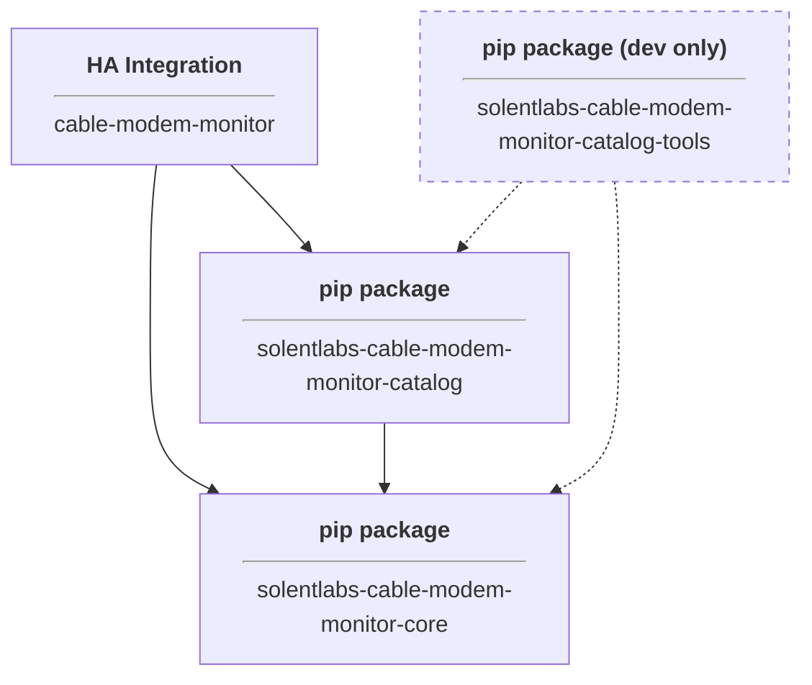
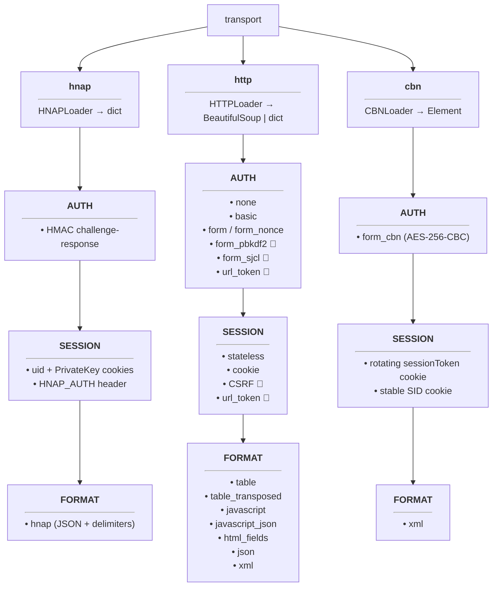

# Architecture

A Home Assistant integration that polls cable modems over their local web
interface and exposes DOCSIS signal data as sensors.

The core challenge: every modem manufacturer implements their web UI differently.
Different auth mechanisms, different page structures, different data formats.
The architecture absorbs this variety through a config-driven strategy pattern
where modem behavior is driven by YAML configuration, not code.

**Evidence base:** the modem catalog's HAR captures — real wire
sessions plus declared synthetic and hybrid fixtures. Current counts
and per-entry provenance live in the auto-generated catalog
[README](../../cable_modem_monitor_catalog/README.md) and
[CATALOG_AUDIT](../../cable_modem_monitor_catalog/CATALOG_AUDIT.md).

---

## Packages

Two pip packages and an HA integration in a monorepo with strict dependency
direction. Each pip package has its own `pyproject.toml` and enforces boundaries
through real Python packaging — import violations are missing module errors, not
lint warnings. The HA integration is distributed via HACS.

**Naming convention:** `cable_modem_monitor_` prefix for all packages in the
`solentlabs` namespace. The HA integration name (`cable_modem_monitor`) is
locked to the HACS store.



The dashed edge indicates that `catalog_tools` is a developer
accelerator, never installed by HA or any runtime consumer. See
[ARCHITECTURE_DECISIONS.md](ARCHITECTURE_DECISIONS.md) §
"catalog_tools is a developer accelerator, never a runtime dep".

**Import paths:**

- `from solentlabs.cable_modem_monitor_core import ...`
- `from solentlabs.cable_modem_monitor_catalog import CATALOG_PATH`
- `from solentlabs.cable_modem_monitor_catalog_tools import ...` (maintainer dev only)

**Repository layout:**

```text
packages/
├── cable_modem_monitor_core/           # runtime engine
│   ├── pyproject.toml                  # name = "solentlabs-cable-modem-monitor-core"
│   └── solentlabs/cable_modem_monitor_core/
├── cable_modem_monitor_catalog/        # modem data (pure content)
│   ├── pyproject.toml                  # name = "solentlabs-cable-modem-monitor-catalog"
│   └── solentlabs/cable_modem_monitor_catalog/
└── cable_modem_monitor_catalog_tools/  # catalog authoring tools (never installed by HA)
    ├── pyproject.toml                  # name = "solentlabs-cable-modem-monitor-catalog-tools"
    └── solentlabs/cable_modem_monitor_catalog_tools/
custom_components/
└── cable_modem_monitor/                # HA integration
```

HA installs only `core + catalog`. `catalog_tools` is a developer
accelerator — see
[ARCHITECTURE_DECISIONS.md § catalog_tools is a developer accelerator](ARCHITECTURE_DECISIONS.md).

### Optional extras

Core's base dependencies are minimal — what the runtime engine needs
(including `pydantic` as a runtime dep — Core's models require it).
Additional transport-specific functionality is available via optional
extras:

| Extra | Install | What it adds | Who uses it |
|-------|---------|--------------|-------------|
| `[sjcl]` | `pip install solentlabs-cable-modem-monitor-core[sjcl]` | `cryptography>=41.0` | `form_sjcl` auth strategy (AES-CCM) |
| `[cbn]` | `pip install solentlabs-cable-modem-monitor-core[cbn]` | `cryptography>=41.0` | `form_cbn` auth strategy (AES-256-CBC) |

### Core — `solentlabs-cable-modem-monitor-core`

The complete engine. Given a path to modem files and user credentials, Core
does everything: loads config, authenticates, fetches data, parses responses,
and signals policy decisions (including recovery). The orchestrator is a
policy engine that delegates to specialized components (ModemDataCollector,
HealthMonitor, Recovery) — each independently testable with a clear
input→output contract. Platform-agnostic — no `homeassistant.*` imports,
no catalog imports.

Core is bounded by interfaces and abstract base classes. Concrete
implementations live here too (auth strategies, resource loaders, actions),
but modem-specific behavior comes from config, not from Core code.

| Responsibility | What |
|----------------|------|
| Data models | `ModemData`, `ChannelData`, `SystemInfo`, `HealthInfo`, `ModemIdentity` |
| Config schemas | `ModemConfig`, `AuthConfig`, `PageConfig`, `ParserConfig` |
| ABCs / base classes | `BaseParser`, `BaseAuthManager`, `AuthStrategyBase` (model ClassVars) |
| Action executors | `orchestration/actions/` — transport-scoped executors (`http_action`, `hnap_action`, `cbn_action`) with single `execute_action()` dispatch. `ActionResult` return type. |
| Protocol primitives | `protocol/hnap` — shared HNAP constants and HMAC signing. `protocol/cbn` — shared CBN_Encrypt (AES-256-CBC) used by `form_cbn` auth. |
| Auth shared helpers | `auth/response` — JSON response parsing (double-decode, type check, diagnostics) shared by `form_sjcl`, `form_pbkdf2`, `hnap`. |
| Parser coordinator | `ModemParserCoordinator` — factory + orchestration: parser.yaml → `BaseParser` instances → parser.py chaining → `ModemData` |
| Auth strategies | `none`, `basic`, `form`, `form_nonce`, `form_pbkdf2`, `form_sjcl`, `hnap`, `url_token`, `form_cbn` |
| Resource loaders | HTTP → `BeautifulSoup` or `dict` (format-dependent), HNAP → JSON, CBN → `Element` |
| Orchestrator | Policy engine: signal→policy dispatch, circuit breaker, status derivation |
| ModemDataCollector | Single collection cycle: auth → load → parse → `ModemData` or signal |
| HealthMonitor | Health probes on independent cadence → `HealthInfo` |
| Restart action | `Orchestrator.restart()` — one-shot: authenticate, dispatch reboot command, clear session, trigger recovery, return |
| Recovery | Cadence controller: opens a bounded aggressive-polling window on any trigger — commanded restart, observed outage, or a 2-of-3 reboot-signal check on a successful poll (counter reset, uptime drop, transitional docsis). Exposes `recovery_active` + observer. |
| Auth Manager | Strategy dispatch, session reuse, backoff |
| Modem loader | `load_modem_config(path, mfr, model, variant)` — knows the directory convention |
| Catalog Manager | `list_modems(catalog_path)` → `list[ModemSummary]` — walks catalog, returns identity fields for config flow display and filtering |
| Connectivity | Protocol detection, legacy SSL, health probes |
| Exceptions | `LoginLockoutError`, `AuthFailedError`, `ParseError` |
| Test harness | Schema validators, HAR replay framework, parser output assertions |

The test harness lives in Core so that Catalog contributors cannot
accidentally modify test assertions or loader logic. Catalog's CI installs
Core and runs Core's test suite pointed at the catalog files.

Core could power any platform — Home Assistant, a Windows service, a CLI
tool, a Prometheus exporter. The platform tells Core where the modem files
are and provides credentials; Core does the rest.

### Catalog — `solentlabs-cable-modem-monitor-catalog`

A content package. No business logic — just modem config files, parser
overrides, and HAR evidence. Depends on Core only (parser.py files are
optional post-processors invoked by Core's `ModemParserCoordinator`).

| Content | What |
|---------|------|
| `modem.yaml` / `modem-{variant}.yaml` | Identity, auth config, metadata |
| `parser.yaml` | Declarative extraction mappings |
| `parser.py` | Optional post-processor for modem-specific extraction quirks |
| `tests/` | HAR captures and expected output golden files |

```text
solentlabs/cable_modem_monitor_catalog/
├── __init__.py              # exposes CATALOG_PATH
└── modems/
    └── {mfr}/{model}/
        ├── modem.yaml
        ├── parser.yaml
        ├── parser.py
        └── tests/
```

No loader, no discovery, no test code. Adding a modem means adding a
directory — no registration, no changes to Catalog package code.

### HA Integration — `cable-modem-monitor`

Thin platform adapter. Translates between Home Assistant's lifecycle and
Core's engine. Depends on both Core and Catalog.

| Responsibility | What |
|----------------|------|
| Config flow | Manufacturer dropdown (union of `manufacturer` and `brands` values) → model filter → variant → connection → validate. Uses Core's `list_modems()` with Catalog's `CATALOG_PATH` |
| Runtime storage | `CableModemRuntimeData` on `entry.runtime_data` (HA 2024.12+) |
| Data coordinator | Wraps Core's `Orchestrator.get_modem_data()` in HA's `DataUpdateCoordinator` |
| Health coordinator | Second `DataUpdateCoordinator` wrapping `HealthMonitor.ping()`. Conditional — only created if probes work. Independent cadence (default 30s) |
| Entities | Maps Core's `ModemSnapshot` → platform entities. Channel entities unavailable when `modem_data` is None |
| Status sensor | Priority cascade over `connection_status`, `health_status`, `docsis_status`. `diagnosis` attribute derived by adapter from `health_status` enum |
| Restart button | Maps platform button press → `orchestrator.restart()` in executor thread with `cancel_event` for clean shutdown |
| Update button | Triggers immediate poll via `coordinator.async_request_refresh()` |
| Reset entities button | Removes all entities from HA registry and reloads the integration |
| Reauth flow | Circuit breaker triggers HA native `async_step_reauth` via `entry.async_start_reauth()`. On success: entry updated + reloaded — a fresh orchestrator starts with clean auth state |
| Diagnostics | Combines Core's `OrchestratorDiagnostics` with HA-side sanitized logs, channel dump, PII checklist |
| Dashboard generator | Service that generates Lovelace YAML for modem dashboard based on current channels |

No parsing, no auth, no modem-specific knowledge. The Capture button from
v3.13 was removed — `har-capture` is the tool for collecting raw modem data
for parser development.

**Startup example:**

```python
from solentlabs.cable_modem_monitor_catalog import CATALOG_PATH
from solentlabs.cable_modem_monitor_core.config_loader import (
    load_modem_config,
    load_parser_config,
)
from solentlabs.cable_modem_monitor_core.orchestration import (
    create_orchestrator,
)

# Load configs from catalog
modem_config = load_modem_config(CATALOG_PATH / "arris" / "sb8200" / "modem.yaml")
parser_config = load_parser_config(CATALOG_PATH / "arris" / "sb8200" / "parser.yaml")

# For form_nonce modems: apply_credential_encoding(modem_config, ...) here

# Create orchestration graph via Core factory
orchestrator, health_monitor, identity = create_orchestrator(
    modem_config, parser_config, post_processor=None,
    base_url="http://192.168.100.1", username="admin", password="...",
)

# Poll
snapshot = orchestrator.get_modem_data()
```

---

## Transport and Format

The `transport` field in modem.yaml is the first config decision — it
identifies the wire protocol (`http`, `hnap`, or `cbn`) and determines
whether the remaining axes are free or locked. For `http`, auth,
session, and format are configured independently (qualified — some
auth/session pairings are linked, marked with 🔗 below). For `hnap`
and `cbn`, the protocol locks all axes to fixed values.



*🔗 Implies specific session mechanism — see
[MODEM_YAML_SPEC.md](MODEM_YAML_SPEC.md#auth-session-action-consistency)
for validation rules.*

All three transports follow the same pipeline order: auth → session →
format. The difference is constraint: for HNAP and CBN, each step has
exactly one valid choice. For HTTP, each step is configured independently
— choosing `basic` auth doesn't restrict format to HTML tables, and
choosing `json` format doesn't require `form_pbkdf2` auth.

### HNAP — Fully Constrained

- The protocol defines everything: auth, session, format
- Only two values vary per modem: HMAC algorithm and action names
- One strategy handles all HNAP modems

### CBN (Compal Broadband Networks) — Fully Constrained

- Proprietary XML POST API in Compal Broadband Networks modem firmware
- Single endpoint (`getter.xml`/`setter.xml`) with `fun=N` parameters
- AES-256-CBC encrypted auth (`CBN_Encrypt` from `encrypt_cryptoJS.js`)
- Rotating session token on every response
- One strategy handles all CBN modems (CH7465MT, CH7466CE, CH7465CE)

### HTTP — Independent Axes

- Auth, session, and format are configured independently
  (some auth strategies imply specific session mechanisms — see 🔗 above)
- This is where all the complexity (and variety) lives
- The majority of the fleet: from simple unauthenticated HTML table
  scraping to PBKDF2 challenge-response with JSON APIs

### Constraint Summary

| Transport | Loader | Valid Auth | Valid Formats | Valid Action Types |
|-----------|--------|-----------|--------------|-------------------|
| `hnap` | HNAPLoader → `dict` | `hnap` only | `hnap` only | `hnap` |
| `http` | HTTPLoader → BeautifulSoup or dict | `none`, `basic`, `form`, `form_nonce`, `url_token`, `form_pbkdf2`, `form_sjcl` | `table`, `table_transposed`, `javascript`, `javascript_json`, `html_fields`, `json`, `xml` | `http` |
| `cbn` | CBNLoader → `Element` | `form_cbn` | `xml` | `cbn` |

At runtime, the format declared in parser.yaml determines how the response
is decoded. HTML formats (`table`, `table_transposed`, `javascript`,
`javascript_json`, `html_fields`) are parsed into `BeautifulSoup`.
Structured formats (`json`, `xml`) are decoded into `dict`. Any format supports an optional
`encoding` property (e.g., `encoding: base64` for modems that wrap
JSON in base64). The encoding is a pre-step — the loader
unwraps the encoding before the format-specific decoder runs. The
format-to-value-type mapping is deterministic and validated at config
load time.

These constraints are validated at both **build time** (Pydantic validation
in Catalog's dev-gate) and **load time** (`load_modem_config()` in Core).
A misconfigured modem.yaml is rejected with a clear error, not at runtime
with mysterious parsing failures.

### Extension Model

Adding a new format, auth strategy, or transport is **additive only** — no
existing entries change.

- **New format for `http`:** Add the `BaseParser` implementation, add the
  format string to the valid formats list, update validators. Existing
  modem configs and tests are untouched.
- **New auth strategy for `http`:** Add the model (with `display_name`
  and `transport` ClassVars), the manager module (with `create_manager()`
  entry point), and a test handler module. Add to the `AuthConfig` union
  and `_AUTH_MODELS` list. The factory dynamically loads the manager by
  strategy literal — no factory code changes. Display labels and
  transport validation derive from ClassVars automatically.
- **New transport:** Add a new loader, new `BaseParser` implementation(s),
  a new row in the constraint table, and validator updates. No existing
  code changes. `cbn` demonstrates this: new loader, new `xml`
  parser, new `form_cbn` auth — no changes to HTTP or HNAP code.

The constraint table is an allowlist, not a lock. It prevents
misconfigurations without preventing growth.

---

## Core Components

Everything below lives in `solentlabs-cable-modem-monitor-core`. These are
generic — no modem-specific knowledge, no HA imports.

### Auth Manager

Handles authentication for all transports through configuration, not code.
Each auth strategy is a single audited implementation that reads its parameters
from modem.yaml:

| Strategy | Transport | Stateless? |
|----------|-----------|:----------:|
| `none` | HTTP | Yes |
| `basic` | HTTP | Yes |
| `form` | HTTP | No |
| `form_nonce` | HTTP | No |
| `hnap` | HNAP | No |
| `form_pbkdf2` | HTTP | No |
| `form_sjcl` | HTTP | No |
| `url_token` | HTTP | No |
| `form_cbn` | CBN | No |

See [MODEM_YAML_SPEC.md](MODEM_YAML_SPEC.md#auth) for per-strategy
config fields.

**Key points:**

- `form` and `form_nonce` are separate strategies because they have different
  response handling — `form` evaluates redirects and cookies, `form_nonce`
  parses text prefixes (`Url:` / `Error:`)
- `form_pbkdf2` is separate from `form` because it requires a multi-round-trip
  challenge-response: POST to get server-provided salts, client-side PBKDF2
  key derivation, then POST the derived hash. This is structurally closer to
  HNAP's challenge-response than to a simple form POST with encoding flags
- `form_sjcl` is separate from `form_pbkdf2` because it adds client-side
  AES-CCM encryption of credentials (via SJCL — Stanford JavaScript Crypto
  Library) and requires decrypting the server response to extract a CSRF
  nonce. Both use PBKDF2 key derivation, but `form_sjcl` encrypts the
  payload and decrypts the response, while `form_pbkdf2` hashes the password
  and sends it in plaintext JSON. Requires the `cryptography` package
  (install Core with `[sjcl]` extra)
- All other form differences (encoding, CSRF, field names, session cookies)
  are config flags on `form`. Specifically: base64 password encoding is
  `encoding: base64`, dynamic endpoint discovery is `login_page` +
  `form_selector`, and AJAX-style login is handled through `form`'s
  existing config surface — none of these warrant separate strategies
- Auth strategy **selection** is purely config-driven — no runtime inspection
  of login pages to determine which strategy to use.
  Auth **execution** routinely interacts with login pages to complete the
  handshake. The distinction: config decides *what* to do, runtime
  interaction is *how* the configured strategy executes.
- **Login page pre-fetch pattern:** Several strategies pre-fetch a
  login page and extract session-specific state from the response.
  Each strategy extracts different data, but the principle is shared:
  if the strategy fetches a page, it reads what it needs from the
  response.

  | Strategy | Extracts from login page | When |
  |----------|--------------------------|------|
  | `form` | `<input type="hidden">` fields (CSRF tokens, mode flags) | Every auth attempt |
  | `form_nonce` | Form structure (credential encoding: plain vs b64-packed) | Setup time only (config flow / test harness) |
  | `form_sjcl` | JS crypto variables (`myIv`, `mySalt`, `currentSessionId`) | Every auth attempt |
  | `form_cbn` | Session token cookie | Every auth attempt |
  | `url_token` | Auth token from response body | Every auth attempt |

  For `form`, discovered hidden fields are merged with `hidden_fields`
  (static overrides from YAML) and credentials. See MODEM_YAML_SPEC.md
  for the merge order.

  For `form_nonce`, credential encoding is detected once at setup
  time — the HA config flow pre-fetches the login page during
  validation and stores the result in the config entry. The test
  harness detects from HAR entries. At runtime, the auth manager
  reads `credential_encoding` from the config — no pre-fetch occurs
  during polling. See MODEM_YAML_SPEC.md for detection logic.
- Multi-variant modems use separate `modem-{variant}.yaml` files — one per
  firmware variant, each with a single `auth` block. The config flow presents
  variants as user choices during setup. Protocol (HTTP vs HTTPS) is detected
  automatically and is independent of firmware variant — the user selects based
  on their network, not their protocol. See `CONFIG_FLOW_SPEC.md` for the
  full setup flow.

#### Crypto Library vs Firmware Wire Format

Each complex auth strategy has two layers:

- **Crypto library** — the algorithms and encoding rules defined by
  the JavaScript library the firmware uses (SJCL, CryptoJS, etc.).
  These are universal to any modem using that library.  Shared crypto
  lives in the `protocol/` directory (e.g., `protocol/cbn.py`).
- **Firmware wire format** — field names, payload structure, JS
  variable names, success criteria.  These are specific to a firmware
  family (Arris Touchstone, Technicolor REST, Compal).

Currently, each complex strategy serves exactly one firmware family,
so wire format assumptions are embedded in the strategy code.  When a
second modem appears on the same crypto library with a different wire
format, the refactoring point is the wire format layer — extract it
to config or to a separate handler.  The crypto library layer should
not change.

| Strategy | Crypto library | Firmware family | Spec |
|----------|---------------|-----------------|------|
| `form_sjcl` | SJCL (PBKDF2 + AES-CCM) | Arris Touchstone | [AUTH_SJCL_SPEC.md](AUTH_SJCL_SPEC.md) |
| `form_pbkdf2` | SJCL (PBKDF2 only) | Technicolor REST | [AUTH_PBKDF2_SPEC.md](AUTH_PBKDF2_SPEC.md) |
| `form_cbn` | CryptoJS (AES-256-CBC) | Compal/CBN | [AUTH_CBN_SPEC.md](AUTH_CBN_SPEC.md) |

Each dedicated spec documents the encoding boundaries, hardcoded
firmware wire format assumptions, evidence base, and known gaps.
The crypto library section is the implementation authority — if code
deviates from the library's encoding rules, code is wrong.

#### `url_token` Strategy — Config Reference

URL token auth appends base64-encoded credentials to the URL query string
instead of using an Authorization header or form POST. The response sets a
session cookie; subsequent requests use a server-issued token in the query
string.

Evidence base: modems with HTTPS variants that encode credentials in URL
query strings. Two firmware builds use different token formats — one prefixes
a string before the base64 token, the other sends bare base64. Both produce
the same session mechanism.

**Auth flow:**

```text
1. Encode credentials: base64("username:password")
2. Login request:
   GET /cmconnectionstatus.html?{login_prefix}{base64_token}
   Headers: Authorization: Basic {base64_token}  (if auth_header_data)
            X-Requested-With: XMLHttpRequest      (if ajax_login)
3. Response sets session cookie (auth.cookie_name)
4. Subsequent data requests:
   GET /cmswinfo.html?{auth.token_prefix}{session_token}
```

**Auth config fields** (login mechanics only):

| Field | Type | Default | Description |
|-------|------|---------|-------------|
| `login_page` | string | required | Page URL that accepts the token login (e.g., `/cmconnectionstatus.html`) |
| `login_prefix` | string | `""` | Prefix before base64 token in login URL. Some firmware uses `login_`, others use bare base64. If empty, no prefix is added. |
| `success_indicator` | string | `""` | String to match in login response body to confirm success (e.g., `Downstream Bonded Channels`) |
| `ajax_login` | bool | `false` | If true, login request includes `X-Requested-With: XMLHttpRequest` header (matches browser jQuery behavior observed in HAR) |
| `auth_header_data` | bool | `false` | If true, include `Authorization: Basic {token}` header on data requests (not just login). Most firmware only needs the session cookie. |

Session cookie and token prefix are declared in the `session` section
— see `MODEM_YAML_SPEC.md` Session.

**Example:**

```yaml
auth:
  strategy: url_token
  login_page: "/cmconnectionstatus.html"
  login_prefix: "login_"       # Some firmware builds use "", others use "login_"
  success_indicator: "Downstream Bonded Channels"
  ajax_login: true
  auth_header_data: false

session:
  cookie_name: "sessionId"
  token_prefix: "ct_"
```

**Handling `login_prefix` variance:** When `login_prefix` is configured, the
strategy uses it. If a modem family has firmware builds that differ only in
prefix (e.g., one build uses a prefix, another sends bare base64), the strategy can be configured to
try both — first with the prefix, then without on failure. This avoids
needing separate modem configs for what is otherwise identical behavior.

#### `form_pbkdf2` Strategy

PBKDF2 challenge-response with server-provided salts and optional
double-hashing.  See [AUTH_PBKDF2_SPEC.md](AUTH_PBKDF2_SPEC.md) for
the full protocol, encoding rules, firmware assumptions, and evidence
base.  Config fields are in
[MODEM_YAML_SPEC.md](MODEM_YAML_SPEC.md#form_pbkdf2).

#### `form_sjcl` Strategy

SJCL AES-CCM encrypted auth with bidirectional encryption (encrypt
credentials, decrypt response to extract CSRF nonce).  Requires the
`cryptography` package (`[sjcl]` extra).  See
[AUTH_SJCL_SPEC.md](AUTH_SJCL_SPEC.md) for the full protocol,
encoding rules, firmware assumptions, and evidence base.  Config
fields are in
[MODEM_YAML_SPEC.md](MODEM_YAML_SPEC.md#form_sjcl).

### Session Management

Maintains authenticated state between requests. For the HTTP transport,
session is independent from auth — the same auth strategy can use different
session mechanisms across modems. For HNAP, session is locked to the transport.

| Mechanism | Transport |
|-----------|-----------|
| Stateless | HTTP |
| Cookie | HTTP |
| CSRF token | HTTP |
| Nonce | HTTP |
| URL token | HTTP |
| HNAP session | HNAP |

Session config is independent from auth config — different modems using
the same auth strategy often have different session mechanisms. See
[MODEM_YAML_SPEC.md](MODEM_YAML_SPEC.md#session) for config fields
(cookie names, token prefixes, concurrency limits, headers, logout).

### Resource Loaders

Fetch the resources declared in parser.yaml and return them as a keyed dict
for the parser. Transport determines the fetch mechanism (HTTP GET/POST vs
HNAP SOAP), and format determines the decode step (`BeautifulSoup` for HTML
formats, `dict` for structured formats and HNAP). Auth and session state
are already established upstream — the loader attaches credentials to
requests but doesn't manage them.

See `RESOURCE_LOADING_SPEC.md` for the full resource dict contract, loader
behavior per transport, URL construction, path deduplication, and HNAP
batching details.

### Parsing: parser.yaml + parser.py

Parsing has three distinct roles:

**`BaseParser` (ABC)** — the extraction interface. Eight format-specific
implementations: `HTMLTableParser`, `HTMLTableTransposedParser`,
`HTMLFieldsParser`, `JSEmbeddedParser`, `JSJsonParser`, `HNAPParser`, and
`StructuredParser` (ABC) with two subclasses — `JSONParser` and
`XMLParser`. Both structured formats receive `dict` from the loader
(via `json.loads()` or `xmltodict.parse()`); `StructuredParser` holds
the shared dict-path extraction pipeline, while `XMLParser` adds
normalization for xmltodict quirks (`@attribute` keys, `#text`
unwrapping, single-element list coercion). `JSJsonParser` extracts
JSON arrays from JavaScript variable assignments
(`varName = [{...}];`) inside `<script>` tags — distinct from
`JSEmbeddedParser` which handles pipe-delimited `tagValueList` strings.
It reuses `JSONParser`'s field extraction and channel type logic.
Each takes section config + resources and returns extracted data
(channel list or system_info dict). Field normalization (type
conversion, unit stripping, frequency normalization), channel type
detection, and filter application happen during extraction — they are
`BaseParser` implementation responsibilities.

**`ModemParserCoordinator`** — factory and orchestrator. This is what
the rest of the system calls: `parse(resources) → ModemData`.
Internally it reads parser.yaml, creates `BaseParser` instances per
section based on the `format` field (factory), runs them against the
resource dict, merges companion table fields into primary channels
(when `merge_by` is declared), passes results + resources to parser.py
if present (chaining), and assembles `ModemData` from section results.

**parser.py** — optional post-processor, not a subclass. Receives the
`BaseParser` output plus the raw resources for a section. Can enrich
(add fields), transform (convert values), filter (remove channels),
or fully replace the extraction output. Its output is final —
last-write-wins. parser.py is per-modem and can only affect its own
modem's output.

**Pipeline:**

```text
ModemParserCoordinator.parse(resources)
  for each section (downstream, upstream, system_info):
    parse primary tables → concatenate → channel list
    parse companion tables (merge_by) → merge fields into channel list
    parser.py post-processes (if present) → final section data
  assemble → ModemData
```

Nine extraction formats in two tiers. Eight general-purpose formats
(`table`, `table_transposed`, `javascript`, `javascript_json`, `hnap`,
`json`, `xml`) are valid for any channel section. One section-level format
(`html_fields`) is valid only for `system_info` sources. Format selection
is per-section — a modem's `downstream` can use `table_transposed` while
its `system_info` uses `html_fields` or `javascript`. `parser.yaml`
declares the format and field mappings per section. Capabilities are
implicit — the presence of a mapping IS the capability declaration.

See `PARSING_SPEC.md` for common concepts, output contract, and
post-processing hooks. Format-specific extraction is documented in
`FORMAT_TABLE_SPEC.md`, `FORMAT_JAVASCRIPT_SPEC.md`,
`FORMAT_HNAP_SPEC.md`, `FORMAT_JSON_SPEC.md`, and `FORMAT_XML_SPEC.md`.
System info extraction is in `SYSTEM_INFO_SPEC.md`.

### Data Models

Two collection models with independent lifecycles:

- **`ModemData`** — parsed modem data, updated on the data polling cadence
  - `downstream`, `upstream` — lists of `ChannelData`
  - `system_info` — `SystemInfo` fields
  - `docsis_lock_state` — derived from channel lock status during parsing
- **`HealthInfo`** — operational health, updated on the health check cadence
  - `icmp_latency_ms` — ICMP round-trip time
  - `http_latency_ms` — HTTP probe response time (None when collection evidence suppresses the probe)
  - `health_status` — derived composite state (see below)

**Why two models?** Ping is lightweight. Parsing is heavy. A flaky modem
may need fast heartbeats (ping every 30s) without hammering the web
interface (data poll every 10 minutes). Each model has its own cadence and
lifecycle.

**`ModemSnapshot`** — return type of `get_modem_data()`, combining
collection results with health and operational state. Carries
`connection_status` and `docsis_status` (derived by the orchestrator),
`modem_data` from the collector (None on failure), and `health_info`
from the health monitor. Channel counts and aggregate fields are
already in `system_info` — computed by the parser coordinator.

**`OrchestratorDiagnostics`** — operational diagnostics snapshot from
`diagnostics()`, including poll timing, auth failure streak, circuit
breaker state, session validity, connectivity backoff state, and
per-resource fetch details (`ResourceFetch`).

**`ChannelData`** — per-channel metrics for downstream and upstream:

- Fixed fields: channel ID, frequency, power, SNR, lock status,
    modulation, channel type, corrected and uncorrected codewords
- Upstream adds `symbol_rate`, omits SNR and codewords

**`SystemInfo`** — mix of structured and dynamic fields:

- Structured: `system_uptime`, `last_boot_time`, `software_version`,
    `hardware_version`, `model_name`
- Dynamic: modem-specific fields (e.g., `connectivity_state`,
    `boot_status`) pass through without core needing to understand them
- Core derives `last_boot_time` from `system_uptime` when the modem
    doesn't provide it natively — consumers see the same field regardless
    of source

**`ModemIdentity`** — static modem metadata from modem.yaml, populated
once at config load time. Built by `load_modem_config()`. Consumers
use it for display and device registration.

See [ORCHESTRATION_SPEC.md](ORCHESTRATION_SPEC.md#data-models) for
field-level definitions of `ModemSnapshot`, `OrchestratorDiagnostics`,
`ResourceFetch`, and `ModemIdentity`.

**Status** — three independent signals, each derived from different data:

- `connection_status` (on `ModemSnapshot`) — from pipeline outcome
- `docsis_status` (on `ModemSnapshot`) — from channel `lock_status` fields
- `health_status` (on `HealthInfo`) — from probe results

See [ORCHESTRATION_SPEC.md](ORCHESTRATION_SPEC.md#data-models) for
per-value definitions (`ConnectionStatus`, `DocsisStatus`, `HealthStatus`).

Consumers compose these into a display state. The platform adapter
uses a priority cascade — see `ENTITY_MODEL_SPEC.md` for the HA
implementation.

**Capabilities are implicit.** A field mapping in parser.yaml or an
override in parser.py declares the capability. If downstream channels
are mapped, the modem has downstream channel sensors. If `system_uptime`
is mapped, the modem has an uptime sensor. No separate capabilities list
in modem.yaml — the parser output IS the capability declaration.

The two exceptions are modem-side actions: `actions.restart` in
modem.yaml declares restart capability (user-triggered), and
`actions.logout` declares logout capability (system-triggered session
cleanup). Both use the same action schema (`type: http` or
`type: hnap`). No other modem commands are supported — the
integration is read-only monitoring plus session lifecycle management.
See MODEM_YAML_SPEC.md Actions section for the full schema.

**Absent capability = absent entity.** If the parser doesn't extract a
field, the corresponding HA entity is never created — no greyed-out
buttons, no disabled switches, no "not supported" placeholders. The UI
only shows what the modem can actually do.

This is deliberate. A disabled button invites questions ("why can't I click
this?") and support requests. A missing button is invisible — users don't
miss what was never there. It also avoids false promises: some modems had
reboot disabled in firmware after the 2015–2016 ARRIS CSRF vulnerability
that affected 135 million devices. The modem literally has no restart
endpoint, so showing a greyed-out reboot button would be misleading.

### Config Schema

Schema that defines modem.yaml structure. Pydantic models validate
during development and CI — an HTTP modem declaring HNAP auth is
rejected before it ships. Runtime loads into dataclasses.

modem.yaml serves two purposes based on `status`:

- **Working modems** (`confirmed`, `awaiting_verification`) —
  full config including auth, session, actions, hardware
- **Database entries** (`unsupported`) — identity and hardware info only,
  documents modems awaiting data or locked down

#### Auth config is a discriminated union

The `auth.strategy` field selects a **per-strategy dataclass**. Each
strategy has its own config type with only the fields that strategy uses:

```python
@dataclass
class FormAuthConfig:
    action: str
    username_field: str = "username"
    password_field: str = "password"
    encoding: str = "plain"
    hidden_fields: dict = field(default_factory=dict)
    login_page: str = ""
    form_selector: str = ""
    success_redirect: str = ""
    success_indicator: str = ""

@dataclass
class HnapAuthConfig:
    hmac_algorithm: str   # "md5" or "sha256"
```

`load_modem_config()` reads `auth.strategy`, selects the matching
dataclass, and populates it from the YAML fields. The result is a
typed config where invalid fields don't exist — a `FormAuthConfig`
has no `hmac_algorithm`, an `HnapAuthConfig` has no `encoding`.

**Strategies accept only their own config dataclass:**

```python
class FormAuthManager(BaseAuthManager):
    def __init__(self, config: FormAuth): ...

class HnapAuthManager(BaseAuthManager):
    def __init__(self, config: HnapAuth): ...
```

No dict intermediary, no generic `AuthConfig` bag of optional fields,
no `SessionConfig` — session state is handled by the runner after auth
completes. The dataclass IS the runtime config — the strategy accepts
exactly the type the loader produces.

---

## Core Extraction Pipeline

The extraction pipeline is the core data path — it runs identically at
runtime (against a real modem) and during testing (against a HAR mock
server). The only difference is the server: real network endpoint vs
localhost replay. Every other component — auth, loaders, coordinator,
parsers — is the same code on the same path.

```text
Auth Manager ──▶ Resource Loader ──▶ Coordinator + Parsers ──▶ Post-Parse Filters ──▶ ModemData
     │                  │                     │                       │
     ▼                  ▼                     ▼                       ▼
 AuthResult         resources dict      parsed channels         filtered channels
 (session,          {path: content}     + system_info           + system_info
  cookies,
  private_key)
```

### Stage 1: Authentication

**Input:** modem.yaml (auth config), session, base URL, credentials
**Output:** `AuthResult` (success/failure, session cookies, auth context)
**Component:** `auth.factory.create_auth_manager()` → strategy-specific adapter

The auth manager is created from modem.yaml's `auth` block. It configures
the session (headers, cookies), then authenticates against the server. On
success, the session carries auth state (cookies, tokens) for subsequent
requests. HNAP auth also produces a `private_key` for request signing.

### Stage 2: Resource Loading

**Input:** parser.yaml (resource URLs), authenticated session, base URL
**Output:** `resources` dict — `{url_path: content}`
**Component:** `HTTPResourceLoader` or `HNAPLoader`

Three transport paths, selected by `modem.yaml.transport`:

**HTTP transport** (`HTTPResourceLoader`):

- Derives fetch targets from parser.yaml via `collect_fetch_targets()`
- Fetches each resource URL independently over HTTP
- HTML responses → `BeautifulSoup` objects
- JSON responses → parsed dicts
- URL token modems append session token to query string

**HNAP transport** (`HNAPLoader`):

- Derives HNAP action names from parser.yaml response keys
- Sends a single batched SOAP POST to `/HNAP1/`
- Signs request with HMAC (MD5 or SHA256) using the private key from auth
- Returns `{"hnap_response": {merged_action_responses}}`

**CBN transport** (`CBNLoader`):

- POSTs to `getter.xml` endpoint with `fun=N` parameters
- Each `fun` value returns a different XML data page
- Session token rotates on every response via `Set-Cookie`
- Returns `{endpoint_path: Element}` (parsed XML elements)

### Stage 3: Parsing

**Input:** `resources` dict, parser.yaml, parser.py (optional)
**Output:** `ModemData` dict — `{downstream: [...], upstream: [...], system_info: {...}}`
**Component:** `ModemParserCoordinator`

The coordinator iterates parser.yaml sections (downstream, upstream,
system_info). For each section, it selects the format-specific parser
based on the `format` field:

| Format | Parser | Input Type |
|--------|--------|------------|
| `table` | `HTMLTableParser` | BeautifulSoup |
| `table_transposed` | `HTMLTableTransposedParser` | BeautifulSoup |
| `javascript` | `JSEmbeddedParser` | BeautifulSoup (script tags) |
| `javascript_json` | `JSJsonParser` | BeautifulSoup (script tags) |
| `json` | `JsonParser` | dict |
| `hnap` | `HNAPParser` | dict (hnap_response) |
| `html_fields` | `HTMLFieldsParser` | BeautifulSoup |

Each parser extracts channels (list of field dicts) or system_info
(flat field dict) from the resource content using the field mappings
in parser.yaml.

If a `parser.py` post-processor exists, its `PostProcessor.process()`
method runs after the config-driven extraction, allowing custom logic
that parser.yaml can't express.

### Test Harness: Same Pipeline, HAR Replay

The test harness (`test_harness/`) exercises this exact pipeline by
substituting a real modem with an `HARMockServer` — a local HTTP server
that replays HAR-captured responses with auth simulation:

| Runtime | Test |
|---------|------|
| Real modem at `192.168.100.1` | `HARMockServer` on localhost |
| User-provided credentials | Fixed `admin`/`pw` |
| Live HTTP/HNAP responses | HAR-captured response replay |

Everything else is identical — same auth factory, same loaders, same
coordinator, same parsers. The `HARMockServer`:

1. Builds a route table from HAR response bodies
2. Creates an auth handler from modem.yaml (simulates the modem's auth)
3. Serves responses on localhost (ephemeral port for tests, fixed port
   for manual use)
4. The pipeline runs against this server as if it were a real modem

**Two usage modes:**

- **Automated regression testing** — the test runner (`runner.py`)
  starts an ephemeral server per test case, runs the pipeline, and
  compares output against golden files. Entry point: `pytest`.

- **Manual integration testing** — a persistent server for verifying
  against a real HA instance. Entry point:
  `python -m solentlabs.cable_modem_monitor_core.test_harness <modem_dir>`.

**Golden file comparison** follows the pipeline: the output `ModemData`
is compared field-by-field against the committed `modem.expected.json`.
Zero diffs = pipeline produces the same output as when the golden file
was reviewed and committed. Any diff is a regression.

When a test runs, the actual pipeline output is written to
`modem.actual.json` alongside the HAR file. On pass, the file is
cleaned up. On failure, the file persists for inspection and
side-by-side diffing against the golden file. These files are
gitignored (`*.actual.json`) and never committed.

**Golden file trust assumption:** The golden file is reviewed once by a
human during the intake process and then becomes the regression baseline.
All future test runs validate against it. If the initial HAR
interpretation is incorrect — wrong field mapping, misidentified format,
bad channel_type inference — the tests will reinforce the incorrect
output indefinitely. The golden file review during intake is the critical
correctness gate. After commit, the regression only guards against drift
from whatever was committed, right or wrong. This is by design — the
intake process (Catalog Tools scaffolding + LLM iteration + human
review) is where correctness must be established.

### Two Regression Scopes

**Core regression** — committed configs through the extraction pipeline:

- Uses committed modem.yaml + parser.yaml + parser.py
- Runs HAR through `HARMockServer` → auth → load → parse → golden file comparison
- Tests: does the existing, working system still work?
- Implemented by: catalog test suite (auto-discovered HAR/golden file pairs)
- Pass criteria: zero golden file drift

**Pipeline regression** — catalog-tools-generated configs through the
extraction pipeline:

- Uses HAR → Catalog Tools intake pipeline → generated modem.yaml + parser.yaml
- Overwrites committed configs with generated versions
- Runs same extraction pipeline → golden file comparison
- Tests: can the intake pipeline reproduce working configs from a HAR alone?
- Pass criteria: zero golden file drift (generated output = manual curation)
- Current state: significant drift (pipeline gaps in field mapping, type
  normalization, channel type inference, format-specific extraction)

---

## Runtime Polling Loop

After setup, the integration polls the modem on a user-configured cadence
(default 10 minutes). The orchestrator is a policy engine that delegates
execution to specialized components. Consumers own scheduling —
HA uses DataUpdateCoordinator, CLI tools use a loop.

```text
Orchestrator (policy + composition)
 ├─ ModemDataCollector  — one collection cycle → ModemData | signal
 ├─ HealthMonitor       — probe cycle → HealthInfo
 ├─ Recovery            — bounded aggressive-poll window; cadence signal
 └─ restart()           — one-shot: auth → action → clear session → trigger recovery
```

**Orchestrator** — decides *what to do* with results. Owns all policy:
backoff, circuit breaker, error recovery, status derivation, state
transitions. Does not own scheduling or threads. Consumers call
`get_modem_data()` when they want data.

**ModemDataCollector** — executes a single collection cycle: auth manager
→ resource loader → parser. Returns `ModemData` on success or a signal
(auth failure, parse error, connectivity error) on failure. Stateless
per invocation — the auth manager handles session reuse across calls.

**HealthMonitor** — runs health probes (ICMP → HEAD → data poll fallback)
on its own cadence, independent of data polling. Returns `HealthInfo`.
Lightweight — never triggers full auth or parsing.

**Recovery** — manages a bounded "aggressive polling" window. Any of
three triggers opens a window: commanded restart, observed
connectivity outage, or a reboot-signal check on a successful
poll. Core signals `recovery_active` via an observer callback so
the consumer can switch its poll cadence. The window runs to a
fixed duration and closes; Core never waits.

The reboot-signal check (`_check_reboot_signals` on the Recovery
class) is a simple 2-of-3 vote over observables: counter reset,
uptime drop, transitional docsis. No weights, no probabilities. If
two or more match on a successful poll, a window opens. A bug in
the signal check cannot affect commanded-restart behavior, which
enters recovery through a direct call.

**`restart()`** — one-shot command: authenticate, dispatch the reboot
action, clear the session, trigger a recovery window, return. It
does not observe the reboot; the subsequent polls (at recovery
cadence) report real modem state as the modem comes back.

Protocol layers signal conditions (exceptions, return values); the
orchestrator owns all policy (retry, backoff, error reporting). This
separation ensures no hidden policy in protocol layers.

See `RUNTIME_POLLING_SPEC.md` for the full specification: poll cycle
sequence, signal and policy separation, session lifecycle (reuse, stale
retry, backoff, single-session logout), health pipeline, modem restart
(planned and unplanned), and per-poll diagnostics.

---

## Modem Contract

What a modem must provide to plug into the system:

### Required

- **`modem.yaml`** (or `modem-{variant}.yaml`) — everything about the modem
  except parsing: identity (manufacturer, model, model_aliases, brands,
  transport), auth strategy config, hardware, session config,
  metadata (status, attribution, ISPs).

  Single-variant modems use `modem.yaml`. Multi-variant modems use
  `modem-{variant}.yaml` files — one per firmware variant. All variants in a
  directory must declare the same `model` value.

  See `MODEM_DIRECTORY_SPEC.md` for the multi-variant merge contract.

- **`tests/`** — test fixtures directory. Contains HAR captures (pipeline
  input) and expected output golden files (pipeline assertions). No test
  code — the test harness lives in Core.

- **`tests/modem.har`** — PII-scrubbed HAR capture. Source of truth for
  analysis, testing, and validation. Required for working modems
  (`confirmed`, `awaiting_verification`). Not required for
  `unsupported` modems.

  **Completeness criteria** — a HAR must demonstrate:
  - Pre-auth flow visible (first request returns 401 or login page, not
    cached/authenticated session data)
  - Auth mechanism identifiable from response headers or login sequence
  - All data endpoints exercised with actual response content
  - One capture per firmware variant (should match variant yaml names)
  - Captured with har-capture v0.4.4+ (includes HTTP probe and cookie
    snapshots) when possible

- **`tests/modem.expected.json`** — golden file containing the expected
  `ModemData` output (downstream channels, upstream channels, system_info)
  when the paired HAR is replayed through the full pipeline. Generated by
  running the pipeline against the `HARMockServer`, then reviewed and
  committed. All future runs are regression tests against this file.

  **Naming convention:** `{name}.har` pairs with `{name}.expected.json`.
  For variants: `modem-{variant}.har` → `modem-{variant}.expected.json`.

### Parsing (at least one required)

- **`parser.yaml`** — declarative extraction config. Defines field mappings,
  table selectors, column indices, delimiters, and JSON paths that the
  `BaseParser` implementations consume. The `format` field selects which
  parser (e.g., `table` → `HTMLTableParser`). The presence of a mapping
  declares the capability — no separate capabilities list needed.

- **`parser.py`** — optional post-processor for modem-specific quirks that
  can't be expressed declaratively. Receives the `BaseParser` output plus
  raw resources, and can enrich, transform, or replace the extracted data.
  Not a subclass — a hook invoked by `ModemParserCoordinator`.

At least one of parser.yaml or parser.py is required. They can be mixed —
parser.yaml handles standard extraction, parser.py post-processes
sections that need code. When extraction is too complex for declarative
config (e.g., JSEmbedded with dynamic field discovery), parser.py alone
is valid. The implementer decides where to draw the line.

**parser.yaml and parser.py never contain auth or metadata.
modem.yaml never contains extraction logic.**

### What the modem gets back

Its data parsed into the standard `ModemData` shape — channels with frequency,
power, SNR, and error counts. The modem doesn't need to know about HA sensors,
coordinators, or any upstream concerns.

---

## Firmware Variants and Modem Families

Some modem models ship with multiple firmware families that differ in
protocol, auth mechanism, or data format. These aren't minor config
differences — they can require different parsing strategies, making them
functionally distinct modems that share a model name.

### parser.yaml + modem-{variant}.yaml (Decided)

Extraction config is per-modem and shared. Auth config and metadata
(contributors, verification status, ISPs) are per-variant.

**`parser.yaml`** (and/or `parser.py`) defines how to extract data from
resources — field mappings, table selectors, delimiters. Capabilities are
implicit from the mappings. Shared across all firmware variants.

**`modem.yaml`** (or `modem-{variant}.yaml`) defines everything else —
identity, transport, auth, hardware, metadata. Each
variant file has one auth strategy. Per-variant verification and
attribution are natural — they live in the variant file, not a shared blob.

Single-variant modems: `modem.yaml` + `parser.yaml` (and/or `parser.py`)
Multi-variant modems: `modem-{variant}.yaml` files + shared `parser.*`

See `MODEM_DIRECTORY_SPEC.md` for the full assembly contract and examples.

### Same transport = same directory

If firmware variants share a transport (same parsing, same endpoints), they
belong in one directory with shared `parser.*`. Each variant gets its
own `modem-{variant}.yaml` with a single auth strategy.

```text
modems/netgear/cm1200/
├── parser.py               # JSEmbedded extraction
├── modem-noauth.yaml       # auth: none
├── modem-basic.yaml        # auth: basic (challenge_cookie)
└── tests/
    ├── modem.har
    ├── modem.expected.json
    ├── modem-basic.har
    └── modem-basic.expected.json
```

### Different transport = different directory

If variants require a different **transport** (e.g., `http` vs `hnap`), they
need separate modem directories. A transport change means different parser,
different auth strategy, different endpoints — it's a different modem that
happens to share a model number.

**The determinant is usually ISP-provisioned firmware, not hardware revision.**
Cable modems receive firmware via DOCSIS provisioning. The same hardware
revision can run different firmware depending on the ISP. Users cannot
determine their firmware family during setup — they can only answer behavioral
questions like "does your modem require login?"

### Modem families (shared UI across models)

Some manufacturers use the same web interface across multiple model numbers,
sharing identical page structure, auth, and endpoints — only the model name
and metadata differ.

With the parser.yaml + modem-{variant}.yaml split, families share one
`parser.yaml` (extraction mappings) and each model gets its own variant
yaml with per-model metadata. `model_aliases` in `modem.yaml` records
alternate user-facing model names (rebadges, regional variants, sticker
codes) and `brands` records user-visible box branding. Both are shown:
aliases and brands in the model line's parenthetical, brands
additionally as manufacturer-dropdown choices (see
ARCHITECTURE_DECISIONS § Config Flow). Firmware-internal identifiers
belong in neither field. Distinct products get their own catalog
entries — see `MODEM_YAML_SPEC.md` § Aliases vs Separate Entries.

### Evidence: Multi-Variant Modem

A modem with three firmware families can produce four variants. All HTML
variants use the same HTML table structure and share one parser, but have
fundamentally different auth flows.

| Firmware family | Auth | Post-login session | Variant file |
|-----------------|------|--------------------|--------------|
| No-auth firmware | `none` | N/A | `modem-noauth.yaml` |
| Token firmware (build A) | `url_token` (with prefix) | Token in URL (`?ct_<token>`) | `modem-url-token.yaml` |
| Token firmware (build B) | `url_token` (bare base64) | Cookie only (no token in URL) | `modem-cookie.yaml` |
| HNAP firmware | HNAP (HMAC-MD5) | `sessionToken` cookie | Separate dir |

Two variants from the same firmware family can differ in more than just
`login_prefix`. Their entire post-login session mechanisms may be different:
one extracts a token from the login response body and appends it to
subsequent URLs (`?ct_<token>`), the other gets an empty response body and
relies on cookies only. Each needs its own complete `url_token` config — its
own variant yaml.

```text
modems/<mfr>/<model>/
├── parser.yaml             # table selectors, column mappings (shared)
├── modem-noauth.yaml       # auth: none (ISP firmware with no login)
├── modem-url-token.yaml    # auth: url_token (prefix variant)
├── modem-cookie.yaml       # auth: url_token (cookie-only session)
├── parser.py
└── tests/
    ├── modem.har
    ├── modem.expected.json
    ├── modem-url-token.har
    ├── modem-url-token.expected.json
    ├── modem-cookie.har
    └── modem-cookie.expected.json
```

An HNAP variant is a separate directory — different transport, different
parsing config, needs its own parser.

Hardware version does not determine the variant: multiple hardware revisions
can run the same firmware with identical behavior. The same hardware revision
can also appear on a different firmware build with a different token format.
The firmware is ISP-provisioned.

---

## Hooks and Configuration Boundaries

Only parsing exposes override hooks (`parser.py`). Auth and session are
fully handled in core through configuration (`modem.yaml`).

### Why parsing has two expression modes

Parsing has genuine structural variety — HTML tables, JavaScript variables,
transposed layouts, HNAP delimiters. `parser.yaml` handles the common
patterns declaratively via `BaseParser` implementations. `parser.py`
post-processes the rest via code. Both produce the same `ModemData` output.

See "Parsing: parser.yaml + parser.py" in Core Components for details.

### Why auth and session have no hooks

The auth and session variety across supported modems is wide but shallow — different
values, not different behaviors. Every variation maps to a config field:

| Variation | Config |
|-----------|--------|
| Form POST URL | `auth.action` |
| Password field name | `auth.password_field` |
| Password encoding | `auth.encoding` |
| HMAC algorithm | `auth.hmac_algorithm` |
| Session cookie name | `auth.cookie_name` |
| Logout mechanism | `actions.logout` (shared action schema) |
| Single-session semantics | `actions.logout` presence |
| CSRF token | `auth.csrf_header` (strategy-specific; `form_pbkdf2` currently) |

No auth hooks means:

- **Smaller security surface.** Auth touches credentials. One audited
  implementation per strategy, not per-modem overrides that could mishandle
  passwords or leak tokens.
- **New patterns belong in core.** If a modem needs a genuinely new auth flow
  (OAuth, digest, etc.), that's a new core strategy — not a per-modem hook.
  It applies to any future modem using the same protocol.

### Summary

| Layer | Config | Code Hooks | Rationale |
|-------|--------|------------|-----------|
| Parsing | `parser.yaml` | `parser.py` | Structural variety; declarative where possible, code where needed |
| Auth | `modem.yaml` | None | Variation is values, not behavior; smaller security surface |
| Session | `modem.yaml` | None | Cookie names, URLs, headers are config |

---

## Testing

Testing is organized by package boundary. Each package has its own test
concerns, fixtures, and assertion style. Detailed test specifications
will live in per-package docs; this section defines the architectural
decisions that affect directory structure and package boundaries.

### Three test scopes

#### 1. Core — isolated unit tests

Strategy extraction logic, auth strategies, config schema validation,
data model invariants. Tests use synthetic inputs (hand-crafted HTML
snippets, JSON structures, delimiter strings) designed to exercise
specific code paths. No real modem data, no HAR files, no network.

Core also owns the **test harness** — shared infrastructure for HAR
replay, golden file comparison, and structural assertions. The harness
lives in Core so that Catalog contributors cannot modify test assertions
or loader logic. Catalog's CI installs Core and uses Core's test harness.

#### 2. Catalog — HAR replay integration tests

Each modem's `tests/` directory contains HAR captures (input) and
expected output golden files (assertions). The test harness in Core
discovers these fixtures, replays each HAR through the `HARMockServer`, runs
the full pipeline (auth → load → parse), and compares the output
against the golden file.

```text
modems/{mfr}/{model}/tests/
├── modem.har                  # HAR capture (pipeline input)
├── modem.expected.json        # golden file (expected ModemData output)
├── modem-{variant}.har        # variant HAR
└── modem-{variant}.expected.json  # variant golden file
```

**Naming convention:** `{name}.har` pairs with `{name}.expected.json`.
The test harness discovers HAR files, finds the matching expected
output, and resolves which `modem*.yaml` applies (base or variant).

**Golden file lifecycle:**

1. Contributor submits HAR capture via `har-capture`
2. Catalog Tools pipeline: `validate_har` → `analyze_har` → `enrich_metadata` → `generate_config` → `generate_golden_file` → `write_modem_package`
3. `run_tests` replays HAR against `HARMockServer`, compares output to golden file
4. Developer reviews golden file against the raw HAR responses
5. Reviewed output is committed as `{name}.expected.json`
6. All future runs are regression tests against the golden file

Golden files contain the full `ModemData` output — downstream channels,
upstream channels, and system_info dict. If anything changes, the diff
shows exactly what shifted.

**Structural assertions** are also derived from parser.yaml at test
time — field presence, field types, frequency normalization, canonical
channel_type values, filter rules applied. These catch a class of bugs
that golden file comparison alone might miss (e.g., a field present
with the wrong type that happens to serialize identically).

**Regression firewall:** `BaseParser` tests run against **all modems that
use that parser**, not just the modem being worked on. Enhancing
`HTMLTableParser` triggers every Catalog modem test that uses
`format: table`.

#### 3. HA Integration — adapter tests

Config flow, coordinator, entity model, device registry. Tests mock
Core's engine interface — they verify HA-specific behavior (entity
creation, state updates, availability) without running the real
pipeline. See [HA_ADAPTER_SPEC.md § Testing](../../../custom_components/cable_modem_monitor/docs/HA_ADAPTER_SPEC.md#testing).

### No test code in Catalog

The `tests/` directory in each modem contains only data files — HAR
captures and golden files. No pytest files, no conftest, no helpers.
The test harness in Core consumes these fixtures. This means:

- Adding a modem never requires writing test code — provide a HAR and
  a reviewed golden file
- Strategy changes are validated across all modems automatically
- Contributors cannot accidentally weaken assertions

---

## Key Decisions

Architecture decisions and their rationale live in
[ARCHITECTURE_DECISIONS.md](ARCHITECTURE_DECISIONS.md), organised by
theme with the reasoning and constraints for each. This document
describes how the system is built; that one records why.

---

## Logging

All Core modules use Python's `logging` module with `__name__`-scoped
loggers. Consumers (HA, CLI, test harness) configure handlers and
levels; Core only emits log records.

### Level Conventions

| Level | Use | Examples |
|-------|-----|----------|
| `DEBUG` | Internal state, wire data, parsing details | Challenge received, record too short, pattern did not match |
| `INFO` | Pipeline milestones | Auth succeeded, resource loaded, parse complete, restart-window filter applied |
| `WARNING` | Recoverable issues | Resource not found, table not found, unknown strategy, unmapped channel type |
| `ERROR` | Unrecoverable failures | Auth failed after retries, config load error, golden file mismatch |

### Guidelines

- **DEBUG is the default working level.** Most log calls are DEBUG.
  A modem owner running the integration locally should see clean logs
  at INFO; switching to DEBUG reveals the full pipeline trace.
- **INFO marks success milestones.** One INFO per major pipeline stage
  (auth, load, parse) — not per channel or per field.
- **WARNING means the pipeline continued but data may be incomplete.**
  Missing optional fields, fallback paths taken.
- **ERROR means the pipeline stopped.** Auth rejection, malformed
  config, assertion failure. These map to HA persistent notifications
  or test failures.
- **Never log secrets.** Passwords, tokens, HMAC keys, and session
  cookies must not appear in log output at any level.

---

## Invariants

1. **A `BaseParser` implementation never imports from a modem directory.**
   Modem-specific behavior comes from parser.yaml config or parser.py
   post-processing.

2. **Same config + same responses = same output.** Parsing is deterministic.

3. **Adding a modem cannot break another modem.** Isolated by config, no shared
   mutable state.

4. **Enhancing a `BaseParser` implementation runs all modem tests for that
   format.** The regression firewall.

5. **Core and Catalog have no HA dependencies.** No `homeassistant.*` imports
   in either package. CI enforces this — import boundary violations fail the
   build.

6. **parser.py cannot make network calls.** `ModemParserCoordinator` only
   passes pre-fetched resources — no session, no HTTP client.

7. **Auth and session have no per-modem hooks.** All variation is modem.yaml
   config fields, not code.

8. **`ModemData` and `HealthInfo` are independent.** Neither model depends
   on the other's cadence.

9. **parser.* is ONLY responsible for parsing.** parser.yaml and parser.py
   never contain auth or metadata. modem.yaml never
   contains extraction logic.

10. **Capabilities are implicit.** A mapping in parser.yaml or an override
    in parser.py declares the capability. No separate capabilities list.

11. **Protocol layers signal, orchestrator decides.** Auth, loading, and
    parsing never own retry, backoff, or fallback policy. They raise
    exceptions or return results; the orchestrator decides what to do next.

---

## References

| Document | Purpose |
|----------|---------|
| `ARCHITECTURE_DECISIONS.md` | Design rationale — the "why" behind the architecture |
| `MODEM_YAML_SPEC.md` | modem.yaml schema — identity, auth, session, actions |
| `MODEM_DIRECTORY_SPEC.md` | Catalog directory structure, file roles, assembly rules |
| `PARSING_SPEC.md` | Parsing overview — common concepts, output contract, channel types, aggregates, post-processing |
| `FORMAT_TABLE_SPEC.md` | HTMLTableParser, HTMLTableTransposedParser, companion table merging |
| `FORMAT_JAVASCRIPT_SPEC.md` | JSEmbeddedParser, JSJsonParser |
| `FORMAT_HNAP_SPEC.md` | HNAPParser — delimiter-separated HNAP responses |
| `FORMAT_JSON_SPEC.md` | JSONParser — JSON API field paths and array navigation |
| `FORMAT_XML_SPEC.md` | XMLParser — XML element tag navigation |
| `SYSTEM_INFO_SPEC.md` | system_info extraction — multi-source, format schemas, field tiers |
| `RESOURCE_LOADING_SPEC.md` | Resource dict contract, loader behavior per transport |
| `ORCHESTRATION_SPEC.md` | Orchestrator, collector, health monitor, restart monitor — interface contracts and data models |
| `ORCHESTRATION_USE_CASES.md` | Scenario-based use cases — normal ops, auth failures, connectivity, restart, health, lifecycle |
| `RUNTIME_POLLING_SPEC.md` | Poll cycle, session lifecycle, health pipeline, restart recovery |
| `FIELD_REGISTRY.md` | Three-tier field naming authority |
| `VERIFICATION_STATUS.md` | Parser status lifecycle |
<!-- Cross-package links: these relative paths work in the monorepo but
     will need updating if packages are published separately to PyPI. -->
| `../../cable_modem_monitor_catalog_tools/docs/ONBOARDING_SPEC.md` | Catalog Tools modem onboarding workflow |
| `../../../custom_components/cable_modem_monitor/docs/CONFIG_FLOW_SPEC.md` | Setup wizard step sequence |
| `../../../custom_components/cable_modem_monitor/docs/ENTITY_MODEL_SPEC.md` | Core output → HA entities, attributes, availability |
| `../../../custom_components/cable_modem_monitor/docs/HA_ADAPTER_SPEC.md` | HA wiring — runtime data, coordinators, polling modes, restart, reauth |
