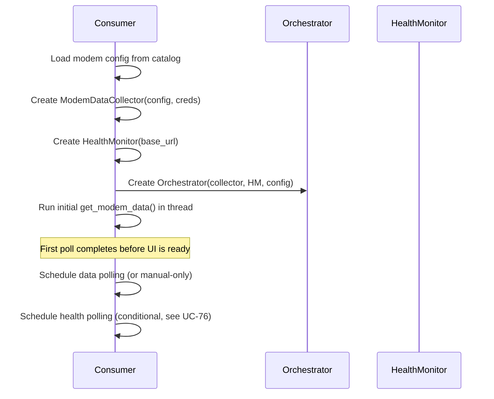
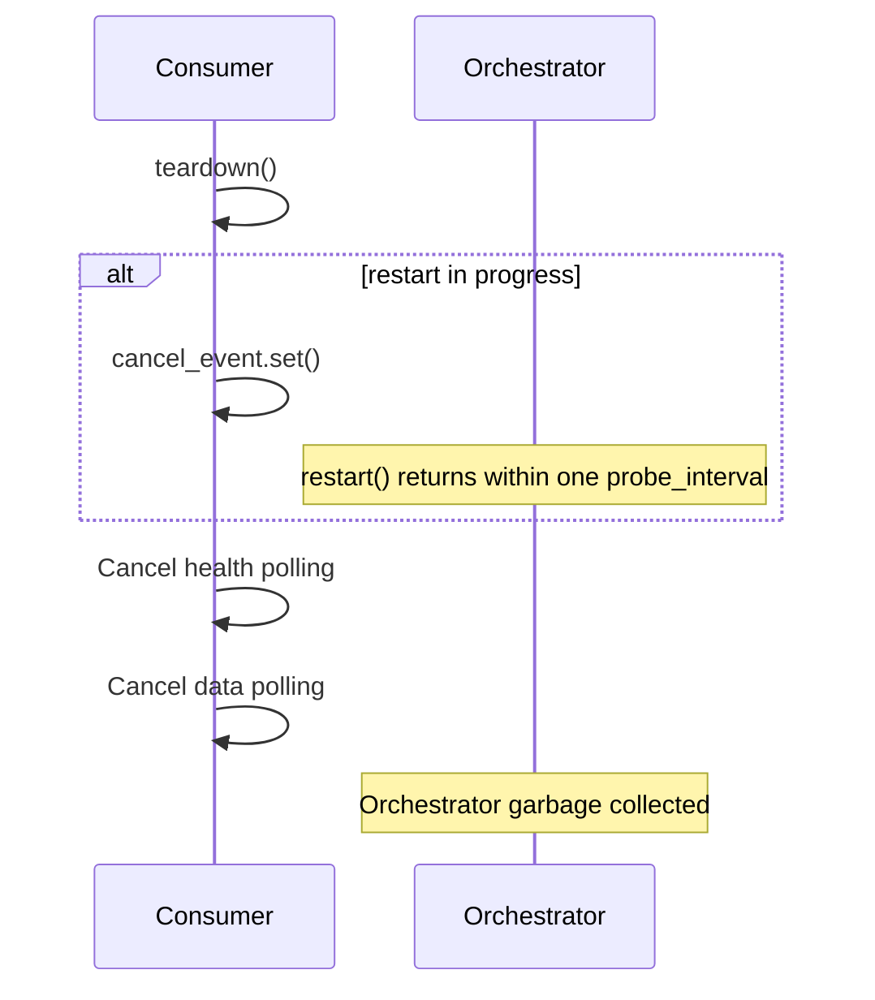
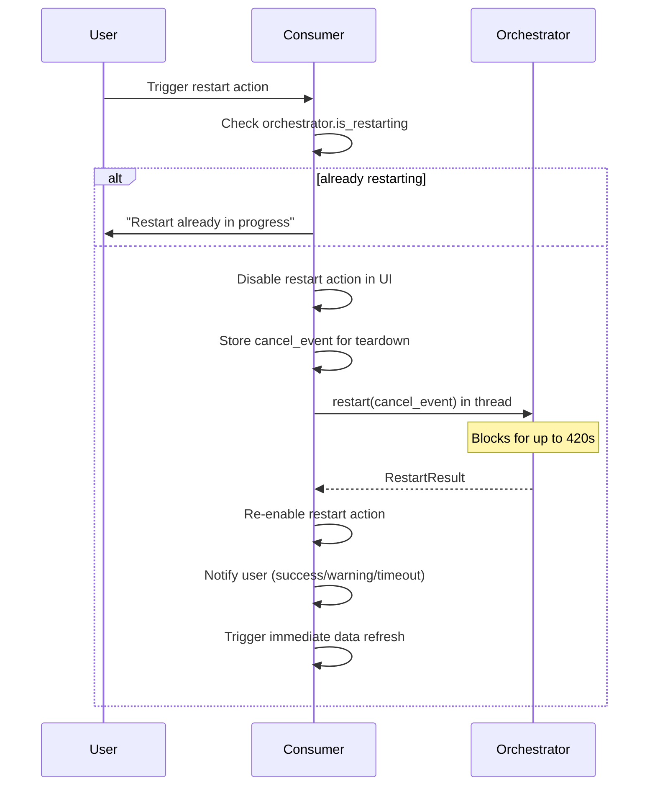
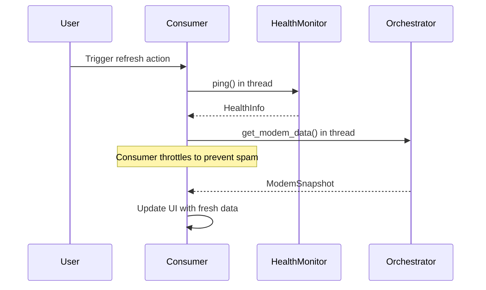
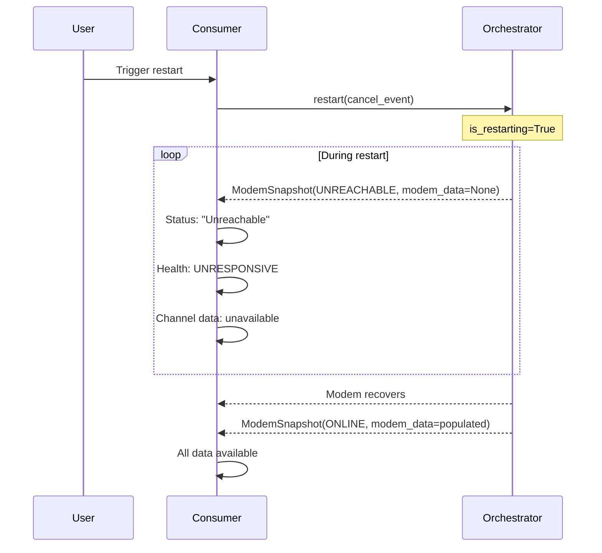
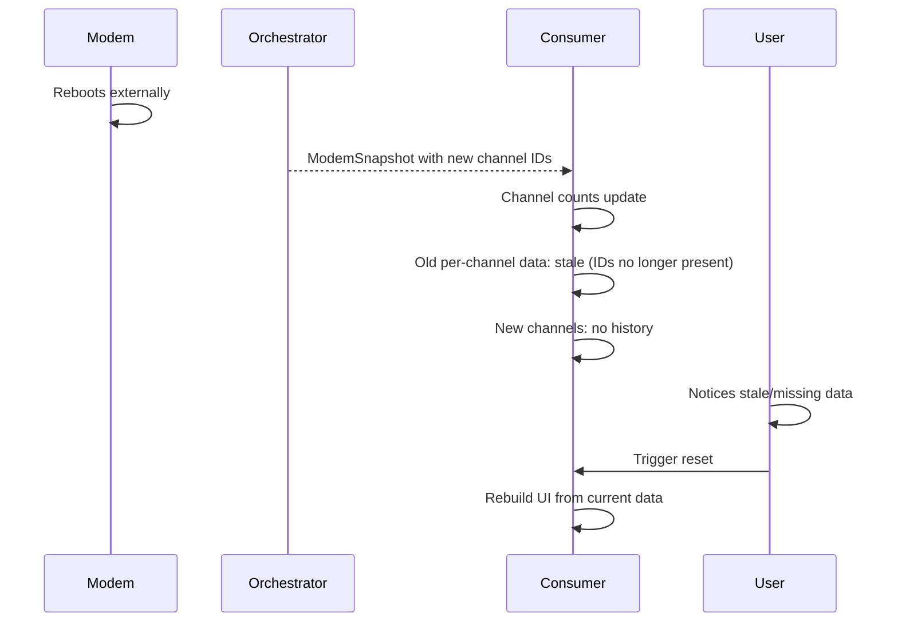
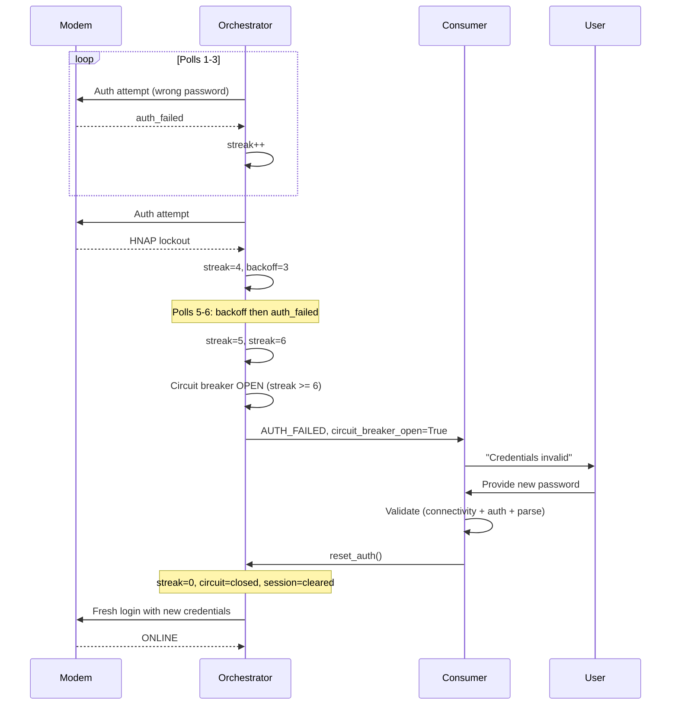
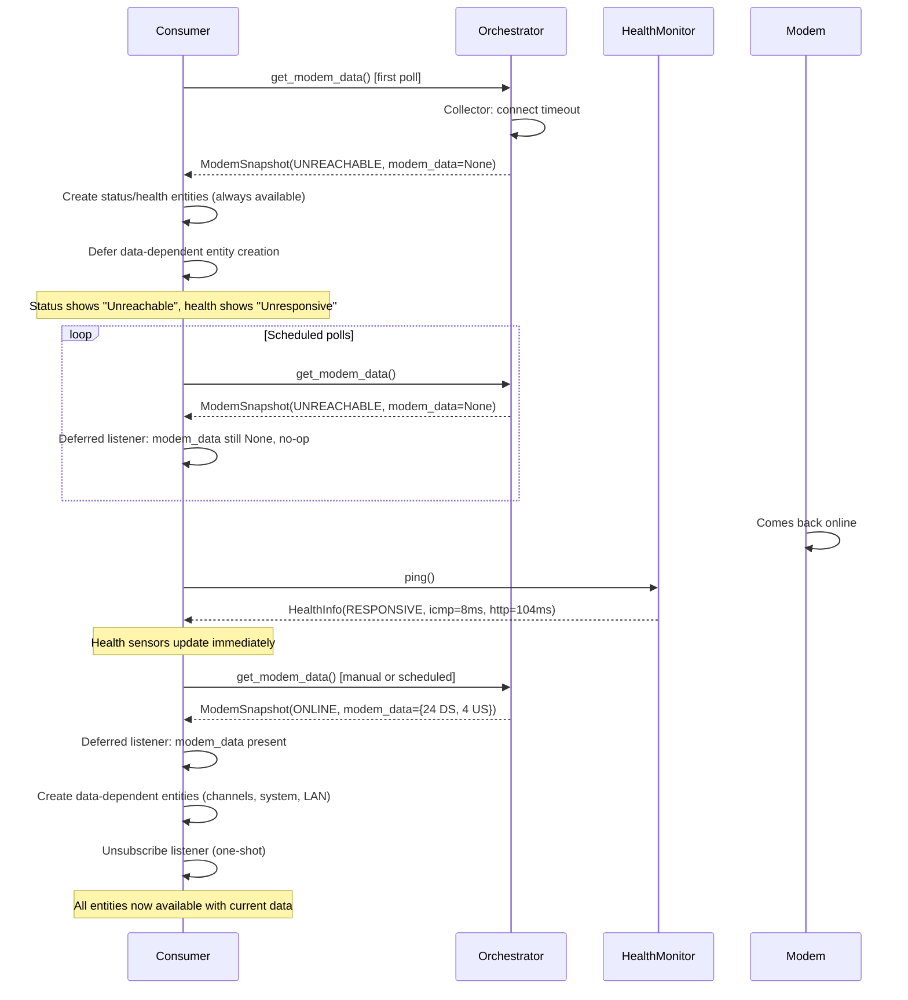

# Orchestration Use Cases

Scenario-driven specification for the orchestration layer. Each use case
documents preconditions, a step-by-step sequence, and assertions that
map directly to test cases. Grouped by concern area.

**Relationship to other specs:**
- `ORCHESTRATION_SPEC.md` — interface contracts (method signatures, types)
- `RUNTIME_POLLING_SPEC.md` — behavioral rules (signal policy, design rules)
- This spec — end-to-end scenarios (what happens when...)

**Conventions:**
- `UC-XX` IDs are stable — tests reference them for traceability
- "Consumer" means any caller (HA coordinator, CLI, exporter)
- Time values are illustrative, not prescriptive
- `→` means "results in"

---

## Normal Operations

### UC-01: First poll — fresh login

**Preconditions:** Orchestrator just created. No session. No prior state.

| Step | Action | State change | Observable |
|------|--------|-------------|------------|
| 1 | Consumer calls `get_modem_data()` | | |
| 2 | Circuit breaker check | closed (default) | |
| 3 | Backoff check | 0 (default) | |
| 4 | Collector: session invalid → authenticate | Session established | |
| 5 | Collector: load resources | | |
| 6 | Collector: parse → 24 DS, 4 US | | |
| 7 | Collector returns `ModemResult(success=True)` | | |
| 8 | Orchestrator: streak=0 (already 0) | | |
| 9 | Orchestrator: derive connection_status | | ONLINE |
| 10 | Orchestrator: derive docsis_status | | OPERATIONAL |
| 11 | Orchestrator: read HM.latest | | |
| 12 | Return `ModemSnapshot` | last_status=ONLINE | |

**Assertions:**
- `snapshot.connection_status == ONLINE`
- `snapshot.docsis_status == OPERATIONAL`
- `snapshot.modem_data` has 24 DS and 4 US channels
- `snapshot.collector_signal == OK`
- `orchestrator.status == ONLINE`
- `orchestrator.diagnostics().auth_failure_streak == 0`
- `orchestrator.diagnostics().session_is_valid == True`

---

### UC-02: Subsequent poll — session reuse

**Preconditions:** UC-01 completed. Session is valid.

| Step | Action | State change | Observable |
|------|--------|-------------|------------|
| 1 | Consumer calls `get_modem_data()` | | |
| 2 | Collector: session valid → skip auth | No new session | |
| 3 | Collector: load resources with existing session | | |
| 4 | Collector: parse → 24 DS, 4 US | | |
| 5 | Return `ModemSnapshot(ONLINE)` | | |

**Assertions:**
- No login attempt was made (verify via auth manager call count)
- `snapshot.connection_status == ONLINE`
- `diagnostics().session_is_valid == True`

---

### UC-03: On-demand refresh

**Preconditions:** Normal operation.

| Step | Action | State change | Observable |
|------|--------|-------------|------------|
| 1 | Consumer calls `get_modem_data()` (same method, no distinction) | | |
| 2 | Orchestrator runs full pipeline | | |
| 3 | Return `ModemSnapshot` | | |

**Assertions:**
- The orchestrator applies the same backoff and circuit breaker
  checks regardless of whether the call is scheduled or on-demand
- Consumer decides scheduling — orchestrator doesn't know or care
  why it was called

**Note:** On-demand vs scheduled is entirely a consumer concern. The
orchestrator has no concept of "scheduled" vs "manual." This is
intentional — backoff and lockout protection apply equally to both.

---

### UC-04: Zero channels with system_info — no signal

**Preconditions:** Modem is online but has no cable connection.

| Step | Action | State change | Observable |
|------|--------|-------------|------------|
| 1 | Consumer calls `get_modem_data()` | | |
| 2 | Collector: auth → load → parse | | |
| 3 | Parser returns 0 DS, 0 US, system_info={firmware: "1.0"} | | |
| 4 | Collector returns `ModemResult(success=True, signal=OK)` | | |
| 5 | Orchestrator: has_channels=False, system_info present | | |
| 6 | Derive connection_status=NO_SIGNAL | | |

**Assertions:**
- `snapshot.connection_status == NO_SIGNAL`
- `snapshot.modem_data` is present (not None)
- `snapshot.modem_data["downstream"] == []`
- `snapshot.collector_signal == OK` (zero channels is valid data, not a failure)
- Auth failure streak is NOT incremented

---

### UC-05: Zero channels without system_info — ambiguous

**Preconditions:** Parser doesn't extract system_info (or matched nothing).

| Step | Action | State change | Observable |
|------|--------|-------------|------------|
| 1 | Consumer calls `get_modem_data()` | | |
| 2 | Parser returns 0 DS, 0 US, system_info={} | | |
| 3 | Collector returns `ModemResult(success=True, signal=OK)` | | |
| 4 | Orchestrator: has_channels=False, system_info empty | | |
| 5 | Log WARNING: "Zero channels and no system_info..." | | |
| 6 | Derive connection_status=NO_SIGNAL | | |

**Assertions:**
- `snapshot.connection_status == NO_SIGNAL`
- WARNING log emitted suggesting parser verification
- Still returns success (not a failure, just ambiguous)

---

### UC-06: Single-session modem — logout after poll

**Preconditions:** modem.yaml declares `max_concurrent: 1` and
`actions.logout`. Modem allows only one authenticated session.

| Step | Action | State change | Observable |
|------|--------|-------------|------------|
| 1 | Consumer calls `get_modem_data()` | | |
| 2 | Collector: auth → load → parse → success | | |
| 3 | Collector: execute logout action | Session released | |
| 4 | Collector returns `ModemResult(success=True)` | | |

**Assertions:**
- Logout action was executed after successful parse
- Session is released (modem's web UI is accessible to user)
- `session_is_valid` may be False after logout (strategy-dependent)
- If logout fails, collection still succeeds (logout is best-effort)

---

### UC-07: DOCSIS status derivation

**Preconditions:** Various downstream channel lock_status combinations.

| DS lock_status values | US present | Expected docsis_status |
|-----------------------|-----------|----------------------|
| All `"locked"` | Yes | `OPERATIONAL` |
| All `"locked"` | No (0 US) | `PARTIAL_LOCK` |
| Some `"locked"`, some `"not_locked"` | Yes | `PARTIAL_LOCK` |
| None `"locked"` | Any | `NOT_LOCKED` |
| No DS channels | Any | `NOT_LOCKED` |
| `lock_status` field absent on channels | Any | `UNKNOWN` |

**Assertions:**
- Each row is a distinct test case
- UNKNOWN prevents false "Not Locked" for modems without lock_status data
- All-locked + no-upstream is PARTIAL_LOCK (upstream matters for OPERATIONAL)

---

## Auth Failures

### UC-10: Wrong credentials — single failure

**Preconditions:** Incorrect password configured.

| Step | Action | State change | Observable |
|------|--------|-------------|------------|
| 1 | Consumer calls `get_modem_data()` | | |
| 2 | Collector: auth fails → `AuthResult.FAILURE` | | |
| 3 | Collector returns `ModemResult(success=False, signal=AUTH_FAILED)` | | |
| 4 | Orchestrator: streak 0→1 | | |
| 5 | Orchestrator: threshold check (1 < 6) → circuit stays closed | | |
| 6 | Return `ModemSnapshot(AUTH_FAILED)` | | |

**Assertions:**
- `snapshot.connection_status == AUTH_FAILED`
- `diagnostics().auth_failure_streak == 1`
- `diagnostics().circuit_breaker_open == False`
- `snapshot.modem_data is None`

---

### UC-11: Transient auth failure — streak resets on success

**Preconditions:** One prior auth failure (streak=1).

| Step | Action | State change | Observable |
|------|--------|-------------|------------|
| 1 | Consumer calls `get_modem_data()` | | |
| 2 | Collector: auth succeeds → load → parse → OK | | |
| 3 | Orchestrator: streak 1→0 | streak reset | |
| 4 | Return `ModemSnapshot(ONLINE)` | | |

**Assertions:**
- `diagnostics().auth_failure_streak == 0`
- Streak resets on any successful collection, regardless of prior count
- Circuit breaker stays closed

---

### UC-12: Firmware lockout — AUTH_LOCKOUT with backoff

**Preconditions:** HNAP modem. Auth manager receives `LoginResult: "LOCKUP"`.

| Step | Action | State change | Observable |
|------|--------|-------------|------------|
| 1 | Consumer calls `get_modem_data()` | | |
| 2 | Collector: auth raises `LoginLockoutError` | | |
| 3 | Collector catches, returns `ModemResult(signal=AUTH_LOCKOUT)` | | |
| 4 | Orchestrator: streak incremented | streak++ | |
| 5 | Orchestrator: backoff=3 | backoff=3 | |
| 6 | Return `ModemSnapshot(AUTH_FAILED)` | | |

**Assertions:**
- `snapshot.connection_status == AUTH_FAILED`
- `diagnostics().auth_failure_streak` incremented
- Next 3 polls will be suppressed (see UC-13)
- WARNING log: "Auth lockout — firmware anti-brute-force triggered..."

---

### UC-13: Backoff expiry — polling resumes

**Preconditions:** UC-12 just occurred. backoff=3.

| Poll | Backoff before | Action | Backoff after |
|------|---------------|--------|--------------|
| N+1 | 3 | Decrement, skip collection, return AUTH_FAILED | 2 |
| N+2 | 2 | Decrement, skip collection, return AUTH_FAILED | 1 |
| N+3 | 1 | Decrement, skip collection, return AUTH_FAILED | 0 |
| N+4 | 0 | Run collection normally | 0 |

**Assertions:**
- Each backoff poll returns `ModemSnapshot(AUTH_FAILED)` without
  running the collector
- Backoff decrements by 1 per poll regardless of outcome
- At backoff=0, collection resumes
- INFO log each suppressed poll: "Backoff active (N remaining)..."

---

### UC-14: Circuit breaker trip — 6 consecutive failures

**Preconditions:** streak=5, one more auth failure will trip the breaker.

| Step | Action | State change | Observable |
|------|--------|-------------|------------|
| 1 | Consumer calls `get_modem_data()` | | |
| 2 | Collector: AUTH_FAILED or AUTH_LOCKOUT | | |
| 3 | Orchestrator: streak 5→6 | | |
| 4 | Orchestrator: 6 >= threshold → circuit OPEN | circuit=True | |
| 5 | Return `ModemSnapshot(AUTH_FAILED)` | | |

**Assertions:**
- `diagnostics().circuit_breaker_open == True`
- `diagnostics().auth_failure_streak == 6`
- ERROR log: "Auth circuit breaker OPEN — 6 consecutive auth failures..."

---

### UC-15: Circuit breaker blocks polling

**Preconditions:** Circuit breaker is open.

| Step | Action | State change | Observable |
|------|--------|-------------|------------|
| 1 | Consumer calls `get_modem_data()` | | |
| 2 | Orchestrator: circuit open → return immediately | No collection | |
| 3 | Return `ModemSnapshot(AUTH_FAILED)` | | |

**Assertions:**
- Collector.execute() was NOT called
- No HTTP traffic to the modem
- ERROR log: "Circuit breaker is OPEN — polling stopped..."
- `is_restarting == False` (circuit breaker is different from restart)

---

### UC-16: Credential reconfiguration — reset_auth()

**Preconditions:** Circuit breaker is open. User reconfigured credentials
via HA reauth flow.

| Step | Action | State change | Observable |
|------|--------|-------------|------------|
| 1 | Consumer calls `reset_auth()` | | |
| 2 | Orchestrator: streak=0 | streak reset | |
| 3 | Orchestrator: circuit=closed | circuit closed | |
| 4 | Orchestrator: backoff=0 | backoff cleared | |
| 5 | Orchestrator: collector.clear_session() | session cleared | |
| 6 | Consumer calls `get_modem_data()` | | |
| 7 | Collector: fresh login with new credentials | | |

**Assertions:**
- `diagnostics().auth_failure_streak == 0`
- `diagnostics().circuit_breaker_open == False`
- `diagnostics().session_is_valid == False` (after reset, before next poll)
- Next poll attempts fresh login (no stale session, no backoff, no circuit block)

---

### UC-17: LOAD_AUTH — 401 on data page

**Preconditions:** Auth appeared to succeed but data page returns 401/403.
Session may be stale, or strategy doesn't grant data access.

| Step | Action | State change | Observable |
|------|--------|-------------|------------|
| 1 | Consumer calls `get_modem_data()` | | |
| 2 | Collector: auth succeeds (or session reused) | | |
| 3 | Resource Loader: GET /status.html → HTTP 401 | | |
| 4 | Collector returns `ModemResult(signal=LOAD_AUTH)` | | |
| 5 | Orchestrator: streak++ | | |
| 6 | Orchestrator: collector.clear_session() | session cleared | |
| 7 | Return `ModemSnapshot(AUTH_FAILED)` | | |

**Assertions:**
- Session is cleared so next poll starts with fresh login
- Auth failure streak is incremented (LOAD_AUTH is auth-related)
- If persistent, will escalate to circuit breaker (same as wrong credentials)
- INFO log: "LOAD_AUTH — clearing session, reporting auth_failed..."

---

### UC-18: LOAD_AUTH — self-correcting stale session

**Preconditions:** UC-17 occurred (session cleared). Credentials are correct.

| Step | Action | State change | Observable |
|------|--------|-------------|------------|
| 1 | Consumer calls `get_modem_data()` | | |
| 2 | Collector: no session → fresh login → success | | |
| 3 | Collector: load → parse → OK | | |
| 4 | Orchestrator: streak→0 | streak reset | |
| 5 | Return `ModemSnapshot(ONLINE)` | | |

**Assertions:**
- Fresh login resolves the stale session
- Streak resets to 0
- Single LOAD_AUTH → fresh login → success is the expected self-healing path

---

### UC-19: Login page detection — auth redirect on data URL

**Preconditions:** Resource Loader fetches a data page. Modem returns
HTTP 200 but the body is a login page (auth redirect, session expired
silently). Without detection, this would reach the parser and cause
PARSE_ERROR.

| Step | Action | State change | Observable |
|------|--------|-------------|------------|
| 1 | Consumer calls `get_modem_data()` | | |
| 2 | Collector: auth succeeds (or session reused) | | |
| 3 | Resource Loader: GET /status.html → HTTP 200, body contains login form | | |
| 4 | Resource Loader: detects login page indicators | | |
| 5 | Collector returns `ModemResult(signal=LOAD_AUTH)` | | |
| 6 | Orchestrator: clear session, streak++ | | |

**Assertions:**
- Signal is LOAD_AUTH (not PARSE_ERROR) — correct root cause classification
- Login page detection checks for `<input type="password">` or similar
- Session is cleared for fresh login on next poll
- WARNING log: "Data page /status.html appears to be a login page"

---

### UC-20: Password changed after months of success

**Preconditions:** Modem working for months. User changes password on
modem's web UI. Session is still valid in memory.

| Poll | What happens | Streak | Status |
|------|-------------|--------|--------|
| N | Session valid → reuse → load → parse → OK | 0 | ONLINE |
| ... | (months of normal operation) | 0 | ONLINE |
| N+K | Session expires → re-auth → wrong password | 1 | AUTH_FAILED |
| N+K+1 | AUTH_FAILED | 2 | AUTH_FAILED |
| N+K+2 | LOCKUP → AUTH_LOCKOUT, backoff=3 | 3 | AUTH_FAILED |
| N+K+3 | Backoff (2 remaining) | 3 | AUTH_FAILED |
| N+K+4 | Backoff (1 remaining) | 3 | AUTH_FAILED |
| N+K+5 | Backoff (0 remaining) | 3 | AUTH_FAILED |
| N+K+6 | AUTH_FAILED | 4 | AUTH_FAILED |
| N+K+7 | AUTH_FAILED | 5 | AUTH_FAILED |
| N+K+8 | AUTH_LOCKOUT, streak=6 → circuit OPEN | 6 | AUTH_FAILED |
| N+K+9+ | Circuit open, no collection | 6 | AUTH_FAILED |

**Assertions:**
- Session reuse delays the failure until the session naturally expires
- Circuit breaker trips after ~2 lockout cycles (threshold 6)
- User sees escalating log messages with streak count (1/6, 2/6, ... 6/6)
- ERROR log at circuit trip is actionable: "Reconfigure credentials to resume"
- After reset_auth() with correct password → back to normal (UC-16)

---

## Connectivity Failures

### UC-30: Connection refused — modem offline

**Preconditions:** Modem is powered off or unreachable.

| Step | Action | State change | Observable |
|------|--------|-------------|------------|
| 1 | Consumer calls `get_modem_data()` | | |
| 2 | Collector: auth → ConnectionError | | |
| 3 | Collector returns `ModemResult(signal=CONNECTIVITY)` | | |
| 4 | Orchestrator: increment connectivity streak, set backoff | connectivity_streak=1, backoff=1 | |
| 5 | Return `ModemSnapshot(UNREACHABLE)` | | |

**Assertions:**
- `snapshot.connection_status == UNREACHABLE`
- Auth failure streak is NOT incremented (connectivity is not auth)
- Connectivity backoff applied: `min(2^(streak-1), 6)` polls skipped before retry
- Next poll is skipped (backoff=1); poll after that retries

---

### UC-31: HTTP timeout — slow modem

**Preconditions:** Modem responds slowly, exceeds per-request timeout.

| Step | Action | State change | Observable |
|------|--------|-------------|------------|
| 1 | Consumer calls `get_modem_data()` | | |
| 2 | Collector: auth or load → Timeout | | |
| 3 | Collector returns `ModemResult(signal=CONNECTIVITY)` | | |
| 4 | Return `ModemSnapshot(UNREACHABLE)` | | |

**Assertions:**
- Same policy as connection refused — connectivity backoff, no auth streak
- Modem's per-request timeout from modem.yaml applies

---

### UC-32: HTTP 5xx on data page

**Preconditions:** Modem's web server returns 500/502/503.

| Step | Action | State change | Observable |
|------|--------|-------------|------------|
| 1 | Consumer calls `get_modem_data()` | | |
| 2 | Collector: auth OK → load /status.html → HTTP 500 | | |
| 3 | Collector returns `ModemResult(signal=LOAD_ERROR)` | | |
| 4 | Return `ModemSnapshot(UNREACHABLE)` | | |

**Assertions:**
- `snapshot.connection_status == UNREACHABLE`
- Auth failure streak NOT incremented (server error, not auth)
- All-or-nothing: if any page returns 5xx, entire poll fails

---

### UC-33: Parser error — malformed response

**Preconditions:** Modem returns unexpected HTML/data format.

| Step | Action | State change | Observable |
|------|--------|-------------|------------|
| 1 | Consumer calls `get_modem_data()` | | |
| 2 | Collector: auth OK → load OK → parse raises exception | | |
| 3 | Collector catches, returns `ModemResult(signal=PARSE_ERROR)` | | |
| 4 | Return `ModemSnapshot(PARSER_ISSUE)` | | |

**Assertions:**
- `snapshot.connection_status == PARSER_ISSUE`
- Distinct from UNREACHABLE — the modem responded, but data is unparseable
- Auth streak NOT incremented
- ERROR log with parser exception details

---

### UC-34: Status transition — unreachable to online

**Preconditions:** Last poll returned UNREACHABLE (modem was offline).
Modem has come back online.

| Step | Action | State change | Observable |
|------|--------|-------------|------------|
| 1 | Consumer calls `get_modem_data()` | | |
| 2 | Collector: session may be stale from before outage | | |
| 3a | If modem rejects stale session → LOAD_AUTH → clear session | | |
| 3b | If modem accepts (IP-based or ignores stale cookies) → success | | |
| 4 | Orchestrator: detects UNREACHABLE → ONLINE transition | last_status=ONLINE | |
| 5 | Log INFO status transition for diagnostics | | |

**Assertions:**
- Transition is logged: "Status transition [MODEL]: unreachable → online"
- If stale session rejected (3a): next poll does fresh login, self-corrects (UC-18)
- No proactive session clear — LOAD_AUTH handles it naturally

---

### UC-35: All-or-nothing page loading

**Preconditions:** Modem has 3 data pages. Second page fails.

| Step | Action | State change | Observable |
|------|--------|-------------|------------|
| 1 | Consumer calls `get_modem_data()` | | |
| 2 | Collector: auth OK | | |
| 3 | Resource Loader: GET /page1.html → 200 OK | | |
| 4 | Resource Loader: GET /page2.html → timeout | | |
| 5 | Resource Loader: aborts (does NOT fetch page 3) | | |
| 6 | Collector returns `ModemResult(signal=CONNECTIVITY)` | | |

**Assertions:**
- Partial data is never returned — if any page fails, entire poll fails
- Log identifies which page failed, error type, HTTP status
- Previous ModemSnapshot persists on consumer's sensors until next success

---

## Restart

### UC-40: Planned restart — full two-phase recovery

**Preconditions:** modem.yaml declares `actions.restart`. Modem is online.

| Step | Action | State change | Observable |
|------|--------|-------------|------------|
| 1 | Consumer calls `restart()` | is_restarting=True | |
| 2 | Orchestrator: authenticate (fresh session) | | |
| 3 | Orchestrator: execute restart action | | |
| 4 | Connection drop during request = success | | |
| 5 | Orchestrator: clear_session() | session cleared | |
| 6 | Create RestartMonitor, call monitor_recovery() | | |
| 7 | Phase 1: probe every 10s until modem responds | | |
| 8 | Modem responds at ~90s | | |
| 9 | Phase 2: poll for channel stabilization | | |
| 10 | 3 consecutive stable counts + 30s grace | | |
| 11 | Return `RestartResult(success=True, COMPLETE, 150s)` | is_restarting=False | |

**Assertions:**
- `result.success == True`
- `result.phase_reached == COMPLETE`
- `result.elapsed_seconds > 0`
- `orchestrator.is_restarting == False` after return
- Session was cleared (old pre-restart session is dead)

---

### UC-41: Restart cancel — clean shutdown

**Preconditions:** Restart in progress (phase 1). Consumer needs to stop.

| Step | Action | State change | Observable |
|------|--------|-------------|------------|
| 1 | Consumer calls `restart(cancel_event)` | is_restarting=True | |
| 2 | Phase 1: probing for response | | |
| 3 | Consumer sets `cancel_event` (e.g., HA unloading) | | |
| 4 | RM: cancel_event.wait(probe_interval) returns immediately | | |
| 5 | RM: cancel_event.is_set() → exit loop | | |
| 6 | Return `RestartResult(success=False, WAITING_RESPONSE, 45s)` | is_restarting=False | |

**Assertions:**
- `result.success == False`
- `result.phase_reached == WAITING_RESPONSE` (or wherever cancel was detected)
- Return happens within one probe_interval of cancel being set
- `is_restarting == False` after return (cleanup happens regardless)

---

### UC-42: Restart during restart — rejected

**Preconditions:** Restart already in progress.

| Step | Action | State change | Observable |
|------|--------|-------------|------------|
| 1 | Consumer calls `restart()` | | |
| 2 | Orchestrator: is_restarting=True → reject | No state change | |
| 3 | Return `RestartResult(success=False, error="...")` | | |

**Assertions:**
- No second restart command sent to modem
- `result.success == False`
- `result.error` indicates restart already in progress
- Original restart continues unaffected

---

### UC-43: Poll during restart — short-circuit

**Preconditions:** Restart in progress.

| Step | Action | State change | Observable |
|------|--------|-------------|------------|
| 1 | Consumer calls `get_modem_data()` | | |
| 2 | Orchestrator: is_restarting=True → return early | No collection | |
| 3 | Return `ModemSnapshot(UNREACHABLE)` | | |

**Assertions:**
- Collector.execute() NOT called (no HTTP traffic to rebooting modem)
- Auth failure streak NOT incremented
- No backoff applied
- `snapshot.connection_status == UNREACHABLE` (accurate — modem is rebooting)

---

### UC-44: Restart not supported

**Preconditions:** modem.yaml does not declare `actions.restart`.

| Step | Action | State change | Observable |
|------|--------|-------------|------------|
| 1 | Consumer calls `restart()` | | |
| 2 | Orchestrator: no restart action → raise | | |

**Assertions:**
- `RestartNotSupportedError` raised
- `is_restarting` never set to True
- Platform adapter should prevent this by checking config before exposing restart

---

### UC-45: Restart bypasses circuit breaker

**Preconditions:** Circuit breaker is open (persistent auth failures).
User presses restart button.

| Step | Action | State change | Observable |
|------|--------|-------------|------------|
| 1 | Consumer calls `restart()` | | |
| 2 | Orchestrator: does NOT check circuit breaker | | |
| 3 | Orchestrator: authenticates with fresh session | | |
| 4 | If auth succeeds: restart proceeds normally | | |
| 5 | If auth fails: restart fails with clear error | | |

**Assertions:**
- Circuit breaker is not consulted during restart
- Restart uses its own fresh auth session
- Auth failure during restart does NOT increment the orchestrator's streak
- Restart is a user-initiated action — circuit breaker protects automated polling only

---

### UC-46: Restart — phase 1 timeout

**Preconditions:** Restart command sent. Modem never comes back
(hardware failure, power still out).

| Step | Action | State change | Observable |
|------|--------|-------------|------------|
| 1 | Phase 1: probe every 10s for response_timeout (120s default) | | |
| 2 | All probes fail (connection refused / timeout) | | |
| 3 | response_timeout exceeded | | |
| 4 | Return `RestartResult(success=False, WAITING_RESPONSE, 120s)` | is_restarting=False | |

**Assertions:**
- `result.success == False`
- `result.phase_reached == WAITING_RESPONSE`
- Total time ~= response_timeout
- WARNING log: "Restart recovery: response timeout..."

---

### UC-47: Restart — phase 2 timeout

**Preconditions:** Modem responded (phase 1 passed). Channels never
stabilize (keep changing, DOCSIS registration never completes).

| Step | Action | State change | Observable |
|------|--------|-------------|------------|
| 1 | Phase 2: poll every 10s for channel_stabilization_timeout (300s) | | |
| 2 | Channel counts keep changing (8 DS → 16 DS → 20 DS → 18 DS...) | | |
| 3 | Never get 3 consecutive stable counts | | |
| 4 | channel_stabilization_timeout exceeded | | |
| 5 | Return `RestartResult(success=False, CHANNEL_SYNC, 420s)` | is_restarting=False | |

**Assertions:**
- `result.phase_reached == CHANNEL_SYNC` (not WAITING_RESPONSE)
- Total time ~= response_timeout + channel_stabilization_timeout
- WARNING log: "Channel stabilization timeout..."

---

### UC-48: Restart — skip phase 2

**Preconditions:** Fragile modem (e.g., S33v2). Consumer configured
`channel_stabilization_timeout=0` to minimize post-restart probing.

| Step | Action | State change | Observable |
|------|--------|-------------|------------|
| 1 | Phase 1: modem responds at 90s | | |
| 2 | Phase 2: skipped (timeout=0) | | |
| 3 | Return `RestartResult(success=True, COMPLETE, 90s)` | | |

**Assertions:**
- No channel stabilization polling occurs
- Result is COMPLETE immediately after response detection
- Total time ~= time until first response

---

### UC-49: Unplanned restart detection

**Preconditions:** Modem was restarted externally (ISP, power outage).
No restart command sent. Normal polling discovers the outage.

| Poll | What happens | Status |
|------|-------------|--------|
| N | Normal poll → ONLINE | ONLINE |
| N+1 | ConnectionError → CONNECTIVITY (streak=1, backoff=1) | UNREACHABLE |
| N+2 | Connectivity backoff skip | UNREACHABLE |
| N+3 | Backoff cleared, modem back → LOAD_AUTH → clear session | AUTH_FAILED |
| N+4 | Fresh login → success | ONLINE |

**Assertions:**
- No RestartMonitor involved — normal polling handles recovery
- UNREACHABLE → ONLINE transition logged
- Stale session self-corrects via LOAD_AUTH → clear → fresh login
- Connectivity backoff reduces wasted timeouts during outage
- LOAD_AUTH resets connectivity state (modem responded)
- Health checks (if running) detect the outage faster than data polls

**Alternative path (IP-based session):**

| Poll | What happens | Status |
|------|-------------|--------|
| N+3 | Modem back, accepts stale cookies (or IP-based) → success | ONLINE |

No LOAD_AUTH step needed. Both paths are valid.

---

## Health

### UC-50: Normal health check — both probes

**Preconditions:** Both ICMP and HTTP HEAD enabled.

| Step | Action | Observable |
|------|--------|------------|
| 1 | Consumer calls `ping()` | |
| 2 | HM: ICMP ping → success (4ms) | |
| 3 | HM: HTTP HEAD → success (12ms) | |
| 4 | HM: derive status → RESPONSIVE | |
| 5 | HM: store as .latest | |
| 6 | Return `HealthInfo(RESPONSIVE, icmp_latency_ms=4, http_latency_ms=12)` | |

**Assertions:**
- Both probes run regardless of each other's result
- Order: ICMP first (lightest), then HTTP HEAD
- INFO log: "Health check: responsive (icmp 4ms, HTTP 12ms)"

---

### UC-51: Health checks decoupled from collection

**Preconditions:** Data collection and health checks both running.

| Step | Action | Observable |
|------|--------|------------|
| 1 | Data poll completes successfully | ONLINE |
| 2 | Health timer fires (independent cadence) | |
| 3 | HM: run ICMP + HTTP HEAD probes | |
| 4 | Return `HealthInfo(RESPONSIVE, icmp_latency_ms=4, http_latency_ms=12)` | |

**Assertions:**
- Health checks and data collection run independently on their own cadences
- Health probes always run their full set (ICMP + HTTP HEAD) regardless of collection state
- No coupling between the two pipelines — neither suppresses the other
- Health provides fast outage detection; collection provides modem data

---

### UC-52: Health continues when collection stops

**Preconditions:** Data polling disabled or collector missed a cycle.
Health checks still running on their own cadence.

| Step | Action | Observable |
|------|--------|------------|
| 1 | No data collection runs (disabled or failed) | |
| 2 | Health timer fires | |
| 3 | HM: run ICMP + HTTP HEAD probes | |
| 4 | Return `HealthInfo(...)` | |

**Assertions:**
- Health probes run regardless of whether data collection is active
- No dependency on collection state — health is fully independent
- Provides reachability data even when data polling is disabled (UC-74)

---

### UC-53: Outage detection between data polls

**Preconditions:** Health cadence = 30s, data cadence = 10m.
Modem goes down 2 minutes after last data poll.

| Time | Event | Health status | Data status |
|------|-------|-------------|-------------|
| 0:00 | Data poll → ONLINE | | ONLINE |
| 0:30 | Health check → responsive | RESPONSIVE | ONLINE |
| 1:00 | Health check → responsive | RESPONSIVE | ONLINE |
| 2:00 | Modem goes offline | | |
| 2:30 | Health check → unresponsive | UNRESPONSIVE | ONLINE |
| 3:00 | Health check → unresponsive | UNRESPONSIVE | ONLINE |
| 10:00 | Data poll → UNREACHABLE | UNRESPONSIVE | UNREACHABLE |

**Assertions:**
- Health detects the outage at 2:30 (7.5 minutes before data poll)
- Consumer updates health sensors immediately on health callback
- Data status remains ONLINE until next data poll (stale but not wrong — it was
  the last known data state)
- This is the primary value of independent health cadence

---

### UC-54: ICMP blocked network

**Preconditions:** Network blocks ICMP. `supports_icmp=True` (not
yet known to be blocked).

| Step | Action | Observable |
|------|--------|------------|
| 1 | Consumer calls `ping()` | |
| 2 | HM: ICMP → fail (blocked) | |
| 3 | HM: HTTP HEAD → success | |
| 4 | Return `HealthInfo(ICMP_BLOCKED)` | |

**Assertions:**
- `health_status == ICMP_BLOCKED`
- Modem IS responsive (HTTP works) — ICMP failure is network, not modem
- Consumer may choose to disable ICMP after seeing persistent ICMP_BLOCKED

---

### UC-55: Degraded — HTTP fails, ping succeeds

**Preconditions:** Modem's web server is hung but network stack responds.

| Step | Action | Observable |
|------|--------|------------|
| 1 | Consumer calls `ping()` | |
| 2 | HM: ICMP → success | |
| 3 | HM: HTTP HEAD → timeout | |
| 4 | Return `HealthInfo(DEGRADED)` | |

**Assertions:**
- `health_status == DEGRADED`
- Modem is network-reachable but web UI is unresponsive
- WARNING log: "Health check: degraded (ping OK, HTTP timeout)"

---

### UC-56: Both probes disabled

**Preconditions:** `supports_icmp=False`, `supports_head=False`.

| Step | Action | Observable |
|------|--------|------------|
| 1 | Consumer calls `ping()` | |
| 2 | HM: no probes to run | |
| 3 | Return `HealthInfo(UNKNOWN)` | |

**Assertions:**
- `health_status == UNKNOWN`
- No network traffic generated
- Consumer should not schedule health checks if no probes are enabled

---

### UC-57: Health during restart — independent

**Preconditions:** Restart in progress. Health thread/timer continues.

| Time | Health check | Restart monitor |
|------|-------------|----------------|
| 0:00 | | Restart command sent |
| 0:10 | | Phase 1 probe #1 (fail) |
| 0:15 | ping() → unresponsive | |
| 0:20 | | Phase 1 probe #2 (fail) |
| 0:30 | | Phase 1 probe #3 (success!) |
| 0:45 | ping() → responsive | |

**Assertions:**
- Health checks continue independently during restart
- Health thread and RestartMonitor may both call ping() — this is fine
  (stateless probes, atomic `_latest` update under GIL)
- Health sensors update in real-time during restart recovery
- No coordination needed between health timer and restart monitor

---

## Diagnostics

### UC-60: Diagnostics snapshot

**Preconditions:** Several polls have run.

| Step | Action | Observable |
|------|--------|------------|
| 1 | Consumer calls `diagnostics()` | |
| 2 | Return `OrchestratorDiagnostics(...)` | |

**Assertions:**
- Returns `OrchestratorDiagnostics` with all fields populated (see
  [ORCHESTRATION_SPEC.md](ORCHESTRATION_SPEC.md#data-models) § Data Models
  for field definitions)
- Diagnostics are a read-only snapshot — calling `diagnostics()` has no side effects
- Diagnostics are available even when circuit breaker is open

---

## Consumer Lifecycle

These use cases define Core's interface contract from the consumer's
perspective. Any platform (Home Assistant, CLI, web service) follows the
same component creation, polling, and teardown sequence. For HA-specific
wiring (DataUpdateCoordinator, entity availability, options flow), see
[HA_ADAPTER_SPEC.md](../../../custom_components/cable_modem_monitor/docs/HA_ADAPTER_SPEC.md).

### UC-70: Consumer setup

**Assertions:**
- All Core components created before first poll
- First poll runs before UI is ready (consumer gets initial data to display)
- Health monitor only created if at least one probe works (see UC-76)
- Core does not spawn threads — consumer manages all scheduling and threading

---

### UC-71: Consumer teardown

**Assertions:**
- If restart is running, cancel_event stops it promptly
- Consumer cancels all polling timers
- Orchestrator and components garbage collected normally — no threads to join

---

### UC-72: Consumer-triggered restart

**Assertions:**
- Restart action disabled while running (prevents double-trigger)
- `restart()` runs in a thread (doesn't block consumer's event loop)
- cancel_event stored so teardown can interrupt if needed
- User notified of result
- Immediate data refresh after restart for fresh readings

---

### UC-73: Consumer-triggered refresh

**Assertions:**
- Refresh triggers both health probe and data collection
- If health monitor exists, probe runs first (fresh health data for the snapshot)
- Consumer should throttle rapid refreshes (e.g., debounce or cooldown)
- Same `get_modem_data()` path as scheduled polls (same backoff/circuit checks)

---

## Polling Modes and Configuration

### UC-74: Disabled data polling — health continues

**Context:** Fragile modems may crash from frequent data polling.
Consumer disables scheduled data polls but keeps health probes running
for reachability monitoring.

**Preconditions:** Consumer configured with data polling disabled,
health check interval at 30s. Initial poll completed during setup.

| Step | Action | State change | Observable |
|------|--------|-------------|------------|
| 1 | Setup completes with first poll | Consumer has data | UI shows initial data |
| 2 | No data polling timer scheduled | | No scheduled polls |
| 3 | Health timer fires (30s) | | |
| 4 | health_monitor.ping() runs in thread | | ICMP + HTTP probes |
| 5 | HealthInfo updated | | Health indicators show latency |
| 6 | User triggers manual refresh | | |
| 7 | get_modem_data() runs in thread | | ModemSnapshot returned |
| 8 | UI updated with fresh data | | |

**Assertions:**
- No scheduled data polls after setup
- Health probes continue on their own cadence
- Manual refresh triggers full data collection
- Backoff and circuit breaker still apply to manual triggers
- Health indicators update between manual data polls

---

### UC-75: Both disabled — fully manual

**Preconditions:** Consumer configured with both data polling and health
checks disabled. Initial poll completed during setup.

| Step | Action | State change | Observable |
|------|--------|-------------|------------|
| 1 | Setup completes with first poll + first health probe | Consumer has data | UI ready |
| 2 | No timers scheduled | | No scheduled polls or probes |
| 3 | User triggers manual refresh | | |
| 4 | get_modem_data() runs in thread | | ModemSnapshot with latest health |
| 5 | UI updated | | |

**Assertions:**
- No scheduled polls or health probes after setup
- Manual refresh triggers data collection
- ModemSnapshot includes most recent HealthInfo (from initial probe or last manual trigger)
- System is completely passive until user acts

---

### UC-76: Conditional health monitor setup

**Preconditions:** During setup, health probes are tested.

| Step | Action | State change | Observable |
|------|--------|-------------|------------|
| 1 | Setup: run first health_monitor.ping() | | |
| 2a | If ICMP or HTTP succeeds | supports_icmp/supports_head recorded | |
| 3a | Create health monitor, schedule polling | Health timer starts | Health indicators available |
| 2b | If both ICMP and HTTP fail | Neither probe supported | |
| 3b | Skip health monitor | No health timer | No health indicators |

**Assertions:**
- Health monitor only created when at least one probe works
- Probe support flags stored for subsequent startups
- When no probes work, health_monitor is None
- Orchestrator works correctly with health_monitor=None

---

### UC-77: Configurable intervals

**Preconditions:** Consumer running with default intervals (data: 600s,
health: 30s).

| Step | Action | State change | Observable |
|------|--------|-------------|------------|
| 1 | User changes data poll interval to 1800s | | |
| 2 | User changes health check interval to 60s | | |
| 3 | Consumer validates and applies | | |
| 4 | Polling resumes with new intervals | Both schedulers updated | |

**Assertions:**
- Data poll interval: min 30s, max 86400s, or disabled
- Health check interval: min 10s, max 86400s, or disabled
- Both intervals independently configurable
- Consumer handles reload/reschedule on interval change
- Disabling data polling stops data timer
- Disabling health polling stops health timer

---

### UC-78: Data availability during restart

**Preconditions:** Normal operation. Restart initiated.

| Step | Action | State change | Observable |
|------|--------|-------------|------------|
| 1 | User triggers restart | is_restarting=True | |
| 2 | get_modem_data() returns ModemSnapshot(UNREACHABLE, modem_data=None) | | |
| 3 | Status: always derivable, shows "Unreachable" | | Shows restart state |
| 4 | Health: always available (independent probes) | | Shows UNRESPONSIVE during reboot |
| 5 | Channel data: unavailable (modem_data is None) | | No channel readings |
| 6 | Modem recovers, first successful poll | modem_data populated | |
| 7 | Channel data: available again | | Fresh readings |

**Assertions:**
- Status is always derivable — reports accurate state throughout restart
- Health probes run independently — report probe results throughout
- Channel data unavailable when modem_data is None (gap in time series)
- Consumer decides how to surface unavailability (e.g., HA uses entity availability, CLI might show dashes)
- Restart/refresh actions remain available throughout

---

### UC-79: Disabled polling — initial poll still runs

**Preconditions:** Consumer configured with data polling disabled.

| Step | Action | State change | Observable |
|------|--------|-------------|------------|
| 1 | Setup begins | | |
| 2 | Initial get_modem_data() runs | First poll completes | ModemSnapshot with data |
| 3 | UI created from initial poll data | | Shows initial readings |
| 4 | No data polling timer scheduled | | No subsequent polls |
| 5 | Status shows "Operational" (not "Unreachable") | | |

**Assertions:**
- First poll always runs during setup regardless of polling mode
- UI has real data from the start (no transient "Unreachable" state)
- "Disabled" means "no scheduled polls after setup", not "never poll"
- Health probe also runs once during setup for probe discovery

---

### UC-80: Channel set change

**Preconditions:** Normal operation. Modem reboots and bonds to different channels.

| Step | Action | State change | Observable |
|------|--------|-------------|------------|
| 1 | Modem reboots externally | | |
| 2 | Next poll: new channel IDs in ModemSnapshot | | |
| 3 | Channel count fields update immediately | | Show new counts |
| 4 | Per-channel data: old channel IDs are stale | | Consumer shows stale/missing |
| 5 | Per-channel data: new channel IDs have no prior state | | Data not visible until reset |
| 6 | User triggers reset | | |
| 7 | Consumer rebuilds from current data | | Fresh UI for new channels |

**Assertions:**
- Channel count fields always reflect current data (not tied to per-channel identity)
- Consumer provides a reset mechanism for channel identity changes
- New channels get new identifiers (different channel IDs)
- History for old channels preserved under old identifiers
- No automatic reset — user controls when to reset

**Future enhancement:** Automatic channel change detection (stability
monitoring across polls + notification) could replace the
manual discovery step. See Discussion #97 for context.

---

### UC-81: Circuit breaker triggers reauth

**Preconditions:** Normal operation. User changes modem password externally.

| Step | Action | State change | Observable |
|------|--------|-------------|------------|
| 1 | Poll: auth fails (wrong password) | streak=1 | auth_failed |
| 2 | Polls 2-3: auth fails | streak=2,3 | auth_failed |
| 3 | Poll 4: HNAP lockout | streak=4, backoff=3 | auth_failed |
| 4 | Polls 5-6: backoff active, then auth fails | streak=5,6 | auth_failed |
| 5 | Circuit breaker opens (streak >= 6) | circuit_open=True | Polling stopped |
| 6 | Consumer detects circuit breaker state | | Shows credential error |
| 7 | User provides new password | | |
| 8 | Consumer validates (connectivity + auth + parse) | | |
| 9 | On success: orchestrator.reset_auth() | streak=0, circuit=closed, session=cleared | |
| 10 | Next poll: fresh login with new credentials | | ONLINE |

**Assertions:**
- Circuit breaker opens after AUTH_FAILURE_THRESHOLD (6) consecutive failures
- Consumer surfaces credential error and provides reauth mechanism
- Reauth validates new credentials before accepting
- `reset_auth()` clears all auth state (streak, circuit, backoff, session)
- No polling between circuit open and reauth completion
- First poll after reauth attempts fresh login

---

## SSL / TLS

### UC-82: HTTPS modem with self-signed certificate

**Preconditions:** Modem uses HTTPS with self-signed cert. Protocol
detection discovered `legacy_ssl=False` (modern TLS, but self-signed).
Collector created with default `legacy_ssl=False`.

| Step | Action | State change | Observable |
|------|--------|-------------|------------|
| 1 | Consumer creates ModemDataCollector(legacy_ssl=False) | Session created via create_session(legacy_ssl=False) | session.verify == False |
| 2 | Collector: authenticate via HTTPS | SSL handshake succeeds (verify=False) | |
| 3 | Collector: load resources | | |
| 4 | Return ModemResult(success=True) | | |

**Assertions:**
- Session created via `create_session()`, not bare `requests.Session()`
- `session.verify == False` — self-signed cert accepted
- No `LegacySSLAdapter` mounted (modern TLS is fine)

---

### UC-83: HTTPS modem with legacy SSL firmware

**Preconditions:** Modem uses HTTPS but only supports legacy TLS ciphers.
Protocol detection discovered `legacy_ssl=True`. Collector created
with `legacy_ssl=True`.

| Step | Action | State change | Observable |
|------|--------|-------------|------------|
| 1 | Consumer creates ModemDataCollector(legacy_ssl=True) | Session created via create_session(legacy_ssl=True) | LegacySSLAdapter mounted on https:// |
| 2 | Collector: authenticate via HTTPS | Legacy cipher negotiation succeeds | |
| 3 | Collector: load resources | | |
| 4 | Return ModemResult(success=True) | | |

**Assertions:**
- Session created via `create_session(legacy_ssl=True)`
- `LegacySSLAdapter` mounted on `https://`
- `session.verify == False`

---

### UC-84: Startup while modem unreachable

**Preconditions:** Consumer starts while modem is powered off or
unreachable (e.g., HA boots before network is up, laptop returns from
off-network). Health monitor created with probes configured.

| Step | Action | State change | Observable |
|------|--------|-------------|------------|
| 1 | Consumer setup (UC-70) | Core components created | |
| 2 | First get_modem_data() | connect timeout | ModemSnapshot(UNREACHABLE, modem_data=None) |
| 3 | Consumer creates always-available entities | | Status: "Unreachable", Health: "Unresponsive" |
| 4 | Consumer registers deferred entity listener | | Data-dependent entities pending |
| 5 | Subsequent polls: modem still down | | Listener fires, modem_data=None, no-op |
| 6 | Health detects modem responsive | | Health: "Responsive" (ICMP + HTTP OK) |
| 7 | Next data poll succeeds | UNREACHABLE to ONLINE | ModemSnapshot with channel data |
| 8 | Deferred listener: creates data entities | | Channel, system, LAN sensors appear |
| 9 | Listener unsubscribes | | One-shot complete |
| 10 | Normal polling resumes | | All entities updating normally |

**Assertions:**
- Status sensor always available during outage (shows "Unreachable")
- Health sensors always available (show probe results independently)
- Data-dependent entities created on first successful poll, not at startup
- No duplicate entities — deferred creation is one-shot
- Deferred listener does not fire after unsubscribe
- If consumer unloads before modem recovers, listener is cleaned up
- Transition logged: "Status transition: unreachable to online"
- Equivalent to UC-34 at orchestrator level, but consumer handles entity lifecycle
