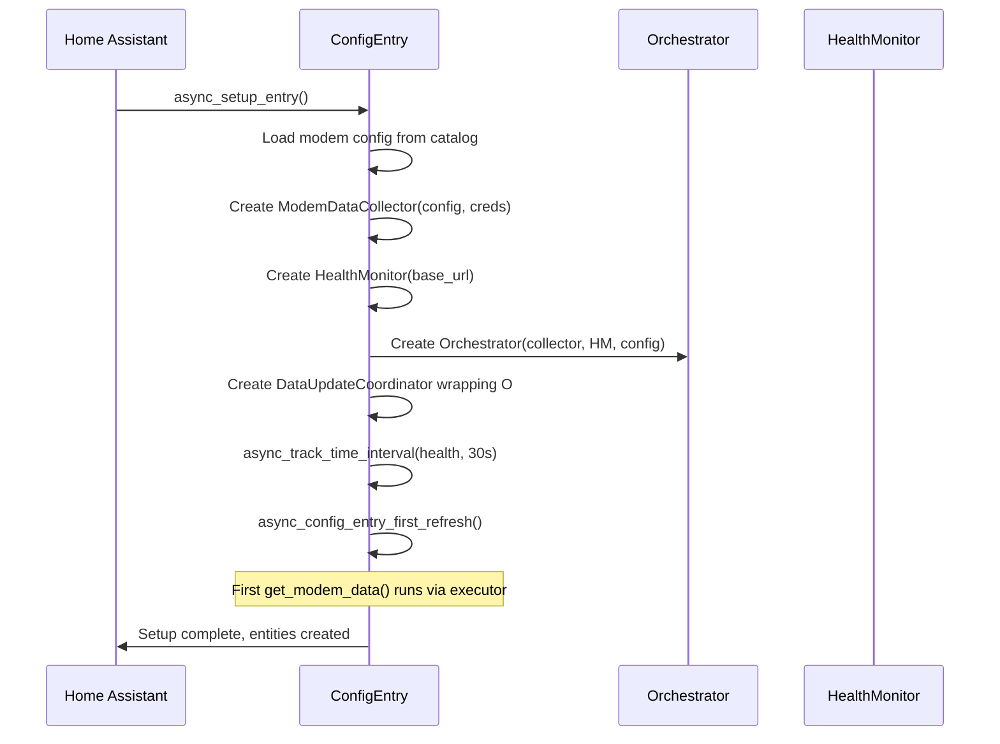
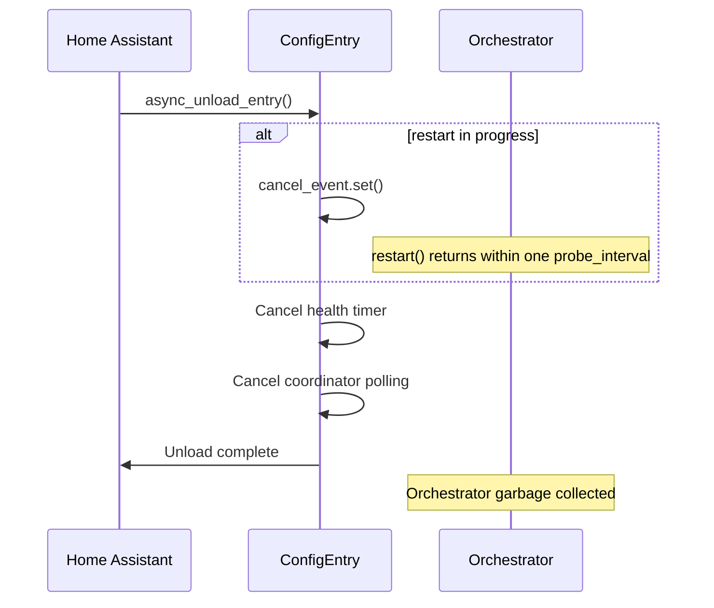
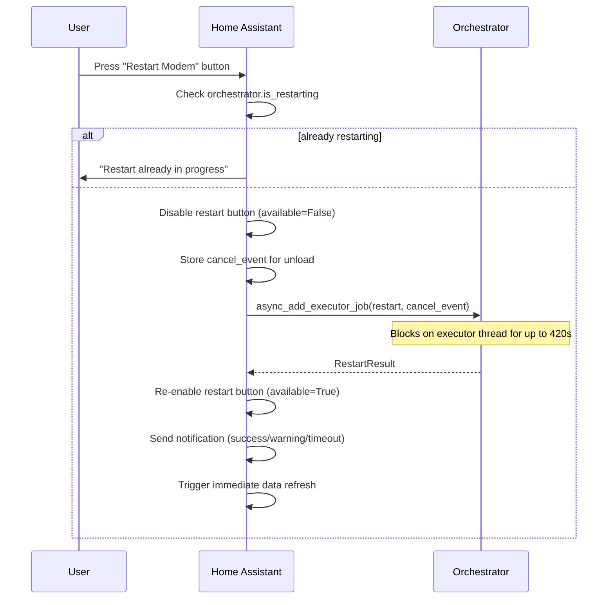
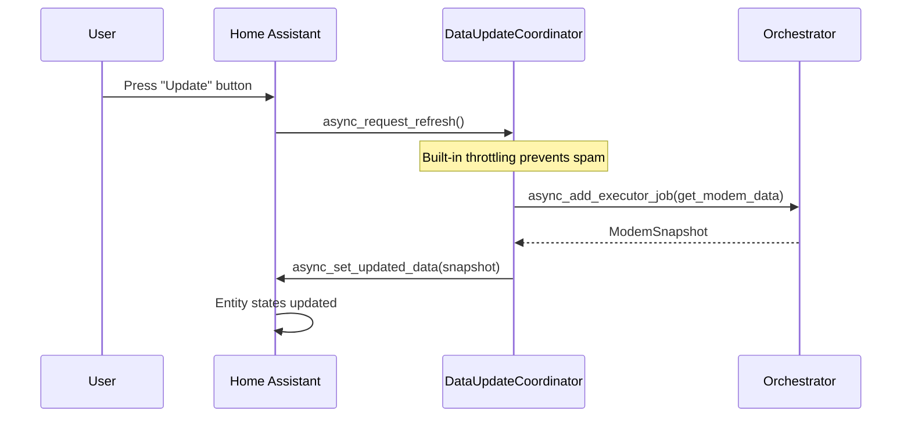

# Orchestration Use Cases

Scenario-driven specification for the orchestration layer. Each use case
documents preconditions, a step-by-step sequence, and assertions that
map directly to test cases. Grouped by concern area.

**Relationship to other specs:**
- `ORCHESTRATION_SPEC.md` — interface contracts (method signatures, types)
- `RUNTIME_POLLING_SPEC.md` — behavioral rules (signal policy, design rules)
- This spec — end-to-end scenarios (what happens when...)

**Conventions:**
- `UC-XX` IDs are stable — tests reference them for traceability
- "Consumer" means any caller (HA coordinator, CLI, exporter)
- Time values are illustrative, not prescriptive
- `→` means "results in"

---

## Normal Operations

### UC-01: First poll — fresh login

**Preconditions:** Orchestrator just created. No session. No prior state.

| Step | Action | State change | Observable |
|------|--------|-------------|------------|
| 1 | Consumer calls `get_modem_data()` | | |
| 2 | Circuit breaker check | closed (default) | |
| 3 | Backoff check | 0 (default) | |
| 4 | Collector: session invalid → authenticate | Session established | |
| 5 | Collector: load resources | | |
| 6 | Collector: parse → 24 DS, 4 US | | |
| 7 | Collector returns `ModemResult(success=True)` | | |
| 8 | Orchestrator: streak=0 (already 0) | | |
| 9 | Orchestrator: notify HM `update_from_collection()` | HM evidence=fresh | |
| 10 | Orchestrator: derive connection_status | | ONLINE |
| 11 | Orchestrator: derive docsis_status | | OPERATIONAL |
| 12 | Orchestrator: compute aggregates | | |
| 13 | Orchestrator: read HM.latest | | |
| 14 | Return `ModemSnapshot` | last_status=ONLINE | |

**Assertions:**
- `snapshot.connection_status == ONLINE`
- `snapshot.docsis_status == OPERATIONAL`
- `snapshot.modem_data` has 24 DS and 4 US channels
- `snapshot.collector_signal == OK`
- `orchestrator.status == ONLINE`
- `orchestrator.metrics().auth_failure_streak == 0`
- `orchestrator.metrics().session_is_valid == True`

---

### UC-02: Subsequent poll — session reuse

**Preconditions:** UC-01 completed. Session is valid.

| Step | Action | State change | Observable |
|------|--------|-------------|------------|
| 1 | Consumer calls `get_modem_data()` | | |
| 2 | Collector: session valid → skip auth | No new session | |
| 3 | Collector: load resources with existing session | | |
| 4 | Collector: parse → 24 DS, 4 US | | |
| 5 | Return `ModemSnapshot(ONLINE)` | | |

**Assertions:**
- No login attempt was made (verify via auth manager call count)
- `snapshot.connection_status == ONLINE`
- `metrics().session_is_valid == True`

---

### UC-03: On-demand refresh

**Preconditions:** Normal operation.

| Step | Action | State change | Observable |
|------|--------|-------------|------------|
| 1 | Consumer calls `get_modem_data()` (same method, no distinction) | | |
| 2 | Orchestrator runs full pipeline | | |
| 3 | Return `ModemSnapshot` | | |

**Assertions:**
- The orchestrator applies the same backoff and circuit breaker
  checks regardless of whether the call is scheduled or on-demand
- Consumer decides scheduling — orchestrator doesn't know or care
  why it was called

**Note:** On-demand vs scheduled is entirely a consumer concern. The
orchestrator has no concept of "scheduled" vs "manual." This is
intentional — backoff and lockout protection apply equally to both.

---

### UC-04: Zero channels with system_info — no signal

**Preconditions:** Modem is online but has no cable connection.

| Step | Action | State change | Observable |
|------|--------|-------------|------------|
| 1 | Consumer calls `get_modem_data()` | | |
| 2 | Collector: auth → load → parse | | |
| 3 | Parser returns 0 DS, 0 US, system_info={firmware: "1.0"} | | |
| 4 | Collector returns `ModemResult(success=True, signal=OK)` | | |
| 5 | Orchestrator: has_channels=False, system_info present | | |
| 6 | Derive connection_status=NO_SIGNAL | | |

**Assertions:**
- `snapshot.connection_status == NO_SIGNAL`
- `snapshot.modem_data` is present (not None)
- `snapshot.modem_data["downstream"] == []`
- `snapshot.collector_signal == OK` (zero channels is valid data, not a failure)
- Auth failure streak is NOT incremented

---

### UC-05: Zero channels without system_info — ambiguous

**Preconditions:** Parser doesn't extract system_info (or matched nothing).

| Step | Action | State change | Observable |
|------|--------|-------------|------------|
| 1 | Consumer calls `get_modem_data()` | | |
| 2 | Parser returns 0 DS, 0 US, system_info={} | | |
| 3 | Collector returns `ModemResult(success=True, signal=OK)` | | |
| 4 | Orchestrator: has_channels=False, system_info empty | | |
| 5 | Log WARNING: "Zero channels and no system_info..." | | |
| 6 | Derive connection_status=NO_SIGNAL | | |

**Assertions:**
- `snapshot.connection_status == NO_SIGNAL`
- WARNING log emitted suggesting parser verification
- Still returns success (not a failure, just ambiguous)

---

### UC-06: Single-session modem — logout after poll

**Preconditions:** modem.yaml declares `max_concurrent: 1` and
`actions.logout`. Modem allows only one authenticated session.

| Step | Action | State change | Observable |
|------|--------|-------------|------------|
| 1 | Consumer calls `get_modem_data()` | | |
| 2 | Collector: auth → load → parse → success | | |
| 3 | Collector: execute logout action | Session released | |
| 4 | Collector returns `ModemResult(success=True)` | | |

**Assertions:**
- Logout action was executed after successful parse
- Session is released (modem's web UI is accessible to user)
- `session_is_valid` may be False after logout (strategy-dependent)
- If logout fails, collection still succeeds (logout is best-effort)

---

### UC-07: DOCSIS status derivation

**Preconditions:** Various downstream channel lock_status combinations.

| DS lock_status values | US present | Expected docsis_status |
|-----------------------|-----------|----------------------|
| All `"locked"` | Yes | `OPERATIONAL` |
| All `"locked"` | No (0 US) | `PARTIAL_LOCK` |
| Some `"locked"`, some `"not_locked"` | Yes | `PARTIAL_LOCK` |
| None `"locked"` | Any | `NOT_LOCKED` |
| No DS channels | Any | `NOT_LOCKED` |
| `lock_status` field absent on channels | Any | `UNKNOWN` |

**Assertions:**
- Each row is a distinct test case
- UNKNOWN prevents false "Not Locked" for modems without lock_status data
- All-locked + no-upstream is PARTIAL_LOCK (upstream matters for OPERATIONAL)

---

## Auth Failures

### UC-10: Wrong credentials — single failure

**Preconditions:** Incorrect password configured.

| Step | Action | State change | Observable |
|------|--------|-------------|------------|
| 1 | Consumer calls `get_modem_data()` | | |
| 2 | Collector: auth fails → `AuthResult.FAILURE` | | |
| 3 | Collector returns `ModemResult(success=False, signal=AUTH_FAILED)` | | |
| 4 | Orchestrator: streak 0→1 | | |
| 5 | Orchestrator: threshold check (1 < 6) → circuit stays closed | | |
| 6 | Return `ModemSnapshot(AUTH_FAILED)` | | |

**Assertions:**
- `snapshot.connection_status == AUTH_FAILED`
- `metrics().auth_failure_streak == 1`
- `metrics().circuit_breaker_open == False`
- `snapshot.modem_data is None`

---

### UC-11: Transient auth failure — streak resets on success

**Preconditions:** One prior auth failure (streak=1).

| Step | Action | State change | Observable |
|------|--------|-------------|------------|
| 1 | Consumer calls `get_modem_data()` | | |
| 2 | Collector: auth succeeds → load → parse → OK | | |
| 3 | Orchestrator: streak 1→0 | streak reset | |
| 4 | Return `ModemSnapshot(ONLINE)` | | |

**Assertions:**
- `metrics().auth_failure_streak == 0`
- Streak resets on any successful collection, regardless of prior count
- Circuit breaker stays closed

---

### UC-12: Firmware lockout — AUTH_LOCKOUT with backoff

**Preconditions:** HNAP modem. Auth manager receives `LoginResult: "LOCKUP"`.

| Step | Action | State change | Observable |
|------|--------|-------------|------------|
| 1 | Consumer calls `get_modem_data()` | | |
| 2 | Collector: auth raises `LoginLockoutError` | | |
| 3 | Collector catches, returns `ModemResult(signal=AUTH_LOCKOUT)` | | |
| 4 | Orchestrator: streak incremented | streak++ | |
| 5 | Orchestrator: backoff=3 | backoff=3 | |
| 6 | Return `ModemSnapshot(AUTH_FAILED)` | | |

**Assertions:**
- `snapshot.connection_status == AUTH_FAILED`
- `metrics().auth_failure_streak` incremented
- Next 3 polls will be suppressed (see UC-13)
- WARNING log: "Auth lockout — firmware anti-brute-force triggered..."

---

### UC-13: Backoff expiry — polling resumes

**Preconditions:** UC-12 just occurred. backoff=3.

| Poll | Backoff before | Action | Backoff after |
|------|---------------|--------|--------------|
| N+1 | 3 | Decrement, skip collection, return AUTH_FAILED | 2 |
| N+2 | 2 | Decrement, skip collection, return AUTH_FAILED | 1 |
| N+3 | 1 | Decrement, skip collection, return AUTH_FAILED | 0 |
| N+4 | 0 | Run collection normally | 0 |

**Assertions:**
- Each backoff poll returns `ModemSnapshot(AUTH_FAILED)` without
  running the collector
- Backoff decrements by 1 per poll regardless of outcome
- At backoff=0, collection resumes
- INFO log each suppressed poll: "Backoff active (N remaining)..."

---

### UC-14: Circuit breaker trip — 6 consecutive failures

**Preconditions:** streak=5, one more auth failure will trip the breaker.

| Step | Action | State change | Observable |
|------|--------|-------------|------------|
| 1 | Consumer calls `get_modem_data()` | | |
| 2 | Collector: AUTH_FAILED or AUTH_LOCKOUT | | |
| 3 | Orchestrator: streak 5→6 | | |
| 4 | Orchestrator: 6 >= threshold → circuit OPEN | circuit=True | |
| 5 | Return `ModemSnapshot(AUTH_FAILED)` | | |

**Assertions:**
- `metrics().circuit_breaker_open == True`
- `metrics().auth_failure_streak == 6`
- ERROR log: "Auth circuit breaker OPEN — 6 consecutive auth failures..."

---

### UC-15: Circuit breaker blocks polling

**Preconditions:** Circuit breaker is open.

| Step | Action | State change | Observable |
|------|--------|-------------|------------|
| 1 | Consumer calls `get_modem_data()` | | |
| 2 | Orchestrator: circuit open → return immediately | No collection | |
| 3 | Return `ModemSnapshot(AUTH_FAILED)` | | |

**Assertions:**
- Collector.execute() was NOT called
- No HTTP traffic to the modem
- ERROR log: "Circuit breaker is OPEN — polling stopped..."
- `is_restarting == False` (circuit breaker is different from restart)

---

### UC-16: Credential reconfiguration — reset_auth()

**Preconditions:** Circuit breaker is open. User reconfigured credentials
via HA reauth flow.

| Step | Action | State change | Observable |
|------|--------|-------------|------------|
| 1 | Consumer calls `reset_auth()` | | |
| 2 | Orchestrator: streak=0 | streak reset | |
| 3 | Orchestrator: circuit=closed | circuit closed | |
| 4 | Orchestrator: backoff=0 | backoff cleared | |
| 5 | Orchestrator: collector.clear_session() | session cleared | |
| 6 | Consumer calls `get_modem_data()` | | |
| 7 | Collector: fresh login with new credentials | | |

**Assertions:**
- `metrics().auth_failure_streak == 0`
- `metrics().circuit_breaker_open == False`
- `metrics().session_is_valid == False` (after reset, before next poll)
- Next poll attempts fresh login (no stale session, no backoff, no circuit block)

---

### UC-17: LOAD_AUTH — 401 on data page

**Preconditions:** Auth appeared to succeed but data page returns 401/403.
Session may be stale, or strategy doesn't grant data access.

| Step | Action | State change | Observable |
|------|--------|-------------|------------|
| 1 | Consumer calls `get_modem_data()` | | |
| 2 | Collector: auth succeeds (or session reused) | | |
| 3 | Resource Loader: GET /status.html → HTTP 401 | | |
| 4 | Collector returns `ModemResult(signal=LOAD_AUTH)` | | |
| 5 | Orchestrator: streak++ | | |
| 6 | Orchestrator: collector.clear_session() | session cleared | |
| 7 | Return `ModemSnapshot(AUTH_FAILED)` | | |

**Assertions:**
- Session is cleared so next poll starts with fresh login
- Auth failure streak is incremented (LOAD_AUTH is auth-related)
- If persistent, will escalate to circuit breaker (same as wrong credentials)
- INFO log: "LOAD_AUTH — clearing session, reporting auth_failed..."

---

### UC-18: LOAD_AUTH — self-correcting stale session

**Preconditions:** UC-17 occurred (session cleared). Credentials are correct.

| Step | Action | State change | Observable |
|------|--------|-------------|------------|
| 1 | Consumer calls `get_modem_data()` | | |
| 2 | Collector: no session → fresh login → success | | |
| 3 | Collector: load → parse → OK | | |
| 4 | Orchestrator: streak→0 | streak reset | |
| 5 | Return `ModemSnapshot(ONLINE)` | | |

**Assertions:**
- Fresh login resolves the stale session
- Streak resets to 0
- Single LOAD_AUTH → fresh login → success is the expected self-healing path

---

### UC-19: Login page detection — auth redirect on data URL

**Preconditions:** Resource Loader fetches a data page. Modem returns
HTTP 200 but the body is a login page (auth redirect, session expired
silently). Without detection, this would reach the parser and cause
PARSE_ERROR.

| Step | Action | State change | Observable |
|------|--------|-------------|------------|
| 1 | Consumer calls `get_modem_data()` | | |
| 2 | Collector: auth succeeds (or session reused) | | |
| 3 | Resource Loader: GET /status.html → HTTP 200, body contains login form | | |
| 4 | Resource Loader: detects login page indicators | | |
| 5 | Collector returns `ModemResult(signal=LOAD_AUTH)` | | |
| 6 | Orchestrator: clear session, streak++ | | |

**Assertions:**
- Signal is LOAD_AUTH (not PARSE_ERROR) — correct root cause classification
- Login page detection checks for `<input type="password">` or similar
- Session is cleared for fresh login on next poll
- WARNING log: "Data page /status.html appears to be a login page"

---

### UC-20: Password changed after months of success

**Preconditions:** Modem working for months. User changes password on
modem's web UI. Session is still valid in memory.

| Poll | What happens | Streak | Status |
|------|-------------|--------|--------|
| N | Session valid → reuse → load → parse → OK | 0 | ONLINE |
| ... | (months of normal operation) | 0 | ONLINE |
| N+K | Session expires → re-auth → wrong password | 1 | AUTH_FAILED |
| N+K+1 | AUTH_FAILED | 2 | AUTH_FAILED |
| N+K+2 | LOCKUP → AUTH_LOCKOUT, backoff=3 | 3 | AUTH_FAILED |
| N+K+3 | Backoff (2 remaining) | 3 | AUTH_FAILED |
| N+K+4 | Backoff (1 remaining) | 3 | AUTH_FAILED |
| N+K+5 | Backoff (0 remaining) | 3 | AUTH_FAILED |
| N+K+6 | AUTH_FAILED | 4 | AUTH_FAILED |
| N+K+7 | AUTH_FAILED | 5 | AUTH_FAILED |
| N+K+8 | AUTH_LOCKOUT, streak=6 → circuit OPEN | 6 | AUTH_FAILED |
| N+K+9+ | Circuit open, no collection | 6 | AUTH_FAILED |

**Assertions:**
- Session reuse delays the failure until the session naturally expires
- Circuit breaker trips after ~2 lockout cycles (threshold 6)
- User sees escalating log messages with streak count (1/6, 2/6, ... 6/6)
- ERROR log at circuit trip is actionable: "Reconfigure credentials to resume"
- After reset_auth() with correct password → back to normal (UC-16)

---

## Connectivity Failures

### UC-30: Connection refused — modem offline

**Preconditions:** Modem is powered off or unreachable.

| Step | Action | State change | Observable |
|------|--------|-------------|------------|
| 1 | Consumer calls `get_modem_data()` | | |
| 2 | Collector: auth → ConnectionError | | |
| 3 | Collector returns `ModemResult(signal=CONNECTIVITY)` | | |
| 4 | Orchestrator: no backoff, no streak change | | |
| 5 | Return `ModemSnapshot(UNREACHABLE)` | | |

**Assertions:**
- `snapshot.connection_status == UNREACHABLE`
- Auth failure streak is NOT incremented (connectivity is not auth)
- No backoff applied (connectivity failures aren't the modem's fault)
- Next poll runs at normal cadence

---

### UC-31: HTTP timeout — slow modem

**Preconditions:** Modem responds slowly, exceeds per-request timeout.

| Step | Action | State change | Observable |
|------|--------|-------------|------------|
| 1 | Consumer calls `get_modem_data()` | | |
| 2 | Collector: auth or load → Timeout | | |
| 3 | Collector returns `ModemResult(signal=CONNECTIVITY)` | | |
| 4 | Return `ModemSnapshot(UNREACHABLE)` | | |

**Assertions:**
- Same policy as connection refused — no backoff, no streak
- Modem's per-request timeout from modem.yaml applies

---

### UC-32: HTTP 5xx on data page

**Preconditions:** Modem's web server returns 500/502/503.

| Step | Action | State change | Observable |
|------|--------|-------------|------------|
| 1 | Consumer calls `get_modem_data()` | | |
| 2 | Collector: auth OK → load /status.html → HTTP 500 | | |
| 3 | Collector returns `ModemResult(signal=LOAD_ERROR)` | | |
| 4 | Return `ModemSnapshot(UNREACHABLE)` | | |

**Assertions:**
- `snapshot.connection_status == UNREACHABLE`
- Auth failure streak NOT incremented (server error, not auth)
- All-or-nothing: if any page returns 5xx, entire poll fails

---

### UC-33: Parser error — malformed response

**Preconditions:** Modem returns unexpected HTML/data format.

| Step | Action | State change | Observable |
|------|--------|-------------|------------|
| 1 | Consumer calls `get_modem_data()` | | |
| 2 | Collector: auth OK → load OK → parse raises exception | | |
| 3 | Collector catches, returns `ModemResult(signal=PARSE_ERROR)` | | |
| 4 | Return `ModemSnapshot(PARSER_ISSUE)` | | |

**Assertions:**
- `snapshot.connection_status == PARSER_ISSUE`
- Distinct from UNREACHABLE — the modem responded, but data is unparseable
- Auth streak NOT incremented
- ERROR log with parser exception details

---

### UC-34: Status transition — unreachable to online

**Preconditions:** Last poll returned UNREACHABLE (modem was offline).
Modem has come back online.

| Step | Action | State change | Observable |
|------|--------|-------------|------------|
| 1 | Consumer calls `get_modem_data()` | | |
| 2 | Collector: session may be stale from before outage | | |
| 3a | If modem rejects stale session → LOAD_AUTH → clear session | | |
| 3b | If modem accepts (IP-based or ignores stale cookies) → success | | |
| 4 | Orchestrator: detects UNREACHABLE → ONLINE transition | last_status=ONLINE | |
| 5 | Log INFO with session_valid state for diagnostics | | |

**Assertions:**
- Transition is logged: "Status transition: unreachable → online (session_valid: X)"
- If stale session rejected (3a): next poll does fresh login, self-corrects (UC-18)
- No proactive session clear — LOAD_AUTH handles it naturally

---

### UC-35: All-or-nothing page loading

**Preconditions:** Modem has 3 data pages. Second page fails.

| Step | Action | State change | Observable |
|------|--------|-------------|------------|
| 1 | Consumer calls `get_modem_data()` | | |
| 2 | Collector: auth OK | | |
| 3 | Resource Loader: GET /page1.html → 200 OK | | |
| 4 | Resource Loader: GET /page2.html → timeout | | |
| 5 | Resource Loader: aborts (does NOT fetch page 3) | | |
| 6 | Collector returns `ModemResult(signal=CONNECTIVITY)` | | |

**Assertions:**
- Partial data is never returned — if any page fails, entire poll fails
- Log identifies which page failed, error type, HTTP status
- Previous ModemSnapshot persists on consumer's sensors until next success

---

## Restart

### UC-40: Planned restart — full two-phase recovery

**Preconditions:** modem.yaml declares `actions.restart`. Modem is online.

| Step | Action | State change | Observable |
|------|--------|-------------|------------|
| 1 | Consumer calls `restart()` | is_restarting=True | |
| 2 | Orchestrator: authenticate (fresh session) | | |
| 3 | Orchestrator: execute restart action | | |
| 4 | Connection drop during request = success | | |
| 5 | Orchestrator: clear_session() | session cleared | |
| 6 | Create RestartMonitor, call monitor_recovery() | | |
| 7 | RM: clear HM collection evidence | evidence cleared | |
| 8 | Phase 1: probe every 10s until modem responds | | |
| 9 | Modem responds at ~90s | | |
| 10 | Phase 2: poll for channel stabilization | | |
| 11 | 3 consecutive stable counts + 30s grace | | |
| 12 | Return `RestartResult(success=True, COMPLETE, 150s)` | is_restarting=False | |

**Assertions:**
- `result.success == True`
- `result.phase_reached == COMPLETE`
- `result.elapsed_seconds > 0`
- `orchestrator.is_restarting == False` after return
- Session was cleared (old pre-restart session is dead)
- HM collection evidence was cleared at start

---

### UC-41: Restart cancel — clean shutdown

**Preconditions:** Restart in progress (phase 1). Consumer needs to stop.

| Step | Action | State change | Observable |
|------|--------|-------------|------------|
| 1 | Consumer calls `restart(cancel_event)` | is_restarting=True | |
| 2 | Phase 1: probing for response | | |
| 3 | Consumer sets `cancel_event` (e.g., HA unloading) | | |
| 4 | RM: cancel_event.wait(probe_interval) returns immediately | | |
| 5 | RM: cancel_event.is_set() → exit loop | | |
| 6 | Return `RestartResult(success=False, WAITING_RESPONSE, 45s)` | is_restarting=False | |

**Assertions:**
- `result.success == False`
- `result.phase_reached == WAITING_RESPONSE` (or wherever cancel was detected)
- Return happens within one probe_interval of cancel being set
- `is_restarting == False` after return (cleanup happens regardless)

---

### UC-42: Restart during restart — rejected

**Preconditions:** Restart already in progress.

| Step | Action | State change | Observable |
|------|--------|-------------|------------|
| 1 | Consumer calls `restart()` | | |
| 2 | Orchestrator: is_restarting=True → reject | No state change | |
| 3 | Return `RestartResult(success=False, error="...")` | | |

**Assertions:**
- No second restart command sent to modem
- `result.success == False`
- `result.error` indicates restart already in progress
- Original restart continues unaffected

---

### UC-43: Poll during restart — short-circuit

**Preconditions:** Restart in progress.

| Step | Action | State change | Observable |
|------|--------|-------------|------------|
| 1 | Consumer calls `get_modem_data()` | | |
| 2 | Orchestrator: is_restarting=True → return early | No collection | |
| 3 | Return `ModemSnapshot(UNREACHABLE)` | | |

**Assertions:**
- Collector.execute() NOT called (no HTTP traffic to rebooting modem)
- Auth failure streak NOT incremented
- No backoff applied
- `snapshot.connection_status == UNREACHABLE` (accurate — modem is rebooting)

---

### UC-44: Restart not supported

**Preconditions:** modem.yaml does not declare `actions.restart`.

| Step | Action | State change | Observable |
|------|--------|-------------|------------|
| 1 | Consumer calls `restart()` | | |
| 2 | Orchestrator: no restart action → raise | | |

**Assertions:**
- `RestartNotSupportedError` raised
- `is_restarting` never set to True
- HA adapter should prevent this by checking config before showing button

---

### UC-45: Restart bypasses circuit breaker

**Preconditions:** Circuit breaker is open (persistent auth failures).
User presses restart button.

| Step | Action | State change | Observable |
|------|--------|-------------|------------|
| 1 | Consumer calls `restart()` | | |
| 2 | Orchestrator: does NOT check circuit breaker | | |
| 3 | Orchestrator: authenticates with fresh session | | |
| 4 | If auth succeeds: restart proceeds normally | | |
| 5 | If auth fails: restart fails with clear error | | |

**Assertions:**
- Circuit breaker is not consulted during restart
- Restart uses its own fresh auth session
- Auth failure during restart does NOT increment the orchestrator's streak
- Restart is a user-initiated action — circuit breaker protects automated polling only

---

### UC-46: Restart — phase 1 timeout

**Preconditions:** Restart command sent. Modem never comes back
(hardware failure, power still out).

| Step | Action | State change | Observable |
|------|--------|-------------|------------|
| 1 | Phase 1: probe every 10s for response_timeout (120s default) | | |
| 2 | All probes fail (connection refused / timeout) | | |
| 3 | response_timeout exceeded | | |
| 4 | Return `RestartResult(success=False, WAITING_RESPONSE, 120s)` | is_restarting=False | |

**Assertions:**
- `result.success == False`
- `result.phase_reached == WAITING_RESPONSE`
- Total time ~= response_timeout
- WARNING log: "Restart recovery: response timeout..."

---

### UC-47: Restart — phase 2 timeout

**Preconditions:** Modem responded (phase 1 passed). Channels never
stabilize (keep changing, DOCSIS registration never completes).

| Step | Action | State change | Observable |
|------|--------|-------------|------------|
| 1 | Phase 2: poll every 10s for channel_stabilization_timeout (300s) | | |
| 2 | Channel counts keep changing (8 DS → 16 DS → 20 DS → 18 DS...) | | |
| 3 | Never get 3 consecutive stable counts | | |
| 4 | channel_stabilization_timeout exceeded | | |
| 5 | Return `RestartResult(success=False, CHANNEL_SYNC, 420s)` | is_restarting=False | |

**Assertions:**
- `result.phase_reached == CHANNEL_SYNC` (not WAITING_RESPONSE)
- Total time ~= response_timeout + channel_stabilization_timeout
- WARNING log: "Channel stabilization timeout..."

---

### UC-48: Restart — skip phase 2

**Preconditions:** Fragile modem (e.g., S33v2). Consumer configured
`channel_stabilization_timeout=0` to minimize post-restart probing.

| Step | Action | State change | Observable |
|------|--------|-------------|------------|
| 1 | Phase 1: modem responds at 90s | | |
| 2 | Phase 2: skipped (timeout=0) | | |
| 3 | Return `RestartResult(success=True, COMPLETE, 90s)` | | |

**Assertions:**
- No channel stabilization polling occurs
- Result is COMPLETE immediately after response detection
- Total time ~= time until first response

---

### UC-49: Unplanned restart detection

**Preconditions:** Modem was restarted externally (ISP, power outage).
No restart command sent. Normal polling discovers the outage.

| Poll | What happens | Status |
|------|-------------|--------|
| N | Normal poll → ONLINE | ONLINE |
| N+1 | ConnectionError → CONNECTIVITY | UNREACHABLE |
| N+2 | ConnectionError → CONNECTIVITY | UNREACHABLE |
| N+3 | Modem back, stale session → LOAD_AUTH → clear session | AUTH_FAILED |
| N+4 | Fresh login → success | ONLINE |

**Assertions:**
- No RestartMonitor involved — normal polling handles recovery
- UNREACHABLE → ONLINE transition logged with session_valid state
- Stale session self-corrects via LOAD_AUTH → clear → fresh login
- No backoff on CONNECTIVITY (polls at normal cadence during outage)
- Health checks (if running) detect the outage faster than data polls

**Alternative path (IP-based session):**

| Poll | What happens | Status |
|------|-------------|--------|
| N+3 | Modem back, accepts stale cookies (or IP-based) → success | ONLINE |

No LOAD_AUTH step needed. Both paths are valid.

---

## Health

### UC-50: Normal health check — both probes

**Preconditions:** Both ICMP and HTTP HEAD enabled.

| Step | Action | Observable |
|------|--------|------------|
| 1 | Consumer calls `ping()` | |
| 2 | HM: ICMP ping → success (4ms) | |
| 3 | HM: HTTP HEAD → success (12ms) | |
| 4 | HM: derive status → RESPONSIVE | |
| 5 | HM: store as .latest | |
| 6 | Return `HealthInfo(RESPONSIVE, icmp_latency_ms=4, http_latency_ms=12)` | |

**Assertions:**
- Both probes run regardless of each other's result
- Order: ICMP first (lightest), then HTTP HEAD
- INFO log: "Health check: responsive (icmp 4ms, HTTP 12ms)"

---

### UC-51: Collection evidence suppression

**Preconditions:** Successful data collection just occurred.
`update_from_collection(timestamp)` was called.

| Step | Action | Observable |
|------|--------|------------|
| 1 | Consumer calls `ping()` | |
| 2 | HM: collection evidence is fresh (within poll_interval) | |
| 3 | HM: skip HTTP HEAD (evidence proves responsiveness) | |
| 4 | HM: run ICMP only | |
| 5 | Return `HealthInfo(RESPONSIVE, icmp_latency_ms=Xms, http_latency_ms=None)` | |

**Assertions:**
- HTTP HEAD probe NOT executed (saves a request to the modem)
- `http_latency_ms is None` (no probe-specific measurement)
- `health_status` is RESPONSIVE because evidence is fresh
- ICMP still runs independently (different network layer)
- Critical for fragile modems where every HTTP request carries risk

---

### UC-52: Evidence expiry — HTTP resumes

**Preconditions:** Collection evidence older than poll_interval.
Collector missed a cycle (or hasn't run yet).

| Step | Action | Observable |
|------|--------|------------|
| 1 | Consumer calls `ping()` | |
| 2 | HM: evidence is stale (> poll_interval since last collection) | |
| 3 | HM: run both ICMP and HTTP HEAD | |
| 4 | Return `HealthInfo(...)` | |

**Assertions:**
- HTTP HEAD probe runs (evidence expired, can't assume responsiveness)
- poll_interval is the staleness threshold

---

### UC-53: Outage detection between data polls

**Preconditions:** Health cadence = 30s, data cadence = 10m.
Modem goes down 2 minutes after last data poll.

| Time | Event | Health status | Data status |
|------|-------|-------------|-------------|
| 0:00 | Data poll → ONLINE | | ONLINE |
| 0:30 | Health check → responsive | RESPONSIVE | ONLINE |
| 1:00 | Health check → responsive | RESPONSIVE | ONLINE |
| 2:00 | Modem goes offline | | |
| 2:30 | Health check → unresponsive | UNRESPONSIVE | ONLINE |
| 3:00 | Health check → unresponsive | UNRESPONSIVE | ONLINE |
| 10:00 | Data poll → UNREACHABLE | UNRESPONSIVE | UNREACHABLE |

**Assertions:**
- Health detects the outage at 2:30 (7.5 minutes before data poll)
- Consumer updates health sensors immediately on health callback
- Data status remains ONLINE until next data poll (stale but not wrong — it was
  the last known data state)
- This is the primary value of independent health cadence

---

### UC-54: ICMP blocked network

**Preconditions:** Network blocks ICMP. `supports_icmp=True` (not
yet known to be blocked).

| Step | Action | Observable |
|------|--------|------------|
| 1 | Consumer calls `ping()` | |
| 2 | HM: ICMP → fail (blocked) | |
| 3 | HM: HTTP HEAD → success | |
| 4 | Return `HealthInfo(ICMP_BLOCKED)` | |

**Assertions:**
- `health_status == ICMP_BLOCKED`
- Modem IS responsive (HTTP works) — ICMP failure is network, not modem
- Consumer may choose to disable ICMP after seeing persistent ICMP_BLOCKED

---

### UC-55: Degraded — HTTP fails, ping succeeds

**Preconditions:** Modem's web server is hung but network stack responds.

| Step | Action | Observable |
|------|--------|------------|
| 1 | Consumer calls `ping()` | |
| 2 | HM: ICMP → success | |
| 3 | HM: HTTP HEAD → timeout | |
| 4 | Return `HealthInfo(DEGRADED)` | |

**Assertions:**
- `health_status == DEGRADED`
- Modem is network-reachable but web UI is unresponsive
- WARNING log: "Health check: degraded (ping OK, HTTP timeout)"

---

### UC-56: Both probes disabled

**Preconditions:** `supports_icmp=False`, `supports_head=False`.

| Step | Action | Observable |
|------|--------|------------|
| 1 | Consumer calls `ping()` | |
| 2 | HM: no probes to run | |
| 3 | Return `HealthInfo(UNKNOWN)` | |

**Assertions:**
- `health_status == UNKNOWN`
- No network traffic generated
- Consumer should not schedule health checks if no probes are enabled

---

### UC-57: Health during restart — independent

**Preconditions:** Restart in progress. Health thread/timer continues.

| Time | Health check | Restart monitor |
|------|-------------|----------------|
| 0:00 | | Restart command sent |
| 0:10 | | Phase 1 probe #1 (fail) |
| 0:15 | ping() → unresponsive | |
| 0:20 | | Phase 1 probe #2 (fail) |
| 0:30 | | Phase 1 probe #3 (success!) |
| 0:45 | ping() → responsive | |

**Assertions:**
- Health checks continue independently during restart
- Health thread and RestartMonitor may both call ping() — this is fine
  (stateless probes, atomic `_latest` update under GIL)
- Health sensors update in real-time during restart recovery
- No coordination needed between health timer and restart monitor

---

## Metrics

### UC-60: Metrics snapshot

**Preconditions:** Several polls have run.

| Step | Action | Observable |
|------|--------|------------|
| 1 | Consumer calls `metrics()` | |
| 2 | Return `OrchestratorMetrics(...)` | |

**Assertions:**
- `poll_duration` — wall-clock time of last get_modem_data() call (None if never polled)
- `auth_failure_streak` — current streak (0 if healthy)
- `circuit_breaker_open` — bool
- `session_is_valid` — current session state from collector
- `resource_fetches` — per-resource timing (path, duration_ms, size_bytes) from last collection
- `last_poll_timestamp` — monotonic time of last poll (None if never polled)
- Metrics are a read-only snapshot — calling metrics() has no side effects
- Metrics are available even when circuit breaker is open

---

## Lifecycle

### UC-70: HA integration setup

**Assertions:**
- All Core components created during setup
- First poll runs before entities are created (HA requirement)
- Health timer starts after setup
- No threads spawned by Core — HA manages all scheduling

---

### UC-71: HA integration unload

**Assertions:**
- If restart is running, cancel_event stops it promptly
- No threads to join (HA manages scheduling)
- All timers cancelled
- Orchestrator and components garbage collected normally

---

### UC-72: HA restart button press

**Assertions:**
- Button disabled while restart is running
- Restart runs on executor thread (doesn't block HA's event loop)
- cancel_event stored so unload can interrupt if needed
- Notification sent with result details
- Immediate data refresh after restart to get fresh readings

---

### UC-73: HA refresh button press

**Assertions:**
- Uses HA's built-in DataUpdateCoordinator refresh (already throttled)
- No custom deduplication needed — HA handles it
- Same get_modem_data() call as scheduled polls (same backoff/circuit checks)
