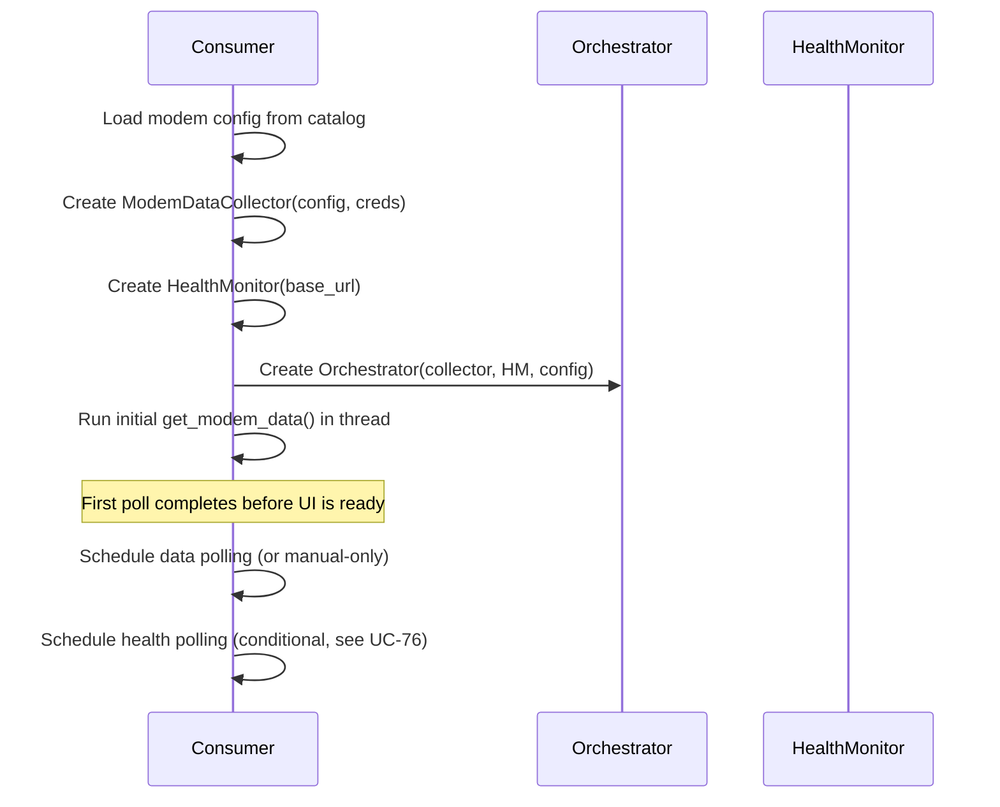
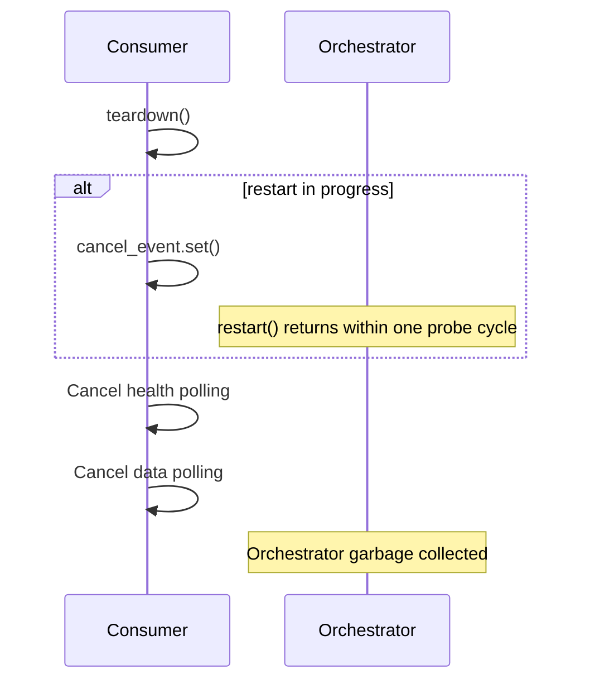
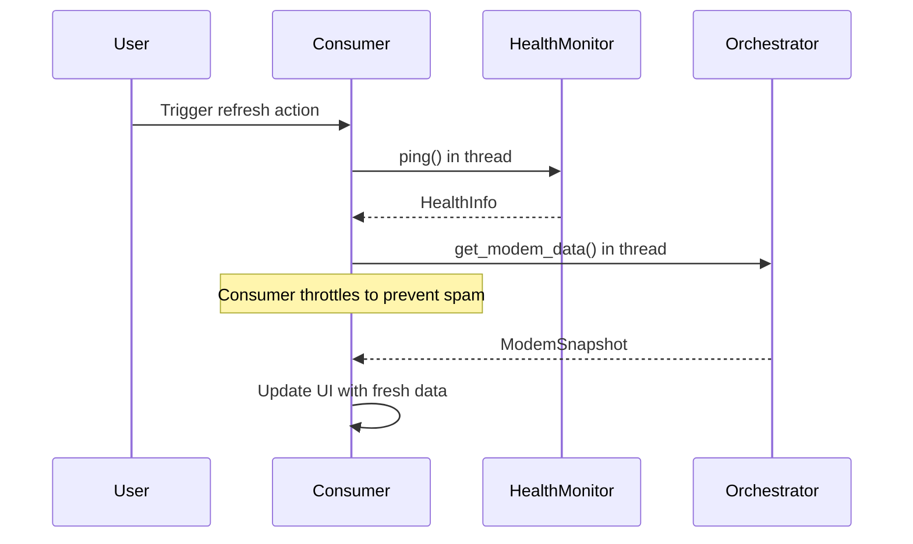
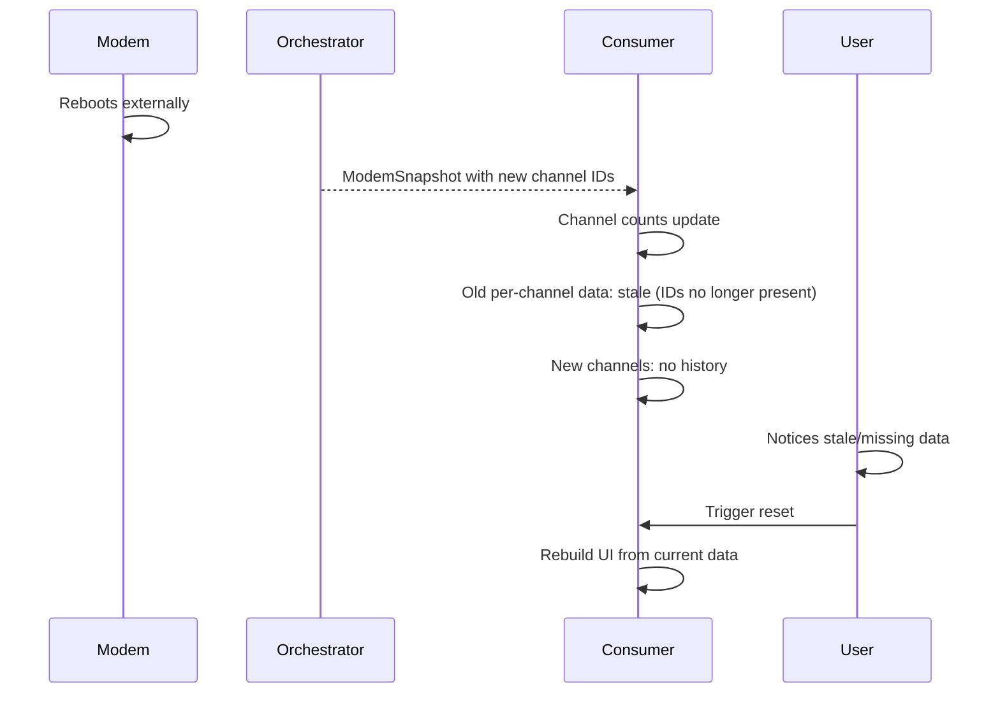
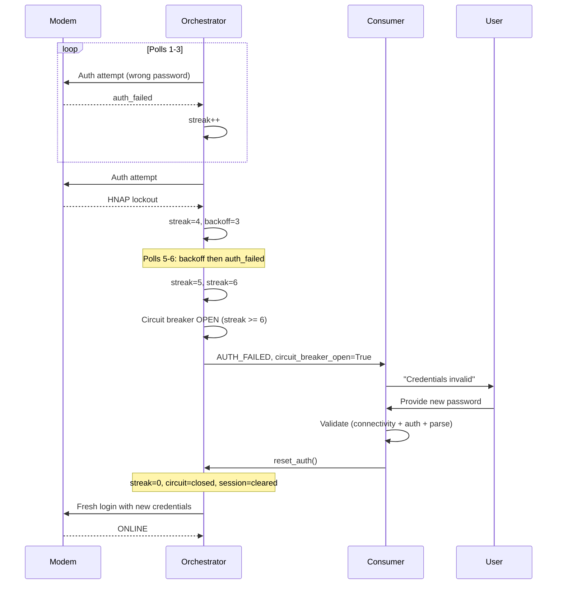
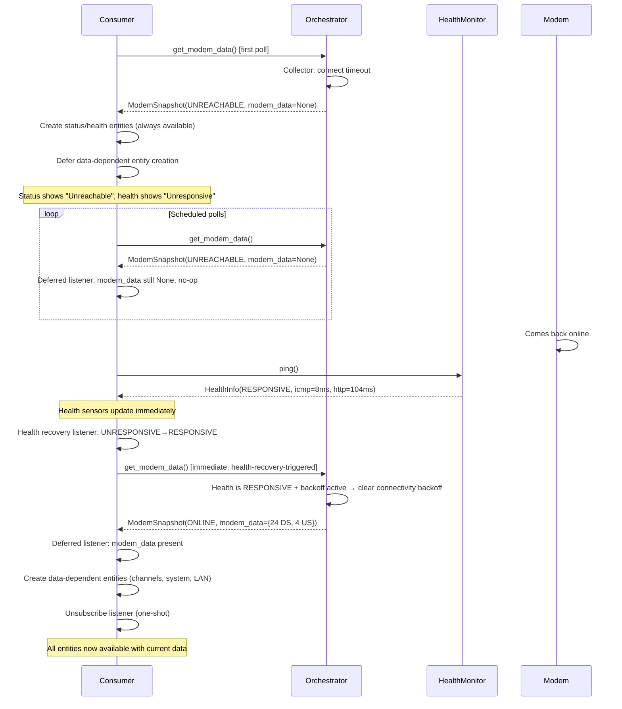

# Orchestration Use Cases

Scenario-driven specification for the orchestration layer. Each use case
documents preconditions, a step-by-step sequence, and assertions that
map directly to test cases. Grouped by concern area.

**Relationship to other specs:**

- `ORCHESTRATION_SPEC.md` — interface contracts (method signatures, types)
- `RUNTIME_POLLING_SPEC.md` — behavioral rules (signal policy, design rules)
- This spec — end-to-end scenarios (what happens when...)

**Conventions:**

- `UC-XX` IDs are stable — tests reference them for traceability
- "Consumer" means any caller (HA coordinator, CLI, exporter)
- Time values are illustrative, not prescriptive
- `→` means "results in"

---

## Normal Operations

### UC-01: First poll — fresh login

**Preconditions:** Orchestrator just created. No session. No prior state.

| Step | Action | State change | Observable |
|------|--------|-------------|------------|
| 1 | Consumer calls `get_modem_data()` | | |
| 2 | Circuit breaker check | closed (default) | |
| 3 | Backoff check | 0 (default) | |
| 4 | Collector: session invalid → authenticate | Session established | |
| 5 | Collector: load resources | | |
| 6 | Collector: parse → 24 DS, 4 US | | |
| 7 | Collector returns `ModemResult(success=True)` | | |
| 8 | Orchestrator: streak=0 (already 0) | | |
| 9 | Orchestrator: derive connection_status | | ONLINE |
| 10 | Orchestrator: derive docsis_status | | OPERATIONAL |
| 11 | Orchestrator: read HM.latest | | |
| 12 | Return `ModemSnapshot` | last_status=ONLINE | |

**Assertions:**

- `snapshot.connection_status == ONLINE`
- `snapshot.docsis_status == OPERATIONAL`
- `snapshot.modem_data` has 24 DS and 4 US channels
- `snapshot.collector_signal == OK`
- `orchestrator.status == ONLINE`
- `orchestrator.diagnostics().auth_failure_streak == 0`
- `orchestrator.diagnostics().session_is_valid == True`

---

### UC-02: Subsequent poll — session reuse

**Preconditions:** UC-01 completed. Session is valid.

| Step | Action | State change | Observable |
|------|--------|-------------|------------|
| 1 | Consumer calls `get_modem_data()` | | |
| 2 | Collector: session valid → skip auth | No new session | |
| 3 | Collector: load resources with existing session | | |
| 4 | Collector: parse → 24 DS, 4 US | | |
| 5 | Return `ModemSnapshot(ONLINE)` | | |

**Assertions:**

- No login attempt was made (verify via auth manager call count)
- `snapshot.connection_status == ONLINE`
- `diagnostics().session_is_valid == True`

---

### UC-03: On-demand refresh

**Preconditions:** Normal operation.

| Step | Action | State change | Observable |
|------|--------|-------------|------------|
| 1 | Consumer calls `get_modem_data()` (same method, no distinction) | | |
| 2 | Orchestrator runs full pipeline | | |
| 3 | Return `ModemSnapshot` | | |

**Assertions:**

- The orchestrator applies the same backoff and circuit breaker
  checks regardless of whether the call is scheduled or on-demand
- Consumer decides scheduling — orchestrator doesn't know or care
  why it was called

**Note:** On-demand vs scheduled is entirely a consumer concern. The
orchestrator has no concept of "scheduled" vs "manual." This is
intentional — backoff and lockout protection apply equally to both.

---

### UC-04: Zero channels with system_info — no signal

**Preconditions:** Modem is online but has no cable connection.

| Step | Action | State change | Observable |
|------|--------|-------------|------------|
| 1 | Consumer calls `get_modem_data()` | | |
| 2 | Collector: auth → load → parse | | |
| 3 | Parser returns 0 DS, 0 US, system_info={firmware: "1.0"} | | |
| 4 | Collector returns `ModemResult(success=True, signal=OK)` | | |
| 5 | Orchestrator: has_channels=False, system_info present | | |
| 6 | Derive connection_status=NO_SIGNAL | | |

**Assertions:**

- `snapshot.connection_status == NO_SIGNAL`
- `snapshot.modem_data` is present (not None)
- `snapshot.modem_data["downstream"] == []`
- `snapshot.collector_signal == OK` (zero channels is valid data, not a failure)
- Auth failure streak is NOT incremented

---

### UC-05: Zero channels without system_info — ambiguous

**Preconditions:** Parser doesn't extract system_info (or matched nothing).

| Step | Action | State change | Observable |
|------|--------|-------------|------------|
| 1 | Consumer calls `get_modem_data()` | | |
| 2 | Parser returns 0 DS, 0 US, system_info={} | | |
| 3 | Collector returns `ModemResult(success=True, signal=OK)` | | |
| 4 | Orchestrator: has_channels=False, system_info empty | | |
| 5 | Log WARNING: "Zero channels and no system_info..." | | |
| 6 | Derive connection_status=NO_SIGNAL | | |

**Assertions:**

- `snapshot.connection_status == NO_SIGNAL`
- WARNING log emitted suggesting parser verification
- Still returns success (not a failure, just ambiguous)

---

### UC-06: Single-session modem — logout after poll

**Preconditions:** modem.yaml declares `max_concurrent: 1` and
`actions.logout`. Modem allows only one authenticated session.

| Step | Action | State change | Observable |
|------|--------|-------------|------------|
| 1 | Consumer calls `get_modem_data()` | | |
| 2 | Collector: auth → load → parse → success | | |
| 3 | Collector: execute logout action | Session released | |
| 4 | Collector returns `ModemResult(success=True)` | | |

**Assertions:**

- Logout action was executed after successful parse
- Session is released (modem's web UI is accessible to user)
- `session_is_valid` may be False after logout (strategy-dependent)
- If logout fails, collection still succeeds (logout is best-effort)

---

### UC-07: DOCSIS status derivation

**Preconditions:** Various downstream channel lock_status combinations.

| DS lock_status values | US present | Expected docsis_status |
|-----------------------|-----------|----------------------|
| All `"locked"` | Yes | `OPERATIONAL` |
| All `"locked"` | No (0 US) | `PARTIAL_LOCK` |
| Some `"locked"`, some `"not_locked"` | Yes | `PARTIAL_LOCK` |
| None `"locked"` | Any | `NOT_LOCKED` |
| No DS channels | Any | `NOT_LOCKED` |
| `lock_status` field absent on channels | Any | `UNKNOWN` |

**Assertions:**

- Each row is a distinct test case
- UNKNOWN prevents false "Not Locked" for modems without lock_status data
- All-locked + no-upstream is PARTIAL_LOCK (upstream matters for OPERATIONAL)

---

## Auth Failures

### UC-10: Wrong credentials — single failure

**Preconditions:** Incorrect password configured.

| Step | Action | State change | Observable |
|------|--------|-------------|------------|
| 1 | Consumer calls `get_modem_data()` | | |
| 2 | Collector: auth fails → `AuthResult.FAILURE` | | |
| 3 | Collector returns `ModemResult(success=False, signal=AUTH_FAILED)` | | |
| 4 | Orchestrator: streak 0→1 | | |
| 5 | Orchestrator: threshold check (1 < 6) → circuit stays closed | | |
| 6 | Return `ModemSnapshot(AUTH_FAILED)` | | |

**Assertions:**

- `snapshot.connection_status == AUTH_FAILED`
- `diagnostics().auth_failure_streak == 1`
- `diagnostics().circuit_breaker_open == False`
- `snapshot.modem_data is None`

---

### UC-11: Transient auth failure — streak resets on success

**Preconditions:** One prior auth failure (streak=1).

| Step | Action | State change | Observable |
|------|--------|-------------|------------|
| 1 | Consumer calls `get_modem_data()` | | |
| 2 | Collector: auth succeeds → load → parse → OK | | |
| 3 | Orchestrator: streak 1→0 | streak reset | |
| 4 | Return `ModemSnapshot(ONLINE)` | | |

**Assertions:**

- `diagnostics().auth_failure_streak == 0`
- Streak resets on any successful collection, regardless of prior count
- Circuit breaker stays closed

---

### UC-12: Firmware lockout — AUTH_LOCKOUT trips circuit

**Preconditions:** HNAP modem. Auth manager receives `LoginResult: "LOCKUP"`.

| Step | Action | State change | Observable |
|------|--------|-------------|------------|
| 1 | Consumer calls `get_modem_data()` | | |
| 2 | Collector: auth raises `LoginLockoutError` | | |
| 3 | Collector catches, returns `ModemResult(signal=AUTH_LOCKOUT)` | | |
| 4 | Orchestrator: streak incremented, circuit trips | circuit=True | |
| 5 | Return `ModemSnapshot(AUTH_FAILED)` | | |

**Assertions:**

- `snapshot.connection_status == AUTH_FAILED`
- `diagnostics().circuit_breaker_open == True`
- No further login attempts — polling blocked until reset_auth()
- WARNING log: "Auth lockout — firmware anti-brute-force triggered,
  stopping immediately"

---

### UC-13: LOAD_AUTH backoff — session issues self-correct

**Preconditions:** Data page returned 401/403. Session issue, not
credential rejection. LOAD_AUTH uses the threshold-based circuit
breaker (default: 6) because session issues typically self-correct
after session refresh (UC-18).

| Poll | Streak | Action | Circuit |
|------|--------|--------|---------|
| N | 1 | LOAD_AUTH — session cleared, streak++ | closed |
| N+1 | 0 | Fresh login → success → streak reset | closed |

If LOAD_AUTH persists (6 consecutive):

| Poll | Streak | Action | Circuit |
|------|--------|--------|---------|
| N through N+5 | 1→6 | LOAD_AUTH each poll, session cleared | closed→open |

**Assertions:**

- Circuit stays closed while streak < threshold (6)
- Self-corrects after session refresh in typical cases
- Persistent LOAD_AUTH (6×) trips circuit as a safety net
- Distinct from AUTH_FAILED/AUTH_LOCKOUT which trip immediately

---

### UC-14: Circuit breaker trip — credential rejection

**Preconditions:** Modem reachable. Credentials are wrong.

| Step | Action | State change | Observable |
|------|--------|-------------|------------|
| 1 | Consumer calls `get_modem_data()` | | |
| 2 | Collector: AUTH_FAILED | | |
| 3 | Orchestrator: streak 0→1, circuit trips | circuit=True | |
| 4 | Return `ModemSnapshot(AUTH_FAILED)` | | |

**Assertions:**

- `diagnostics().circuit_breaker_open == True`
- `diagnostics().auth_failure_streak == 1`
- Exactly one login attempt against the modem
- ERROR log: "Auth circuit breaker OPEN — credentials rejected..."

---

### UC-15: Circuit breaker blocks polling

**Preconditions:** Circuit breaker is open.

| Step | Action | State change | Observable |
|------|--------|-------------|------------|
| 1 | Consumer calls `get_modem_data()` | | |
| 2 | Orchestrator: circuit open → return immediately | No collection | |
| 3 | Return `ModemSnapshot(AUTH_FAILED)` | | |

**Assertions:**

- Collector.execute() was NOT called
- No HTTP traffic to the modem
- ERROR log: "Circuit breaker is OPEN — polling stopped..."
- `recovery_active == False` (circuit breaker is a separate concern from recovery)

---

### UC-16: Credential reconfiguration — reset_auth()

**Preconditions:** Circuit breaker is open. User reconfigured credentials
via HA reauth flow.

| Step | Action | State change | Observable |
|------|--------|-------------|------------|
| 1 | Consumer calls `reset_auth()` | | |
| 2 | Orchestrator: streak=0 | streak reset | |
| 3 | Orchestrator: circuit=closed | circuit closed | |
| 4 | Orchestrator: backoff=0 | backoff cleared | |
| 5 | Orchestrator: collector.clear_session() | session cleared | |
| 6 | Consumer calls `get_modem_data()` | | |
| 7 | Collector: fresh login with new credentials | | |

**Assertions:**

- `diagnostics().auth_failure_streak == 0`
- `diagnostics().circuit_breaker_open == False`
- `diagnostics().session_is_valid == False` (after reset, before next poll)
- Next poll attempts fresh login (no stale session, no backoff, no circuit block)

---

### UC-17: LOAD_AUTH — 401 on data page

**Preconditions:** Auth appeared to succeed but data page returns 401/403.
Session may be stale, or strategy doesn't grant data access.

| Step | Action | State change | Observable |
|------|--------|-------------|------------|
| 1 | Consumer calls `get_modem_data()` | | |
| 2 | Collector: auth succeeds (or session reused) | | |
| 3 | Resource Loader: GET /status.html → HTTP 401 | | |
| 4 | Collector returns `ModemResult(signal=LOAD_AUTH)` | | |
| 5 | Orchestrator: collector.clear_session() | session cleared | |
| 6 | Orchestrator: retry collection once in same poll | | |
| 7 | Retry still fails | | |
| 8 | Orchestrator: streak++ | | |
| 9 | Return `ModemSnapshot(AUTH_FAILED)` | | |

**Assertions:**

- Session is cleared before the same-poll retry
- Orchestrator retries LOAD_AUTH once in the same poll
- Auth failure streak is incremented (LOAD_AUTH is auth-related)
- If the retry also fails, the failure remains auth-related and can
  still escalate to the circuit breaker
- INFO log: "LOAD_AUTH — clearing session, reporting auth_failed..."

---

### UC-18: LOAD_AUTH — self-correcting stale session

**Preconditions:** Data page returned LOAD_AUTH because the reused
session was stale. Credentials are correct.

| Step | Action | State change | Observable |
|------|--------|-------------|------------|
| 1 | Consumer calls `get_modem_data()` | | |
| 2 | Collector returns `ModemResult(signal=LOAD_AUTH)` | | |
| 3 | Orchestrator: clear session | session cleared | |
| 4 | Orchestrator: retry collection once in same poll | | |
| 5 | Collector: no session → fresh login → success | | |
| 6 | Collector: load → parse → OK | | |
| 7 | Orchestrator: streak→0 | streak reset | |
| 8 | Return `ModemSnapshot(ONLINE)` | | |

**Assertions:**

- Fresh login resolves the stale session within the same poll
- `auth_failed` is not surfaced when the retry succeeds
- Streak resets to 0
- Single LOAD_AUTH → same-poll fresh login → success is the expected
  self-healing path
- The orchestrator increments a consecutive stale-session recovery
  streak on each successful same-poll recovery
- An intervening normal successful poll resets that streak
- After 2 consecutive recovered stale sessions, later polls stop
  attempting cached-session reuse and start with a fresh login

---

### UC-19: Login page detection — auth redirect on data URL

**Preconditions:** Resource Loader fetches a data page. Modem returns
HTTP 200 but the body is a login page (auth redirect, session expired
silently). Without detection, this would reach the parser and produce
empty-data results — see UC-19a for the false-negative case where
detection misses.

| Step | Action | State change | Observable |
|------|--------|-------------|------------|
| 1 | Consumer calls `get_modem_data()` | | |
| 2 | Collector: auth succeeds (or session reused) | | |
| 3 | Resource Loader: GET /status.html → HTTP 200, body contains login form | | |
| 4 | Resource Loader: detects login page indicators | | |
| 5 | Collector returns `ModemResult(signal=LOAD_AUTH)` | | |
| 6 | Orchestrator: clear session, streak++ | | |

**Assertions:**

- Signal is LOAD_AUTH (not PARSE_ERROR) — correct root cause classification
- Login page detection checks for `<input type="password">` or similar
- Session is cleared for fresh login on next poll
- WARNING log: "Data page /status.html appears to be a login page"

---

### UC-19a: Stub-page detection — login-page false negative

**Preconditions:** Resource Loader fetches a data page. Modem returns
HTTP 200 with valid HTML chrome but the body lacks every parser anchor
declared in `parser.yaml` — neither a `<input type="password">` (so
login-page detection returns false) nor any of the JavaScript function
bodies or JSON variables the parser is configured to extract from.

| Step | Action | State change | Observable |
|------|--------|-------------|------------|
| 1 | Consumer calls `get_modem_data()` | | |
| 2 | Collector: auth succeeds (or session reused) | | |
| 3 | Resource Loader: GET /status.html → HTTP 200, no password field | | |
| 4 | Resource Loader: page added to resources (login-page false negative) | | |
| 5 | Coordinator: parsers run, find 0 of N expected anchors per resource | | |
| 6 | Coordinator: emit `ParseDiagnostics(expected_anchors=N, fulfilled_anchors=0)` | | |
| 7 | Collector returns `ModemResult(signal=LOAD_INTEGRITY)` | | |
| 8 | Orchestrator: clear session | session cleared | |
| 9 | Orchestrator: retry collection once in same poll | | |
| 10 | If retry still produces stub | streak++ | |
| 11 | Return `ModemSnapshot(AUTH_FAILED)` | | |

**Assertions:**

- Signal is `LOAD_INTEGRITY`, not `OK` — zero-anchor fulfillment is not a valid result
- Connection status surfaces as `AUTH_FAILED` (priority 3 per `ENTITY_MODEL_SPEC § Status Sensor`)
- Same-poll retry follows the LOAD_AUTH precedent (UC-17/UC-18); if the stub clears, recovery is symmetric to UC-18
- Auth failure streak is incremented when retry also fails (LOAD_INTEGRITY is auth-related)
- Repeated failures escalate to circuit breaker via the standard streak threshold
- WARNING log: `"Stub response on /status.html [MODEL] — 0 of N expected parser anchors found, treating as session integrity failure"`
- `ParseDiagnostics` is captured per resource in the diagnostic dump (`RUNTIME_POLLING_SPEC § Diagnostics for Remote Troubleshooting`)

**Discriminator from UC-04:** UC-04 assumes the parser fulfilled its
anchors and extracted values from a modem that simply reports zero
locked channels. UC-19a is the inverse — the parser couldn't locate
any of its declared sources at all. UC-04: `fulfilled == expected`
with empty channels. UC-19a: `fulfilled == 0` with `expected > 0`.

**Background:** Issue #151. Surfaced on Netgear CM1200 returning a
7 KB stub on both `/DocsisStatus.htm` and `/RouterStatus.htm` for
~8 minutes after a fresh integration re-add — all four expected
`Init…TableTagValue` JS function bodies absent. Integration sat
silent at `no_signal` until the modem eventually self-corrected with
a 401. UC-19a closes the gap so detection happens on the next poll
instead of waiting for the modem's internal session timeout.
Architectural foundation: `ARCHITECTURE_DECISIONS.md § Signal/policy
separation`.

---

### UC-20: Password changed after months of success

**Preconditions:** Modem working for months. User changes password on
modem's web UI. Session is still valid in memory.

> **Note:** This UC documents the *current* behavior (circuit breaker
> at streak=6). See UC-86 for the target behavior — AUTH_FAILED means
> credentials are known bad, so retrying with the same credentials is
> pointless and risks triggering modem anti-brute-force lockouts.

| Poll | What happens | Streak | Status |
|------|-------------|--------|--------|
| N | Session valid → reuse → load → parse → OK | 0 | ONLINE |
| ... | (months of normal operation) | 0 | ONLINE |
| N+K | Session expires → re-auth → wrong password | 1 | AUTH_FAILED |
| N+K+1 | AUTH_FAILED | 2 | AUTH_FAILED |
| N+K+2 | LOCKUP → AUTH_LOCKOUT, backoff=4 | 3 | AUTH_FAILED |
| N+K+3 | Backoff (3 remaining) | 3 | AUTH_FAILED |
| N+K+4 | Backoff (2 remaining) | 3 | AUTH_FAILED |
| N+K+5 | Backoff (1 remaining) | 3 | AUTH_FAILED |
| N+K+6 | Backoff cleared → AUTH_FAILED | 4 | AUTH_FAILED |
| N+K+7 | AUTH_FAILED | 5 | AUTH_FAILED |
| N+K+8 | AUTH_LOCKOUT, streak=6 → circuit OPEN | 6 | AUTH_FAILED |
| N+K+9+ | Circuit open, no collection | 6 | AUTH_FAILED |

**Assertions:**

- Session reuse delays the failure until the session naturally expires
- Circuit breaker trips after ~2 lockout cycles (threshold 6)
- User sees escalating log messages with streak count (1/6, 2/6, ... 6/6)
- ERROR log at circuit trip is actionable: "Reconfigure credentials to resume"
- After reset_auth() with correct password → back to normal (UC-16)

---

### UC-21: HNAP stale session — HTTP error on reused HNAP session

**Preconditions:** HNAP modem. Session reused from prior poll. Server
has expired the session (firmware timeout or max-session limit).

| Step | Action | State change | Observable |
|------|--------|-------------|------------|
| 1 | Consumer calls `get_modem_data()` | | |
| 2 | Collector: session valid (uid cookie + key) → reuse | | |
| 3 | Resource Loader: POST /HNAP1/ with stale session → HTTP 404 | | |
| 4 | Collector: HNAP error + reused session → LOAD_AUTH | | |
| 5 | Orchestrator: collector.clear_session() | session cleared | |
| 6 | Orchestrator: retry collection once in same poll | | |
| 7 | Collector: fresh login → HNAP load → parse → OK | | ONLINE |

**Assertions:**

- Signal is LOAD_AUTH (not LOAD_ERROR) — session context determines routing
- Session is cleared before the same-poll retry (→ UC-18)
- Successful retry does not increment auth failure streak
- WARNING log: "HNAP HTTP 404 on reused session [MODEL] — session likely expired"
- INFO logs show the retry and successful same-poll recovery
- After the second consecutive recovered stale session, later polls
  clear the cached session before collection and go straight to fresh auth

**Note:** Some HNAP firmware returns 404 for expired sessions, not 401.
Others may return 500. The routing does not depend on the specific status
code — any HTTP error on a reused HNAP session is treated as a stale
session, because `/HNAP1/` is a fixed endpoint that always exists on
HNAP modems (RESOURCE_LOADING_SPEC § HNAP Batching).

---

### UC-22: HNAP server error on fresh session

**Preconditions:** HNAP modem. Fresh login just completed. Modem has
a firmware issue or temporary overload.

| Step | Action | State change | Observable |
|------|--------|-------------|------------|
| 1 | Consumer calls `get_modem_data()` | | |
| 2 | Collector: no session → fresh login → success | | |
| 3 | Resource Loader: POST /HNAP1/ → HTTP 500 | | |
| 4 | Collector: HNAP error + fresh session → LOAD_ERROR | | |
| 5 | Return `ModemSnapshot(UNREACHABLE)` | | |

**Assertions:**

- Signal is LOAD_ERROR (not LOAD_AUTH) — fresh session rules out stale session
- Session is NOT cleared — avoid unnecessary re-login that could trigger lockout
- Auth failure streak NOT incremented
- INFO log: "HNAP load error [MODEL]: ..."

---

### UC-23: Form auth — hidden field discovery from login page

**Preconditions:** Modem uses `strategy: form` with `login_page`
configured. The login page contains `<input type="hidden">` fields
(e.g., CSRF token) that must be included in the login POST.

| Step | Action | State change | Observable |
|------|--------|-------------|------------|
| 1 | Consumer calls `get_modem_data()` | | |
| 2 | Collector: no active session, starts auth | | |
| 3 | FormAuthManager: GET `login_page` | Session cookies established | |
| 4 | FormAuthManager: reads hidden fields from login form HTML | | DEBUG log: "Discovered N hidden field(s)" |
| 5 | FormAuthManager: builds POST data — discovered fields (base) ← `hidden_fields` (override) ← credentials | | |
| 6 | FormAuthManager: POST to `action` endpoint with merged form data | | |
| 7 | Success evaluation (redirect or status check) | Auth succeeded | |

**Assertions:**

- Hidden fields from the login page are included in the POST body
- `hidden_fields` from modem.yaml override discovered values (same key)
- Credentials (`username_field`, `password_field`) override both
- If login page returns empty body or error: discovered fields = `{}`,
  auth proceeds with `hidden_fields` and credentials only (graceful
  degradation)
- Dynamic fields (e.g., CSRF tokens) get fresh values on every auth
  attempt — no stale values from build-time config

---

## Connectivity Failures

### UC-30: Connection refused — modem offline

**Preconditions:** Modem is powered off or unreachable.

| Step | Action | State change | Observable |
|------|--------|-------------|------------|
| 1 | Consumer calls `get_modem_data()` | | |
| 2 | Collector: auth → ConnectionError | | |
| 3 | Collector returns `ModemResult(signal=CONNECTIVITY)` | | |
| 4 | Orchestrator: increment connectivity streak, set backoff | connectivity_streak=1, backoff=1 | |
| 5 | Return `ModemSnapshot(UNREACHABLE)` | | |

**Assertions:**

- `snapshot.connection_status == UNREACHABLE`
- Auth failure streak is NOT incremented (connectivity is not auth)
- Connectivity backoff applied: `min(2^(streak-1), 6)` polls skipped before retry
- Next poll is skipped (backoff=1); poll after that retries

---

### UC-31: HTTP timeout — slow modem

**Preconditions:** Modem responds slowly, exceeds per-request timeout.

| Step | Action | State change | Observable |
|------|--------|-------------|------------|
| 1 | Consumer calls `get_modem_data()` | | |
| 2 | Collector: auth or load → Timeout | | |
| 3 | Collector returns `ModemResult(signal=CONNECTIVITY)` | | |
| 4 | Return `ModemSnapshot(UNREACHABLE)` | | |

**Assertions:**

- Same policy as connection refused — connectivity backoff, no auth streak
- Modem's per-request timeout from modem.yaml applies

---

### UC-32: HTTP 5xx on data page

**Preconditions:** Modem's web server returns 500/502/503.

| Step | Action | State change | Observable |
|------|--------|-------------|------------|
| 1 | Consumer calls `get_modem_data()` | | |
| 2 | Collector: auth OK → load /status.html → HTTP 500 | | |
| 3 | Collector returns `ModemResult(signal=LOAD_ERROR)` | | |
| 4 | Return `ModemSnapshot(UNREACHABLE)` | | |

**Assertions:**

- `snapshot.connection_status == UNREACHABLE`
- Auth failure streak NOT incremented (server error, not auth)
- All-or-nothing: if any page returns 5xx, entire poll fails

---

### UC-33: Parser error — malformed response

**Preconditions:** Modem returns unexpected HTML/data format.

| Step | Action | State change | Observable |
|------|--------|-------------|------------|
| 1 | Consumer calls `get_modem_data()` | | |
| 2 | Collector: auth OK → load OK → parse raises exception | | |
| 3 | Collector catches, returns `ModemResult(signal=PARSE_ERROR)` | | |
| 4 | Return `ModemSnapshot(PARSER_ISSUE)` | | |

**Assertions:**

- `snapshot.connection_status == PARSER_ISSUE`
- Distinct from UNREACHABLE — the modem responded, but data is unparseable
- Auth streak NOT incremented
- ERROR log with parser exception details

---

### UC-34: Status transition — unreachable to online

**Preconditions:** Last poll returned UNREACHABLE (modem was offline).
Modem has come back online.

| Step | Action | State change | Observable |
|------|--------|-------------|------------|
| 1 | Consumer calls `get_modem_data()` | | |
| 2 | Collector: session may be stale from before outage | | |
| 3a | If modem rejects stale session → LOAD_AUTH → clear session | | |
| 3b | If modem accepts (IP-based or ignores stale cookies) → success | | |
| 4 | Orchestrator: detects UNREACHABLE → ONLINE transition | last_status=ONLINE | |
| 5 | Log INFO status transition for diagnostics | | |

**Assertions:**

- Transition is logged: "Status transition [MODEL]: unreachable → online"
- If stale session rejected (3a): same poll does fresh login, self-corrects (UC-18)
- No proactive session clear — LOAD_AUTH handles it naturally

---

### UC-35: All-or-nothing page loading

**Preconditions:** Modem has 3 data pages. Second page fails.

| Step | Action | State change | Observable |
|------|--------|-------------|------------|
| 1 | Consumer calls `get_modem_data()` | | |
| 2 | Collector: auth OK | | |
| 3 | Resource Loader: GET /page1.html → 200 OK | | |
| 4 | Resource Loader: GET /page2.html → timeout | | |
| 5 | Resource Loader: aborts (does NOT fetch page 3) | | |
| 6 | Collector returns `ModemResult(signal=CONNECTIVITY)` | | |

**Assertions:**

- Partial data is never returned — if any page fails, entire poll fails
- Log identifies which page failed, error type, HTTP status
- Previous ModemSnapshot persists on consumer's sensors until next success

---

## Restart

### UC-40: Restart — one-shot command

**Preconditions:** modem.yaml declares `actions.restart`. Modem is
online. Recovery is not currently active.

| Step | Action | Observable |
|------|--------|------------|
| 1 | Consumer calls `orchestrator.restart()`. | |
| 2 | Orchestrator authenticates (fresh session), executes `actions.restart`, clears session. Connection drop during the request counts as success. | INFO log: `"Restart command sent [MODEL] — session cleared (<elapsed>s)"` |
| 3 | Orchestrator calls `recovery.begin(reason="restart_command")`. The recovery window opens. | INFO log: `"Recovery window open [MODEL] — reason: restart_command"`; observer fires; HA switches coordinator cadence to the recovery interval. |
| 4 | `restart()` returns. Total elapsed typically 2–5 s. | No further log from `restart()`; window runs on its own. |
| 5 | Coordinator polls at recovery cadence. Snapshots reflect reality (UNREACHABLE while the modem is down, Denied/Not-Locked while ranging, Operational once back). | Status sensor displays whatever the modem reports at each poll. |
| 6 | Recovery window expires after `Recovery.WINDOW_SECONDS`. Observer fires; HA restores normal cadence. | INFO log: `"Recovery window closed [MODEL] — elapsed: <N>s, last snapshot docsis: <value>"` |

**Assertions:**

- `result.success == True`
- `result.error == ""`
- `result.elapsed_seconds > 0` (typically < 5 s)
- `orchestrator.recovery_active == True` when `restart()` returns
- The pre-restart session was cleared (next poll authenticates fresh)
- `restart()` does NOT poll the modem after sending the command

---

### UC-41: (retired)

Restart has no cancel path under the new model — the call is
one-shot and returns in a few seconds. There is nothing long-running
to cancel. If HA unloads mid-call, the in-flight `execute_action`
completes (or raises); either way `restart()` returns promptly.

The recovery window, which runs after `restart()` returns, is
driven by the consumer's normal polling schedule. HA's coordinator
unload stops scheduled polls, which stops the window's observed
behavior — no explicit cancel primitive required.

---

### UC-42: Restart during recovery — allowed

**Preconditions:** A recovery window is open (`recovery_active == True`),
from any trigger (commanded restart, observed outage, reboot-signal check).
User observes a flakey modem and wants to try restarting again.

| Step | Action | Observable |
|------|--------|------------|
| 1 | Consumer calls `restart()` while recovery is active. | |
| 2 | Orchestrator proceeds normally — authenticates, executes the action, clears session, calls `recovery.begin()`. | If modem is reachable and accepts the command: reboot re-triggers, recovery window restarts. If modem is unreachable: `error="command_failed"` returned. |

**Assertions:**

- Core does not raise based on `recovery_active`.
- The command either dispatches or fails honestly; the caller sees
  the outcome via `RestartResult`.
- `recovery.begin()` is called on success regardless of prior window
  state — an already-open window is re-started (fresh elapsed clock,
  updated reason). Rationale: the user's re-press expresses intent
  to give the modem fresh fast-poll coverage.
- Consumer-layer serialization (HA mutex) prevents concurrent
  `restart()` calls from the same button, but deliberate re-presses
  after the mutex clears are allowed.

---

### UC-43: Poll during recovery — no short-circuit

**Preconditions:** Recovery window is open (`recovery_active == True`).

| Step | Action | State change | Observable |
|------|--------|-------------|------------|
| 1 | Consumer calls `get_modem_data()` | | |
| 2 | Orchestrator runs the normal poll sequence. No special guard. | Collector executes; result reflects reality. | |
| 3 | On success: snapshot carries whatever status the modem reported (ONLINE, NO_SIGNAL, etc.). On failure: UNREACHABLE or AUTH_FAILED as normal. | | |
| 4 | Orchestrator calls `recovery.evaluate_snapshot()` or `recovery.evaluate_failure()` as usual; the already-open window is not re-entered. | | |

**Assertions:**

- `collector.execute()` IS called (the point of recovery cadence is to
  poll more often, not to stop polling)
- Snapshot reflects actual modem state — no synthetic `RESTARTING`
  status
- Recovery module does not alter the snapshot in any way
- Auth failures during recovery are handled by the normal signal
  policy (no special bypass)

---

### UC-44: Restart not supported

**Preconditions:** modem.yaml does not declare `actions.restart`.

| Step | Action | State change | Observable |
|------|--------|-------------|------------|
| 1 | Consumer calls `restart()` | | |
| 2 | Orchestrator: no restart action → raise | | |

**Assertions:**

- `RestartNotSupportedError` raised
- No side effects (no recovery window, no modem traffic)
- Platform adapter should prevent this by checking
  `supports_restart` before exposing the button

---

### UC-45: Restart bypasses circuit breaker

**Preconditions:** Circuit breaker is open (persistent auth failures).
User presses restart button. Recovery is not active.

| Step | Action | State change | Observable |
|------|--------|-------------|------------|
| 1 | Consumer calls `restart()` | | |
| 2 | Orchestrator: does NOT check circuit breaker | | |
| 3 | Orchestrator: authenticates with fresh session | | |
| 4 | If auth succeeds: command dispatches, recovery window opens. | | |
| 5 | If auth fails: `restart()` returns `error="command_failed"`. No recovery window opens. | | |

**Assertions:**

- Circuit breaker is not consulted during restart
- Restart uses its own fresh auth session
- Auth failure during restart does NOT increment the orchestrator's streak
- Restart is a user-initiated action — circuit breaker protects automated polling only

---

### UC-46: (retired)

Restart has no probe loop and no response timeout under the new
model. The command either dispatches (success) or raises
(`error="command_failed"`). If the modem never comes back after the
command, that shows up through normal polling during the recovery
window (UNREACHABLE snapshots until/unless the modem returns, or
until the window elapses and the coordinator falls back to normal
cadence).

---

### UC-49: Unplanned restart detection via normal polling

**Preconditions:** Modem was restarted externally (ISP, power
outage, firmware push). No restart command sent. The reboot-signal
check does not fire (signals don't match, or the check is disabled).
Normal polling discovers the outage through the connectivity policy.

| Poll | What happens | Status |
|------|-------------|--------|
| N | Normal poll → ONLINE | ONLINE |
| N+1 | ConnectionError → CONNECTIVITY (streak=1, backoff=1). Orchestrator calls `recovery.evaluate_failure()`; recovery opens a window on connectivity-outage threshold. | UNREACHABLE |
| N+2..k | Coordinator polls at recovery cadence. All polls UNREACHABLE while the modem is down. | UNREACHABLE |
| N+k+1 | Modem back, LOAD_AUTH on stale session → clear session | AUTH_FAILED |
| N+k+2 | Fresh login → success | ONLINE |
| After window expires | Coordinator returns to normal cadence regardless of current state. | whatever modem reports |

**Assertions:**

- No `restart()` call involved — normal polling handles it
- Recovery window opens from the connectivity trigger, accelerates
  polling so the return is seen quickly
- Stale session self-corrects via LOAD_AUTH → clear → fresh login
- UNREACHABLE → ONLINE transition logged
- Health checks (if running) detect the outage faster than data polls

**Alternative path (IP-based session):**

| Poll | What happens | Status |
|------|-------------|--------|
| N+k+1 | Modem back, accepts stale cookies → success | ONLINE |

No LOAD_AUTH step needed. Both paths are valid.

---

## Health

### UC-50: Normal health check — all probes on a HEAD-capable modem

**Preconditions:** ICMP enabled, HTTP probe enabled, supports_head=True.

| Step | Action | State change | Observable |
|------|--------|-------------|------------|
| 1 | Consumer calls `ping()` | | |
| 2 | HM: ICMP ping → success (4ms) | | |
| 3 | HM: HTTP HEAD → success (12ms elapsed) | | |
| 4 | HM: TCP connect → success (2ms) | | |
| 5 | HM: server response time = 12 − 2 = 10ms | | |
| 6 | HM: derive status from ICMP + TCP → RESPONSIVE | | |
| 7 | HM: store as .latest | | |
| 8 | Return `HealthInfo(RESPONSIVE, icmp_latency_ms=4, tcp_latency_ms=2, http_latency_ms=10)` | | |

**Assertions:**

- ICMP, HEAD, and TCP all run when conditions are met
- Order: ICMP first, then HEAD (uncontested connection), then TCP
- Status derives from ICMP + TCP only — HEAD is latency-only
- DEBUG log: "Health check: responsive (ICMP 4ms, TCP 2ms, HTTP HEAD 10ms, 0 bytes)"

---

### UC-50a: Normal health check — GET-only modem

**Preconditions:** ICMP enabled, HTTP probe enabled, supports_head=False.

| Step | Action | State change | Observable |
|------|--------|-------------|------------|
| 1 | Consumer calls `ping()` | | |
| 2 | HM: ICMP ping → success (4ms) | | |
| 3 | HM: HEAD probe **skipped** (supports_head=False, no GET fallback) | | |
| 4 | HM: TCP connect → success (2ms) | | |
| 5 | HM: derive status from ICMP + TCP → RESPONSIVE | | |
| 6 | Return `HealthInfo(RESPONSIVE, icmp_latency_ms=4, tcp_latency_ms=2, http_latency_ms=None)` | | |

**Assertions:**

- HEAD probe is never called on supports_head=False modems
- TCP probe still runs (independent of HEAD)
- `http_latency_ms` stays None — populating it via GET fallback would
  produce bimodal cold/warm corrupted data
- Status remains RESPONSIVE based on ICMP + TCP

---

### UC-51: Health checks decoupled from collection

**Preconditions:** Data collection and health checks both running.

| Step | Action | State change | Observable |
|------|--------|-------------|------------|
| 1 | Data poll completes successfully | | ONLINE |
| 2 | Health timer fires (independent cadence) | | |
| 3 | HM: run ICMP + TCP (+ HEAD if supported) probes | | |
| 4 | Return `HealthInfo(RESPONSIVE, ...)` | | |

**Assertions:**

- Health checks and data collection run independently on their own cadences
- Health probes always run their full set (subject to capability flags)
  regardless of collection state, except when collection evidence
  suppresses TCP/HEAD (UC-58, UC-59)
- No coupling between the two pipelines — neither blocks the other
- Health provides fast outage detection; collection provides modem data

---

### UC-52: Health continues when collection stops

**Preconditions:** Data polling disabled or collector missed a cycle.
Health checks still running on their own cadence.

| Step | Action | State change | Observable |
|------|--------|-------------|------------|
| 1 | No data collection runs (disabled or failed) | | |
| 2 | Health timer fires | | |
| 3 | HM: run ICMP + TCP (+ HEAD if supported) probes | | |
| 4 | Return `HealthInfo(...)` | | |

**Assertions:**

- Health probes run regardless of whether data collection is active
- No dependency on collection state — health is fully independent
- Provides reachability data even when data polling is disabled (UC-74)

---

### UC-53: Outage detection between data polls

**Preconditions:** Health cadence = 30s, data cadence = 10m.
Modem goes down 2 minutes after last data poll.

| Time | Event | Health status | Data status |
|------|-------|-------------|-------------|
| 0:00 | Data poll → ONLINE | | ONLINE |
| 0:30 | Health check → responsive | RESPONSIVE | ONLINE |
| 1:00 | Health check → responsive | RESPONSIVE | ONLINE |
| 2:00 | Modem goes offline | | |
| 2:30 | Health check → unresponsive | UNRESPONSIVE | ONLINE |
| 3:00 | Health check → unresponsive | UNRESPONSIVE | ONLINE |
| 10:00 | Data poll → UNREACHABLE | UNRESPONSIVE | UNREACHABLE |

**Assertions:**

- Health detects the outage at 2:30 (7.5 minutes before data poll)
- Consumer updates health sensors immediately on health callback
- Data status remains ONLINE until next data poll (stale but not wrong — it was
  the last known data state)
- This is the primary value of independent health cadence

---

### UC-54: ICMP blocked network

**Preconditions:** Network blocks ICMP. `supports_icmp=True` (not
yet known to be blocked).

| Step | Action | State change | Observable |
|------|--------|-------------|------------|
| 1 | Consumer calls `ping()` | | |
| 2 | HM: ICMP → fail (blocked) | | |
| 3 | HM: TCP connect → success | | |
| 4 | Return `HealthInfo(ICMP_BLOCKED)` | | |

**Assertions:**

- `health_status == ICMP_BLOCKED`
- Modem IS reachable at L4 — ICMP failure is network, not modem
- Consumer may choose to disable ICMP after seeing persistent ICMP_BLOCKED

---

### UC-55: Degraded — TCP fails, ping succeeds

**Preconditions:** Modem's L4 stack is hung but network stack
responds at L3.

| Step | Action | State change | Observable |
|------|--------|-------------|------------|
| 1 | Consumer calls `ping()` | | |
| 2 | HM: ICMP → success | | |
| 3 | HM: TCP connect → timeout / refused | | |
| 4 | Return `HealthInfo(DEGRADED)` | | |

**Assertions:**

- `health_status == DEGRADED`
- Modem is network-reachable but TCP listen path is unhappy
- WARNING log: "Health check: degraded (ICMP OK, TCP timeout)"
- HEAD failure alone (when TCP succeeds) does **not** produce DEGRADED
  — application-layer issues surface via the next slow-poll instead

---

### UC-56: Both probes disabled

**Preconditions:** `supports_icmp=False`, `supports_head=False`.

| Step | Action | State change | Observable |
|------|--------|-------------|------------|
| 1 | Consumer calls `ping()` | | |
| 2 | HM: no probes to run | | |
| 3 | Return `HealthInfo(UNKNOWN)` | | |

**Assertions:**

- `health_status == UNKNOWN`
- No network traffic generated
- Consumer should not schedule health checks if no probes are enabled

---

### UC-57: Health during restart — independent

**Preconditions:** Restart in progress. Health thread/timer continues.

| Time | Health check | Restart monitor |
| ------ | -------------- | ----------------- |
| 0:00 | | Restart command sent |
| 0:10 | | Phase 1 probe #1 (fail) |
| 0:15 | ping() → unresponsive | |
| 0:20 | | Phase 1 probe #2 (fail) |
| 0:30 | | Phase 1 probe #3 (success!) |
| 0:45 | ping() → responsive | |

**Assertions:**

- Health checks continue independently during restart
- Health thread and `restart()` may both call ping() — this is fine
  (stateless probes, atomic `_latest` update under GIL)
- Health sensors update in real-time during restart recovery
- No coordination needed between health timer and restart procedure
- The consumer's health recovery listener (UC-84 step 6a) may fire
  during a recovery window if the modem answers health probes
  before the window elapses. The resulting immediate poll is just
  another poll — it runs normally and updates the snapshot. No
  special coordination with `restart()` is needed because
  `restart()` is already done; recovery is purely a cadence concern.

---

### UC-58: TCP/HEAD probes skipped during active collection

**Preconditions:** Health checks and data polling both running.
Poll and health check fire at overlapping times (e.g., after HA
reload both coordinators start from the same instant).

| Step | Action | State change | Observable |
|------|--------|-------------|------------|
| 1 | Orchestrator calls `record_collection_start()` | `_collection_active = True` | |
| 2 | `collector.execute()` begins (auth, fetch, parse) | | Modem web server busy |
| 3 | Health timer fires → `ping()` | | |
| 4 | `_should_skip_probes()` → True (active) | TCP and HEAD not called | |
| 5 | ICMP runs normally | | ICMP latency measured |
| 6 | Status derived: ICMP pass + evidence → RESPONSIVE | | `tcp_latency_ms = None`, `http_latency_ms = None` |
| 7 | Log: `"responsive (ICMP 1.5ms, TCP/HEAD skipped (collection active))"` | | |
| 8 | Collection completes → `record_collection_end(True)` | `_collection_active = False`, `_last_collection_success` set | |

**Assertions:**

- Neither `socket.create_connection` nor `session.head` is called
  during active collection
- ICMP probe runs regardless of collection state
- `tcp_latency_ms` and `http_latency_ms` are None (not measured)
- `health_status` is RESPONSIVE (collection evidence = tcp_ok)
- If ICMP fails during active collection, status is ICMP_BLOCKED
- No contention on the modem's web server

---

### UC-59: TCP/HEAD probes skipped after recent successful collection

**Preconditions:** Data poll completed successfully. Next health
check fires before another poll starts.

| Step | Action | State change | Observable |
|------|--------|-------------|------------|
| 1 | Previous `ping()` completed | `_last_ping_time` set | |
| 2 | `record_collection_end(True)` | `_last_collection_success` > `_last_ping_time` | |
| 3 | Health timer fires → `ping()` | | |
| 4 | `_should_skip_probes()` → True (recent success) | TCP and HEAD not called | |
| 5 | Status derived with evidence → RESPONSIVE | | `tcp_latency_ms = None`, `http_latency_ms = None` |
| 6 | `_last_ping_time` updated at end of `ping()` | Evidence consumed | |
| 7 | Next `ping()` → `_last_collection_success` < `_last_ping_time` | TCP and HEAD run normally | |

**Assertions:**

- Collection evidence is consumed once (first ping after collection)
- Second ping after collection runs TCP and HEAD probes normally
- Failed collection (`record_collection_end(False)`) does not
  suppress probes
- `http_probe=False` modems are unaffected (TCP and HEAD already
  disabled at config level)

---

## Diagnostics

### UC-60: Diagnostics snapshot

**Preconditions:** Several polls have run.

| Step | Action | State change | Observable |
|------|--------|-------------|------------|
| 1 | Consumer calls `diagnostics()` | | |
| 2 | Return `OrchestratorDiagnostics(...)` | | |

**Assertions:**

- Returns `OrchestratorDiagnostics` with all fields populated (see
  [ORCHESTRATION_SPEC.md](ORCHESTRATION_SPEC.md#data-models) § Data Models
  for field definitions)
- Diagnostics are a read-only snapshot — calling `diagnostics()` has no side effects
- Diagnostics are available even when circuit breaker is open

---

## Consumer Lifecycle

These use cases define Core's interface contract from the consumer's
perspective. Any platform (Home Assistant, CLI, web service) follows the
same component creation, polling, and teardown sequence. For HA-specific
wiring (DataUpdateCoordinator, entity availability, options flow), see
[HA_ADAPTER_SPEC.md](../../../custom_components/cable_modem_monitor/docs/HA_ADAPTER_SPEC.md).

### UC-70: Consumer setup



**Assertions:**

- All Core components created before first poll
- First poll runs before UI is ready (consumer gets initial data to display)
- Health monitor only created if at least one probe works (see UC-76)
- Core does not spawn threads — consumer manages all scheduling and threading

---

### UC-71: Consumer teardown



**Assertions:**

- If restart is running, cancel_event stops it promptly
- Consumer cancels all polling timers
- Orchestrator and components garbage collected normally — no threads to join

---

### UC-72: Consumer-triggered restart

```mermaid
sequenceDiagram
    participant U as User
    participant C as Consumer
    participant O as Orchestrator

    U->>C: Trigger restart action
    C->>C: Acquire active_operation = "restart" (HA mutex)

    alt active_operation already held
        C->>U: "Operation in progress — try again"
    else
        C->>O: restart() in thread
        Note over O: Returns in 2–5s
        O-->>C: RestartResult
        C->>U: Persistent notification — "Restart command sent"
        C->>C: active_operation cleared; button re-enabled
        Note over O: recovery_active is True; observer fired
        Note over C: Adapter switches coordinator to recovery cadence
    end
```

**Assertions:**

- Restart button is disabled only while `active_operation` is held
  (~2–5 s). It is NOT gated on `recovery_active` — the user may
  retry after observing the dashboard.
- `restart()` runs in a thread (keeps HA's event loop free) but
  returns quickly
- User notified that the command was sent — not that it succeeded
- No "immediate data refresh after restart" — the recovery window
  handles that by polling at a faster cadence
- The dashboard reflects real modem state throughout (Unreachable,
  transitional, Operational) — no synthetic label

---

### UC-73: Consumer-triggered refresh



**Assertions:**

- Refresh triggers both health probe and data collection
- If health monitor exists, probe runs first (fresh health data for the snapshot)
- Consumer should throttle rapid refreshes (e.g., debounce or cooldown)
- Same `get_modem_data()` path as scheduled polls (same backoff/circuit checks)

---

## Polling Modes and Configuration

### UC-74: Disabled data polling — health continues

**Context:** Fragile modems may crash from frequent data polling.
Consumer disables scheduled data polls but keeps health probes running
for reachability monitoring.

**Preconditions:** Consumer configured with data polling disabled,
health check interval at 30s. Initial poll completed during setup.

| Step | Action | State change | Observable |
|------|--------|-------------|------------|
| 1 | Setup completes with first poll | Consumer has data | UI shows initial data |
| 2 | No data polling timer scheduled | | No scheduled polls |
| 3 | Health timer fires (30s) | | |
| 4 | health_monitor.ping() runs in thread | | ICMP + TCP + HEAD probes |
| 5 | HealthInfo updated | | Health indicators show latency |
| 6 | User triggers manual refresh | | |
| 7 | get_modem_data() runs in thread | | ModemSnapshot returned |
| 8 | UI updated with fresh data | | |

**Assertions:**

- No scheduled data polls after setup
- Health probes continue on their own cadence
- Manual refresh triggers full data collection
- Backoff and circuit breaker still apply to manual triggers
- Health indicators update between manual data polls

---

### UC-75: Both disabled — fully manual

**Preconditions:** Consumer configured with both data polling and health
checks disabled. Initial poll completed during setup.

| Step | Action | State change | Observable |
|------|--------|-------------|------------|
| 1 | Setup completes with first poll + first health probe | Consumer has data | UI ready |
| 2 | No timers scheduled | | No scheduled polls or probes |
| 3 | User triggers manual refresh | | |
| 4 | get_modem_data() runs in thread | | ModemSnapshot with latest health |
| 5 | UI updated | | |

**Assertions:**

- No scheduled polls or health probes after setup
- Manual refresh triggers data collection
- ModemSnapshot includes most recent HealthInfo (from initial probe or last manual trigger)
- System is completely passive until user acts

---

### UC-76: Conditional health monitor setup

**Preconditions:** During setup, health probes are tested.

| Step | Action | State change | Observable |
|------|--------|-------------|------------|
| 1 | Setup: run first health_monitor.ping() | | |
| 2a | If ICMP or HTTP succeeds | supports_icmp/supports_head recorded | |
| 3a | Create health monitor, schedule polling | Health timer starts | Health indicators available |
| 2b | If both ICMP and HTTP fail | Neither probe supported | |
| 3b | Skip health monitor | No health timer | No health indicators |

**Assertions:**

- Health monitor only created when at least one probe works
- Probe support flags stored for subsequent startups
- When no probes work, health_monitor is None
- Orchestrator works correctly with health_monitor=None

---

### UC-77: Configurable intervals

**Preconditions:** Consumer running with default intervals (data: 600s,
health: 30s).

| Step | Action | State change | Observable |
|------|--------|-------------|------------|
| 1 | User changes data poll interval to 1800s | | |
| 2 | User changes health check interval to 60s | | |
| 3 | Consumer validates and applies | | |
| 4 | Polling resumes with new intervals | Both schedulers updated | |

**Assertions:**

- Data poll interval: min 30s, max 86400s, or disabled
- Health check interval: min 10s, max 86400s, or disabled
- Both intervals independently configurable
- Consumer handles reload/reschedule on interval change
- Disabling data polling stops data timer
- Disabling health polling stops health timer

---

### UC-78: Data availability during a recovery window

**Preconditions:** A recovery window is active (`recovery_active == True`),
from any trigger (commanded restart, observed outage, reboot-signal check).

```mermaid
sequenceDiagram
    participant U as User
    participant C as Consumer
    participant O as Orchestrator

    U->>C: Trigger restart
    C->>O: restart()
    O-->>C: RestartResult(success=True)  -- ~2–5s
    Note over O: recovery_active flips True; observer fires
    C->>C: Switch coordinator to recovery cadence

    loop Recovery cadence (fast)
        C->>O: get_modem_data()
        O-->>C: ModemSnapshot(<actual state>, modem_data=<actual or None>)
        C->>C: Status renders actual state (Unreachable / Denied / Operational)
        C->>C: Data sensors Unavailable only when modem_data is None
        C->>C: Health: independent probe cadence
    end

    Note over O: Window expires; recovery_active flips False; observer fires
    C->>C: Restore normal cadence
```

| Step | Action | Observable |
|------|--------|------------|
| 1 | Recovery window opens (from any trigger). `recovery_active` flips True; observer fires. | Consumer switches to recovery cadence |
| 2 | Coordinator polls at recovery cadence. Each poll runs normally. | Snapshot reflects real modem state (Unreachable / transitional / Operational) |
| 3 | Data sensors read Unavailable when `modem_data is None` (poll failed). Otherwise they render the snapshot's values as usual. | Data sensors honest to reality |
| 4 | Health sensors keep running on their independent coordinator. | Report whatever probes observe |
| 5 | Window expires. `recovery_active` flips False; observer fires. | Consumer restores normal cadence |

**Assertions:**

- Status sensor renders whatever the snapshot reports — Unreachable,
  Denied, Operational — not a synthetic "Restarting…" label.
- Data sensors flip to **Unavailable** only when `modem_data is None`
  (poll failed, which is the same rule as during any unreachable
  period — no recovery-specific special case).
- Health probes run on their own coordinator and are unaffected by
  recovery state.
- Core does not push extra updates during recovery. The coordinator
  just polls faster; each poll drives its own update.
- Restart button is disabled only for the duration of the
  `active_operation` mutex (~2–5 s per press). A user who observes
  a flakey modem mid-window may re-press restart; see UC-42.
- Snapshots during ranging may report reduced channel bonding
  (e.g., 1 DS / 1 US) before full bonding restores. With at least
  one locked downstream and upstream, `DocsisStatus = OPERATIONAL`
  is correct — the modem is online at reduced capacity. Channel-
  count sensors render the actual counts faithfully. Detecting
  reduced bonding relative to a steady-state baseline is a capacity
  concern, distinct from operational status.

---

### UC-79: Disabled polling — initial poll still runs

**Preconditions:** Consumer configured with data polling disabled.

| Step | Action | State change | Observable |
|------|--------|-------------|------------|
| 1 | Setup begins | | |
| 2 | Initial get_modem_data() runs | First poll completes | ModemSnapshot with data |
| 3 | UI created from initial poll data | | Shows initial readings |
| 4 | No data polling timer scheduled | | No subsequent polls |
| 5 | Status shows "Operational" (not "Unreachable") | | |

**Assertions:**

- First poll always runs during setup regardless of polling mode
- UI has real data from the start (no transient "Unreachable" state)
- "Disabled" means "no scheduled polls after setup", not "never poll"
- Health probe also runs once during setup for probe discovery

---

### UC-80: Channel set change

**Preconditions:** Normal operation. Modem reboots and bonds to different channels.



| Step | Action | State change | Observable |
|------|--------|-------------|------------|
| 1 | Modem reboots externally | | |
| 2 | Next poll: new channel IDs in ModemSnapshot | | |
| 3 | Channel count fields update immediately | | Show new counts |
| 4 | Per-channel data: old channel IDs are stale | | Consumer shows stale/missing |
| 5 | Per-channel data: new channel IDs have no prior state | | Data not visible until reset |
| 6 | User triggers reset | | |
| 7 | Consumer rebuilds from current data | | Fresh UI for new channels |

**Assertions:**

- Channel count fields always reflect current data (not tied to per-channel identity)
- Consumer provides a reset mechanism for channel identity changes
- New channels get new identifiers (different channel IDs)
- History for old channels preserved under old identifiers
- No automatic reset — user controls when to reset

**Future enhancement:** Automatic channel change detection (stability
monitoring across polls + notification) could replace the
manual discovery step. See Discussion #97 for context.

---

### UC-81: Circuit breaker triggers reauth

**Preconditions:** Normal operation. User changes modem password externally.



| Step | Action | State change | Observable |
|------|--------|-------------|------------|
| 1 | Poll: auth fails (wrong password) | streak=1 | auth_failed |
| 2 | Polls 2-3: auth fails | streak=2,3 | auth_failed |
| 3 | Poll 4: HNAP lockout | streak=4, backoff=3 | auth_failed |
| 4 | Polls 5-6: backoff active, then auth fails | streak=5,6 | auth_failed |
| 5 | Circuit breaker opens (streak >= 6) | circuit_open=True | Polling stopped |
| 6 | Consumer detects circuit breaker state | | Shows credential error |
| 7 | User provides new password | | |
| 8 | Consumer validates (connectivity + auth + parse) | | |
| 9 | On success: orchestrator.reset_auth() | streak=0, circuit=closed, session=cleared | |
| 10 | Next poll: fresh login with new credentials | | ONLINE |

**Assertions:**

- Circuit breaker opens after AUTH_FAILURE_THRESHOLD (6) consecutive failures
- Consumer surfaces credential error and provides reauth mechanism
- Reauth validates new credentials before accepting
- `reset_auth()` clears all auth state (streak, circuit, backoff, session)
- No polling between circuit open and reauth completion
- First poll after reauth attempts fresh login

---

## SSL / TLS

### UC-82: HTTPS modem with self-signed certificate

**Preconditions:** Modem uses HTTPS with self-signed cert. Protocol
detection discovered `legacy_ssl=False` (modern TLS, but self-signed).
Collector created with default `legacy_ssl=False`.

| Step | Action | State change | Observable |
|------|--------|-------------|------------|
| 1 | Consumer creates ModemDataCollector(legacy_ssl=False) | Session created via create_session(legacy_ssl=False) | session.verify == False |
| 2 | Collector: authenticate via HTTPS | SSL handshake succeeds (verify=False) | |
| 3 | Collector: load resources | | |
| 4 | Return ModemResult(success=True) | | |

**Assertions:**

- Session created via `create_session()`, not bare `requests.Session()`
- `session.verify == False` — self-signed cert accepted
- No `LegacySSLAdapter` mounted (modern TLS is fine)

---

### UC-83: HTTPS modem requiring SECLEVEL=0 cipher context

**Preconditions:** Modem uses HTTPS but requires ``SECLEVEL=0`` — either
because it negotiates TLS 1.1 or older, or because its TLS 1.2 cipher
suites fall below Python's default security floor. Protocol detection
discovered `legacy_ssl=True`. Collector created with `legacy_ssl=True`.

| Step | Action | State change | Observable |
|------|--------|-------------|------------|
| 1 | Consumer creates ModemDataCollector(legacy_ssl=True) | Session created via create_session(legacy_ssl=True) | LegacySSLAdapter mounted on https:// |
| 2 | Collector: authenticate via HTTPS | Legacy cipher negotiation succeeds | |
| 3 | Collector: load resources | | |
| 4 | Return ModemResult(success=True) | | |

**Assertions:**

- Session created via `create_session(legacy_ssl=True)`
- `LegacySSLAdapter` mounted on `https://`
- `session.verify == False`

---

### UC-85: Protocol detection — TCP probe with HTTPS preference

**Preconditions:** User entered a bare IP with no protocol prefix.
The pipeline must pick HTTP or HTTPS up front and observe whether the
runtime session needs ``LegacySSLAdapter``.

| Step | Action | State change | Observable |
|------|--------|-------------|------------|
| 1 | TCP probe ``host:80`` and ``host:443`` (IPv4-pinned) | | |
| 2 | If 443 open: standard Python SSL handshake | | TLS handshake |
| 3a | Standard handshake succeeds → read ``sock.version()`` | protocol=https; legacy_ssl from version | |
| 3b | Standard handshake fails → try ``SECLEVEL=0`` handshake | | TLS handshake |
| 3b-i | ``SECLEVEL=0`` succeeds | protocol=https; legacy_ssl=True | |
| 3b-ii | ``SECLEVEL=0`` fails *and* :80 open → fall back to HTTP | protocol=http | |
| 4 | Build ``ConnectivityResult(protocol, legacy_ssl, working_url)`` | | |

**Assertions:**

- Detection sends *no* HTTP requests — only TCP connect plus, on
  :443, TLS handshake attempts. No session slot consumed, no login
  counter increment, no risk of single-session-firmware lockout.
- If TCP :443 accepts and any TLS handshake completes, HTTPS is
  chosen even when :80 also responds — modems that expose both ports
  almost always intend HTTPS for authenticated traffic.
- ``legacy_ssl`` answers the runtime question directly: standard
  Python SSL is tried first (matching ``create_session(legacy_ssl=False)``);
  ``SECLEVEL=0`` is the fallback (matching ``create_session(legacy_ssl=True)``).
  ``legacy_ssl=True`` when standard SSL fails but ``SECLEVEL=0``
  succeeds, *or* when the negotiated version is TLS 1.1 or older —
  both conditions require ``LegacySSLAdapter`` at runtime.
- User-specified protocol prefixes restrict probing to that single
  transport — auto-detect is bypassed.
- ``working_url`` preserves a user-supplied ``host:port`` when
  present.

**Alternative path — HTTPS with cipher incompatibility:**

Port 443 open, standard Python SSL fails (modem only accepts cipher
suites below Python's default SECLEVEL-2 floor), ``SECLEVEL=0``
handshake succeeds.

| Step | Action | State change | Observable |
|------|--------|-------------|------------|
| 1 | TCP probe :80 and :443 → both open | | |
| 2 | Standard Python SSL handshake → fails | | ``SSLV3_ALERT_HANDSHAKE_FAILURE`` |
| 3 | ``SECLEVEL=0`` handshake → succeeds | protocol=https; legacy_ssl=True | |
| 4 | Return ``ConnectivityResult(success=True, protocol="https", legacy_ssl=True)`` | | |

> Real-world trigger: Arris SB8200 v6 (Spectrum, firmware
> AB01.01.009.51). Port 443 responds to TLS 1.2 but only with cipher
> suites outside Python's SECLEVEL=2 floor. Without the SECLEVEL=0
> fallback, ``legacy_ssl=False`` would be stored and the runtime
> session would fail with the same SSL error. (Issue #170.)

**Alternative path — modem unreachable:**

| Step | Action | State change | Observable |
|------|--------|-------------|------------|
| 1 | TCP probe :80 and :443 → both refused or time out | | |
| 2 | Return ``ConnectivityResult(success=False, error=...)`` | | |

> **Auth-retry chain dissolved.** Earlier revisions of this use case
> retried authentication across HTTP → HTTPS → HTTPS+legacy when the
> first attempt returned ``AUTH_FAILED``. That chain produced
> ``MSG_LOGIN_150``-style "another user logged in" errors on
> single-session firmware (issue #120) by colliding with our own
> previous attempt. Protocol selection is now structurally correct
> via the TCP probe, so the retry is unnecessary; UC-86 governs auth
> behaviour (single attempt, immediate stop on rejection).

---

### UC-84: Startup while modem unreachable

**Preconditions:** Consumer starts while modem is powered off or
unreachable (e.g., HA boots before network is up, laptop returns from
off-network). Health monitor created with probes configured.



| Step | Action | State change | Observable |
|------|--------|-------------|------------|
| 1 | Consumer setup (UC-70) | Core components created | |
| 2 | First get_modem_data() | connect timeout | ModemSnapshot(UNREACHABLE, modem_data=None) |
| 3 | Consumer creates always-available entities | | Status: "Unreachable", Health: "Unresponsive" |
| 4 | Consumer registers deferred entity listener | | Data-dependent entities pending |
| 5 | Subsequent polls: modem still down | connectivity backoff grows | Listener fires, modem_data=None, no-op |
| 6 | Health detects modem responsive | UNRESPONSIVE→RESPONSIVE | Health: "Responsive" (ICMP + TCP) |
| 6a | Health recovery listener fires | schedules immediate poll | Recovery latency bounded by health interval, not scan interval |
| 7 | Immediate poll: orchestrator clears backoff | UNREACHABLE to ONLINE | Health RESPONSIVE + backoff active → reset_connectivity() |
| 8 | Deferred listener: creates data entities | | Channel, system, LAN sensors appear |
| 9 | Listener unsubscribes | | One-shot complete |
| 9a | Re-notification fires (1s delay) | async_update_listeners | Deferred entities receive _handle_coordinator_update() |
| 10 | Normal polling resumes | | All entities updating normally |

**Assertions:**

- Status sensor always available during outage (shows "Unreachable")
- Health sensors always available (show probe results independently)
- Data-dependent entities created on first successful poll, not at startup
- Deferred entities receive initial state within 1 second of creation
  via delayed coordinator re-notification (no Unknown window)
- No duplicate entities — deferred creation is one-shot
- Deferred listener does not fire after unsubscribe
- If consumer unloads before modem recovers, listener is cleaned up
- Transition logged: "Status transition: unreachable to online"
- Equivalent to UC-34 at orchestrator level, but consumer handles entity lifecycle
- Health recovery listener bounds recovery latency to the health check interval
  (not the scan interval) — orchestrator clears connectivity backoff when health
  proves the modem is reachable before the next scheduled poll
- Connectivity backoff accumulated during outage is cleared in a single step
  (reset_connectivity), not decremented poll-by-poll

---

## Credential Failure — Immediate Stop

These use cases establish the principle: **bad credentials mean stop
immediately.** Retrying with known-bad credentials is pointless and
risks triggering modem anti-brute-force lockouts (firmware reboot on
HNAP devices). The system should attempt authentication once. If it
fails, stop polling and surface the error to the user.

### UC-86: Setup — bad credentials rejected by config flow

**Preconditions:** User adding the integration for the first time.
Enters incorrect password in the config flow.

| Step | Action | State change | Observable |
|------|--------|-------------|------------|
| 1 | User enters host, username, password | | |
| 2 | Config flow calls `validate_connection()` | | |
| 3 | Auth attempt → modem rejects credentials | | |
| 4 | Config flow shows `invalid_auth` error | No entry created | "Login failed" in UI |
| 5 | User corrects password and resubmits | | |

**Assertions:**

- Exactly one auth attempt against the modem
- No config entry is created — no polling loop starts
- Integration is not loaded into HA
- User can retry immediately with corrected credentials
- No streak, no backoff, no circuit breaker — config flow is stateless

**Key principle:** The config flow is the gate. Bad credentials never
reach the orchestrator.

---

### UC-87: Runtime — stored credentials invalidated

**Preconditions:** Integration running normally for weeks/months. User
changes the modem's password via modem web UI. Stored credentials in
HA are now wrong. Current session in memory may still be valid.

| Poll | What happens | Streak | Status |
|------|-------------|--------|--------|
| N | Session still valid → reuse → OK | 0 | ONLINE |
| N+K | Session expires → re-auth → wrong password | 1 | AUTH_FAILED |
| N+K+1 | Circuit trips immediately → trigger reauth | 1 | AUTH_FAILED |

**Target behavior:**

- First AUTH_FAILED → circuit breaker trips (threshold=1 for
  credential failures)
- Polling stops immediately — no further login attempts
- HA triggers reauth flow (UC-81) — user sees notification to
  re-enter credentials
- After successful reauth → back to normal (UC-16)
- Zero risk of triggering modem anti-brute-force lockout

**Why not retry?** AUTH_FAILED means the modem explicitly rejected the
credentials. Unlike CONNECTIVITY (network glitch) or LOAD_AUTH (stale
session), there is no transient condition that would make the same
password work on the next attempt. Retrying with known-bad credentials:

1. Wastes polls against a modem that will always reject them
2. Risks triggering firmware anti-brute-force (AUTH_LOCKOUT, or worse,
   automatic reboot on HNAP devices)
3. Delays the reauth notification to the user

**Distinguishing AUTH_FAILED from LOAD_AUTH:** LOAD_AUTH (401/403 on a
data page after successful login) is a session issue, not a credential
issue. LOAD_AUTH clears the session and retries once in the same poll;
if that fresh login succeeds, the condition self-corrects (UC-18).
AUTH_FAILED is the modem
rejecting the login itself.

> **Status:** UC-20 documents the current behavior (threshold=6).
> UC-87 is the target. Implementation requires lowering the circuit
> breaker threshold for AUTH_FAILED signals specifically, while
> preserving tolerance for LOAD_AUTH self-correction.

### UC-88: Reboot-signal trigger

**Preconditions:** Integration polling normally. The ISP pushes new
firmware, the user power-cycles the modem, or the modem reboots
itself from watchdog. No HA-layer restart was issued. The modem
returns to answering polls before the user's next scheduled poll
(otherwise the connectivity trigger would catch it instead — see
UC-49).

| Poll | What happens | `recovery_active` | Coordinator interval |
|------|-------------|-------------------|---------------------|
| N    | Normal poll — counters = (500, 50), docsis = Operational | False | user-configured (e.g., 15 min) |
| N+1  | Successful poll: counters = (0, 0), docsis = Denied. Reboot-signal check matches (counter reset + transitional docsis = 2 of 3); recovery opens a window with reason `reboot_signals:counter_reset+transitional_docsis`. Observer fires. | **True** | Switches to recovery cadence (e.g., 30 s) |
| N+2..k | Polls run at recovery cadence. Snapshots reflect actual modem state (ranging → operational). Window is NOT closed by operational snapshot — it runs its full duration. | True | recovery cadence |
| N+k+1 | `_RECOVERY_WINDOW_SECONDS` elapsed; window closes. Observer fires. | False | Restored to user-configured |

**Core behavior:** The reboot-signal check runs inside
`Recovery.evaluate_snapshot()` on every successful poll. It's a
2-of-3 vote over counter reset, uptime drop, transitional docsis
and returns a trigger reason or None. Recovery opens a window when
the reason is non-None and no window is already active. See
ORCHESTRATION_SPEC § Reboot-Signal Trigger for the signal set.

**HA behavior:** The observer fires the `recovery_state_changed`
dispatcher signal. Listeners respond:

1. The data coordinator's `update_interval` switches to the
   recovery cadence on entry, restores on exit. On entry, HA calls
   `async_request_refresh()` so the first fast-cadence poll happens
   immediately.
2. The restart button's enabled state re-evaluates.

**Status sensor is not special-cased.** It renders the snapshot's
actual status throughout — Operational / Denied / Not Locked /
Unreachable / whatever. No synthetic "Restarting…" label fires
from recovery state.

**False positives are bounded-harm.** If the reboot-signal check
misfires on a firmware stats-clear or signal anomaly, the only
consequence is polling faster for `_RECOVERY_WINDOW_SECONDS`.
Dashboard state is unaffected (it always reflects truth). No stalls,
no timeouts, no misleading UX.

**Modems without the relevant fields** simply don't trigger from
the reboot-signal check. Their reboots surface through normal
polling via UC-49 instead. That's fine — the signal check is an
enhancement, not a requirement.

**Interaction with commanded restart:** if a restart command is
issued and recovery is already open from a signal-check trigger, the
command is refused (UC-42). If the command is issued first, any
subsequent reboot-signal match during the command's window is a no-op
(window is already open; re-entry does nothing).
