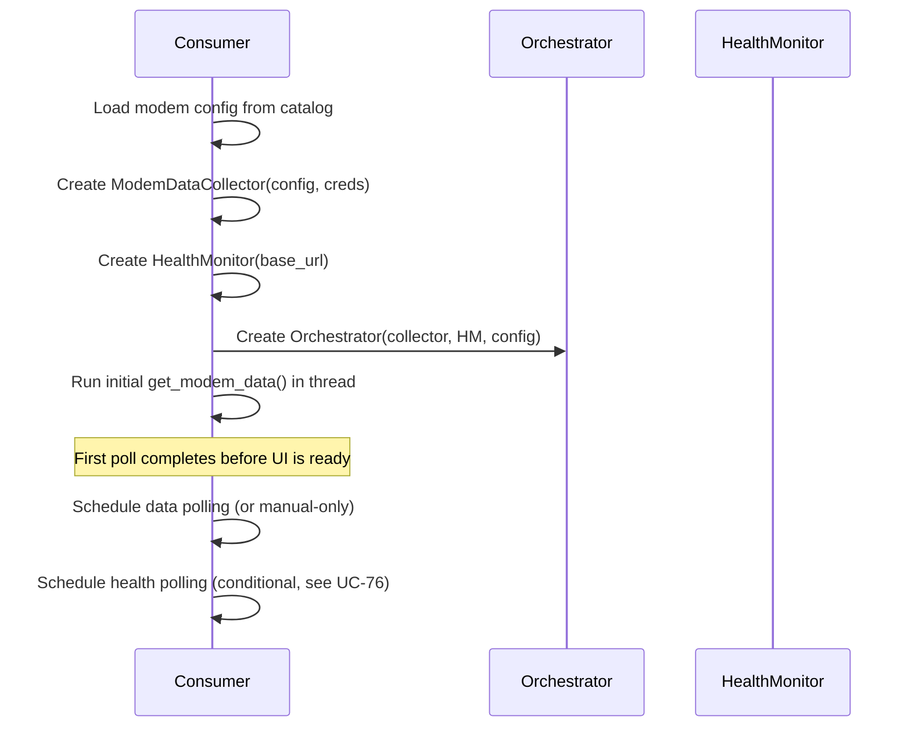
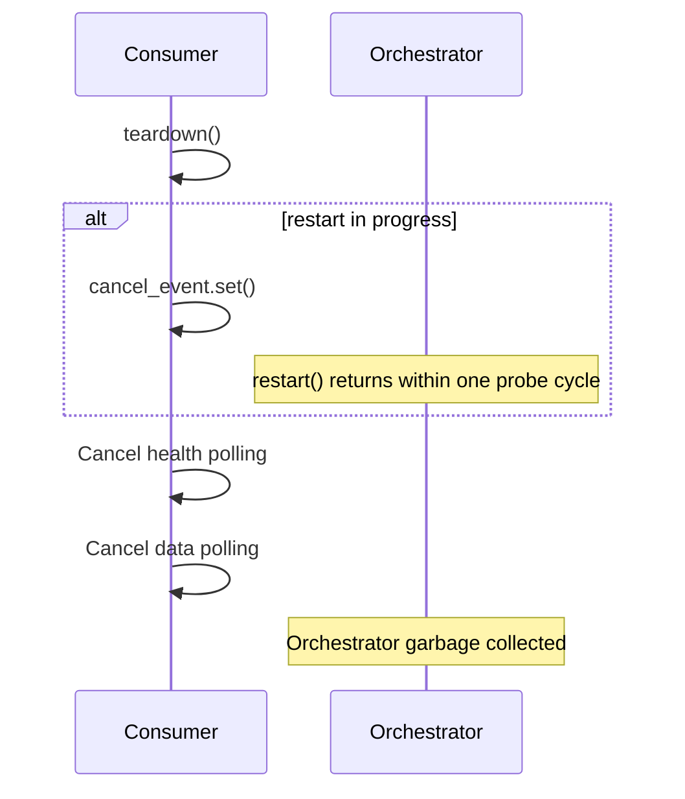
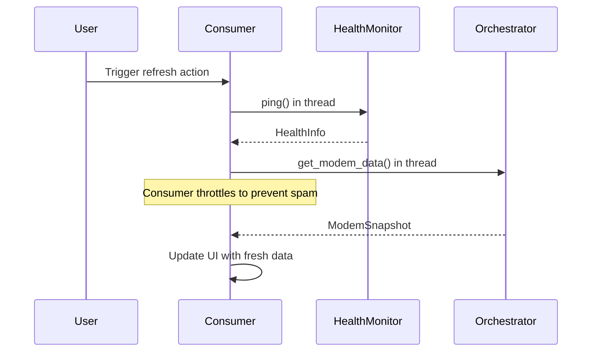
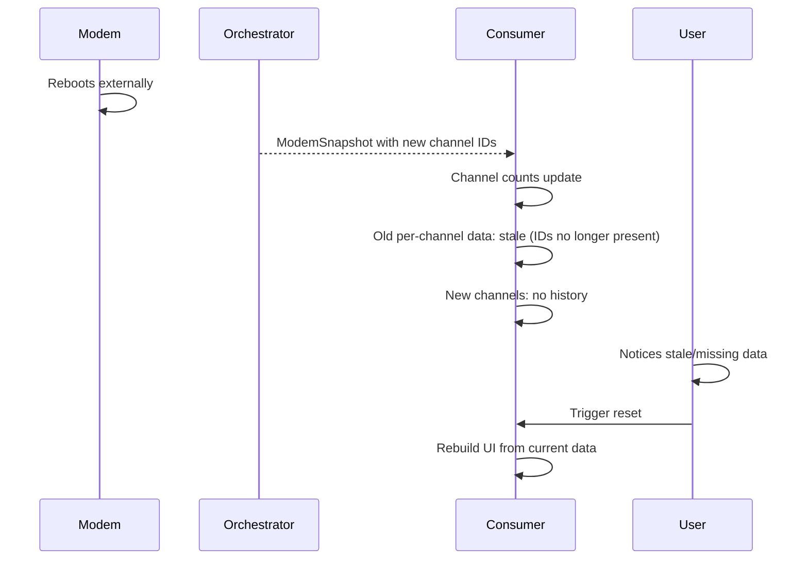
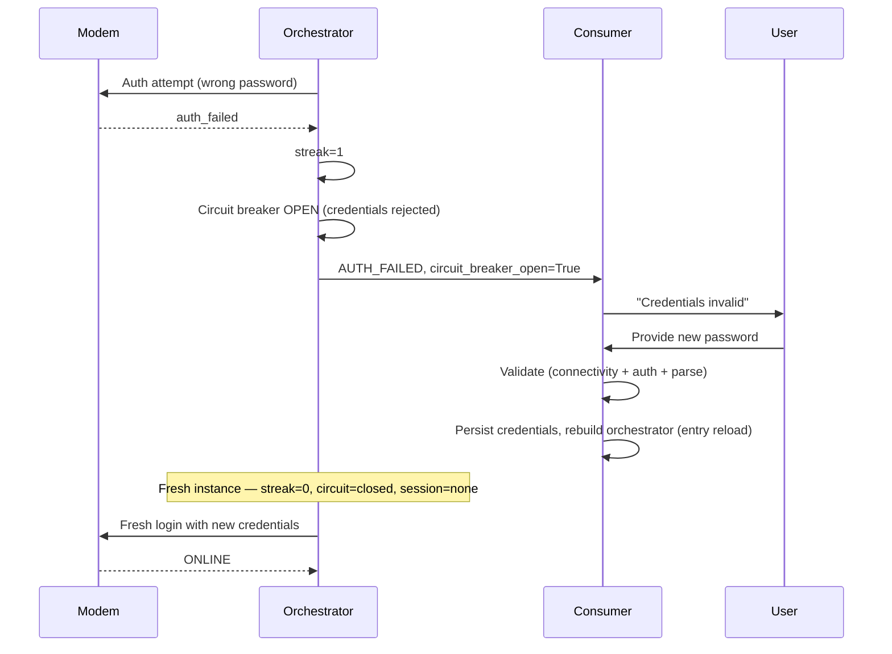
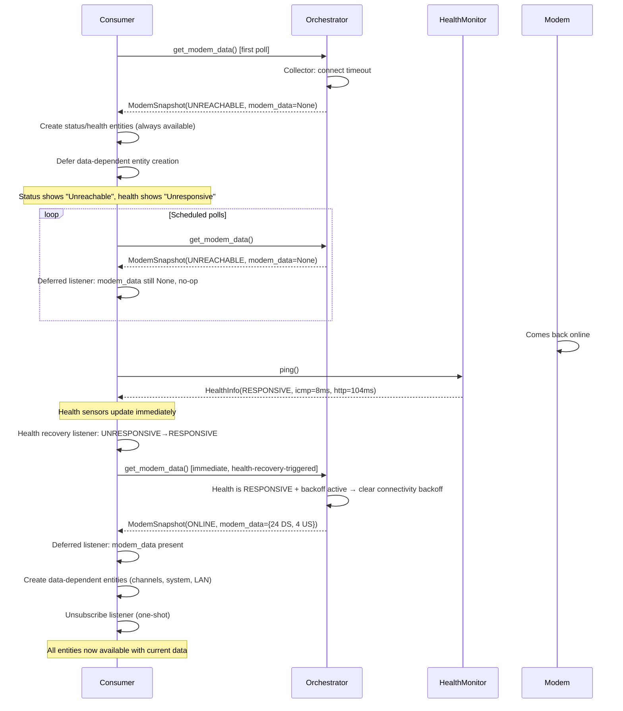

# Orchestration Use Cases

Scenario-driven specification for the orchestration layer. Each use case
documents preconditions, a step-by-step sequence, and assertions that
map directly to test cases. Grouped by concern area.

**Relationship to other specs:**

- `ORCHESTRATION_SPEC.md` — interface contracts (method signatures, types)
- `RUNTIME_POLLING_SPEC.md` — behavioral rules (signal policy, design rules)
- This spec — end-to-end scenarios (what happens when...)

**Conventions:**

- `UC-XX` IDs are stable — tests reference them for traceability
- "Consumer" means any caller (HA coordinator, CLI, exporter)
- Time values are illustrative, not prescriptive
- `→` means "results in"

---

## Normal Operations

### UC-01: First poll — fresh login

**Preconditions:** Orchestrator just created. No session. No prior state.

| Step | Action | State change | Observable |
|------|--------|-------------|------------|
| 1 | Consumer calls `get_modem_data()` | | |
| 2 | Circuit breaker check | closed (default) | |
| 3 | Backoff check | 0 (default) | |
| 4 | Collector: session invalid → authenticate | Session established | |
| 5 | Collector: load resources | | |
| 6 | Collector: parse → 24 DS, 4 US | | |
| 7 | Collector returns `ModemResult(success=True)` | | |
| 8 | Orchestrator: streak=0 (already 0) | | |
| 9 | Orchestrator: derive connection_status | | ONLINE |
| 10 | Orchestrator: derive docsis_status | | OPERATIONAL |
| 11 | Orchestrator: read HM.latest | | |
| 12 | Return `ModemSnapshot` | last_status=ONLINE | |

**Assertions:**

- `snapshot.connection_status == ONLINE`
- `snapshot.docsis_status == OPERATIONAL`
- `snapshot.modem_data` has 24 DS and 4 US channels
- `snapshot.collector_signal == OK`
- `orchestrator.status == ONLINE`
- `orchestrator.diagnostics().auth_failure_streak == 0`
- `orchestrator.diagnostics().session_is_valid == True`

---

### UC-02: Subsequent poll — session reuse

**Preconditions:** UC-01 completed. Session is valid.

| Step | Action | State change | Observable |
|------|--------|-------------|------------|
| 1 | Consumer calls `get_modem_data()` | | |
| 2 | Collector: session valid → skip auth | No new session | |
| 3 | Collector: load resources with existing session | | |
| 4 | Collector: parse → 24 DS, 4 US | | |
| 5 | Return `ModemSnapshot(ONLINE)` | | |

**Assertions:**

- No login attempt was made (verify via auth manager call count)
- `snapshot.connection_status == ONLINE`
- `diagnostics().session_is_valid == True`

---

### UC-03: On-demand refresh

**Preconditions:** Normal operation.

| Step | Action | State change | Observable |
|------|--------|-------------|------------|
| 1 | Consumer calls `get_modem_data()` (same method, no distinction) | | |
| 2 | Orchestrator runs full pipeline | | |
| 3 | Return `ModemSnapshot` | | |

**Assertions:**

- The orchestrator applies the same backoff and circuit breaker
  checks regardless of whether the call is scheduled or on-demand
- Consumer decides scheduling — orchestrator doesn't know or care
  why it was called

**Note:** On-demand vs scheduled is entirely a consumer concern. The
orchestrator has no concept of "scheduled" vs "manual." This is
intentional — backoff and lockout protection apply equally to both.

---

### UC-04: Zero channels with system_info — no signal

**Preconditions:** Modem is online but has no cable connection.

| Step | Action | State change | Observable |
|------|--------|-------------|------------|
| 1 | Consumer calls `get_modem_data()` | | |
| 2 | Collector: auth → load → parse | | |
| 3 | Parser returns 0 DS, 0 US, system_info={firmware: "1.0"} | | |
| 4 | Collector returns `ModemResult(success=True, signal=OK)` | | |
| 5 | Orchestrator: has_channels=False, system_info present | | |
| 6 | Derive connection_status=NO_SIGNAL | | |

**Assertions:**

- `snapshot.connection_status == NO_SIGNAL`
- `snapshot.modem_data` is present (not None)
- `snapshot.modem_data["downstream"] == []`
- `snapshot.collector_signal == OK` (zero channels is valid data, not a failure)
- Auth failure streak is NOT incremented

---

### UC-05: Zero channels without system_info — ambiguous

**Preconditions:** Parser doesn't extract system_info (or matched nothing).

| Step | Action | State change | Observable |
|------|--------|-------------|------------|
| 1 | Consumer calls `get_modem_data()` | | |
| 2 | Parser returns 0 DS, 0 US, system_info={} | | |
| 3 | Collector returns `ModemResult(success=True, signal=OK)` | | |
| 4 | Orchestrator: has_channels=False, system_info empty | | |
| 5 | Log WARNING: "Zero channels and no system_info..." | | |
| 6 | Derive connection_status=NO_SIGNAL | | |

**Assertions:**

- `snapshot.connection_status == NO_SIGNAL`
- WARNING log emitted suggesting parser verification
- Still returns success (not a failure, just ambiguous)

---

### UC-06: Single-session modem — logout after poll

**Preconditions:** modem.yaml declares `actions.logout`. Modem allows
only one authenticated session.

| Step | Action | State change | Observable |
|------|--------|-------------|------------|
| 1 | Consumer calls `get_modem_data()` | | |
| 2 | Collector: auth → load → parse → success | | |
| 3 | Collector: execute logout action | Session released | |
| 4 | Collector returns `ModemResult(success=True)` | | |

**Assertions:**

- Logout action was executed after successful parse
- Session is released (modem's web UI is accessible to user)
- `session_is_valid` may be False after logout (strategy-dependent)
- If logout fails, collection still succeeds (logout is best-effort)
- A refused logout (non-2xx) keeps the local session — the modem still
  holds it, so the next poll reuses the cookie instead of orphaning it

---

### UC-07: DOCSIS status derivation

**Preconditions:** Various downstream channel lock_status combinations.

| DS lock_status values | US present | Expected docsis_status |
|-----------------------|-----------|----------------------|
| All `"locked"` | Yes | `OPERATIONAL` |
| All `"locked"` | No (0 US) | `PARTIAL_LOCK` |
| Some `"locked"`, some `"not_locked"` | Yes | `PARTIAL_LOCK` |
| None `"locked"` | Any | `NOT_LOCKED` |
| No DS channels | Any | `NOT_LOCKED` |
| `lock_status` field absent on channels | Any | `UNKNOWN` |

**Assertions:**

- Each row is a distinct test case
- UNKNOWN prevents false "Not Locked" for modems without lock_status data
- All-locked + no-upstream is PARTIAL_LOCK (upstream matters for OPERATIONAL)

---

## Auth Failures

### UC-10: Wrong credentials — breaker trips on the first failure

**Preconditions:** Modem reachable. Incorrect password configured.

| Step | Action | State change | Observable |
|------|--------|-------------|------------|
| 1 | Consumer calls `get_modem_data()` | | |
| 2 | Collector: auth fails → `AuthResult(success=False)` | | WARNING log: "Auth failed [MODEL] strategy=... — " then the reason, with request, response status, body snippet |
| 3 | Collector returns `ModemResult(success=False, signal=AUTH_FAILED)` | | |
| 4 | Policy: streak 0→1, then trips the breaker in the same call | streak=1, circuit=True | |
| 5 | Return `ModemSnapshot(AUTH_FAILED)` | | |

**Assertions:**

- `snapshot.connection_status == AUTH_FAILED`
- `diagnostics().auth_failure_streak == 1`
- `diagnostics().circuit_breaker_open == True`
- `snapshot.modem_data is None`
- Exactly one login attempt against the modem
- ERROR log: "Auth circuit breaker OPEN [MODEL] — 1 consecutive auth
  failures. Polling stopped. Reconfigure credentials to resume."

**The threshold does not apply here.** `AUTH_FAILED` and `AUTH_LOCKOUT`
route to `_trip_circuit_breaker`, which never reads
`auth_failure_threshold`; the threshold governs `LOAD_AUTH` and
`LOAD_INTEGRITY` only (UC-13). Both mechanisms increment the same
`_auth_failure_streak`, so the count in the log line is not progress
toward a limit here — it reads 1 because this was the first failure.
The polls that follow are blocked by the open breaker (UC-15).

---

### UC-11: Transient auth failure — streak resets on success

**Preconditions:** One prior `LOAD_AUTH` or `LOAD_INTEGRITY` failure
(streak=1, breaker still closed). `AUTH_FAILED` cannot leave this state:
it trips the breaker on the first occurrence (UC-10).

| Step | Action | State change | Observable |
|------|--------|-------------|------------|
| 1 | Consumer calls `get_modem_data()` | | |
| 2 | Collector: auth succeeds → load → parse → OK | | |
| 3 | Orchestrator: streak 1→0 | streak reset | |
| 4 | Return `ModemSnapshot(ONLINE)` | | |

**Assertions:**

- `diagnostics().auth_failure_streak == 0`
- Streak resets on any successful collection, regardless of prior count
- Circuit breaker stays closed

---

### UC-12: Firmware lockout — AUTH_LOCKOUT trips circuit

**Preconditions:** HNAP modem. Auth manager receives `LoginResult: "LOCKUP"`.

| Step | Action | State change | Observable |
|------|--------|-------------|------------|
| 1 | Consumer calls `get_modem_data()` | | |
| 2 | Collector: auth raises `LoginLockoutError` | | |
| 3 | Collector catches, returns `ModemResult(signal=AUTH_LOCKOUT)` | | |
| 4 | Orchestrator: streak incremented, circuit trips | circuit=True | |
| 5 | Return `ModemSnapshot(AUTH_FAILED)` | | |

**Assertions:**

- `snapshot.connection_status == AUTH_FAILED`
- `diagnostics().circuit_breaker_open == True`
- `diagnostics().circuit_trip_signal == AUTH_LOCKOUT`, so a diagnostics
  download taken after polling stopped tells this apart from a wrong
  password
- Blocked polls report "Circuit breaker open — modem locked out further
  logins". Waiting is the remedy, so the message never says credentials
- The consumer must not raise a credential prompt on this route: the
  prompt's form is a real login attempt (UC-81a, UC-86)
- No further login attempts — polling blocked until the consumer
  rebuilds the orchestrator. Unlike the other trip causes there is no
  reauth flow to do it, so the reload is the user's own step (UC-16)
- WARNING log: "Auth lockout [MODEL] — firmware anti-brute-force
  triggered, stopping immediately (streak: 1)"
- ERROR log: "Auth circuit breaker OPEN [MODEL] — 1 consecutive auth
  failures. Polling stopped. Reconfigure credentials to resume."

---

### UC-13: LOAD_AUTH threshold — session issues self-correct

**Preconditions:** Data page returned 401/403. Session issue, not
credential rejection. LOAD_AUTH uses the threshold-based circuit
breaker (default: 6) because session issues typically self-correct
after session refresh (UC-18).

| Poll | Streak | Action | Circuit |
|------|--------|--------|---------|
| N | 1 | LOAD_AUTH — session cleared, streak++ | closed |
| N+1 | 0 | Fresh login → success → streak reset | closed |

If LOAD_AUTH persists (6 consecutive):

| Poll | Streak | Action | Circuit |
|------|--------|--------|---------|
| N through N+5 | 1→6 | LOAD_AUTH each poll, session cleared | closed→open |

**Assertions:**

- Circuit stays closed while streak < threshold (6)
- Self-corrects after session refresh in typical cases
- Persistent LOAD_AUTH (6×) trips circuit as a safety net
- Distinct from AUTH_FAILED/AUTH_LOCKOUT which trip immediately

---

### UC-14: (retired)

A reachable modem with wrong credentials is one scenario, not two.
UC-10 is where it lives, and UC-15 covers the polls that follow once
the breaker is open.

---

### UC-15: Circuit breaker blocks polling

**Preconditions:** Circuit breaker is open.

| Step | Action | State change | Observable |
|------|--------|-------------|------------|
| 1 | Consumer calls `get_modem_data()` | | |
| 2 | Orchestrator: circuit open → return immediately | No collection | |
| 3 | Return `ModemSnapshot(AUTH_FAILED)` | | |

**Assertions:**

- Collector.execute() was NOT called
- No HTTP traffic to the modem
- ERROR log: "Circuit breaker OPEN [MODEL] — polling stopped.
  Reconfigure credentials to resume."
- `recovery_active == False` (circuit breaker is a separate concern from recovery)

---

### UC-16: Credential reconfiguration — consumer rebuilds orchestrator

**Preconditions:** User updates credentials — after a lockout (circuit
breaker open, HA reauth flow; UC-81) or proactively with no lockout
(HA options flow, password changed before the old one ever failed).
Credentials are constructor-bound and Core has no credential setter,
so new credentials always mean a new orchestrator.

| Step | Action | State change | Observable |
|------|--------|-------------|------------|
| 1 | Consumer validates new credentials (connectivity + auth + parse) | | |
| 2 | Consumer persists them (HA: config entry update) | | |
| 3 | Consumer discards the old orchestrator, constructs a new one with the new credentials (HA: entry reload) | all auth state at constructor defaults | |
| 4 | Consumer calls `get_modem_data()` | | first-poll INFO |
| 5 | Collector: fresh login with new credentials | | |

**Assertions:**

- `diagnostics().auth_failure_streak == 0`
- `diagnostics().circuit_breaker_open == False`
- `diagnostics().session_is_valid == False` (before the first poll)
- First poll attempts fresh login — a fresh instance cannot carry a
  stale session, backoff, or open circuit

---

### UC-17: LOAD_AUTH — 401 on data page

**Preconditions:** Auth appeared to succeed but data page returns 401/403.
Session may be stale, or strategy doesn't grant data access.

| Step | Action | State change | Observable |
|------|--------|-------------|------------|
| 1 | Consumer calls `get_modem_data()` | | |
| 2 | Collector: auth succeeds (or session reused) | | |
| 3 | Resource Loader: GET /status.html → HTTP 401 | | |
| 4 | Collector returns `ModemResult(signal=LOAD_AUTH)` | | |
| 5 | Orchestrator: collector.clear_session() | session cleared | |
| 6 | Orchestrator: retry collection once in same poll | | |
| 7 | Retry still fails | | |
| 8 | Orchestrator: streak++ | | |
| 9 | Return `ModemSnapshot(AUTH_FAILED)` | | |

**Assertions:**

- Session is cleared before the same-poll retry
- Orchestrator retries LOAD_AUTH once in the same poll
- Auth failure streak is incremented (LOAD_AUTH is auth-related)
- If the retry also fails, the failure remains auth-related and can
  still escalate to the circuit breaker
- INFO log: "LOAD_AUTH [MODEL] — clearing session and retrying once in
  same poll"

---

### UC-17a: Post-login 401 — the strategy decides what the user is told

**Preconditions:** UC-17. `authenticate()` reported success and a data
page then answered 401/403. Two states produce that: a session the
modem no longer honours, and a wrong password the login never checked.
The status code does not separate them, so the message is chosen from
what the strategy is known to verify.

| Declared mode | Meaning | Core log hint | Config-flow error key |
|---------------|---------|---------------|----------------------|
| `NOT_CONFIGURED` | No credential was sent at all, so the catalog entry is wrong, not the password | "modem requires authentication (check config)" | `invalid_auth` |
| `CREDENTIALS_SUSPECT` | The strategy did not verify the credential at login, so the 401 is very often the bad password surfacing late | "credentials rejected" | `invalid_auth` |
| `SESSION_REJECTED` | The strategy rejects a bad password at login time, so the login having succeeded rules the credential out | "session expired" | `session_rejected` |

**Assertions:**

- `BaseAuthManager.auth_failure_mode()` owns the answer. Nothing in the
  orchestration layer branches on strategy name
- The base returns `CREDENTIALS_SUSPECT`. A missed declaration is
  unspecific, never wrong in the user's face
- `SESSION_REJECTED` is a claim, payable only by a bad-password test
  showing `success=False`. Today: `form_pbkdf2`, `hnap`, and `form` with
  a `success:` criterion
- `form` reads its own config, not its class: with a criterion it
  reports `SESSION_REJECTED`, without one `CREDENTIALS_SUSPECT`
- The refinement applies to `LOAD_AUTH` and `LOAD_INTEGRITY` only.
  `AUTH_FAILED` maps to `invalid_auth` unconditionally and never
  reaches this path (UC-87c)
- The strategies holding the conservative default are not known *not*
  to verify — the harness cannot yet simulate a refusal for them, so
  the claim is unpaid rather than disproved

**Why the default is pessimistic rather than absent.** Telling a user
with a genuinely wrong password "the login worked, so this is not a
username or password problem" is a dead end. Telling a user with good
credentials to check their password is merely unhelpful. So the
unverified case takes the recoverable error.

**Evidence:** #120 (Technicolor CGA6444VF, `form_pbkdf2`). `LOAD_AUTH`
mapped to `invalid_auth` for every strategy, so a modem that had
authenticated us and issued a session told the user to check their
password. `form_pbkdf2` verifies the credential at login, which is what
made the accusation demonstrably wrong and drove the refinement.

**Authority:** `ARCHITECTURE_DECISIONS.md` § Post-login 401 is read per
auth strategy. `AuthFailureMode` in `auth/base.py` is the authoritative
set; `CONFIG_FLOW_SPEC.md` § Step 4 carries the error-key table.

---

### UC-18: LOAD_AUTH — self-correcting stale session

**Preconditions:** Data page returned LOAD_AUTH because the reused
session was stale. Credentials are correct.

| Step | Action | State change | Observable |
|------|--------|-------------|------------|
| 1 | Consumer calls `get_modem_data()` | | |
| 2 | Collector returns `ModemResult(signal=LOAD_AUTH)` | | |
| 3 | Orchestrator: clear session | session cleared | |
| 4 | Orchestrator: retry collection once in same poll | | |
| 5 | Collector: no session → fresh login → success | | |
| 6 | Collector: load → parse → OK | | |
| 7 | Orchestrator: streak→0 | streak reset | |
| 8 | Return `ModemSnapshot(ONLINE)` | | |

**Assertions:**

- Fresh login resolves the stale session within the same poll
- `auth_failed` is not surfaced when the retry succeeds
- Streak resets to 0
- Single LOAD_AUTH → same-poll fresh login → success is the expected
  self-healing path
- The orchestrator increments a consecutive stale-session recovery
  streak on each successful same-poll recovery
- An intervening normal successful poll resets that streak
- After 2 consecutive recovered stale sessions, later polls stop
  attempting cached-session reuse and start with a fresh login

---

### UC-19: Login page detection — auth redirect on data URL

**Preconditions:** Resource Loader fetches a data page. Modem returns
HTTP 200 but the body is a login page (auth redirect, session expired
silently). Without detection, this would reach the parser and produce
empty-data results — see UC-19a for the false-negative case where
detection misses.

| Step | Action | State change | Observable |
|------|--------|-------------|------------|
| 1 | Consumer calls `get_modem_data()` | | |
| 2 | Collector: auth succeeds (or session reused) | | |
| 3 | Resource Loader: GET /status.html → HTTP 200, body contains login form | | |
| 4 | Resource Loader: detects login page, raises `LoginPageDetectedError` | fetch aborts, resources already fetched that poll are discarded | WARNING log |
| 5 | Collector returns `ModemResult(signal=LOAD_AUTH)` | | |
| 6 | Orchestrator: logout (best-effort), clear session | session cleared | |
| 7 | Orchestrator: retry collection once in same poll — fresh login, refetch every target | | |
| 8 | Retry succeeds | streak→0 | `ModemSnapshot(ONLINE)` |
| 9 | Retry serves the login page again | streak++ | `ModemSnapshot(AUTH_FAILED)` |
| 10 | Streak reaches the threshold | circuit breaker opens | HA starts reauth flow |

**Assertions:**

- Signal is LOAD_AUTH (not PARSE_ERROR) — correct root cause classification
- Login page detection checks for `<input type="password">` or similar
- The raise aborts the whole poll, not just the tripped page: a partial resource set is never parsed
- Recovery is a same-poll retry (UC-18 path), not a wait for the next poll
- Two consecutive same-poll recoveries disable cached session reuse (UC-18)
- The breaker does not close on its own; the reauth flow's config-entry reload is what clears it
- WARNING log: "Data page /status.html appears to be a login page — session: cookies=[…] basic_auth=…"

---

### UC-19a: Stub-page detection — login-page false negative

**Preconditions:** Resource Loader fetches a data page. Modem returns
HTTP 200 with valid HTML chrome but the body lacks every parser anchor
declared in `parser.yaml` — neither a `<input type="password">` (so
login-page detection returns false) nor any of the JavaScript function
bodies or JSON variables the parser is configured to extract from.

| Step | Action | State change | Observable |
|------|--------|-------------|------------|
| 1 | Consumer calls `get_modem_data()` | | |
| 2 | Collector: auth succeeds (or session reused) | | |
| 3 | Resource Loader: GET /status.html → HTTP 200, no password field | | |
| 4 | Resource Loader: page added to resources (login-page false negative) | | |
| 5 | Coordinator: parsers run, find 0 of N expected anchors per resource | | |
| 6 | Coordinator: emit `ParseDiagnostics(expected_anchors=N, fulfilled_anchors=0)` | | |
| 7 | Collector returns `ModemResult(signal=LOAD_INTEGRITY)` | | |
| 8 | Orchestrator: clear session | session cleared | |
| 9 | Orchestrator: retry collection once in same poll | | |
| 10 | If retry still produces stub | streak++ | |
| 11 | Return `ModemSnapshot(AUTH_FAILED)` | | |

**Assertions:**

- Signal is `LOAD_INTEGRITY`, not `OK` — zero-anchor fulfillment is not a valid result
- Connection status surfaces as `AUTH_FAILED` (priority 3 per `ENTITY_MODEL_SPEC § Status Sensor`)
- Same-poll retry follows the LOAD_AUTH precedent (UC-17/UC-18); if the stub clears, recovery is symmetric to UC-18
- Auth failure streak is incremented when retry also fails (LOAD_INTEGRITY is auth-related)
- Repeated failures escalate to circuit breaker via the standard streak threshold
- What the user is told on escalation is UC-17a's rule, not this use
  case's — `LOAD_INTEGRITY` takes the same per-strategy refinement as
  `LOAD_AUTH`. Do not restate it here
- WARNING log: `"Stub page detected [MODEL] — /status.html: 0/N anchors found"`
- `ParseDiagnostics` is captured per resource in the diagnostic dump (`RUNTIME_POLLING_SPEC § Diagnostics for Remote Troubleshooting`)

**Discriminator from UC-04:** UC-04 assumes the parser fulfilled its
anchors and extracted values from a modem that simply reports zero
locked channels. UC-19a is the inverse — the parser couldn't locate
any of its declared sources at all. UC-04: `fulfilled == expected`
with empty channels. UC-19a: `fulfilled == 0` with `expected > 0`.

**Background:** Issue #151. Surfaced on Netgear CM1200 returning a
7 KB stub on both `/DocsisStatus.htm` and `/RouterStatus.htm` for
~8 minutes after a fresh integration re-add — all four expected
`Init…TableTagValue` JS function bodies absent. Integration sat
silent at `no_signal` until the modem eventually self-corrected with
a 401. UC-19a closes the gap so detection happens on the next poll
instead of waiting for the modem's internal session timeout.
Architectural foundation: `ARCHITECTURE_DECISIONS.md § Signal/policy
separation`.

---

### UC-19b: Login-page body on the url_token inject path

**Preconditions:** `url_token` auth with `inject_credential_cookie`.
The login GET returns the login page instead of a session token (auth
did not establish a session — single-session contention, silent
redirect, or rejected credentials). The body is multi-line HTML, not a
header-safe token.

| Step | Action | State change | Observable |
|------|--------|-------------|------------|
| 1 | Consumer calls `get_modem_data()` | | |
| 2 | Auth: login GET returns the login page (body has `type="password"`, contains newlines) | | |
| 3 | Auth: body is not header-safe → do **not** inject it as `cookie_name`; leave the credential cookie unset | | |
| 4 | Auth: returns `AuthResult(success=True)` with no credential cookie (no spurious success artefact) | | |
| 5 | Resource Loader: GET data page → HTTP 200, body is the login page | | |
| 6 | Resource Loader: detects login page → `LOAD_AUTH` (UC-19) | | |
| 7 | Orchestrator: clear session, retry once in same poll; streak++ if the retry also fails | session cleared | |

**Assertions:**

- Auth never injects a non-header-safe value as the credential cookie — prevents the `http.client.putheader` `ValueError` (no stack trace for an expected failure)
- Signal is `LOAD_AUTH`, reached through the existing UC-19 detection — no new failure branch
- Single occurrence self-corrects in the same poll via the UC-19 retry; persistent failures escalate normally
- Auth log at the manager's level: body is a login page, credential cookie not injected

**Background:** SB8200 inject variant (#124, rct). The login response
was the login page; the inject path stuffed the full HTML into the
`credential` cookie and reported success, and the loader then crashed
in `http.client.putheader` setting that cookie as a request header.
This use case closes the gap so the inject path honors the same
login-page classification the loader already applies (UC-19).

---

### UC-19c: Login-page detection — false positive on a real data page

**Preconditions:** Login-page detection is enabled (stateful strategy
on the `http` transport). A fetch-list page answers HTTP 200 with real
data, and its markup happens to contain `type="password"` — a
gateway's "show my WiFi password" widget, a settings panel rendered
into a status page, or the string inside inline JS or a comment.

| Step | Action | State change | Observable |
|------|--------|-------------|------------|
| 1 | Consumer calls `get_modem_data()` | | |
| 2 | Collector: auth succeeds (or session reused) | | |
| 3 | Resource Loader: GET /status.html → HTTP 200, real data, body contains a password input | | |
| 4 | Detection fires; the raise aborts the poll and discards every resource fetched so far | | WARNING log |
| 5 | Collector returns `ModemResult(signal=LOAD_AUTH)` | | |
| 6 | Orchestrator: clear session, retry once in same poll — the retry refetches the same page and trips again | streak++ | `ModemSnapshot(AUTH_FAILED)` |
| 7 | Repeat until the streak reaches the threshold | circuit breaker opens | HA prompts for credentials that are not wrong |

**Assertions:**

- The test is a substring on the undecoded body, not a DOM query, and
  requires no wrapping `<form>` — so a bare `<input type="password">`
  outside any form matches
- Nothing distinguishes this from UC-19 at runtime. A correct data page
  and a served login page produce the same signal, the same recovery,
  and the same escalation
- The failure does not self-correct: the page is the modem's real
  answer, so every retry reproduces it
- The end state is the reauth prompt (UC-81a) for a working password

**Why the looser test is still right.** Parsing for an `<input>` node
would miss the false negatives that cost more: markup too broken to
yield a node, and login forms that exist only inside a script template.
Detection also runs before decode, so it reads a body that fails to
decode. `RESOURCE_LOADING_SPEC.md` § Login Page Detection states the
tradeoff and rates this row's likelihood "very low" on the grounds that
the fetch list holds status pages, not settings pages — which holds for
standalone modems and is exactly what a combined modem/router gateway
breaks.

**Evidence:** #184 (Technicolor XB7 / CGM4331COM, firmware
Prod_24.2_PD, reported against 3.13.1). The authenticated
`at_a_glance.jst` renders the WiFi passkey in a readonly input inside a
bare ``; the reporter confirmed the page carries no `<form>` at
all. Four Technicolor gateway entries name that same page as their
login `success:` landing, so the shape is in the catalog.

**Not reproduced by any committed capture.** Across the 48 catalog
HARs, no page on any entry's fetch list carries a password input. The
XB7 entry fetches `/network_setup.jst`, not `at_a_glance.jst`, so the
reported page is not on its fetch list today.

**No intake gate stands behind this.** `RESOURCE_LOADING_SPEC.md`
describes an MCP onboarding HARD STOP for a data page containing a
password field. No such check exists. `catalog_tools/validation/` has
none, and every other password-field matcher in the repo reads a login
form to name its fields during intake — none of them looks at a data
page.

**Consequence in 3.13.1 vs 3.14.** In 3.13.1 the detector logged a
session-expired error and parsing continued, so the reporter saw log
noise with intact data. In 3.14 the raise aborts the poll, so the same
page yields no data at all.

> **Status:** Current behavior, documented rather than endorsed. The
> escape hatch `RESOURCE_LOADING_SPEC.md` names — a per-modem
> `session.login_page` override with an explicit indicator — is not
> spec'd and not implemented.

---

### UC-20: Password changed after months of success

**Preconditions:** Modem working for months. User changes password on
modem's web UI. Session is still valid in memory.

| Poll | What happens | Streak | Status |
|------|-------------|--------|--------|
| N | Session valid → reuse → load → parse → OK | 0 | ONLINE |
| ... | (months of normal operation) | 0 | ONLINE |
| N+K | Session expires → re-auth → wrong password | 1 | AUTH_FAILED |
| N+K+1+ | Circuit open, no collection | 1 | AUTH_FAILED |

**Assertions:**

- Session reuse delays the failure until the session naturally expires
- Exactly one login attempt against the modem with the stale password —
  the circuit trips on the first AUTH_FAILED, so wrong-password logins
  never accumulate toward firmware anti-brute-force
- ERROR log at circuit trip is actionable: "Reconfigure credentials to resume"
- After rebuild with correct password → back to normal (UC-16)

---

### UC-21: HNAP stale session — HTTP error on reused HNAP session

**Preconditions:** HNAP modem. Session reused from prior poll. Server
has expired the session (firmware timeout or max-session limit).

| Step | Action | State change | Observable |
|------|--------|-------------|------------|
| 1 | Consumer calls `get_modem_data()` | | |
| 2 | Collector: session valid (uid cookie + key) → reuse | | |
| 3 | Resource Loader: POST /HNAP1/ with stale session → HTTP 404 | | |
| 4 | Collector: HNAP error + reused session → LOAD_AUTH | | |
| 5 | Orchestrator: collector.clear_session() | session cleared | |
| 6 | Orchestrator: retry collection once in same poll | | |
| 7 | Collector: fresh login → HNAP load → parse → OK | | ONLINE |

**Assertions:**

- Signal is LOAD_AUTH (not LOAD_ERROR) — session context determines routing
- Session is cleared before the same-poll retry (→ UC-18)
- Successful retry does not increment auth failure streak
- WARNING log: "HNAP session expired [MODEL] — HTTP 404"
- INFO logs show the retry and successful same-poll recovery
- After the second consecutive recovered stale session, later polls
  clear the cached session before collection and go straight to fresh auth

**Note:** Some HNAP firmware returns 404 for expired sessions, not 401.
Others may return 500. The routing does not depend on the specific status
code — any HTTP error on a reused HNAP session is treated as a stale
session, because `/HNAP1/` is a fixed endpoint that always exists on
HNAP modems (RESOURCE_LOADING_SPEC § HNAP Batching).

---

### UC-22: HNAP server error on fresh session

**Preconditions:** HNAP modem. Fresh login just completed. Modem has
a firmware issue or temporary overload.

| Step | Action | State change | Observable |
|------|--------|-------------|------------|
| 1 | Consumer calls `get_modem_data()` | | |
| 2 | Collector: no session → fresh login → success | | |
| 3 | Resource Loader: POST /HNAP1/ → HTTP 500 | | |
| 4 | Collector: HNAP error + fresh session → LOAD_ERROR | | |
| 5 | Return `ModemSnapshot(UNREACHABLE)` | | |

**Assertions:**

- Signal is LOAD_ERROR (not LOAD_AUTH) — fresh session rules out stale session
- Session is NOT cleared — avoid unnecessary re-login that could trigger lockout
- Auth failure streak NOT incremented
- WARNING log: "HNAP load error [MODEL] — {reason}"

---

### UC-23: Form auth — hidden field discovery from login page

**Preconditions:** Modem uses `strategy: form` with `login_page`
configured. The login page contains `<input type="hidden">` fields
(e.g., CSRF token) that must be included in the login POST.

| Step | Action | State change | Observable |
|------|--------|-------------|------------|
| 1 | Consumer calls `get_modem_data()` | | |
| 2 | Collector: no active session, starts auth | | |
| 3 | FormAuthManager: GET `login_page` | Session cookies established | |
| 4 | FormAuthManager: reads hidden fields from login form HTML | | DEBUG log: "Discovered N hidden field(s) from login form" |
| 5 | FormAuthManager: builds POST data — discovered fields (base) ← `hidden_fields` (override) ← credentials | | |
| 6 | FormAuthManager: POST to `action` endpoint with merged form data | | |
| 7 | Success evaluation (redirect or status check) | Auth succeeded | |

**Assertions:**

- Hidden fields from the login page are included in the POST body
- `hidden_fields` from modem.yaml override discovered values (same key)
- Credentials (`username_field`, `password_field`) override both
- If login page returns empty body or error: discovered fields = `{}`,
  auth proceeds with `hidden_fields` and credentials only (graceful
  degradation)
- Dynamic fields (e.g., CSRF tokens) get fresh values on every auth
  attempt — no stale values from build-time config

---

## Connectivity Failures

### UC-30: Connection refused — modem offline

**Preconditions:** Modem is powered off or unreachable.

| Step | Action | State change | Observable |
|------|--------|-------------|------------|
| 1 | Consumer calls `get_modem_data()` | | |
| 2 | Collector: auth → ConnectionError | | |
| 3 | Collector returns `ModemResult(signal=CONNECTIVITY)` | | |
| 4 | Orchestrator: increment connectivity streak, set backoff | connectivity_streak=1, backoff=1 | |
| 5 | Return `ModemSnapshot(UNREACHABLE)` | | |

**Assertions:**

- `snapshot.connection_status == UNREACHABLE`
- Auth failure streak is NOT incremented (connectivity is not auth)
- Connectivity backoff applied: `min(2^(streak-1), 6)` polls skipped before retry
- Next poll is skipped (backoff=1); poll after that retries

---

### UC-31: HTTP timeout — slow modem

**Preconditions:** Modem responds slowly, exceeds per-request timeout.

| Step | Action | State change | Observable |
|------|--------|-------------|------------|
| 1 | Consumer calls `get_modem_data()` | | |
| 2 | Collector: auth or load → Timeout | | |
| 3 | Collector returns `ModemResult(signal=CONNECTIVITY)` | | |
| 4 | Return `ModemSnapshot(UNREACHABLE)` | | |

**Assertions:**

- Same policy as connection refused — connectivity backoff, no auth streak
- Modem's per-request timeout from modem.yaml applies

---

### UC-32: HTTP 5xx on data page

**Preconditions:** Modem's web server returns 500/502/503.

| Step | Action | State change | Observable |
|------|--------|-------------|------------|
| 1 | Consumer calls `get_modem_data()` | | |
| 2 | Collector: auth OK → load /status.html → HTTP 500 | | |
| 3 | Collector returns `ModemResult(signal=LOAD_ERROR)` | | |
| 4 | Return `ModemSnapshot(UNREACHABLE)` | | |

**Assertions:**

- `snapshot.connection_status == UNREACHABLE`
- Auth failure streak NOT incremented (server error, not auth)
- All-or-nothing: if any page returns 5xx, entire poll fails

---

### UC-33: Parser error — malformed response

**Preconditions:** Modem returns unexpected HTML/data format.

| Step | Action | State change | Observable |
|------|--------|-------------|------------|
| 1 | Consumer calls `get_modem_data()` | | |
| 2 | Collector: auth OK → load OK → parse raises exception | | |
| 3 | Collector catches, returns `ModemResult(signal=PARSE_ERROR)` | | |
| 4 | Return `ModemSnapshot(PARSER_ISSUE)` | | |

**Assertions:**

- `snapshot.connection_status == PARSER_ISSUE`
- Distinct from UNREACHABLE — the modem responded, but data is unparseable
- Auth streak NOT incremented
- ERROR log with parser exception details

---

### UC-34: Status transition — unreachable to online

**Preconditions:** Last poll returned UNREACHABLE (modem was offline).
Modem has come back online.

| Step | Action | State change | Observable |
|------|--------|-------------|------------|
| 1 | Consumer calls `get_modem_data()` | | |
| 2 | Collector: session may be stale from before outage | | |
| 3a | If modem rejects stale session → LOAD_AUTH → clear session | | |
| 3b | If modem accepts (IP-based or ignores stale cookies) → success | | |
| 4 | Orchestrator: detects UNREACHABLE → ONLINE transition | last_status=ONLINE | |
| 5 | Log INFO status transition for diagnostics | | |

**Assertions:**

- Transition is logged: "Status transition [MODEL]: unreachable → online"
- If stale session rejected (3a): same poll does fresh login, self-corrects (UC-18)
- No proactive session clear — LOAD_AUTH handles it naturally

---

### UC-35: All-or-nothing page loading

**Preconditions:** Modem has 3 data pages. Second page fails.

| Step | Action | State change | Observable |
|------|--------|-------------|------------|
| 1 | Consumer calls `get_modem_data()` | | |
| 2 | Collector: auth OK | | |
| 3 | Resource Loader: GET /page1.html → 200 OK | | |
| 4 | Resource Loader: GET /page2.html → timeout | | |
| 5 | Resource Loader: aborts (does NOT fetch page 3) | | |
| 6 | Collector returns `ModemResult(signal=CONNECTIVITY)` | | |

**Assertions:**

- Partial data is never returned — if any page fails, entire poll fails
- Log identifies which page failed, error type, HTTP status
- Previous ModemSnapshot persists on consumer's sensors until next success

---

## Restart

### UC-40: Restart — one-shot command

**Preconditions:** modem.yaml declares `actions.restart`. Modem is
online. Recovery is not currently active.

| Step | Action | Observable |
|------|--------|------------|
| 1 | Consumer calls `orchestrator.restart()`. | |
| 2 | Orchestrator authenticates (fresh session), executes `actions.restart`, clears session. Connection drop during the request counts as success. | INFO log: `"Restart command sent [MODEL] — session cleared (<elapsed>s)"` |
| 3 | Orchestrator calls `recovery.begin(reason="restart_command")`. The recovery window opens. | INFO log: `"Recovery window open [MODEL] — reason: restart_command"`; observer fires; HA switches coordinator cadence to the recovery interval. |
| 4 | `restart()` returns. Total elapsed typically 2–5 s. | No further log from `restart()`; window runs on its own. |
| 5 | Coordinator polls at recovery cadence. Snapshots reflect reality (UNREACHABLE while the modem is down, Denied/Not-Locked while ranging, Operational once back). | Status sensor displays whatever the modem reports at each poll. |
| 6 | Recovery window expires after `Recovery.WINDOW_SECONDS`. Observer fires; HA restores normal cadence. | INFO log: `"Recovery window closed [MODEL] — elapsed: <N>s, last snapshot docsis: <value>"` |

**Assertions:**

- `result.success == True`
- `result.error == ""`
- `result.elapsed_seconds > 0` (typically < 5 s)
- `orchestrator.recovery_active == True` when `restart()` returns
- The pre-restart session was cleared (next poll authenticates fresh)
- `restart()` does NOT poll the modem after sending the command

---

### UC-41: (retired)

Restart has no cancel path under the new model — the call is
one-shot and returns in a few seconds. There is nothing long-running
to cancel. If HA unloads mid-call, the in-flight `execute_action`
completes (or raises); either way `restart()` returns promptly.

The recovery window, which runs after `restart()` returns, is
driven by the consumer's normal polling schedule. HA's coordinator
unload stops scheduled polls, which stops the window's observed
behavior — no explicit cancel primitive required.

---

### UC-42: Restart during recovery — allowed

**Preconditions:** A recovery window is open (`recovery_active == True`),
from any trigger (commanded restart, observed outage, reboot-signal check).
User observes a flakey modem and wants to try restarting again.

| Step | Action | Observable |
|------|--------|------------|
| 1 | Consumer calls `restart()` while recovery is active. | |
| 2 | Orchestrator proceeds normally — authenticates, executes the action, clears session, calls `recovery.begin()`. | If modem is reachable and accepts the command: reboot re-triggers, recovery window restarts. If modem is unreachable or refuses the command: `error="command_failed"` returned. |

**Assertions:**

- Core does not raise based on `recovery_active`.
- The command either dispatches or fails honestly; the caller sees
  the outcome via `RestartResult`.
- `recovery.begin()` is called on success regardless of prior window
  state — an already-open window is re-started (fresh elapsed clock,
  updated reason). Rationale: the user's re-press expresses intent
  to give the modem fresh fast-poll coverage.
- Consumer-layer serialization (HA mutex) prevents concurrent
  `restart()` calls from the same button, but deliberate re-presses
  after the mutex clears are allowed.

---

### UC-43: Poll during recovery — no short-circuit

**Preconditions:** Recovery window is open (`recovery_active == True`).

| Step | Action | State change | Observable |
|------|--------|-------------|------------|
| 1 | Consumer calls `get_modem_data()` | | |
| 2 | Orchestrator runs the normal poll sequence. No special guard. | Collector executes; result reflects reality. | |
| 3 | On success: snapshot carries whatever status the modem reported (ONLINE, NO_SIGNAL, etc.). On failure: UNREACHABLE or AUTH_FAILED as normal. | | |
| 4 | Orchestrator calls `recovery.evaluate_snapshot()` or `recovery.evaluate_failure()` as usual; the already-open window is not re-entered. | | |

**Assertions:**

- `collector.execute()` IS called (the point of recovery cadence is to
  poll more often, not to stop polling)
- Snapshot reflects actual modem state — no synthetic `RESTARTING`
  status
- Recovery module does not alter the snapshot in any way
- Auth failures during recovery are handled by the normal signal
  policy (no special bypass)

---

### UC-44: Restart not supported

**Preconditions:** modem.yaml does not declare `actions.restart`.

| Step | Action | State change | Observable |
|------|--------|-------------|------------|
| 1 | Consumer calls `restart()` | | |
| 2 | Orchestrator: no restart action → raise | | |

**Assertions:**

- `RestartNotSupportedError` raised
- No side effects (no recovery window, no modem traffic)
- Platform adapter should prevent this by checking
  `supports_restart` before exposing the button

---

### UC-45: Restart bypasses circuit breaker

**Preconditions:** Circuit breaker is open (persistent auth failures).
User presses restart button. Recovery is not active.

| Step | Action | State change | Observable |
|------|--------|-------------|------------|
| 1 | Consumer calls `restart()` | | |
| 2 | Orchestrator: does NOT check circuit breaker | | |
| 3 | Orchestrator: authenticates with fresh session | | |
| 4 | If auth succeeds: command dispatches, recovery window opens. | | |
| 5 | If auth fails: `restart()` returns `error="command_failed"`. No recovery window opens. | | |

**Assertions:**

- Circuit breaker is not consulted during restart
- Restart uses its own fresh auth session
- Auth failure during restart does NOT increment the orchestrator's streak
- Restart is a user-initiated action — circuit breaker protects automated polling only

---

### UC-46: (retired)

Restart has no probe loop and no response timeout under the new
model. The command either dispatches (success) or fails — raised,
or refused by the modem (`error="command_failed"`). If the modem
never comes back after the
command, that shows up through normal polling during the recovery
window (UNREACHABLE snapshots until/unless the modem returns, or
until the window elapses and the coordinator falls back to normal
cadence).

---

### UC-49: Unplanned restart detection via normal polling

**Preconditions:** Modem was restarted externally (ISP, power
outage, firmware push). No restart command sent. The reboot-signal
check does not fire (signals don't match, or the check is disabled).
Normal polling discovers the outage through the connectivity policy.

| Poll | What happens | Status |
|------|-------------|--------|
| N | Normal poll → ONLINE | ONLINE |
| N+1 | ConnectionError → CONNECTIVITY (streak=1, backoff=1). Orchestrator calls `recovery.evaluate_failure()`; recovery opens a window on connectivity-outage threshold. | UNREACHABLE |
| N+2..k | Coordinator polls at recovery cadence. All polls UNREACHABLE while the modem is down. | UNREACHABLE |
| N+k+1 | Modem back, LOAD_AUTH on stale session → clear session | AUTH_FAILED |
| N+k+2 | Fresh login → success | ONLINE |
| After window expires | Coordinator returns to normal cadence regardless of current state. | whatever modem reports |

**Assertions:**

- No `restart()` call involved — normal polling handles it
- Recovery window opens from the connectivity trigger, accelerates
  polling so the return is seen quickly
- Stale session self-corrects via LOAD_AUTH → clear → fresh login
- UNREACHABLE → ONLINE transition logged
- Health checks (if running) detect the outage faster than data polls

**Alternative path (IP-based session):**

| Poll | What happens | Status |
|------|-------------|--------|
| N+k+1 | Modem back, accepts stale cookies → success | ONLINE |

No LOAD_AUTH step needed. Both paths are valid.

---

### UC-88: Reboot-signal trigger

**Preconditions:** Integration polling normally. The ISP pushes new
firmware, the user power-cycles the modem, or the modem reboots
itself from watchdog. No HA-layer restart was issued. The modem
returns to answering polls before the user's next scheduled poll
(otherwise the connectivity trigger would catch it instead — see
UC-49).

| Poll | What happens | `recovery_active` | Coordinator interval |
|------|-------------|-------------------|---------------------|
| N    | Normal poll — counters = (500, 50), docsis = Operational | False | user-configured (e.g., 15 min) |
| N+1  | Successful poll: counters = (0, 0), docsis = Denied. Reboot-signal check matches (counter reset + transitional docsis = 2 of 3); recovery opens a window with reason `reboot_signals:counter_reset+transitional_docsis`. Observer fires. | **True** | Switches to recovery cadence (e.g., 30 s) |
| N+2..k | Polls run at recovery cadence. Snapshots reflect actual modem state (ranging → operational). Window is NOT closed by operational snapshot — it runs its full duration. | True | recovery cadence |
| N+k+1 | `Recovery.WINDOW_SECONDS` elapsed; window closes. Observer fires. | False | Restored to user-configured |

**Core behavior:** The reboot-signal check runs inside
`Recovery.evaluate_snapshot()` on every successful poll. It's a
2-of-3 vote over counter reset, uptime drop, transitional docsis
and returns a trigger reason or None. Recovery opens a window when
the reason is non-None and no window is already active. See
ORCHESTRATION_SPEC § Reboot-Signal Trigger for the signal set.

**HA behavior:** The observer fires the `recovery_state_changed`
dispatcher signal. Listeners respond:

1. The data coordinator's `update_interval` switches to the
   recovery cadence on entry, restores on exit. On entry, HA calls
   `async_request_refresh()` so the first fast-cadence poll happens
   immediately.
2. The restart button's enabled state re-evaluates.

**Status sensor is not special-cased.** It renders the snapshot's
actual status throughout — Operational / Denied / Not Locked /
Unreachable / whatever. No synthetic "Restarting…" label fires
from recovery state.

**False positives are bounded-harm.** If the reboot-signal check
misfires on a firmware stats-clear or signal anomaly, the only
consequence is polling faster for `Recovery.WINDOW_SECONDS`.
Dashboard state is unaffected (it always reflects truth). No stalls,
no timeouts, no misleading UX.

**Modems without the relevant fields** simply don't trigger from
the reboot-signal check. Their reboots surface through normal
polling via UC-49 instead. That's fine — the signal check is an
enhancement, not a requirement.

**Interaction with commanded restart:** the two triggers re-enter
differently. A restart command issued while a signal-check window is
open is *not* refused — `recovery.begin()` is the one entry that
always (re)starts the window, so the clock resets and the reason
updates (UC-42). A reboot-signal match during an already-open window
is a no-op, because the vote opens a window only when none is active.

---

### UC-89: Restart refused by the modem

**Preconditions:** `actions.restart` is declared. The user presses
restart. Nothing raises: the modem answers, but it answers no.

Two ways this arrives, both returning `ActionResult(success=False)`
rather than an exception:

| Step | Action | Observable |
|------|--------|-----------|
| 1 | `actions.restart` declares `action_auth` and the per-action login is refused (bad or missing credentials → HTTP 401). The command is never sent. | ERROR log: `Restart command failed [MODEL] — Per-action auth failed: Login returned HTTP 401` |
| 2 | Or the command itself is sent and the modem answers 4xx/5xx. | ERROR log: `Restart command failed [MODEL] — Action refused with status 401` |

**Assertions:**

- `restart()` returns `success=False`, `error="command_failed"`
- **No recovery window opens** — there is no reboot to poll through
- **The collector session is not cleared** — the reason to clear it is
  firmware invalidating it during a reboot, and no reboot happened
- The consumer surfaces the failure. HA raises `HomeAssistantError`
  from the button press, so the user sees it rather than a success
  notification for a modem that never restarted

**Why this is its own case.** A modem with no monitoring auth but a
credentialed restart (`auth.strategy: none` + `action_auth`) has a
config-entry state where monitoring works perfectly and restart cannot
work at all: no password was ever stored, because nothing needed one.
Silence here reads as success to the only person who can fix it (#82).

---

## Health

### UC-50: Normal health check — all probes on a HEAD-capable modem

**Preconditions:** ICMP enabled, HTTP probe enabled, supports_head=True.

| Step | Action | State change | Observable |
|------|--------|-------------|------------|
| 1 | Consumer calls `ping()` | | |
| 2 | HM: ICMP ping → success (4ms) | | |
| 3 | HM: HTTP HEAD → success (12ms elapsed) | | |
| 4 | HM: TCP connect → success (2ms) | | |
| 5 | HM: server response time = 12 − 2 = 10ms | | |
| 6 | HM: derive status from ICMP + TCP → RESPONSIVE | | |
| 7 | HM: store as .latest | | |
| 8 | Return `HealthInfo(RESPONSIVE, icmp_latency_ms=4, tcp_latency_ms=2, http_latency_ms=10)` | | |

**Assertions:**

- ICMP, HEAD, and TCP all run when conditions are met
- Order: ICMP first, then HEAD (uncontested connection), then TCP
- Status derives from ICMP + TCP only — HEAD is latency-only
- DEBUG log (steady state; INFO on a status change): "Health check
  [MODEL]: responsive — ICMP 4.0ms, TCP 2.0ms, HTTP HEAD 10.0ms"

---

### UC-50a: Normal health check — GET-only modem

**Preconditions:** ICMP enabled, HTTP probe enabled, supports_head=False.

| Step | Action | State change | Observable |
|------|--------|-------------|------------|
| 1 | Consumer calls `ping()` | | |
| 2 | HM: ICMP ping → success (4ms) | | |
| 3 | HM: HEAD probe **skipped** (supports_head=False, no GET fallback) | | |
| 4 | HM: TCP connect → success (2ms) | | |
| 5 | HM: derive status from ICMP + TCP → RESPONSIVE | | |
| 6 | Return `HealthInfo(RESPONSIVE, icmp_latency_ms=4, tcp_latency_ms=2, http_latency_ms=None)` | | |

**Assertions:**

- HEAD probe is never called on supports_head=False modems
- TCP probe still runs (independent of HEAD)
- `http_latency_ms` stays None — populating it via GET fallback would
  produce bimodal cold/warm corrupted data
- Status remains RESPONSIVE based on ICMP + TCP

---

### UC-51: Health checks decoupled from collection

**Preconditions:** Data collection and health checks both running.

| Step | Action | State change | Observable |
|------|--------|-------------|------------|
| 1 | Data poll completes successfully | | ONLINE |
| 2 | Health timer fires (independent cadence) | | |
| 3 | HM: run ICMP + TCP (+ HEAD if supported) probes | | |
| 4 | Return `HealthInfo(RESPONSIVE, ...)` | | |

**Assertions:**

- Health checks and data collection run independently on their own cadences
- Health probes always run their full set (subject to capability flags)
  regardless of collection state, except when collection evidence
  suppresses TCP/HEAD (UC-58, UC-59)
- No coupling between the two pipelines — neither blocks the other
- Health provides fast outage detection; collection provides modem data

---

### UC-52: Health continues when collection stops

**Preconditions:** Data polling disabled or collector missed a cycle.
Health checks still running on their own cadence.

| Step | Action | State change | Observable |
|------|--------|-------------|------------|
| 1 | No data collection runs (disabled or failed) | | |
| 2 | Health timer fires | | |
| 3 | HM: run ICMP + TCP (+ HEAD if supported) probes | | |
| 4 | Return `HealthInfo(...)` | | |

**Assertions:**

- Health probes run regardless of whether data collection is active
- No dependency on collection state — health is fully independent
- Provides reachability data even when data polling is disabled (UC-74)

---

### UC-53: Outage detection between data polls

**Preconditions:** Health cadence = 30s, data cadence = 10m.
Modem goes down 2 minutes after last data poll.

| Time | Event | Health status | Data status |
|------|-------|-------------|-------------|
| 0:00 | Data poll → ONLINE | | ONLINE |
| 0:30 | Health check → responsive | RESPONSIVE | ONLINE |
| 1:00 | Health check → responsive | RESPONSIVE | ONLINE |
| 2:00 | Modem goes offline | | |
| 2:30 | Health check → unresponsive | UNRESPONSIVE | ONLINE |
| 3:00 | Health check → unresponsive | UNRESPONSIVE | ONLINE |
| 10:00 | Data poll → UNREACHABLE | UNRESPONSIVE | UNREACHABLE |

**Assertions:**

- Health detects the outage at 2:30 (7.5 minutes before data poll)
- Consumer updates health sensors immediately on health callback
- Data status remains ONLINE until next data poll (stale but not wrong — it was
  the last known data state)
- This is the primary value of independent health cadence

---

### UC-54: ICMP blocked network

**Preconditions:** Network blocks ICMP. `supports_icmp=True` (not
yet known to be blocked).

| Step | Action | State change | Observable |
|------|--------|-------------|------------|
| 1 | Consumer calls `ping()` | | |
| 2 | HM: ICMP → fail (blocked) | | |
| 3 | HM: TCP connect → success | | |
| 4 | Return `HealthInfo(ICMP_BLOCKED)` | | |

**Assertions:**

- `health_status == ICMP_BLOCKED`
- Modem IS reachable at L4 — ICMP failure is network, not modem
- Consumer may choose to disable ICMP after seeing persistent ICMP_BLOCKED

---

### UC-55: Degraded — TCP fails, ping succeeds

**Preconditions:** Modem's L4 stack is hung but network stack
responds at L3.

| Step | Action | State change | Observable |
|------|--------|-------------|------------|
| 1 | Consumer calls `ping()` | | |
| 2 | HM: ICMP → success | | |
| 3 | HM: TCP connect → timeout / refused | | |
| 4 | Return `HealthInfo(DEGRADED)` | | |

**Assertions:**

- `health_status == DEGRADED`
- Modem is network-reachable but TCP listen path is unhappy
- WARNING log (on the transition into degraded): "Health check [MODEL]:
  degraded — ICMP OK, TCP timeout"
- HEAD failure alone (when TCP succeeds) does **not** produce DEGRADED
  — application-layer issues surface via the next slow-poll instead

---

### UC-56: Both probes disabled

**Preconditions:** `supports_icmp=False`, `supports_head=False`.

| Step | Action | State change | Observable |
|------|--------|-------------|------------|
| 1 | Consumer calls `ping()` | | |
| 2 | HM: no probes to run | | |
| 3 | Return `HealthInfo(UNKNOWN)` | | |

**Assertions:**

- `health_status == UNKNOWN`
- No network traffic generated
- Consumer should not schedule health checks if no probes are enabled

---

### UC-57: Health during restart — independent

**Preconditions:** Restart in progress. Health thread/timer continues.

| Time | Health check | Restart monitor |
| ------ | -------------- | ----------------- |
| 0:00 | | Restart command sent |
| 0:10 | | Phase 1 probe #1 (fail) |
| 0:15 | ping() → unresponsive | |
| 0:20 | | Phase 1 probe #2 (fail) |
| 0:30 | | Phase 1 probe #3 (success!) |
| 0:45 | ping() → responsive | |

**Assertions:**

- Health checks continue independently during restart
- Health thread and `restart()` may both call ping() — this is fine
  (stateless probes, atomic `_latest` update under GIL)
- Health sensors update in real-time during restart recovery
- No coordination needed between health timer and restart procedure
- The consumer's health recovery listener (UC-84 step 6a) may fire
  during a recovery window if the modem answers health probes
  before the window elapses. The resulting immediate poll is just
  another poll — it runs normally and updates the snapshot. No
  special coordination with `restart()` is needed because
  `restart()` is already done; recovery is purely a cadence concern.

---

### UC-58: TCP/HEAD probes skipped during active collection

**Preconditions:** Health checks and data polling both running.
Poll and health check fire at overlapping times (e.g., after HA
reload both coordinators start from the same instant).

| Step | Action | State change | Observable |
|------|--------|-------------|------------|
| 1 | Orchestrator calls `record_collection_start()` | `_collection_active = True` | |
| 2 | `collector.execute()` begins (auth, fetch, parse) | | Modem web server busy |
| 3 | Health timer fires → `ping()` | | |
| 4 | `_should_skip_probes()` → True (active) | TCP and HEAD not called | |
| 5 | ICMP runs normally | | ICMP latency measured |
| 6 | Status derived: ICMP pass + evidence → RESPONSIVE | | `tcp_latency_ms = None`, `http_latency_ms = None` |
| 7 | Log: `"responsive (ICMP 1.5ms, TCP/HEAD skipped (collection active))"` | | |
| 8 | Collection completes → `record_collection_end(True)` | `_collection_active = False`, `_last_collection_success` set | |

**Assertions:**

- Neither `socket.create_connection` nor `session.head` is called
  during active collection
- ICMP probe runs regardless of collection state
- `tcp_latency_ms` and `http_latency_ms` are None (not measured)
- `health_status` is RESPONSIVE (collection evidence = tcp_ok)
- If ICMP fails during active collection, the TCP probe is forced
  and its real result decides status (UC-59a)
- No contention on the modem's web server

---

### UC-59: TCP/HEAD probes skipped after recent successful collection

**Preconditions:** Data poll completed successfully. Next health
check fires before another poll starts.

| Step | Action | State change | Observable |
|------|--------|-------------|------------|
| 1 | Previous `ping()` completed | `_last_ping_time` set | |
| 2 | `record_collection_end(True)` | `_last_collection_success` > `_last_ping_time` | |
| 3 | Health timer fires → `ping()` | | |
| 4 | `_should_skip_probes()` → True (recent success) | TCP and HEAD not called | |
| 5 | Status derived with evidence → RESPONSIVE | | `tcp_latency_ms = None`, `http_latency_ms = None` |
| 6 | `_last_ping_time` updated at end of `ping()` | Evidence consumed | |
| 7 | Next `ping()` → `_last_collection_success` < `_last_ping_time` | TCP and HEAD run normally | |

**Assertions:**

- Collection evidence is consumed once (first ping after collection)
- Second ping after collection runs TCP and HEAD probes normally
- Failed collection (`record_collection_end(False)`) does not
  suppress probes
- `http_probe=False` modems are unaffected (TCP and HEAD already
  disabled at config level)

---

### UC-59a: ICMP failure overrides the skip gate

**Preconditions:** The TCP/HEAD skip gate is engaged (collection
active or recently succeeded). The modem then drops off the network
— an outage beginning seconds after a successful poll.

| Step | Action | State change | Observable |
|------|--------|-------------|------------|
| 1 | Health timer fires → `ping()` | | |
| 2 | ICMP probe runs → **fails** | | ICMP timeout |
| 3 | `_should_skip_probes()` → skip reason present | | |
| 4 | ICMP failure contradicts collection evidence → TCP probe forced | `socket.create_connection` called | |
| 5 | TCP fails → status derived from real probe results | | UNRESPONSIVE, not a false ICMP_BLOCKED |
| 6 | HEAD stays skipped (latency-only) | `session.head` not called | |
| 7 | Log: `"unresponsive (ICMP timeout, TCP timeout, HEAD skipped (recent collection; TCP forced by ICMP failure))"` | | |

**Assertions:**

- ICMP fail + forced TCP fail → UNRESPONSIVE (dead modem)
- ICMP fail + forced TCP pass → ICMP_BLOCKED (genuinely filtered
  network, confirmed by a live probe; `tcp_latency_ms` populated)
- HEAD is not called in either case; `http_latency_ms` stays None
- Applies to both skip reasons (collection active, recent success)
- `http_probe=False` modems are unaffected — the override bypasses
  only the collection-evidence skip, never the config-level disable

**Why:** Collection evidence is a statement about the past. A
failing ICMP probe is a current observation that contradicts it —
trusting the stale evidence produced a false `icmp_blocked` status
(and a spurious Status Activity line) whenever an outage began
within one health interval of a successful poll.

---

## Diagnostics

### UC-60: Diagnostics snapshot

**Preconditions:** Several polls have run.

| Step | Action | State change | Observable |
|------|--------|-------------|------------|
| 1 | Consumer calls `diagnostics()` | | |
| 2 | Return `OrchestratorDiagnostics(...)` | | |

**Assertions:**

- Returns `OrchestratorDiagnostics` with all fields populated (see
  [ORCHESTRATION_SPEC.md](ORCHESTRATION_SPEC.md#data-models) § Data Models
  for field definitions)
- Diagnostics are a read-only snapshot — calling `diagnostics()` has no side effects
- Diagnostics are available even when circuit breaker is open

---

## Consumer Lifecycle

These use cases define Core's interface contract from the consumer's
perspective. Any platform (Home Assistant, CLI, web service) follows the
same component creation, polling, and teardown sequence. For HA-specific
wiring (DataUpdateCoordinator, entity availability, options flow), see
[HA_ADAPTER_SPEC.md](../../../custom_components/cable_modem_monitor/docs/HA_ADAPTER_SPEC.md).

### UC-70: Consumer setup

```mermaid
sequenceDiagram
    participant C as Consumer
    participant O as Orchestrator
    participant HM as HealthMonitor

    C->>C: Load modem config from catalog
    C->>C: Create ModemDataCollector(config, creds)
    C->>C: Create HealthMonitor(base_url)
    C->>O: Create Orchestrator(collector, HM, config)
    C->>C: Run initial get_modem_data() in thread
    Note over C: First poll completes before UI is ready
    C->>C: Schedule data polling (or manual-only)
    C->>C: Schedule health polling (conditional, see UC-76)
```

**Assertions:**

- All Core components created before first poll
- First poll runs before UI is ready (consumer gets initial data to display)
- Health monitor only created if at least one probe works (see UC-76)
- Core does not spawn threads — consumer manages all scheduling and threading

---

### UC-71: Consumer teardown

```mermaid
sequenceDiagram
    participant C as Consumer
    participant O as Orchestrator

    C->>C: teardown()

    alt restart in progress
        C->>C: cancel_event.set()
        Note over O: restart() returns within one probe cycle
    end

    C->>C: Cancel health polling
    C->>C: Cancel data polling
    Note over O: Orchestrator garbage collected
```

**Assertions:**

- If restart is running, cancel_event stops it promptly
- Consumer cancels all polling timers
- Orchestrator and components garbage collected normally — no threads to join

---

### UC-72: Consumer-triggered restart

```mermaid
sequenceDiagram
    participant U as User
    participant C as Consumer
    participant O as Orchestrator

    U->>C: Trigger restart action
    C->>C: Acquire active_operation = "restart" (HA mutex)

    alt active_operation already held
        C->>U: "Operation in progress — try again"
    else
        C->>O: restart() in thread
        Note over O: Returns in 2–5s
        O-->>C: RestartResult
        C->>U: Persistent notification — "Restart command sent"
        C->>C: active_operation cleared; new presses accepted
        Note over O: recovery_active is True; observer fired
        Note over C: Adapter switches coordinator to recovery cadence
    end
```

**Assertions:**

- A second restart press is refused only while `active_operation`
  is held (~2–5 s). The button never greys out and is NOT gated on
  `recovery_active` — the user may retry after observing the
  dashboard.
- `restart()` runs in a thread (keeps HA's event loop free) but
  returns quickly
- User notified that the command was sent — not that it succeeded
- The consumer triggers one immediate data refresh after dispatch so
  its dashboard reflects the post-dispatch state; beyond that, the
  recovery window handles updates by polling at a faster cadence
- The dashboard reflects real modem state throughout (Unreachable,
  transitional, Operational) — no synthetic label

---

### UC-73: Consumer-triggered refresh

```mermaid
sequenceDiagram
    participant U as User
    participant C as Consumer
    participant HM as HealthMonitor
    participant O as Orchestrator

    U->>C: Trigger refresh action
    C->>HM: ping() in thread
    HM-->>C: HealthInfo
    C->>O: get_modem_data() in thread
    Note over C: Consumer throttles to prevent spam
    O-->>C: ModemSnapshot
    C->>C: Update UI with fresh data
```

**Assertions:**

- Refresh triggers both health probe and data collection
- If health monitor exists, probe runs first (fresh health data for the snapshot)
- Consumer should throttle rapid refreshes (e.g., debounce or cooldown)
- Same `get_modem_data()` path as scheduled polls (same backoff/circuit checks)

---

## Polling Modes and Configuration

### UC-74: Disabled data polling — health continues

**Context:** Fragile modems may crash from frequent data polling.
Consumer disables scheduled data polls but keeps health probes running
for reachability monitoring.

**Preconditions:** Consumer configured with data polling disabled,
health check interval at 30s. Initial poll completed during setup.

| Step | Action | State change | Observable |
|------|--------|-------------|------------|
| 1 | Setup completes with first poll | Consumer has data | UI shows initial data |
| 2 | No data polling timer scheduled | | No scheduled polls |
| 3 | Health timer fires (30s) | | |
| 4 | health_monitor.ping() runs in thread | | ICMP + TCP + HEAD probes |
| 5 | HealthInfo updated | | Health indicators show latency |
| 6 | User triggers manual refresh | | |
| 7 | get_modem_data() runs in thread | | ModemSnapshot returned |
| 8 | UI updated with fresh data | | |

**Assertions:**

- No scheduled data polls after setup
- Health probes continue on their own cadence
- Manual refresh triggers full data collection
- Backoff and circuit breaker still apply to manual triggers
- Health indicators update between manual data polls

---

### UC-75: Both disabled — fully manual

**Preconditions:** Consumer configured with both data polling and health
checks disabled. Initial poll completed during setup.

| Step | Action | State change | Observable |
|------|--------|-------------|------------|
| 1 | Setup completes with first poll + first health probe | Consumer has data | UI ready |
| 2 | No timers scheduled | | No scheduled polls or probes |
| 3 | User triggers manual refresh | | |
| 4 | get_modem_data() runs in thread | | ModemSnapshot with latest health |
| 5 | UI updated | | |

**Assertions:**

- No scheduled polls or health probes after setup
- Manual refresh triggers data collection
- ModemSnapshot includes most recent HealthInfo (from initial probe or last manual trigger)
- System is completely passive until user acts

---

### UC-76: Conditional health monitor setup

**Preconditions:** During setup, health probes are tested.

| Step | Action | State change | Observable |
|------|--------|-------------|------------|
| 1 | Setup: run first health_monitor.ping() | | |
| 2a | If ICMP or HTTP succeeds | supports_icmp/supports_head recorded | |
| 3a | Create health monitor, schedule polling | Health timer starts | Health indicators available |
| 2b | If both ICMP and HTTP fail | Neither probe supported | |
| 3b | Skip health monitor | No health timer | No health indicators |

**Assertions:**

- Health monitor only created when at least one probe works
- Probe support flags stored for subsequent startups
- When no probes work, health_monitor is None
- Orchestrator works correctly with health_monitor=None

---

### UC-77: Configurable intervals

**Preconditions:** Consumer running with default intervals (data: 600s,
health: 30s).

| Step | Action | State change | Observable |
|------|--------|-------------|------------|
| 1 | User changes data poll interval to 1800s | | |
| 2 | User changes health check interval to 60s | | |
| 3 | Consumer validates and applies | | |
| 4 | Polling resumes with new intervals | Both schedulers updated | |

**Assertions:**

- Data poll interval: min 30s, max 86400s, or disabled
- Health check interval: min 10s, max 86400s, or disabled
- Both intervals independently configurable
- Consumer handles reload/reschedule on interval change
- Disabling data polling stops data timer
- Disabling health polling stops health timer

---

### UC-78: Data availability during a recovery window

**Preconditions:** A recovery window is active (`recovery_active == True`),
from any trigger (commanded restart, observed outage, reboot-signal check).

```mermaid
sequenceDiagram
    participant U as User
    participant C as Consumer
    participant O as Orchestrator

    U->>C: Trigger restart
    C->>O: restart()
    O-->>C: RestartResult(success=True)  -- ~2–5s
    Note over O: recovery_active flips True; observer fires
    C->>C: Switch coordinator to recovery cadence

    loop Recovery cadence (fast)
        C->>O: get_modem_data()
        O-->>C: ModemSnapshot(<actual state>, modem_data=<actual or None>)
        C->>C: Status renders actual state (Unreachable / Denied / Operational)
        C->>C: Data sensors Unavailable only when modem_data is None
        C->>C: Health: independent probe cadence
    end

    Note over O: Window expires; recovery_active flips False; observer fires
    C->>C: Restore normal cadence
```

| Step | Action | Observable |
|------|--------|------------|
| 1 | Recovery window opens (from any trigger). `recovery_active` flips True; observer fires. | Consumer switches to recovery cadence |
| 2 | Coordinator polls at recovery cadence. Each poll runs normally. | Snapshot reflects real modem state (Unreachable / transitional / Operational) |
| 3 | Data sensors read Unavailable when `modem_data is None` (poll failed). Otherwise they render the snapshot's values as usual. | Data sensors honest to reality |
| 4 | Health sensors keep running on their independent coordinator. | Report whatever probes observe |
| 5 | Window expires. `recovery_active` flips False; observer fires. | Consumer restores normal cadence |

**Assertions:**

- Status sensor renders whatever the snapshot reports — Unreachable,
  Denied, Operational — not a synthetic "Restarting…" label.
- Data sensors flip to **Unavailable** only when `modem_data is None`
  (poll failed, which is the same rule as during any unreachable
  period — no recovery-specific special case).
- Health probes run on their own coordinator and are unaffected by
  recovery state.
- Core does not push extra updates during recovery. The coordinator
  just polls faster; each poll drives its own update.
- Restart presses are refused only for the duration of the
  `active_operation` mutex (~2–5 s per press). A user who observes
  a flakey modem mid-window may re-press restart; see UC-42.
- Snapshots during ranging may report reduced channel bonding
  (e.g., 1 DS / 1 US) before full bonding restores. With at least
  one locked downstream and upstream, `DocsisStatus = OPERATIONAL`
  is correct — the modem is online at reduced capacity. Channel-
  count sensors render the actual counts faithfully. Detecting
  reduced bonding relative to a steady-state baseline is a capacity
  concern, distinct from operational status.

---

### UC-79: Disabled polling — initial poll still runs

**Preconditions:** Consumer configured with data polling disabled.

| Step | Action | State change | Observable |
|------|--------|-------------|------------|
| 1 | Setup begins | | |
| 2 | Initial get_modem_data() runs | First poll completes | ModemSnapshot with data |
| 3 | UI created from initial poll data | | Shows initial readings |
| 4 | No data polling timer scheduled | | No subsequent polls |
| 5 | Status shows "Operational" (not "Unreachable") | | |

**Assertions:**

- First poll always runs during setup regardless of polling mode
- UI has real data from the start (no transient "Unreachable" state)
- "Disabled" means "no scheduled polls after setup", not "never poll"
- Health probe also runs once during setup for probe discovery

---

### UC-80: Channel set change

**Preconditions:** Normal operation. Modem reboots and bonds to different channels.

```mermaid
sequenceDiagram
    participant M as Modem
    participant O as Orchestrator
    participant C as Consumer
    participant U as User

    M->>M: Reboots externally
    O-->>C: ModemSnapshot with new channel IDs
    C->>C: Channel counts update
    C->>C: Old per-channel data: stale (IDs no longer present)
    C->>C: New channels: no history
    U->>U: Notices stale/missing data
    U->>C: Trigger reset
    C->>C: Rebuild UI from current data
```

| Step | Action | State change | Observable |
|------|--------|-------------|------------|
| 1 | Modem reboots externally | | |
| 2 | Next poll: new channel IDs in ModemSnapshot | | |
| 3 | Channel count fields update immediately | | Show new counts |
| 4 | Per-channel data: old channel IDs are stale | | Consumer shows stale/missing |
| 5 | Per-channel data: new channel IDs have no prior state | | Data not visible until reset |
| 6 | User triggers reset | | |
| 7 | Consumer rebuilds from current data | | Fresh UI for new channels |

**Assertions:**

- Channel count fields always reflect current data (not tied to per-channel identity)
- Consumer provides a reset mechanism for channel identity changes
- New channels get new identifiers (different channel IDs)
- History for old channels preserved under old identifiers
- No automatic reset — user controls when to reset

**Future enhancement:** Automatic channel change detection (stability
monitoring across polls + notification) could replace the
manual discovery step. See Discussion #97 for context.

---

### UC-81: Circuit breaker triggers reauth

**Preconditions:** Normal operation. User changes modem password externally.

```mermaid
sequenceDiagram
    participant M as Modem
    participant O as Orchestrator
    participant C as Consumer
    participant U as User

    O->>M: Auth attempt (wrong password)
    M-->>O: auth_failed
    O->>O: streak=1

    O->>O: Circuit breaker OPEN (credentials rejected)
    O->>C: AUTH_FAILED, circuit_breaker_open=True
    C->>U: "Credentials invalid"
    U->>C: Provide new password
    C->>C: Validate (connectivity + auth + parse)
    C->>C: Persist credentials, rebuild orchestrator (entry reload)
    Note over O: Fresh instance — streak=0, circuit=closed, session=none
    O->>M: Fresh login with new credentials
    M-->>O: ONLINE
```

| Step | Action | State change | Observable |
|------|--------|-------------|------------|
| 1 | Poll: auth fails (wrong password) | streak=1, circuit_open=True | auth_failed |
| 2 | Consumer detects circuit breaker state | | Shows credential error |
| 3 | User provides new password | | |
| 4 | Consumer validates (connectivity + auth + parse) | | |
| 5 | On success: consumer persists credentials, rebuilds orchestrator (HA: entry update + reload) | fresh instance — streak=0, circuit=closed, session=none | |
| 6 | Next poll: fresh login with new credentials | | ONLINE |

**Assertions:**

- Circuit breaker opens on the first AUTH_FAILED — rejected credentials
  are known bad, so a second attempt buys nothing and risks provoking
  firmware lockout. `AUTH_FAILURE_THRESHOLD` governs the session-shaped
  signals (LOAD_AUTH, LOAD_INTEGRITY), not this path.
- Consumer surfaces credential error and provides reauth mechanism
- Reauth validates new credentials before accepting
- The rebuild leaves no auth state behind — streak, circuit, backoff,
  session all start at constructor defaults (UC-16)
- No polling between circuit open and reauth completion
- First poll after reauth attempts fresh login

---

### UC-81a: Four signals reach the auth-stop announcement; three share one message

**Preconditions:** UC-81's trigger, read as a class rather than as the
single wrong-password path it documents. `SignalPolicy.apply` collapses
four distinct signals into `ConnectionStatus.AUTH_FAILED`, so the
consumer cannot tell the routes apart from the status alone.

| Route | Signal | How the breaker opens | Where it lands | Is the description true? |
|-------|--------|----------------------|----------------|-------------------------|
| Credentials rejected (UC-87) | `AUTH_FAILED` | Immediately, on the first occurrence | Reauth prompt | Yes, unless the login was judged by a criterion (UC-87c) |
| Firmware lockout (UC-12) | `AUTH_LOCKOUT` | Immediately, on the first occurrence | Notification | n/a — routed away |
| Session refused six times (UC-13, UC-17) | `LOAD_AUTH` | At the threshold | Reauth prompt | Only if the strategy never verified the login (UC-17a) |
| Stub page six times (UC-19a) | `LOAD_INTEGRITY` | At the threshold | Reauth prompt | No — a stub is not a credential verdict |

**Assertions:**

- `snapshot.collector_signal` carries the distinction on the poll that
  fails, but a blocked poll is built before collection runs and reports
  `OK`, so the consumer reads `diagnostics().circuit_trip_signal`, which
  latches until the orchestrator is rebuilt
- The three prompt routes land on the same form, whose description reads
  "The modem rejected your credentials. Please re-enter them."
- HA supplies a third statement above ours, `Authentication expired
  for {name}`, which frames the same event as a session expiry. That
  string is HA's, not this integration's
- The error slot on that form is signal-aware — `classify_error`
  refines `LOAD_AUTH` and `LOAD_INTEGRITY` per UC-17a — but it renders
  only *after* a resubmit. The description and the title are static
- Submitting the form calls `validate_connection`, a real login. The
  config flow is stateless by design (UC-86), so the open breaker does
  not stop it

**The AUTH_LOCKOUT route was the harmful one.** Immediate stop exists to
keep login attempts off a modem that has already begun refusing them
for making too many. Prompting the user to re-enter credentials invited
exactly those attempts, by hand, at the moment the protection engaged.
Evidence for the cost is #117: an Arris S33v2 rebooting every day or
two under per-poll logins, the report `ARCHITECTURE_DECISIONS.md`
§ Session reuse across polls and `RUNTIME_POLLING_SPEC.md` both cite.

That route now fires a persistent notification once per open breaker.
It names the lockout, gives the remedy in the order it has to happen
(wait or power cycle, then reload — waiting alone never resumes polling,
because the breaker clears only by orchestrator reconstruction), points
at the diagnostics download, and says nothing about credentials in
either direction.

> **Status:** Implemented for `AUTH_LOCKOUT`. The three remaining routes
> still share one static description, which asserts a credential
> rejection that only the first of them reliably is. Recorded here so
> the four surfaces — trigger, title, description, error slot — are read
> together rather than fixed one at a time, which is how the
> contradiction survived three fixes.

---

## SSL / TLS

### UC-82: HTTPS modem with self-signed certificate

**Preconditions:** Modem uses HTTPS with self-signed cert. Protocol
detection discovered `legacy_ssl=False` (modern TLS, but self-signed).
Collector created with default `legacy_ssl=False`.

| Step | Action | State change | Observable |
|------|--------|-------------|------------|
| 1 | Consumer creates ModemDataCollector(legacy_ssl=False) | Session created via create_session(legacy_ssl=False) | session.verify == False |
| 2 | Collector: authenticate via HTTPS | SSL handshake succeeds (verify=False) | |
| 3 | Collector: load resources | | |
| 4 | Return ModemResult(success=True) | | |

**Assertions:**

- Session created via `create_session()`, not bare `requests.Session()`
- `session.verify == False` — self-signed cert accepted
- No `LegacySSLAdapter` mounted (modern TLS is fine)

---

### UC-83: HTTPS modem requiring SECLEVEL=0 cipher context

**Preconditions:** Modem uses HTTPS but requires ``SECLEVEL=0`` — either
because it negotiates TLS 1.1 or older, or because its TLS 1.2 cipher
suites fall below Python's default security floor. Protocol detection
discovered `legacy_ssl=True`. Collector created with `legacy_ssl=True`.

| Step | Action | State change | Observable |
|------|--------|-------------|------------|
| 1 | Consumer creates ModemDataCollector(legacy_ssl=True) | Session created via create_session(legacy_ssl=True) | LegacySSLAdapter mounted on https:// |
| 2 | Collector: authenticate via HTTPS | Legacy cipher negotiation succeeds | |
| 3 | Collector: load resources | | |
| 4 | Return ModemResult(success=True) | | |

**Assertions:**

- Session created via `create_session(legacy_ssl=True)`
- `LegacySSLAdapter` mounted on `https://`
- `session.verify == False`

---

### UC-85: Protocol detection — TCP probe with HTTPS preference

**Preconditions:** User entered a bare IP with no protocol prefix.
The pipeline must pick HTTP or HTTPS up front and observe whether the
runtime session needs ``LegacySSLAdapter``.

| Step | Action | State change | Observable |
|------|--------|-------------|------------|
| 1 | TCP probe ``host:80`` and ``host:443`` (IPv4-pinned) | | |
| 2 | If 443 open: standard Python SSL handshake | | TLS handshake |
| 3a | Standard handshake succeeds → read ``sock.version()`` | protocol=https; legacy_ssl from version | |
| 3b | Standard handshake fails → try ``SECLEVEL=0`` handshake | | TLS handshake |
| 3b-i | ``SECLEVEL=0`` succeeds | protocol=https; legacy_ssl=True | |
| 3b-ii | ``SECLEVEL=0`` fails *and* :80 open → fall back to HTTP | protocol=http | |
| 4 | Build ``ConnectivityResult(protocol, legacy_ssl, working_url)`` | | |

**Assertions:**

- Detection sends *no* HTTP requests — only TCP connect plus, on
  :443, TLS handshake attempts. No session slot consumed, no login
  counter increment, no risk of single-session-firmware lockout.
- If TCP :443 accepts and any TLS handshake completes, HTTPS is
  chosen even when :80 also responds — modems that expose both ports
  almost always intend HTTPS for authenticated traffic.
- ``legacy_ssl`` answers the runtime question directly: standard
  Python SSL is tried first (matching ``create_session(legacy_ssl=False)``);
  ``SECLEVEL=0`` is the fallback (matching ``create_session(legacy_ssl=True)``).
  ``legacy_ssl=True`` when standard SSL fails but ``SECLEVEL=0``
  succeeds, *or* when the negotiated version is TLS 1.1 or older —
  both conditions require ``LegacySSLAdapter`` at runtime.
- User-specified protocol prefixes restrict probing to that single
  transport — auto-detect is bypassed.
- ``working_url`` preserves a user-supplied ``host:port`` when
  present.

**Alternative path — HTTPS with cipher incompatibility:**

Port 443 open, standard Python SSL fails (modem only accepts cipher
suites below Python's default SECLEVEL-2 floor), ``SECLEVEL=0``
handshake succeeds.

| Step | Action | State change | Observable |
|------|--------|-------------|------------|
| 1 | TCP probe :80 and :443 → both open | | |
| 2 | Standard Python SSL handshake → fails | | ``SSLV3_ALERT_HANDSHAKE_FAILURE`` |
| 3 | ``SECLEVEL=0`` handshake → succeeds | protocol=https; legacy_ssl=True | |
| 4 | Return ``ConnectivityResult(success=True, protocol="https", legacy_ssl=True)`` | | |

> Real-world trigger: Arris SB8200 v6 (Spectrum, firmware
> AB01.01.009.51). Port 443 responds to TLS 1.2 but only with cipher
> suites outside Python's SECLEVEL=2 floor. Without the SECLEVEL=0
> fallback, ``legacy_ssl=False`` would be stored and the runtime
> session would fail with the same SSL error. (Issue #170.)

**Alternative path — modem unreachable:**

| Step | Action | State change | Observable |
|------|--------|-------------|------------|
| 1 | TCP probe :80 and :443 → both refused or time out | | |
| 2 | Return ``ConnectivityResult(success=False, error=...)`` | | |

> **Auth-retry chain dissolved.** Earlier revisions of this use case
> retried authentication across HTTP → HTTPS → HTTPS+legacy when the
> first attempt returned ``AUTH_FAILED``. That chain produced
> ``MSG_LOGIN_150``-style "another user logged in" errors on
> single-session firmware (issue #120) by colliding with our own
> previous attempt. Protocol selection is now structurally correct
> via the TCP probe, so the retry is unnecessary; UC-86 governs auth
> behaviour (single attempt, immediate stop on rejection).

---

### UC-84: Startup while modem unreachable

**Preconditions:** Consumer starts while modem is powered off or
unreachable (e.g., HA boots before network is up, laptop returns from
off-network). Health monitor created with probes configured.

```mermaid
sequenceDiagram
    participant C as Consumer
    participant O as Orchestrator
    participant HM as HealthMonitor
    participant M as Modem

    C->>O: get_modem_data() [first poll]
    O->>O: Collector: connect timeout
    O-->>C: ModemSnapshot(UNREACHABLE, modem_data=None)
    C->>C: Create status/health entities (always available)
    C->>C: Defer data-dependent entity creation
    Note over C: Status shows "Unreachable", health shows "Unresponsive"

    loop Scheduled polls
        C->>O: get_modem_data()
        O-->>C: ModemSnapshot(UNREACHABLE, modem_data=None)
        C->>C: Deferred listener: modem_data still None, no-op
    end

    M->>M: Comes back online
    C->>HM: ping()
    HM-->>C: HealthInfo(RESPONSIVE, icmp=8ms, http=104ms)
    Note over C: Health sensors update immediately
    C->>C: Health recovery listener: UNRESPONSIVE→RESPONSIVE
    C->>O: get_modem_data() [immediate, health-recovery-triggered]
    O->>O: Health is RESPONSIVE + backoff active → clear connectivity backoff
    O-->>C: ModemSnapshot(ONLINE, modem_data={24 DS, 4 US})
    C->>C: Deferred listener: modem_data present
    C->>C: Create data-dependent entities (channels, system, LAN)
    C->>C: Unsubscribe listener (one-shot)
    Note over C: All entities now available with current data
```

| Step | Action | State change | Observable |
|------|--------|-------------|------------|
| 1 | Consumer setup (UC-70) | Core components created | |
| 2 | First get_modem_data() | connect timeout | ModemSnapshot(UNREACHABLE, modem_data=None) |
| 3 | Consumer creates always-available entities | | Status: "Unreachable", Health: "Unresponsive" |
| 4 | Consumer registers deferred entity listener | | Data-dependent entities pending |
| 5 | Subsequent polls: modem still down | connectivity backoff grows | Listener fires, modem_data=None, no-op |
| 6 | Health detects modem responsive | UNRESPONSIVE→RESPONSIVE | Health: "Responsive" (ICMP + TCP) |
| 6a | Health recovery listener fires | schedules immediate poll | Recovery latency bounded by health interval, not scan interval |
| 7 | Immediate poll: orchestrator clears backoff | UNREACHABLE to ONLINE | Health RESPONSIVE + backoff active → reset_connectivity() |
| 8 | Deferred listener: creates data entities | | Channel, system, LAN sensors appear |
| 9 | Listener unsubscribes | | One-shot complete |
| 9a | Re-notification fires (1s delay) | async_update_listeners | Deferred entities receive _handle_coordinator_update() |
| 10 | Normal polling resumes | | All entities updating normally |

**Assertions:**

- Status sensor always available during outage (shows "Unreachable")
- Health sensors always available (show probe results independently)
- Data-dependent entities created on first successful poll, not at startup
- Deferred entities receive initial state within 1 second of creation
  via delayed coordinator re-notification (no Unknown window)
- No duplicate entities — deferred creation is one-shot
- Deferred listener does not fire after unsubscribe
- If consumer unloads before modem recovers, listener is cleaned up
- Transition logged: "Status transition [MODEL]: unreachable → online"
- Equivalent to UC-34 at orchestrator level, but consumer handles entity lifecycle
- Health recovery listener bounds recovery latency to the health check interval
  (not the scan interval) — orchestrator clears connectivity backoff when health
  proves the modem is reachable before the next scheduled poll
- Connectivity backoff accumulated during outage is cleared in a single step
  (reset_connectivity), not decremented poll-by-poll

---

## Credential Failure — Immediate Stop

These use cases establish the principle: **bad credentials mean stop
immediately.** Retrying with known-bad credentials is pointless and
risks triggering modem anti-brute-force lockouts (firmware reboot on
HNAP devices). The system should attempt authentication once. If it
fails, stop polling and surface the error to the user.

### UC-86: Setup — bad credentials rejected by config flow

**Preconditions:** User adding the integration for the first time.
Enters incorrect password in the config flow.

| Step | Action | State change | Observable |
|------|--------|-------------|------------|
| 1 | User enters host, username, password | | |
| 2 | Config flow calls `validate_connection()` | | |
| 3 | Auth attempt → modem rejects credentials | | |
| 4 | Config flow shows `invalid_auth` error | No entry created | "Login failed" in UI |
| 5 | User corrects password and resubmits | | |

**Assertions:**

- Exactly one auth attempt against the modem
- No config entry is created — no polling loop starts
- Integration is not loaded into HA
- User can retry immediately with corrected credentials
- No streak, no backoff, no circuit breaker — config flow is stateless

**Key principle:** The config flow is the gate. Bad credentials never
reach the orchestrator.

---

### UC-86a: Setup — the wrong variant reads as a login failure

**Preconditions:** The chosen model has more than one variant (an
HTTPS build, an ISP-specific firmware, a hardware revision). The user
picks one without knowing which their unit is. Credentials are
correct; the variant is not.

| Step | Action | State change | Observable |
|------|--------|-------------|------------|
| 1 | User picks a variant at Step 2, enters host and credentials at Step 3 | | Connection form names the selected variant |
| 2 | Step 4 validates against that variant's `modem.yaml` | | |
| 3 | Login fails because the config is wrong — wrong endpoint, wrong strategy, wrong success criterion | | |
| 4 | Signal is `AUTH_FAILED`, mapped to `invalid_auth` | No entry created | "Login failed. Check: username… password…" |
| 5 | The connection form returns carrying that error and an inline variant switch | | |
| 6 | User switches variant; host and credentials carry across | selected variant replaced | |
| 7 | If the new variant exposes credential fields the previous one lacked, the form re-renders before validating | | Username and password fields appear |

**Assertions:**

- Every validation failure returns to the connection form. The flow
  never dead-ends, and the user never restarts Add Integration to try
  another variant
- The variant switch appears only when there is a choice — more than
  one variant exists
- The connection form always names the variant being configured, so
  the user can track what they have already tried
- The error text is chosen by signal alone. `_SIGNAL_ERROR_MAP` maps
  `AUTH_FAILED` to `invalid_auth` with no knowledge of whether the
  credential or the config was wrong
- One login attempt per submission, per UC-86. Switching variants and
  resubmitting is a new attempt against the modem

**The cause class.** This is the third member of a family: *our*
config being wrong, reported to the user as *their* password being
wrong. The other two are UC-87c, where a success criterion the entry
declared rejects the landing, and UC-87d, where the login never
produced a verdict at all. The remedy shipped here is navigational —
it lets the user escape a wrong guess — and it does not change what
the message asserts.

**Evidence:** Discussion #175 and #176 (Arris SB8200 v7). The variant
is not auto-detected: probing costs login attempts at firmware that
locks up after a few.

---

### UC-87: Runtime — stored credentials invalidated

**Preconditions:** Integration running normally for weeks/months. User
changes the modem's password via modem web UI. Stored credentials in
HA are now wrong. Current session in memory may still be valid.

| Poll | What happens | Streak | Status |
|------|-------------|--------|--------|
| N | Session still valid → reuse → OK | 0 | ONLINE |
| N+K | Session expires → re-auth → wrong password. Streak 0→1 and the breaker trips in the same poll → trigger reauth | 1 | AUTH_FAILED |
| N+K+1 | Breaker blocks the poll — no collection (UC-15) | 1 | AUTH_FAILED |

**Target behavior:**

- First AUTH_FAILED → circuit breaker trips. `_trip_circuit_breaker`
  does not read `auth_failure_threshold` at all; there is no
  credential-failure threshold to configure. The threshold is
  `LOAD_AUTH`/`LOAD_INTEGRITY`'s alone (UC-13)
- Polling stops immediately — no further login attempts
- HA triggers reauth flow (UC-81) — user sees notification to
  re-enter credentials
- After successful reauth → back to normal (UC-16)
- Zero risk of triggering modem anti-brute-force lockout

**Scope.** UC-87 is the case where the modem examined the credential and
rejected it. The status code is not what identifies it: HNAP answers a
rejected login with HTTP 200 and `LoginResult: "FAILED"`. `AUTH_FAILED`
is the collector's default for any failed login that is not a 5xx, so
the siblings below are carved out by cause, not by status code. A login
answering 5xx, or with a body the entry declares busy, is UC-87a — the
modem declined to serve the request without judging the credential. A
404 is UC-87b. A login
answered under HTTP 400 whose landing fails a declared `success:`
criterion is UC-87c. A login that failed before the modem judged
anything is UC-87d.

**Why not retry?** AUTH_FAILED means the modem explicitly rejected the
credentials. Unlike CONNECTIVITY (network glitch) or LOAD_AUTH (stale
session), there is no transient condition that would make the same
password work on the next attempt. Retrying with known-bad credentials:

1. Wastes polls against a modem that will always reject them
2. Risks triggering firmware anti-brute-force (AUTH_LOCKOUT, or worse,
   automatic reboot on HNAP devices)
3. Delays the reauth notification to the user

**Distinguishing AUTH_FAILED from LOAD_AUTH:** LOAD_AUTH (401/403 on a
data page after successful login) is a session issue, not a credential
issue. LOAD_AUTH clears the session and retries once in the same poll;
if that fresh login succeeds, the condition self-corrects (UC-18).
AUTH_FAILED is the modem
rejecting the login itself.

> **Status:** Implemented. AUTH_FAILED (definitive credential
> rejection) trips the breaker immediately; LOAD_AUTH keeps
> threshold=6 with same-poll self-correction (UC-18). The HA adapter
> starts the reauth flow when the breaker opens (UC-81 step 6).

---

### UC-87a: Runtime — login refused because the modem is busy

**Preconditions:** Integration running normally, stored credentials
correct. Something makes the modem decline to serve a login. Observed
causes on the Sagemcom F3896LG (single-session firmware): the user logs
into the modem's own web page and takes the only session slot, or ISP
customer care is connected to it. A modem mid-reboot behaves the same
way. All answer the login with 5xx. The Technicolor CGA6444VF (#120),
also single-session, refuses the newcomer under HTTP 200 with
`message: "MSG_LOGIN_150"`; its entry declares that body as
`login_busy`, and the rival session there is usually our own, left
over from config-flow validation 342 ms earlier.

| Poll | What happens | Streak | Status |
|------|-------------|--------|--------|
| N | Login answers 5xx, or the strategy marks it busy | 0 | UNREACHABLE |
| N+1..N+k | Still busy; polling continues at normal cadence | 0 | UNREACHABLE |
| N+k+1 | Condition clears; login succeeds | 0 | ONLINE |

**Target behavior:**

- Emit `AUTH_UNAVAILABLE`, report `unreachable`
- Never increment the auth streak, never trip the circuit breaker,
  never raise a credential prompt, at any repetition count
- Polling continues, so the condition clears on its own
- The config flow reports the modem as busy, not the credentials as bad

**Why never, rather than eventually:** a threshold only delays the wrong
answer. The user cannot shorten an ISP customer-care session, so a
reauth form offers a remedy that cannot work, and re-entering a correct
password is not what resolves it. Escalating a "try later" into a
credential accusation is wrong on the first poll and equally wrong on
the six hundredth.

**Why the whole 5xx class, not a specific code:** 5xx is the server
declining to serve the request. It carries no judgment about the
credential, which is the only thing that would justify stopping. Reading
the class keeps this free of per-modem error tables and covers a
rebooting modem with the same rule. Firmware may distinguish causes
further — the F3896LG returns `errorCode` 65545 for another user holding
the session and 65546 for customer care, and its own UI renders separate
messages for each — but Core does not need the distinction to choose the
right behavior, and encoding those codes would be modem-specific
behavior (MODEM_YAML_SPEC § Principles).

**A third route to the same signal.** The Arris S33v3 (`AT01.01.*`
firmware, #201) answers HTTP 200 with `LoginResult: "RELOAD"`. Its own
`Login.js` handles that by navigating back to `/Login.html` with no
alert --- the only branch that neither blames the credential nor
reports a lock, so the browser recovers from it silently on every
occurrence. HNAP's token set is fixed by the protocol rather than
declared per entry, so the strategy sets `busy` directly
(AUTH_HNAP_SPEC.md § Restart the login). Read as a verdict it produced
this use case's exact anti-pattern: one occurrence, breaker tripped,
polling stopped, and a reauth form for a password that was never wrong.

**A fourth route, on the same reasoning.** The CBN firmware line
(Compal CH7465MT capture) answers HTTP 200 with `cbnLogin` or
`cbnFirstInstall`. Its own `common_api.js` handles both by navigating
back to `login.html`, the branch that neither blames the credential nor
reports a lock. `form_cbn` read every body without `"successful"` as a
wrong password, so these produced this use case's exact anti-pattern.
Like HNAP, the token set comes from firmware shared across the platform
rather than from entry config, so the strategy sets `busy` directly
(AUTH_CBN_SPEC.md § Login Token Vocabulary).

**Why a declared body criterion, not a Core error table:** firmware
that refuses under HTTP 200 gives the status rule nothing to read, and
before `login_busy` existed the CGA6444VF's refusal failed the
`login_success` check and tripped the breaker on the first poll, so a
busy modem sent the user a reauth form. Recognising `MSG_LOGIN_150` in
Core would be the per-modem table the paragraph above refuses. The
entry declares the pair; Core owns the matcher and the behavior
(ARCHITECTURE_DECISIONS § Session-busy is a declared criterion).

**Consistency:** this is the rule the data path already applies.
RESOURCE_LOADING_SPEC states that on a data page, 401/403 maps to
`LOAD_AUTH` and other status codes map to `LOAD_ERROR`. Before this use
case existed, the identical 5xx produced `unreachable` from a data page
and a credential prompt from the login.

**Evidence:** #185 HAR (Sagemcom F3896LG-ZG). The captured `index.js`
login handler branches on `status == 503` with `errorCode` 65545 or
65546 and renders "Someone else is currently logged into the settings
page. Only one session is allowed at a time." and "Customer care is
still connected to your interface." A wrong password is handled by a
different mechanism entirely: the UI re-reads
`GET /rest/v1/user/login`, whose response carries
`numberOfContiguousFailures` and `lockoutTime`.

Issue #120 (Technicolor CGA6444VF, 3.14.0-beta.21 logs). The firmware's
`login.js` handles the login response as `error == "ok"` → success,
`message == "MSG_LOGIN_150"` → already logged in, else wrong
credentials; the captured HAR holds no busy body because the browser
never hit one. Config-flow validation logged in at 16:52:15.063, the
first poll began 342 ms later and answered `MSG_LOGIN_150`, the
breaker tripped at one failure, and HA reopened the reauth form, whose
validation login restarted the cycle. The modem frees the slot unaided
in about 20 s, so classification alone breaks the loop.

> **Status:** Implemented. The collector classifies a 5xx login
> response, or an `AuthResult` the strategy marked `busy`, as
> `AUTH_UNAVAILABLE`; `SignalPolicy.apply` maps it to `UNREACHABLE`
> with no side effects, matching `LOAD_ERROR`. Four strategies mark
> busy: `form_pbkdf2` and `bearer` when the body matches the entry's
> `login_busy`, `hnap` on `LoginResult: "RELOAD"`, and `form_cbn` on a
> `cbnLogin` or `cbnFirstInstall` login body.

---

### UC-87b: Runtime — login endpoint absent

**Preconditions:** The configured host is not the expected device, or
firmware moved the login endpoint. The login answers 404.

**Target behavior:**

- `AUTH_FAILED`, circuit breaker trips immediately
- The trip carries the status code so the blocked-poll message reports
  endpoint-not-found rather than reconfigure-credentials
- Distinct from UC-87a: no amount of waiting makes an absent endpoint
  appear, and retrying would keep posting credentials at an unknown
  device

> **Status:** Implemented. `_trip_circuit_breaker(status_code=404)`;
> the orchestrator's blocked-poll branch reads
> `circuit_trip_status_code`.

---

### UC-87c: Runtime — login answered, success criterion rejected the landing

**Preconditions:** Modem uses `strategy: form` with a `success:` block.
The login POST answers under HTTP 400, so the transport-level login
succeeded, but the landing does not match the declared criterion. Nine
catalog entries declare a criterion as of 3.14.0-beta.20, all of them
`redirect`.

| Step | Action | State change | Observable |
|------|--------|-------------|------------|
| 1 | Collector: session invalid → authenticate | | |
| 2 | FormAuthManager: POST to `action`, following redirects | | |
| 3 | `_check_success`: status < 400 passes the HTTP guard; criterion compared against the landing → mismatch | | |
| 4 | Returns `AuthResult(success=False)` naming which criterion failed and what was observed | | WARNING log: "Auth failed [model] strategy=form — Login redirect mismatch: expected path containing '...', got '...'" with request, response status, body snippet |
| 5 | Collector: status is not 5xx → `ModemResult(signal=AUTH_FAILED, auth_status_code=<login status>)` | | |
| 6 | Policy: AUTH_FAILED trips the breaker on the first occurrence | streak 0→1, circuit=True | ERROR log: "Auth circuit breaker OPEN [MODEL] — 1 consecutive auth failures. Polling stopped. Reconfigure credentials to resume." |
| 7 | Later polls short-circuit | No collection | Snapshot error: "Circuit breaker open — credentials rejected" |

**Current behavior:**

- Identical to UC-87 from step 5 on: immediate trip, no retry, HA starts
  the reauth flow (UC-81)
- `auth_status_code` is the login response's own status, so it is 2xx or
  3xx here. Only 404 changes the blocked-poll message (UC-87b)
- Config flow shows `invalid_auth`. `_SIGNAL_ERROR_MAP` maps
  `AUTH_FAILED` unconditionally; the `session_rejected` refinement
  applies to `LOAD_AUTH` and `LOAD_INTEGRITY` only, so it never sees
  this signal (`CONFIG_FLOW_SPEC.md` § Step 4: Validate, the
  signal-to-error-key table)
- The mismatch detail reaches the WARNING log and nothing the user sees

**Distinguishing this from UC-87.** UC-87 is the modem's own verdict on
the credential. Here the modem returned success and the criterion
supplied the verdict, so the same signal covers two different states: a
wrong password, and a correct password landing somewhere the entry never
captured. Nothing downstream separates them.

**What this use case does not establish.** Whether a criterion
discriminates a refused login from an accepted one is a per-entry
evidence question, not a Core behavior. `_check_success` compares the
landing against what the entry declares; a firmware that answers its
success landing regardless of credentials never reaches this path, and
the refusal reads as success instead. No committed fixture captures a
refused login for any of the nine entries — every captured login POST is
an accepted one — so for those entries the criterion is observed to
accept, and not observed to reject.

**Evidence:** #189 (Netgear CM2050V, 3.14.0-beta.20). The login answers
200 at `/ErrorMsg.htm` where the entry declares `/index.htm`, producing
`AUTH_FAILED` with "Login redirect mismatch: expected path containing
'/index.htm', got '/ErrorMsg.htm'". The reporter states the credential
is known good, and the committed captures for the same firmware land on
`/index.htm`, so the landing varies on this hardware — but the cause is
not established, which is why this use case documents the signal and not
a diagnosis.

> **Status:** Implemented. `_check_success` applies the criterion after
> the HTTP-error guard; the collector maps the failure to `AUTH_FAILED`.
> **Open decision:** what `AUTH_FAILED` should tell the user when the
> criterion, not the modem, rejected the login. Tracked as journal task
> `decide-what-auth-failed-should-tell-the-user-when-a-success`; the
> message is unchanged until it is settled.

---

### UC-87d: Runtime — the login failed before the modem judged anything

**Preconditions:** The login flow gave up before the modem judged the
credential. What is missing is a verdict, not necessarily a response —
the modem may have answered every request it was sent, and answered
them well. Four shapes reach here:

| Shape | Example | Where |
|-------|---------|-------|
| The login page did not carry what the strategy needs | "Login page missing myIv or mySalt JS variables" | `form_sjcl` |
| A value the page carried failed validation | `myIv` is not valid hex; AES-CCM decryption failed | `form_sjcl` |
| The handshake response omitted a required field | HNAP challenge missing `Challenge` or `PublicKey`; `url_token` inject with an empty body | `hnap`, `url_token` |
| An environment problem, not a modem one | the `cryptography` package is absent | `form_sjcl`, `form_cbn` |

A login page answering `>= 400` is not one of them. That is an HTTP
failure carrying a status worth reading, so it classifies from that
status like any other login failure and a 5xx is UC-87a. Only a page
answering **under** 400 reaches here: the wrong device at the address,
or firmware that moved the variables.

| Step | Action | State change | Observable |
|------|--------|-------------|------------|
| 1 | Collector: session invalid → authenticate | | |
| 2 | Auth returns `AuthResult(success=False)`, attaching the response wherever one exists | | WARNING log naming the strategy and the specific error |
| 3 | Collector: `auth_status_code` is `None` or a 2xx, so the 5xx test cannot match | | |
| 4 | `ModemResult(signal=AUTH_FAILED)` | | |
| 5 | Policy: `AUTH_FAILED` trips the breaker on the first occurrence | streak 0→1, circuit=True | ERROR log: "Auth circuit breaker OPEN [MODEL] — 1 consecutive auth failures. Polling stopped. Reconfigure credentials to resume." |
| 6 | HA starts the reauth flow (UC-81a) | | "The modem rejected your credentials. Please re-enter them." |

**Assertions:**

- `auth_status_code` carries no verdict: `None` where the flow stopped
  before any response, a 2xx where the modem served one the strategy
  could not use. The `AUTH_UNAVAILABLE` classification tests
  `500 <= status < 600`, and neither value matches, so both fall through
  to `AUTH_FAILED` — the accusing branch is the default
- Immediate trip, no retry, identical to UC-87 from step 4 on
- The blocked-poll message says reconfigure credentials, because only
  404 changes it (UC-87b)
- The specific error survives in the WARNING log and reaches nothing
  the user sees

**Why this is its own case.** UC-87 is the modem's verdict on the
credential. UC-87c is our declared criterion's verdict on the landing.
Here there is no verdict at all — the flow stopped before a credential
was judged, and in the `form_sjcl` shape often before one was even
sent. Retyping the password cannot resolve any of these, and for the
environment shape no password exists that would.

**Why the response still matters when there is no status to read.**
Every failure here carries the response that produced it wherever one
exists, even though the collector cannot classify from it: the page
answered under 400, so the status says nothing. The body is what
distinguishes a wrong device from moved firmware variables, and it is
the only place that distinction survives. One catalog entry reaches
this through `form_sjcl` (Arris TG3442DE).

**Not observed in the field.** No ticket reports this class. It is
enumerated from the failure branches, and it is the same cause family
as UC-86a and UC-87c: our config, our parsing, or our environment
being wrong, reported to the user as their password being wrong.

> **Status:** Current behavior. The signal is correct in the sense that
> the login did fail; what it asserts about *why* is the open question
> UC-87c also carries.
